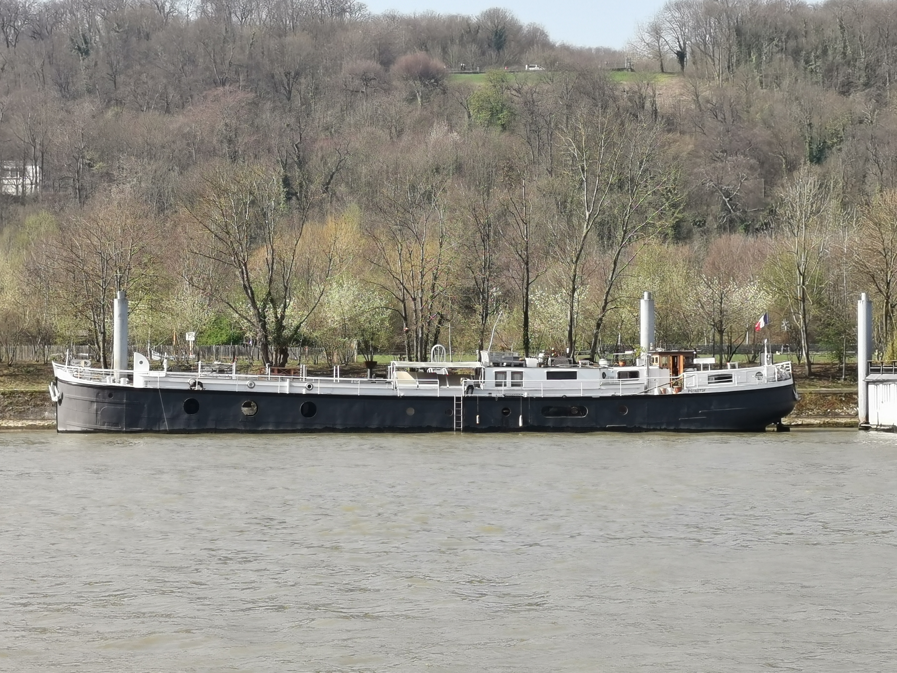

## {background-color="#ffffffff"}


<div class="hero-title">
  Modern AI. Course Architecture
</div>

<div class="hero-subtitle">
  Curriculum, projects and course logistics
</div>

::: {.hero-footer}
<span>**Author:** Alexey Ryabykin</span>
<span>•</span>
<span>**Course:** Modern AI</span>
<span>•</span>
<span>**Year:** 2026-2027</span>
<span>•</span>
<span>**Release:** v0.0.1</span>
:::


## What Is This Course About? {#what-is-this-course-about}

::: {.lead .course-intro-lead}
We’ll explore how modern AI models work and how to adapt them to a task.
:::

::::: {.columns .course-intro-columns}
:::: {.column width="50%"}

### What we’ll study

- Model components and the mathematics behind them.
- Training, fine-tuning and ways to reduce compute and memory use.
- Evaluation and the infrastructure needed to run experiments.

::::
:::: {.column width="50%"}

### How we’ll work

- Read papers alongside the code.
- Implement selected components and test them in small experiments.
- Use a project to compare a baseline with our own changes.

::::
:::::

::: {.course-intro-context}
I’ll bring examples from product work. We’ll use them as starting points for experiments and discussion.
:::

::: {.notes}
Introduce the course as a place to work through models and methods together. The focus is on understanding the code, trying a specific change and checking its effect.
The mathematical material supports these experiments. Small implementations help connect an idea in a paper with the behavior of a model.
The project gives students a task on which to apply the methods and compare results with a baseline. We will discuss the limitations and tradeoffs as well as the improvements.
Share experience from product work as context for these questions. The module roadmap, project catalog and assignment details follow later in the presentation.
:::

## Who Is Your Instructor? {#about-instructor}

::::: {.instructor-layout}
:::: {.instructor-bio}
::: {.card .card-accent}
<span class="card-title" style="display:block;">Alexey Ryabykin</span>

**Lead Engineer, Huawei Research Center**  
Project lead for diffusion model deployment on Mate90.

- **Education:** Bachelor's degree from Moscow Aviation Institute. Master's degrees from MIPT and HSE FCS. PhD at Skoltech in progress.
- **Experience:** Contributed to visual model deployment on Mate60, Pura70, Pura X, Mate70, Mate XT, Pura80, Mate80, Pura90 and Mate90. Introduced model optimization tools for pruning, cherry-picking, normalization removal and layer-wise reduction.
- **Projects and research:** `accelerator`: research workflow optimization framework. `qaput`: pruning framework. Diffusion model acceleration.
- **Teaching:** Limited classroom teaching experience: one course as an undergraduate. Currently mentoring three interns at work.
- **Why this course:** This is a good opportunity to deepen my own understanding and share the knowledge I’ve gained while working on real products.

:::
::::
:::: {.instructor-examples}

<figure class="instructor-example">
  <figcaption>Huawei Night Mode</figcaption>
  
</figure>

<figure class="instructor-example">
  <figcaption>FOV Fusion · 4× Zoom</figcaption>
  
</figure>

<p class="image-credit">Huawei P30 Pro · <a href="https://www.dxomark.com/huawei-p30-pro-camera-review/">Photos: DXOMARK</a></p>

::::
:::::

::: {.notes}
Lead Engineer at Huawei Research Center and project lead for diffusion model deployment on Mate90.
Education: a bachelor's degree from Moscow Aviation Institute, master's degrees from MIPT and HSE FCS, and an ongoing PhD at Skoltech.
Contributed to deploying visual models on Mate60, Pura70, Pura X, Mate70, Pura80, Mate80, Pura90 and Mate90.
Introduced optimization tools for pruning, cherry-picking, normalization removal and layer-wise reduction. Research projects include accelerator, qaput and diffusion model acceleration.
Taught one course during undergraduate studies and currently mentors three interns. Formal teaching experience is still limited.

Image credits: [DXOMARK, Huawei P30 Pro camera review](https://www.dxomark.com/huawei-p30-pro-camera-review/), updated September 18, 2019.
The top photo is identified in the review as a Huawei P30 Pro Night Mode sample. The bottom photo is the review's 4x field-of-view fusion example, combining image data from the primary and telephoto cameras.
[Original Night Mode image](https://www.dxomark.com/wp-content/uploads/medias/post-33077/NightModeWellWest_HuaweiP30Pro_DxOMark_05-00.jpg).
[Original FOV Fusion image](https://www.dxomark.com/wp-content/uploads/medias/post-27399/fusion4x.jpg).
:::

## How Will We Use Telegram? {#telegram}

**🎓 Modern Artificial Intelligence**

Our course group: class materials, hands-on work with modern AI models, support and project discussions.

::::: {.telegram-layout}
:::: {.telegram-topics}

**📌 00 · Start here**

Everything you need to get started: syllabus, schedule, course rules and essential links.

**📢 01 · Announcements**

Course news, deadlines and schedule updates.

**🧩 02 · Prerequisites**

Required background and resources to review Python, PyTorch and ML fundamentals.

**🛠 03 · Kaggle support**

Help with Kaggle, GPUs, environment setup and running notebooks.

::::
:::: {.telegram-topics}

**📚 04 · Lectures & Seminars**

Slides, class recordings, code and questions about lectures and seminars.

**🧪 05 · Projects hub**

Project descriptions and selection, deliverable requirements and general project questions.

**💬 06 · General discussion**

Conversation, interesting discoveries and AI discussions beyond the classroom.

::::
:::: {.telegram-join}
```{=html}
<figure class="telegram-qr">
  
  <figcaption>Scan to join the course group</figcaption>
</figure>

<p class="telegram-contact">Me on Telegram<br><strong>@addicted-by</strong></p>
```

::::
:::::

::: {.notes}
Show where to find materials and where to post questions. Announcements, deadlines and schedule changes are posted in Announcements.
:::

## How Is the Course Structured?

<span class="kicker">Syllabus Overview • From Primitives to Foundation Models</span>

::: {.key-idea}
<span class="key-idea-title" style="display:block;">Comprehensive 8-Module Progression</span>
From linear algebra, computational graphs, and loss landscapes to distributed multi-GPU training, large language models, and vision-language synthesis.

:::

::::: {.curriculum-grid}

::: {.card}
<span class="card-title" style="display:block;">M1: Intro & Modalities</span>
Taxonomy of data modalities, generative architectures, Kaggle setup, capstone catalog.

:::

::: {.card}
<span class="card-title" style="display:block;">M2: Linear Algebra & LoRA</span>
SVD, Eckart-Young theorem, low-rank factorization, LoRA from scratch, PyTorch hooks.

:::

::: {.card}
<span class="card-title" style="display:block;">M3: Graphs & Pruning</span>
Autograd internals, reverse-mode autodiff, 1st-order Taylor sensitivity, pruning maps.

:::

::: {.card}
<span class="card-title" style="display:block;">M4: Distillation</span>
First-order optimizers (SGD, AdamW), loss landscapes, local operator distillation.

:::

::: {.card}
<span class="card-title" style="display:block;">M5: Deep Optimization</span>
Spectral optimization (Muon), Newton-Schulz iterations, Lion, SAM, scaling laws.

:::

::: {.card}
<span class="card-title" style="display:block;">M6: Distributed & DDP</span>
Data/Tensor parallelism, DDP, FSDP, ZeRO, mixed precision (BF16), Accelerate, W&B.

:::

::: {.card}
<span class="card-title" style="display:block;">M7: nanoGPT & SFT</span>
Causal attention, RoPE, RMSNorm, SwiGLU, Qwen2.5 audit, SFT, QLoRA, benchmarks.

:::

::: {.card}
<span class="card-title" style="display:block;">M8: nanoVLM & Vision</span>
Multimodal fusion, ViT, SigLIP, projection layers, cross-attention, instruction tuning.

:::

:::::

::: {.notes}
⏱️ **Timing:** 2.0 min
🗣️ **Key Points:**
The course is logically divided into two halves:
1. Foundational mathematics and single-operator mechanics (Modules 1–4).
2. Frontier scaling, distributed systems, and foundation models (Modules 5–8).

:::

## {background-color="#ffffffff"}

::: {.section-slide .section-split}

::: {.section-main}
<div class="section-number">Part 01</div>

<div class="section-title">
  Foundations: <span class="gradient-text">Algebra, Graphs & Optimization</span>
</div>

<div class="section-desc">
  Modules 01 to 04 • From the current state of AI to computational graphs, automatic matrix differentiation, and optimization.
</div>

:::

::: {.section-agenda-card}
<div class="agenda-header">📋 Part 1 Modules</div>
<ul class="agenda-list">
  <li class="agenda-item">
    <span class="agenda-num">1</span>
    <span class="agenda-tag">Module 1: Introduction, Modalities & Project Selection</span>
  </li>
  <li class="agenda-item">
    <span class="agenda-num">2</span>
    <span class="agenda-tag">Module 2: Linear Algebra for Deep Learning & LoRA</span>
  </li>
  <li class="agenda-item">
    <span class="agenda-num">3</span>
    <span class="agenda-tag">Module 3: Computational Graphs & Taylor Pruning</span>
  </li>
  <li class="agenda-item">
    <span class="agenda-num">4</span>
    <span class="agenda-tag">Module 4: First-Order Optimization & Local Distillation</span>
  </li>
</ul>

:::

:::

::: {.notes}
⏱️ **Timing:** 1.0 min
Transition slide to Part 1 of the course syllabus.

:::

## Module 1: Introduction, Modalities & Project Selection

<span class="kicker">Weeks 01-02 • Course Launch</span>

::::: {.columns}

:::: {.column width="50%"}

::: {.card}
<span class="card-title" style="display:block;">📖 Module 1 Content</span>

- **Course Overview & Logistics:** Grading policy, rules, expectations.
- **Modern AI Landscape:** What AI has already achieved in the world.
- **Data Modalities:** Text, images, audio, video, robotic action.
- **Taxonomy of Architectures:** Autoregression, diffusion, flow matching, masked autoencoders.
- **Multimodal Integration:** Joint embedding spaces and cross-attention alignment.

:::

::: {.card}
<span class="card-title" style="display:block;">💻 Seminar 1</span>

- Workspace configuration in **Kaggle**: GPU quotas, secrets, persistent storage.
- Interactive demonstration of baseline notebooks.

:::

::::

:::: {.column width="50%"}

::: {.card .card-accent}
<span class="card-title" style="display:block;">🎯 Module 1 Homeworks</span>

<span class="definition-term" style="display:block;">HW0: Benchmark Baseline Models</span>

Run baseline notebooks for 2–3 candidate projects. Record quality metrics, latency and memory use.

<span class="definition-term" style="display:block;">HW1: Articles overview</span>

Review the papers behind your project candidates. Compare their methods, datasets and evaluation, then explain your chosen direction.

:::

::::

:::::

::: {.notes}
HW0 gives a first benchmark for candidate projects. HW1 connects the experiments with the papers and helps students choose a direction.
:::

## Module 2: Linear Algebra for Deep Learning & LoRA

<span class="kicker">Week 03-04 • Subspace Geometry</span>

::::: {.columns}

:::: {.column width="50%"}

::: {.card}
<span class="card-title" style="display:block;">📖 Module 2 Content</span>

- **Geometric Motivation:** How data manifolds and subspace geometry govern model trainability.
- **Moore-Penrose Pseudoinverse:** Geometric derivation and least-squares connection $X^+ = (X^T X)^{-1} X^T$.
- **Matrix Decompositions:** LU, QR (Gram-Schmidt orthogonalization), Cholesky (covariance and whitening).
- **Singular Value Decomposition (SVD):** Spectral norm, low-rank approximation (Eckart-Young-Mirsky theorem).
- **LoRA (Low-Rank Adaptation):** Weight update parameterization $W = W_0 + \Delta W$, where $\Delta W = \frac{\alpha}{r} B A$.

:::

::: {.card}
<span class="card-title" style="display:block;">💻 Seminar 2</span>

- Implementing SVD truncation and LoRA layers from scratch in PyTorch.
- PyTorch **Hooks** mechanism: intercepting activations, weights, and gradients dynamically.
- **Student Presentations:** Capstone concept defenses (HW1).

:::

::::

:::: {.column width="50%"}

::: {.card .card-accent}
<span class="card-title" style="display:block;">🎯 Module 2 Homeworks</span>

<span class="definition-term" style="display:block;">HW2: torch / numpy/cupy / scipy</span>

Tensor operations and numerical linear algebra across the three library groups.

<span class="definition-term" style="display:block;">HW3: forward/backward/hooks</span>

Inspect forward and backward passes. Capture operator inputs, outputs and gradients with hooks. Save the operator setup and initialization for **HW7**.

<span class="definition-term" style="display:block;">HW4: analytical operator approximation</span>

Apply analytical low-rank approximations to project operators and measure the effect of rank on reconstruction error.

:::

::::

:::::

::: {.notes}
⏱️ **Timing:** 3.0 min
🗣️ **Key Points:**
Here we connect classical linear algebra (SVD) directly to modern parameter-efficient fine-tuning (LoRA).
Students discover that LoRA is not proprietary magic from Hugging Face PEFT, but a direct consequence of low intrinsic rank during adaptation.

:::

## Module 3: Network Foundations, Graphs & Autograd

<span class="kicker">Week 05-06 • Gradient Mechanics</span>

::::: {.columns}

:::: {.column width="50%"}

::: {.card}
<span class="card-title" style="display:block;">📖 Module 3 Content</span>

- **Computational Graphs:** Static graphs (TorchScript, execution engines) vs Dynamic graphs (PyTorch eager execution).
- **Reverse-Mode Autodiff:** Reverse accumulation, backpropagation, and vector-Jacobian products (VJPs).
- **Gradient as Sensitivity Metric:** First-order Taylor expansion for network pruning:
  $$\Delta \mathcal{L} \approx \left|\frac{\partial \mathcal{L}}{\partial w} \cdot w\right|$$
- **Weight vs Activation Sensitivity:** Equivalence proof for linear and convolutional layers.

:::

::: {.card}
<span class="card-title" style="display:block;">💻 Seminar 3</span>

- Hands-on **Taylor Pruning**: profiling channel, attention head, and layer sensitivity.
- Building custom backward hooks to accumulate gradient statistics across batches.

:::

::::

:::: {.column width="50%"}

::: {.card .card-accent}
<span class="card-title" style="display:block;">🎯 Module 3 Homeworks</span>

<span class="definition-term" style="display:block;">HW5: Matrix differentiation</span>

Derive matrix gradients for the proposed examples.

<span class="definition-term" style="display:block;">HW6: Taylor Importance estimation</span>

Estimate the importance of layers, channels and attention heads using first-order Taylor scores. Build an importance map for your project model.

$$I(a) = \left|\frac{\partial \mathcal{L}}{\partial a} \odot a\right|$$

:::

::::

:::::

::: {.notes}
HW5 develops the matrix differentiation needed to interpret gradients. HW6 uses forward/backward hooks from HW3 to collect Taylor importance scores, which will be reused in HW8.
:::

## Module 4: Optimization Foundations & Local Distillation

<span class="kicker">Week 07 • Optimization Dynamics</span>

::::: {.columns}

:::: {.column width="50%"}

::: {.card}
<span class="card-title" style="display:block;">📖 Module 4 Content</span>

- **Momentum Dynamics:** Classical Momentum vs Nesterov Accelerated Gradient (NAG).
- **Adaptive Methods:** RMSprop, Adam, AdamW (decoupled weight decay vs L2 regularization).
- **Loss Landscapes:** Ill-conditioned Hessians, ravines, saddle points, and gradient noise.
- **Local Distillation:** Distilling an expensive operator into a compact surrogate using layerwise alignment:
  $$\mathcal{L}_{\text{distill}} = \alpha \mathcal{L}_{\text{MSE}}(y_S, y_T) + \beta (1 - \cos(y_S, y_T))$$

:::

::: {.card}
<span class="card-title" style="display:block;">💻 Seminar 4</span>

- Local operator distillation in PyTorch with frozen teacher.

:::

::::

:::: {.column width="50%"}

::: {.card .card-accent}
<span class="card-title" style="display:block;">🎯 Module 4 Homework</span>

<span class="definition-term" style="display:block;">HW7: Local distillation + Initialization from HW3</span>

1. Select an expensive operator and design a lightweight student.
2. Reuse the forward/backward/hooks setup and initialization from **HW3**.
3. Train the student to reproduce the frozen teacher's outputs.
4. Measure reconstruction quality, latency and memory use.

$$\mathcal{L}_{\text{distill}} = \alpha\mathcal{L}_{\text{MSE}} + \beta\mathcal{L}_{\text{cos}}$$

:::

::::

:::::

::: {.notes}
HW7 reuses the work and initialization from HW3. Students distill a selected operator and compare the student with the teacher using the same inputs.
:::

## {background-color="#ffffffff"}

::: {.section-slide .section-split}

::: {.section-main}
<div class="section-number">Part 02</div>

<div class="section-title">
  Scaling: <span class="gradient-text">Advanced Optimizers, Infra & LLMs/VLMs</span>
</div>

<div class="section-desc">
  Modules 05 to 08 • Spectral optimization, multi-GPU distributed systems, nanoGPT pretraining & SFT, and multimodal VLM architectures.
</div>

:::

::: {.section-agenda-card}
<div class="agenda-header">📋 Part 2 Modules</div>
<ul class="agenda-list">
  <li class="agenda-item">
    <span class="agenda-num">5</span>
    <span class="agenda-tag">Module 5: Deep Optimization, Lion/Muon & Flat Minima</span>
  </li>
  <li class="agenda-item">
    <span class="agenda-num">6</span>
    <span class="agenda-tag">Module 6: Infrastructure, Distributed Training & DDP</span>
  </li>
  <li class="agenda-item">
    <span class="agenda-num">7</span>
    <span class="agenda-tag">Module 7: nanoGPT — Training LLMs from Scratch & SFT</span>
  </li>
  <li class="agenda-item">
    <span class="agenda-num">8</span>
    <span class="agenda-tag">Module 8: nanoVLM — Multimodal Synthesis</span>
  </li>
</ul>

:::

:::

::: {.notes}
⏱️ **Timing:** 1.0 min
Transition slide to Part 2 of the course syllabus.

:::

## Module 5: Deep Optimization, Lion/Muon & Flat Minima

<span class="kicker">Week 08-09 • Advanced Optimization</span>

::::: {.columns}

:::: {.column width="50%"}

::: {.card}
<span class="card-title" style="display:block;">📖 Module 5 Content</span>

- **Beyond Standard AdamW:** Why coordinate-wise descent struggles on ill-conditioned matrix manifolds.
- **Muon Optimizer:** Matrix Update Orthogonalization via Newton-Schulz polynomial iterations:
  $$O_0 = G / \|G\|_F, \quad O_{k+1} = \frac{1}{2} O_k (3I - O_k^T O_k)$$
- **Lion Optimizer:** Sign-momentum evolution for memory-efficient gradient updates.
- **SAM (Sharpness-Aware Minimization):** Seeking flat minima for superior out-of-distribution generalization:
  $$\min_w \max_{\|\epsilon\|_2 \le \rho} \mathcal{L}(w + \epsilon)$$
- **Scaling Laws:** Compute-optimal training tradeoffs (Chinchilla, Kaplan).

:::

::: {.card}
<span class="card-title" style="display:block;">💻 Seminar 5</span>

- Parameter group splitting: e.g. Muon for 2D weight matrices, AdamW for embeddings and norm layers.

:::

::::

:::: {.column width="50%"}

::: {.card .card-accent}
<span class="card-title" style="display:block;">🎯 Module 5 Homework</span>

<span class="definition-term" style="display:block;">HW8: Advanced local distillation + Importance estimations from HW6</span>

1. Extend the local distillation pipeline from **HW7**.
2. Use the importance estimates from **HW6** to select operators or weight the feature loss.
3. Compare optimization choices, including Muon or Lion.
4. Evaluate convergence and the tradeoff between quality, latency and memory.

:::

::::

:::::

::: {.notes}
HW8 combines the local distillation pipeline from HW7 with importance estimates from HW6. Compare the variants under the same evaluation conditions.
:::

## Module 6: Infrastructure, Distributed Training & DDP

<span class="kicker">Week 10 • Parallel & High-Throughput Compute</span>

::::: {.columns}

:::: {.column width="50%"}

::: {.card}
<span class="card-title" style="display:block;">📖 Module 6 Content</span>

- **Parallelism Taxonomy:** Data Parallel (DP), Tensor Parallel (Megatron-LM), Pipeline Parallel, Sequence Parallel.
- **Distributed Systems:** DDP (DistributedDataParallel), ZeRO-1/2/3, and PyTorch FSDP (Fully Sharded Data Parallel).
- **GPU Memory Anatomy:** Model weights, gradients, optimizer states, activations. Offloading & activation checkpointing.
- **Mixed Precision:** FP16, BF16, FP8 dynamic loss scaling.
- **High-Throughput DataLoader:** Prefetching, `num_workers`, pinned memory, online augmentation.
- **Reproducibility:** DVC, Git-LFS, MLflow, Weights & Biases.

:::

::: {.card}
<span class="card-title" style="display:block;">💻 Seminar 6</span>

- Distributed launch configuration via **Hugging Face Accelerate**.
- Tracking systems integration: **MLflow, Weights & Biases, Python Fire**.

:::

::::

:::: {.column width="50%"}

::: {.card .card-accent}
<span class="card-title" style="display:block;">🎯 Module 6 Homework</span>

<span class="definition-term" style="display:block;">HW9: Infrastructure HW</span>

1. Configure reproducible training and evaluation runs.
2. Set up distributed launch with `accelerate launch` or `torchrun` when multiple GPUs are available.
3. Compare runtime and memory with a single-GPU baseline.
4. Record configs, checkpoints and experiment metrics.

:::

::::

:::::

::: {.notes}
HW9 covers the infrastructure around the model: reproducible launches, checkpointing, experiment tracking and distributed execution with the available hardware.
:::

## Module 7: nanoGPT/Qwen2.5 — Training LLMs from Scratch & SFT

<span class="kicker">Week 11 • Large Language Architectures</span>

::::: {.columns}

:::: {.column width="50%"}

::: {.card}
<span class="card-title" style="display:block;">📖 Module 7 Content</span>

- **nanoGPT from Scratch:** BPE tokenization, Causal Self-Attention, KV-cache, Weight Tying.
- **Modern LLM Architecture:** RoPE (Rotary Position Embeddings), RMSNorm, QK-RMSNorm, SwiGLU, GQA (Grouped-Query Attention).
- **Architectural Audit:** In-depth code walkthrough of **Qwen2.5-1.5B**.
- **Pretraining vs SFT:** Next-token loss, ChatML templating, masking user prompt tokens.
- **PEFT (LoRA & QLoRA):** NormalFloat4 (NF4) quantization, double quantization, paged optimizers.
- **LLM Benchmarking:** GSM8K, Math500, MMLU, pass@k, contamination detection.

:::

::: {.card}
<span class="card-title" style="display:block;">💻 Seminar 7</span>

- Capstone training scripts: configuring train/eval loops, profiling token throughput and memory.

:::

::::

:::: {.column width="50%"}

::: {.card .card-accent}
<span class="card-title" style="display:block;">🎯 Final Capstone Project</span>

<span class="definition-term" style="display:block;">HW10: Project</span>

1. Train or adapt the model for the chosen task.
2. Compare the final result with the **HW0** baseline.
3. Prepare a reproducible repository, results, demo and final presentation.

:::

::::

:::::

::: {.notes}
HW10 integrates the semester work into a complete project. For LLM tracks, the module provides training and evaluation tools for the final model.
:::

## Module 8: nanoVLM — Multimodal Synthesis

<span class="kicker">Week 12 • Multimodal Frontier</span>

::::: {.columns}

:::: {.column width="50%"}

::: {.card}
<span class="card-title" style="display:block;">📖 Module 8 Content</span>

- **VLM Architecture:** Unifying visual and language representation manifolds.
- **Core Components:** Visual backbone (ViT, SigLIP), cross-modal projectors (MLP Projector vs Resampler), LLM decoder.
- **Fusion Mechanisms:** Prefix tokens, Cross-Attention, contrastive CLIP/SigLIP objectives.
- **Data & Training:** Image-text instruction pairs, dynamic patch slicing (AnyRes).

:::

::: {.card}
<span class="card-title" style="display:block;">💻 Seminar 8</span>

- Empirical comparison of multimodal fusion strategies: convergence rates, zero-shot quality, and compute budgets.

:::

::::

:::: {.column width="50%"}

::: {.key-idea}
<span class="key-idea-title" style="display:block;">✨ NO NEW HOMEWORK ASSIGNED</span>

No new homework assignment is issued in Module 8!

All student time and compute budget is dedicated to:

1. Finalizing training runs and ablation studies for **HW10**;
2. Validating metrics on held-out test benchmarks;
3. Preparing the final project slide deck, demo, and technical defense.

:::

::::

:::::

::: {.notes}
⏱️ **Timing:** 2.5 min
🗣️ **Key Points:**
During Week 8, students are freed from new assignments. This allows everyone to finish training, compute final benchmark tables, and prepare for the oral defense.

:::

## Curated Capstone Projects Catalog (1/2) {#capstone-projects-1}

<span class="kicker">Select Your Semester Track · Click a card to explore</span>

::: {.grid-3}

::: {.card .project-card}
<a class="card-title project-card-link" style="display:block;" href="project_pages/p01_dreambooth.html">01. DreamBooth Personalization</a>

- **SOTA / Baseline:** FLUX.2 / SDXL / Stable Diffusion 1.5.
- **Dataset:** Custom dataset (5–10 reference photos).
- **Metrics:** DINO-I, CLIP-I, CLIP-T, FID.
- **Focus:** Fine-tuning diffusion models for rare personalized objects.

:::

::: {.card .project-card}
<a class="card-title project-card-link" style="display:block;" href="project_pages/p02_textual_inversion.html">02. Textual Inversion</a>

- **SOTA / Baseline:** FLUX.2 / SDXL / SD 1.5.
- **Dataset:** 5–10 subject photos, LAION subset.
- **Metrics:** DINO-I, CLIP-I, CLIP-T, GenEval.
- **Focus:** Learning pseudo-tokens in embedding space without changing weights.

:::

::: {.card .project-card}
<a class="card-title project-card-link" style="display:block;" href="project_pages/p03_weapon_detection.html">03. YOLOv10: Weapon Detection</a>

- **SOTA / Baseline:** YOLOv10S / YOLOv10M.
- **Dataset:** WeaponDetection / Action Recognition Dataset.
- **Metrics:** mAP@50:95, Miss Rate, False Positive Rate, Latency.
- **Focus:** Real-time weapon detection in video streams with automated censorship blur.

:::

::: {.card .project-card}
<a class="card-title project-card-link" style="display:block;" href="project_pages/p04_sql_lora.html">04. LoRA Qwen2.5: SQL Generation</a>

- **SOTA / Baseline:** Claude Fable / Qwen2.5-Coder-1.5B-Instruct.
- **Dataset:** `b-mc2/sql-create-context` + custom SQLite DB.
- **Metrics:** Execution Accuracy (EX), Exact Match (EM), Valid SQL.
- **Focus:** Generating exact SQL queries for complex database schemas.

:::

::: {.card .project-card}
<a class="card-title project-card-link" style="display:block;" href="project_pages/p05_json_lora.html">05. LoRA Qwen2.5: Structured JSON</a>

- **SOTA / Baseline:** Claude Fable / Qwen2.5-Coder-1.5B-Instruct.
- **Dataset:** SchemaBench / JSONSchemaBench (10k schemas).
- **Metrics:** Schema Adherence Accuracy, Valid JSON, Degradation.
- **Focus:** Strict schema adherence without hallucinations.

:::

::: {.card .project-card}
<a class="card-title project-card-link" style="display:block;" href="project_pages/p06_music_image.html">06. Audio-to-Image Adapter</a>

- **SOTA / Baseline:** FLUX.2 / Stable Diffusion 1.5.
- **Dataset:** MUImage (9,966 music-image pairs, 27.7h audio).
- **Metrics:** CLIP-A (audio-visual alignment), CLIP-I, FID.
- **Focus:** Conditioning diffusion image synthesis with audio features.

:::

:::

::: {.notes}
⏱️ **Timing:** 3.0 min
🗣️ **Key Points:**
Projects span multiple modalities: image generation (1, 2, 6), computer vision & detection (3), large language models & code synthesis (4, 5). All fit comfortably inside free Kaggle GPU limits (T4 16GB).

:::

## Curated Capstone Projects Catalog (2/2) {#capstone-projects-2}

<span class="kicker">Select Your Semester Track · Click a card to explore</span>

::: {.grid-2-1}

::: {.grid-2}

::: {.card .project-card}
<a class="card-title project-card-link" style="display:block;" href="project_pages/p07_object_removal.html">07. Object Removal & Inpainting</a>

- **SOTA / Baseline:** FLUX.2 / SDXL / SD 1.5.
- **Dataset:** RemovalBench (paired input/ground-truth frames).
- **Metrics:** FID, LPIPS, GenEval, CLIP-T.
- **Focus:** Consistent object removal and background texture reconstruction.

:::

::: {.card .project-card}
<a class="card-title project-card-link" style="display:block;" href="project_pages/p08_lyrics.html">08. Lyrics Transcription</a>

- **SOTA / Baseline:** ElevenLabs Scribe v2 / Whisper Large-v3-Turbo.
- **Dataset:** M4Singer (29.7 hours of singing vocals, 419 songs).
- **Metrics:** WER, CER, Punctuation F1, Word Timestamps.
- **Focus:** Accurate word-level lyrics transcription with precise timestamp alignment.

:::

::: {.card .project-card}
<a class="card-title project-card-link" style="display:block;" href="project_pages/p09_hair.html">09. Hair Unsharpen Enhancement</a>

- **SOTA / Baseline:** SAM 2.1 / SAM 1.
- **Dataset:** LaPa Dataset (Face parsing benchmark).
- **Metrics:** IoU, Dice/F1, Boundary F1, visual sharpness.
- **Focus:** Hair segmentation and frequency-domain unsharp masking:  
  $I' = I + \alpha \cdot (I - \text{Blur}(I))$.

:::

::: {.card .project-card}
<a class="card-title project-card-link" style="display:block;" href="project_pages/p10_bokeh.html">10. Portrait Bokeh Depth Blur</a>

- **SOTA / Baseline:** SAM 2.1 / SAM 1.
- **Dataset:** P3M-10k (Portrait matting benchmark).
- **Metrics:** IoU, Boundary F1, Precision/Recall.
- **Focus:** Subject extraction and simulated optical bokeh:  
  $I' = M \cdot I + (1 - M) \cdot \text{Blur}(I)$.

:::

:::

::: {.key-idea}
<span class="key-idea-title" style="display:block;">💡 HOW TO CHOOSE YOUR PROJECT?</span>

1. Assess which modality excites you most (Vision, NLP/Code, Audio, Multimodal).
2. In **Seminar 1**, we will run baseline notebooks for all 10 project tracks.
3. In **HW0**, benchmark 2–3 options on Kaggle.
4. In **HW1**, formally defend your chosen direction.

:::

:::

::: {.notes}
⏱️ **Timing:** 3.0 min
🗣️ **Key Points:**
Projects 9 and 10 combine Segment Anything 2 (SAM2) masks with classical image processing equations. Project 8 tackles singing voice transcription (ASR), where standard speech models fail.

:::

## Capstone Project Lifecycle: Step-by-Step Evolution

<span class="kicker">Capstone Timeline • How Your Project Grows</span>

::::: {.columns}

:::: {.column width="50%"}

::: {.card}
<span class="card-title" style="display:block;">Phase 1: Discovery & Benchmark</span>

- **Week 1:** Select 2–3 candidate projects from the catalog.
- **HW0:** Deploy baselines on Kaggle and record initial benchmark metrics (latency, VRAM, baseline scores).
- **HW1:** Articles overview: methods, datasets and evaluation of candidate approaches.

:::

::: {.card}
<span class="card-title" style="display:block;">Phase 2: Decomposition & Analysis</span>

- **HW2:** Tensor foundations in torch, numpy/cupy and scipy.
- **HW3:** Forward/backward passes, hooks and initialization for local distillation.
- **HW4:** Truncated SVD & LoRA decomposition of project operators; singular spectrum analysis.
- **HW5:** Matrix differentiation.
- **HW6:** Taylor importance estimation across project operators.

:::

::::

:::: {.column width="50%"}

::: {.card}
<span class="card-title" style="display:block;">Phase 3: Distillation & Optimization</span>

- **HW7:** Local distillation with initialization from **HW3** ($\mathcal{L}_{MSE} + \mathcal{L}_{cos}$).
- **HW8:** Accelerating distillation convergence using importance estimates from **HW6** and the **Muon** / **Lion** optimizer.

:::

::: {.card .card-glow}
<span class="card-title" style="display:block;">Phase 4: Scaling & Final Defense</span>

- **HW9:** Infrastructure, reproducible launches and distributed training.
- **HW10:** Full fine-tuning (LoRA / SFT), comprehensive benchmark evaluation, GitHub repo, and final oral defense.

:::

::::

:::::

::: {.notes}
⏱️ **Timing:** 2.5 min
🗣️ **Key Points:**
Notice that you do not start your final project from scratch in the last week.
The assignments progressively supply the experiments, analysis and infrastructure for the final project.

:::

## What Are the Homework Assignments? {#homework-list}

::::: {.columns .homework-index}
:::: {.column width="50%"}

| HW | Topic |
|:---|:---|
| **HW0** | Benchmark Baseline Models |
| **HW1** | Articles overview |
| **HW2** | torch<br>numpy/cupy<br>scipy |
| **HW3** | forward/backward/hooks |
| **HW4** | analytical operator approximation |
| **HW5** | Matrix differentiation |

::::
:::: {.column width="50%"}

| HW | Topic |
|:---|:---|
| **HW6** | Taylor Importance estimation |
| **HW7** | Local distillation + Initialization from **HW3** |
| **HW8** | Advanced local distillation + Importance estimations from **HW6** |
| **HW9** | Infrastructure HW |
| **HW10** | Project |

::::
:::::

::: {.notes}
HW7 reuses the work and initialization from HW3. HW8 extends local distillation with importance estimates from HW6. HW10 integrates the course work into the final project.
:::

## How Will Homework Work on Kaggle? {#kaggle-homework}

::::: {.columns}
:::: {.column width="50%"}
::: {.card .card-accent}
<span class="card-title" style="display:block;">Working in Kaggle</span>

**[Placeholder: platform overview and homework setup]**

- [How to open and copy the starter notebook].
- [How to attach datasets and select an accelerator].
- [How to run an experiment and save the results].

:::
::: {.structure-placeholder .kaggle-placeholder}
[Kaggle screenshot / starter notebook link]
:::
::::
:::: {.column width="50%"}
::: {.card}
<span class="card-title" style="display:block;">Submitting Your Homework</span>

**[Placeholder: submission and review process]**

- **What to submit:** [notebook, metrics, conclusions, artifacts].
- **Where to submit:** [link / form / section].
- **Format:** [assignment name and run version].
- **Deadlines and feedback:** [rules and where to find reviews].

:::
::::
:::::

::: {.notes}
Demonstrate the full workflow: open the starter notebook, run an experiment, save a version and submit the assignment. Discuss environment and execution questions in the Telegram topic "03 · Kaggle support".
:::

## Grading Criteria & Academic Integrity

<span class="kicker">Academic Regulations</span>

::::: {.columns}

:::: {.column width="50%"}

::: {.card}
<span class="card-title" style="display:block;">📊 Grading Components</span>

- **Theoretical Rigor (20%):** Mathematical precision of proofs (e.g. HW5 matrix differentiation, HW6 Taylor importance & HW4 SVD).
- **Engineering Quality (30%):** Modularity, type annotations, PyTorch hooks, vectorized execution, zero hardcoded constants.
- **Empirical Research (30%):** Depth of analysis, ablation studies, baseline comparisons, justification of hyperparameters and optimizers.
- **Defense & Presentation (20%):** Proposal presentation at Seminar 4 and final capstone demonstration at semester end.

:::

::::

:::: {.column width="50%"}

::: {.card}
<span class="card-title" style="display:block;">⚖️ Deadlines & AI Policy</span>

- **On-time Submission:** 100% maximum score.
- **Late Penalties:** -10% per day of delay without a verified academic or medical reason.
- **LLM Coding Assistants:** Using LLM copilots is permitted and encouraged for boilerplate and debugging, **BUT** students must be able to explain and defend every line of code and mathematical derivation. Blind copy-pasting without understanding results in a zero grade.

:::

::::

:::::

::: {.notes}
⏱️ **Timing:** 2.0 min
🗣️ **Key Points:**
We live in the era of advanced AI — using coding assistants is natural, but during project defense you will be questioned on mechanics.
If you use a method or library, you must understand exactly how it works under the hood.

:::

## What I Hope You’ll Get Out of the Course {#course-outcomes}

::: {.course-outcomes-body}

I hope you’ll leave with:

- A better feel for how model code relates to the ideas in a paper.
- Experience running experiments and checking whether a change helps.
- Some practice with debugging, memory limits and training runs.
- A project you understand, with a few ideas for what to try next.

:::

::: {.course-outcomes-note}
For me, this is also a chance to revisit what I’ve learned and learn from your questions.
:::

::: {.notes}
These are the things I hope students will gain through the assignments and project: familiarity with model code, experience with experiments, and practice dealing with everyday implementation problems.
The project should give each student something they understand and can continue working on. Discussing attempts that did not help is part of this process.
Teaching the course is also an opportunity for me to deepen my own understanding and share knowledge from product work. Invite questions and suggestions about what would be useful to explore.
:::
