## Decoder-only backbone {#arch-01 .fv-slide .arch-slide background-color="#0a0a0a"}

```{=html}
<div class="fv-meta"><span class="fv-id">A 01 / 46</span><span class="fv-cluster active">Architecture</span><span class="fv-cluster">Data</span><span class="fv-cluster">Training</span><span class="fv-cluster">Inference</span><span class="fv-cluster">Tools</span></div>
<div class="fv-body a01-body">
  <div class="a01-main">
    <div class="a01-backbone">
      <div class="a01-diagram-title">Decoder-only backbone</div>
<svg class="axb-backbone" viewBox="0 0 820 520" role="img" aria-label="Generic decoder-only architecture: embeddings, repeated token mixing and FFN with residual connections, and output projection">
<defs><marker id="a01-a01-arrow" markerUnits="userSpaceOnUse" markerWidth="8" markerHeight="8" refX="7" refY="4" orient="auto"><path d="M0 0L8 4L0 8Z" fill="#141414"/></marker></defs>
<g fill="none" stroke="#141414" stroke-width="2" marker-end="url(#a01-a01-arrow)"><path d="M370 482V460"/><path d="M370 406V366"/><path d="M370 304V295"/><path d="M370 271V257"/><path d="M370 195V186"/><path d="M370 162V144"/><path d="M370 82V52"/></g>
<rect x="150" y="160" width="520" height="225" fill="none" stroke="#c5c5c5" stroke-width="2" stroke-dasharray="6 5"/>
<g font-size="25" text-anchor="middle" fill="#141414">
<text x="370" y="514">Token IDs</text>
<g class="axb-embedding"><rect x="235" y="406" width="270" height="54" fill="#f3f3f3" stroke="#141414"/><text x="370" y="441">Embeddings</text></g>
<g class="axb-mix"><rect x="235" y="304" width="270" height="62" fill="white" stroke="#141414"/><text x="370" y="331">Token mixing</text><text x="370" y="354" font-size="20">Norm → causal mixing</text></g>
<g class="axb-ffn"><rect x="235" y="195" width="270" height="62" fill="white" stroke="#141414"/><text x="370" y="222">FFN</text><text x="370" y="246" font-size="20">Norm → transformation</text></g>
<g class="axb-output"><rect x="235" y="82" width="270" height="62" fill="#f3f3f3" stroke="#141414"/><text x="370" y="108">Output projection</text><text x="370" y="131" font-size="20">Norm → logits</text></g>
<text x="370" y="35">Next-token scores</text>
<text x="83" y="250" font-size="34" font-weight="650">× N</text><text x="83" y="281" font-size="21">blocks</text>
<g class="axb-residual"><path d="M370 385H590V283H383" fill="none" stroke="#141414" stroke-width="2" marker-end="url(#a01-a01-arrow)"/><path d="M370 264H590V174H383" fill="none" stroke="#141414" stroke-width="2" marker-end="url(#a01-a01-arrow)"/><circle cx="370" cy="283" r="12" fill="white" stroke="#141414"/><text x="370" y="291">+</text><circle cx="370" cy="174" r="12" fill="white" stroke="#141414"/><text x="370" y="182">+</text><text x="714" y="245" font-size="22">Residual</text><text x="714" y="274" font-size="22">paths</text></g>
</g></svg>
    </div>
  </div>
  <div class="a01-route">
    <h3 class="a01-agenda-label">Engineering the frontier</h3>
    <ol class="a01-agenda">
      <li>Architecture<span>Computational structure</span></li>
      <li>Data<span>Training material</span></li>
      <li>Training<span>Parameter updates</span></li>
      <li>Inference<span>Model execution</span></li>
      <li>Tools<span>External operations</span></li>
    </ol>
    <p class="a01-route-note">Start with architecture.<br>How should these blocks be organized?</p>
  </div>
</div>
<div class="fv-source"><a href="https://arxiv.org/abs/1706.03762">Vaswani et al., 2017</a> · <a href="https://arxiv.org/abs/2302.13971">LLaMA, 2023, §2.2</a> · Generalized decoder-only diagram · adapted</div>
```

::: {.notes}
Начнём с устройства системы, не с названия конкретной модели. Снизу приходят идентификаторы токенов. Embeddings превращают их в векторы. Дальше повторяется блок из двух разных преобразований: token mixing передаёт информацию между позициями последовательности, а FFN преобразует представление каждой позиции. На рисунке сохранены нормализация, обходные residual-связи и выходная проекция в оценки следующего токена.

Это обобщённый decoder-only backbone, адаптированный по Transformer и LLaMA. Мы не утверждаем, что все модели имеют именно такую нормализацию, одинаковое число слоёв или один способ смешивания токенов. Схема нужна как постоянная карта. Позже мы вернёмся к тем же узлам и увидим, какой ресурс меняет каждое решение.

Справа маршрут всей презентации: Architecture, Data, Training, Inference и Tools. Эти направления связаны: вычислительная структура определяет, как модель обрабатывает обучающий опыт; данные дают этот опыт; обучение обновляет параметры; inference организует выполнение; инструменты добавляют внешние операции. Начинаем с архитектуры. Следующий экран покажет семь тем архитектурной части. Ни один механизм сам по себе не объясняет весь результат системы.

Источники: https://arxiv.org/abs/1706.03762 ; https://arxiv.org/abs/2302.13971 .
:::

## Architecture choices {#arch-02 .fv-slide .arch-slide background-color="#ffffff"}

```{=html}
<div class="fv-meta"><span class="fv-id">A 02 / 46</span><span class="fv-cluster active">Architecture</span><span class="fv-cluster">Data</span><span class="fv-cluster">Training</span><span class="fv-cluster">Inference</span><span class="fv-cluster">Tools</span></div>
<div class="fv-body a02-body">
  <ol class="a02-agenda" aria-label="Architecture agenda">
    <li><span class="a02-number" aria-hidden="true">01</span><span class="a02-topic">Experts and routing</span><span class="a02-examples">MoE</span></li>
    <li><span class="a02-number" aria-hidden="true">02</span><span class="a02-topic">KV cache and compression</span><span class="a02-examples">MQA / GQA / MLA</span></li>
    <li><span class="a02-number" aria-hidden="true">03</span><span class="a02-topic">Sparse attention</span><span class="a02-examples">Indexing / MSA</span></li>
    <li><span class="a02-number" aria-hidden="true">04</span><span class="a02-topic">Recurrent and hybrid models</span><span class="a02-examples">Mamba / Gated DeltaNet</span></li>
    <li><span class="a02-number" aria-hidden="true">05</span><span class="a02-topic">Looped Transformers</span><span class="a02-examples">Huginn / MoR / LoopLM</span></li>
    <li><span class="a02-number" aria-hidden="true">06</span><span class="a02-topic">Residual connections</span><span class="a02-examples">AttnRes</span></li>
    <li><span class="a02-number" aria-hidden="true">07</span><span class="a02-topic">Lookup and adaptive memory</span><span class="a02-examples">Engram / Titans</span></li>
  </ol>
</div>
```

::: {.notes}
Это план архитектурной части лекции. Начнём с экспертов и маршрутизации: как устроена смесь экспертов и почему выбор нескольких ветвей меняет вычисления для каждого токена. Затем перейдём к KV cache. Разберём, что можно переиспользовать при генерации и как MQA и GQA разделяют ключи и значения между головами. На общей карте сравним способы сокращения кэша; при необходимости откроем подробности по quantization, token selection, MLA и sharing.

Следующая тема — разреженное внимание. Здесь важны выбор читаемых позиций, работа indexer и отличие отбора адресов от удаления записей из кэша. После этого рассмотрим рекуррентные модели и гибриды: Mamba, Gated DeltaNet и сочетания таких блоков с attention. Обсудим, что они сохраняют между шагами генерации и в каких случаях их сочетание полезно.

После рекуррентных моделей и гибридов перейдём к Looped Transformers: повторным применениям общего блока по глубине вычисления, изменению скрытого состояния и адаптивному числу проходов. Сравним результаты и стоимость дополнительных повторов. Далее разберём residual connections и AttnRes: как слои получают и объединяют информацию из предыдущих представлений. Завершим механизмами памяти — адресным поиском в Engram и адаптацией памяти в Titans. Для каждой темы последовательно рассмотрим механизм, опубликованные результаты и ограничения сравнения. Перед разбором этих семи тем проследим обработку одного запроса: prefill и decode. После этого перейдём к MoE.
:::

## Why doesn't the answer start immediately? {#arch-03 .fv-slide .arch-slide background-color="#ffffff"}

```{=html}
<div class="fv-meta"><span class="fv-id">A 03 / 46</span><span class="fv-cluster active">Architecture</span><span class="fv-cluster">Data</span><span class="fv-cluster">Training</span><span class="fv-cluster">Inference</span><span class="fv-cluster">Tools</span></div>
<div class="fv-body n04-body">
  <div class="n04-input"><span>The input context is one sequence</span><b>“Why does the Moon shine at night?”</b></div>
  <div class="n04-process" role="img" aria-label="The trained model processes the entire input context. It computes context representations needed to start the answer.">
    <div class="n04-text"><span>Full input</span><div class="n04-strip"><i></i><i></i><i></i><i></i><i></i><i></i><i></i><i></i><i></i></div></div>
    <b class="n04-arrow">→</b>
    <div class="n04-model"><b>Trained model</b><span>Input processing</span></div>
    <b class="n04-arrow">→</b>
    <div class="n04-state"><div class="n04-reps"><i></i><i></i><i></i><i></i><i></i><i></i><i></i><i></i><i></i></div><span>Context representations<br>to start the answer</span></div>
  </div>
  <div class="n04-name"><strong>prefill</strong><span>The initial processing of the input.</span></div>
</div>
<div class="fv-takeaway">Before answering, the model must process the input context.</div>
<div class="fv-source"><a href="https://huggingface.co/docs/transformers/cache_explanation">Hugging Face Transformers · How caching works</a> · Illustration of autoregressive model execution</div>
```

::: {.notes}
Мы уже увидели общий каркас модели и план архитектурного раздела. Прежде чем менять отдельные блоки, проследим один запрос от входа до потока ответа: сначала модель обрабатывает контекст, затем строит продолжение.

Вход — это вся последовательность, которую модель получает в этом запуске: не только последняя реплика, но и нужная история разговора и инструкции. На схеме дан один короткий пример, чтобы не отвлекаться на структуру чата. Прямоугольники обозначают позиции последовательности условно: это не утверждение о конкретном разбиении предложения токенизатором.

Сначала обученная модель обрабатывает вход и вычисляет промежуточные представления. После объяснения процесса вводим название prefill. В причинной модели позиции учитывают только допустимый предшествующий контекст; обработка входной последовательности не означает, что будущий ответ уже известен. Результат этой фазы позволяет выбрать первый токен ответа. Здесь намеренно не обсуждаем очереди, серверы или показатели производительности: это только последовательность вычислений одного запроса.

Переход: первый токен ещё не является полным ответом. На следующем слайде посмотрим, как модель получает продолжение.

Источник для сохранения и использования представлений: [Hugging Face Transformers, How caching works](https://huggingface.co/docs/transformers/cache_explanation). Терминология фаз дополнительно сверена с [DistServe, v3, §2.1](https://arxiv.org/html/2401.09670v3#S2.SS1). Проверено 7 октября 2026 года.
:::

## Why does the answer arrive token by token? {#arch-04 .fv-slide .arch-slide background-color="#ffffff"}

```{=html}
<div class="fv-meta"><span class="fv-id">A 04 / 46</span><span class="fv-cluster active">Architecture</span><span class="fv-cluster">Data</span><span class="fv-cluster">Training</span><span class="fv-cluster">Inference</span><span class="fv-cluster">Tools</span></div>
<div class="fv-body n05-body">
  <p class="n05-lead">Each generated token becomes part of the context for the next step.</p>
  <div class="n05-steps" role="img" aria-label="Answer tokens are added to the input context one at a time. Each step selects the next token.">
    <div class="n05-step"><span class="n05-context">Input</span><span class="n05-old">token 1</span><b class="n05-arrow">→</b><strong class="n05-new">token 2</strong><span class="n05-comment">select the next token</span></div>
    <div class="n05-step"><span class="n05-context">Input</span><span class="n05-old">token 1</span><span class="n05-old">token 2</span><b class="n05-arrow">→</b><strong class="n05-new">token 3</strong></div>
    <div class="n05-step"><span class="n05-context">Input</span><span class="n05-old">token 1</span><span class="n05-old">token 2</span><span class="n05-old">token 3</span><b class="n05-arrow">→</b><strong class="n05-new">token 4</strong><span class="n05-repeat">…</span></div>
  </div>
  <div class="n05-name"><strong>decode</strong><span>Continue the answer one token at a time.</span></div>
  <div class="n05-timeline"><div><b>Process the input</b><span>prefill · before the first token</span></div><b class="n05-time-arrow">→</b><div><b>Generate the continuation</b><span>decode · one token after another</span></div></div>
</div>
<div class="fv-takeaway">Each step depends on the token selected at the previous step.</div>
<div class="fv-source"><a href="https://huggingface.co/docs/transformers/cache_explanation">Hugging Face Transformers · How caching works</a> · Illustration of standard autoregressive generation</div>
```

::: {.notes}
Начинаем с момента, когда первый токен уже выбран после обработки входа. Теперь система подаёт его модели вместе с состоянием предшествующего контекста, получает вероятности следующего токена и выбирает его. Выбранный токен становится частью контекста, после чего цикл повторяется. На слайде показаны именно позиции токенов, а не предположение о соответствии одного слова одному токену.

Вводим название decode после демонстрации нескольких шагов. Стрелка здесь означает вычисление и выбор следующего токена; она не предполагает, что это всегда выбор максимальной вероятности. Возможны разные правила сэмплирования. Цикл продолжается до условия остановки.

В конце возвращаемся к временной линии: prefill обрабатывает вход и даёт возможность выбрать первый токен, decode получает последующие. Длины отрезков на схеме иллюстративны и не выражают отношение измеренных времён. Здесь рассматриваем обычную авторегрессионную генерацию: этот режим позволит подробно разобрать сохранение и чтение K и V.

Переход: теперь различаем обработку входа и последовательную генерацию. Вернёмся к внутренним блокам модели: как сделать доступным большой набор обучаемых параметров, выполняя для каждого токена только часть вычислений? Начнём со смеси экспертов.

Источник: [Hugging Face Transformers, How caching works](https://huggingface.co/docs/transformers/cache_explanation), начало страницы и пример цикла генерации. Определения границы фаз: [DistServe, v3, §2.1](https://arxiv.org/html/2401.09670v3#S2.SS1). Проверено 7 октября 2026 года.
:::

## Mixture-of-Experts: the core idea first {#arch-05 .fv-slide .arch-slide background-color="#ffffff"}

```{=html}
<div class="fv-meta"><span class="fv-id">A 05 / 46</span><span class="fv-cluster active">Architecture</span><span class="fv-cluster">Data</span><span class="fv-cluster">Training</span><span class="fv-cluster">Inference</span><span class="fv-cluster">Tools</span></div>
<div class="fv-body a03-body"><svg viewBox="0 0 1488 395" role="img"><defs><marker id="a03-a03-arrow" markerWidth="7" markerHeight="7" refX="6" refY="3.5" orient="auto"><path d="M0 0L7 3.5L0 7Z" fill="#141414"/></marker></defs><g fill="#141414" font-size="26"><text x="230" y="34" font-size="31" font-weight="650" text-anchor="middle">One FFN</text><text x="1000" y="34" font-size="31" font-weight="650" text-anchor="middle">Mixture of experts</text><g class=""><rect x="155" y="75" width="150" height="54" fill="#bef264" stroke="#141414"/><text x="230.0" y="111.8" font-size="28" text-anchor="middle">x</text></g><path d="M230 130V180" stroke="#141414" stroke-width="2" fill="none" marker-end="url(#a03-a03-arrow)"/><g class=""><rect x="95" y="183" width="270" height="90" fill="#f3f3f3" stroke="#141414"/><text x="230.0" y="237.8" font-size="28" text-anchor="middle">FFN</text></g><path d="M230 273V325" stroke="#141414" stroke-width="2" fill="none" marker-end="url(#a03-a03-arrow)"/><g class=""><rect x="155" y="328" width="150" height="50" fill="white" stroke="#141414"/><text x="230.0" y="362.8" font-size="28" text-anchor="middle">y</text></g><path d="M476 40V390" stroke="#c5c5c5"/><g class=""><rect x="810" y="75" width="150" height="54" fill="#bef264" stroke="#141414"/><text x="885.0" y="111.8" font-size="28" text-anchor="middle">x</text></g><path d="M960 102H1086" stroke="#141414" stroke-width="2" fill="none" marker-end="url(#a03-a03-arrow)"/><g class=""><rect x="1090" y="75" width="240" height="54" fill="white" stroke="#141414"/><text x="1210.0" y="111.8" font-size="28" text-anchor="middle">Weights g(x)</text></g><g class="fragment" data-fragment-index="1"><path d="M885 130V158H685V197" stroke="#141414" stroke-width="2" fill="none" marker-end="url(#a03-a03-arrow)"/><g class=""><rect x="610" y="200" width="150" height="72" fill="#bef264" stroke="#141414"/><text x="685.0" y="245.8" font-size="28" text-anchor="middle">E1(x)</text></g><path d="M685 272V309H995V328" stroke="#141414" stroke-width="2" fill="none" marker-end="url(#a03-a03-arrow)"/><path d="M885 130V158H893V197" stroke="#141414" stroke-width="2" fill="none" marker-end="url(#a03-a03-arrow)"/><g class=""><rect x="818" y="200" width="150" height="72" fill="#bef264" stroke="#141414"/><text x="893.0" y="245.8" font-size="28" text-anchor="middle">E2(x)</text></g><path d="M893 272V309H995V328" stroke="#141414" stroke-width="2" fill="none" marker-end="url(#a03-a03-arrow)"/><path d="M885 130V158H1101V197" stroke="#141414" stroke-width="2" fill="none" marker-end="url(#a03-a03-arrow)"/><g class=""><rect x="1026" y="200" width="150" height="72" fill="#bef264" stroke="#141414"/><text x="1101.0" y="245.8" font-size="28" text-anchor="middle">E3(x)</text></g><path d="M1101 272V309H995V328" stroke="#141414" stroke-width="2" fill="none" marker-end="url(#a03-a03-arrow)"/><path d="M885 130V158H1309V197" stroke="#141414" stroke-width="2" fill="none" marker-end="url(#a03-a03-arrow)"/><g class=""><rect x="1234" y="200" width="150" height="72" fill="#bef264" stroke="#141414"/><text x="1309.0" y="245.8" font-size="28" text-anchor="middle">E4(x)</text></g><path d="M1309 272V309H995V328" stroke="#141414" stroke-width="2" fill="none" marker-end="url(#a03-a03-arrow)"/></g><path d="M1210 129H1440V357H1158" stroke="#141414" stroke-width="2" fill="none" marker-end="url(#a03-a03-arrow)"/><g class=""><rect x="837" y="330" width="316" height="54" fill="white" stroke="#141414"/><text x="995.0" y="366.8" font-size="28" text-anchor="middle">Weighted sum → y</text></g></g></svg><div class="a03-formula fragment" data-fragment-index="2"><span class="math inline">\(y=\sum_i g_i(x)E_i(x)\)</span><span>All branches active · input-dependent weights</span></div></div>
<div class="fv-takeaway">A mixture combines several transformations using input-dependent weights.</div>
<div class="fv-source"><a href="https://arxiv.org/abs/1701.06538">Shazeer et al., 2017, §2</a> · Teaching diagram of a general mixture, before sparsity</div>
```

::: {.notes}
Сначала отделим идею смеси от разреженного выполнения. Слева обычный FFN: одна сеть преобразует вектор входного токена. Справа мы заменяем её несколькими экспертными сетями. Эксперт здесь означает обучаемую подсеть. Мы не назначаем ей заранее профессию, язык или предметную область: возможная специализация возникает в обучении и требует отдельной проверки.

Первый клик раскрывает все экспертные ветви. В этом варианте они активны одновременно. Вход проходит через каждую подсеть, затем полученные векторы объединяются. Функция g вычисляет зависящие от входа веса, поэтому разные токены могут получать разные сочетания результатов.

Второй клик показывает общую формулу. E_i(x) — выход i-го эксперта, g_i(x) — вес его вклада. Одна только такая запись не даёт экономии вычислений: если все веса ненулевые, все экспертные выходы нужны. В статье Shazeer и соавторов отдельно описана обычная softmax-смесь и sparse gating. Следующий шаг будет именно организационным: как оставить вычисление только нескольких ветвей, сохранив доступ к большому набору параметров.

Источник: https://arxiv.org/abs/1701.06538 , §2.
:::

## Sparse MoE: gating selects what to compute {#arch-06 .fv-slide .arch-slide background-color="#ffffff"}

```{=html}
<div class="fv-meta"><span class="fv-id">A 06 / 46</span><span class="fv-cluster active">Architecture</span><span class="fv-cluster">Data</span><span class="fv-cluster">Training</span><span class="fv-cluster">Inference</span><span class="fv-cluster">Tools</span></div>
<div class="fv-body a04-body"><svg viewBox="0 0 1488 392" role="img" aria-label="Token x goes to selected experts; the router selects experts and computes weights for the weighted sum"><defs><marker id="a04-a04-arrow" markerUnits="userSpaceOnUse" markerWidth="11" markerHeight="11" refX="10" refY="5.5" orient="auto"><path d="M0 0L11 5.5L0 11Z" fill="#141414"/></marker></defs><rect x="20" y="195" width="150" height="66" fill="#bef264" stroke="#141414"/><text x="95.0" y="237.8" text-anchor="middle" font-size="28" fill="#141414">Token x</text><rect x="255" y="55" width="235" height="66" fill="white" stroke="#141414"/><text x="372.5" y="97.8" text-anchor="middle" font-size="28" fill="#141414">Router g(x)</text><path d="M95 195V88H253" fill="none" stroke="#141414" stroke-width="2" marker-end="url(#a04-a04-arrow)"/><g class="fragment" data-fragment-index="1"><text x="373" y="31" text-anchor="middle" font-size="25">① score experts</text><path d="M490 88H605" fill="none" stroke="#141414" stroke-width="2" stroke-dasharray="7 5" marker-end="url(#a04-a04-arrow)"/></g><g class="fragment" data-fragment-index="2"><rect x="610" y="55" width="320" height="66" fill="#bef264" stroke="#141414"/><text x="770.0" y="97.1" text-anchor="middle" font-size="26" fill="#141414">② Top-2: E2, E5</text></g><path d="M170 228H520V180H603V224" fill="none" stroke="#c5c5c5" stroke-width="2"/><rect x="548" y="225" width="110" height="62" fill="#f3f3f3" stroke="#141414"/><text x="603.0" y="264.4" text-anchor="middle" font-size="24" fill="#141414">E1(x)</text><path d="M170 228H520V180H748V224" fill="none" stroke="#c5c5c5" stroke-width="2"/><rect x="693" y="225" width="110" height="62" fill="#f3f3f3" stroke="#141414"/><text x="748.0" y="264.4" text-anchor="middle" font-size="24" fill="#141414">E2(x)</text><path d="M170 228H520V180H893V224" fill="none" stroke="#c5c5c5" stroke-width="2"/><rect x="838" y="225" width="110" height="62" fill="#f3f3f3" stroke="#141414"/><text x="893.0" y="264.4" text-anchor="middle" font-size="24" fill="#141414">E3(x)</text><path d="M170 228H520V180H1038V224" fill="none" stroke="#c5c5c5" stroke-width="2"/><rect x="983" y="225" width="110" height="62" fill="#f3f3f3" stroke="#141414"/><text x="1038.0" y="264.4" text-anchor="middle" font-size="24" fill="#141414">E4(x)</text><path d="M170 228H520V180H1183V224" fill="none" stroke="#c5c5c5" stroke-width="2"/><rect x="1128" y="225" width="110" height="62" fill="#f3f3f3" stroke="#141414"/><text x="1183.0" y="264.4" text-anchor="middle" font-size="24" fill="#141414">E5(x)</text><path d="M170 228H520V180H1328V224" fill="none" stroke="#c5c5c5" stroke-width="2"/><rect x="1273" y="225" width="110" height="62" fill="#f3f3f3" stroke="#141414"/><text x="1328.0" y="264.4" text-anchor="middle" font-size="24" fill="#141414">E6(x)</text><g class="fragment" data-fragment-index="2"><rect x="693" y="225" width="110" height="62" fill="#bef264" stroke="#141414"/><text x="748.0" y="264.4" text-anchor="middle" font-size="24" fill="#141414">E2(x)</text><rect x="1128" y="225" width="110" height="62" fill="#bef264" stroke="#141414"/><text x="1183.0" y="264.4" text-anchor="middle" font-size="24" fill="#141414">E5(x)</text></g><g class="fragment" data-fragment-index="3"><text x="1000" y="162" text-anchor="middle" font-size="25">③ compute selected Eᵢ(x)</text><path d="M170 228H520V180H748V223" fill="none" stroke="#141414" stroke-width="2" marker-end="url(#a04-a04-arrow)"/><path d="M520 180H1183V223" fill="none" stroke="#141414" stroke-width="2" marker-end="url(#a04-a04-arrow)"/><path d="M748 287V315H1004V332" fill="none" stroke="#141414" stroke-width="2" marker-end="url(#a04-a04-arrow)"/><path d="M1183 287V315H1004V332" fill="none" stroke="#141414" stroke-width="2" marker-end="url(#a04-a04-arrow)"/></g><g class="fragment" data-fragment-index="4"><path d="M930 88H1430V360H1181" fill="none" stroke="#141414" stroke-width="2" stroke-dasharray="7 5" marker-end="url(#a04-a04-arrow)"/><text x="1090" y="78" text-anchor="middle" font-size="23">weights g₂, g₅</text><rect x="831" y="334" width="346" height="52" fill="#bef264" stroke="#141414"/><text x="1004.0" y="368.75" text-anchor="middle" font-size="25" fill="#141414">④ weighted sum → y</text></g></svg><div class="a04-budget"><div><b>Total parameters</b><span>Store all experts</span></div><div><b>Active parameters</b><span>Compute selected branches</span></div></div></div>
<div class="fv-takeaway">More available capacity need not mean more expert computation per token.</div>
<div class="fv-source"><a href="https://arxiv.org/abs/1701.06538">Shazeer et al., 2017, Fig. 1 and §2.1</a> · Adapted: 6 experts, K = 2</div>
```

::: {.notes}
Теперь введём разреженность. Схема сохраняет вход и набор экспертных подсетей, а router получает тот же вход x. Для каждого входного представления он вычисляет оценки экспертов. Первый клик отмечает этот этап. Пока это ещё не выполнение самих больших экспертных сетей.

Второй клик выбирает K наибольших оценок. В учебном примере K равно двум, выбраны второй и пятый эксперты. Третий клик показывает вычисление их выходов. Остальные ветви приглушены: для этого токена они не запускаются. Четвёртый клик объединяет два результата с маршрутными весами. Сплошные стрелки передают вход и выходы экспертов; пунктир передаёт оценки и веса router. Эксперты преобразуют x, а не оценки router. В оригинальной статье используется noisy top-k gating; шум и балансировочные слагаемые важны при обучении, но здесь мы выделяем структуру выполнения.

Внизу два разных бюджета. Total parameters описывает доступные параметры модели. Active parameters — часть, участвующую в обработке токена, вместе с общими компонентами. Неактивные экспертные веса не исчезают: их всё равно надо где-то хранить. Кроме того, router, передача токенов между устройствами и общие слои тоже стоят ресурсов. Поэтому sparse MoE не означает автоматического пропорционального ускорения всей модели.

Источник: https://arxiv.org/abs/1701.06538 .
:::

## MoE: routing must distribute actual work {#arch-07 .fv-slide .arch-slide background-color="#ffffff"}

```{=html}
<div class="fv-meta"><span class="fv-id">A 07 / 46</span><span class="fv-cluster active">Architecture</span><span class="fv-cluster">Data</span><span class="fv-cluster">Training</span><span class="fv-cluster">Inference</span><span class="fv-cluster">Tools</span></div>
<div class="fv-body a05-body"><div class="a05-main"><div class="a05-heads"><h3>Token → experts</h3><h3>Expert → tokens</h3></div><div class="a05-figure-stage">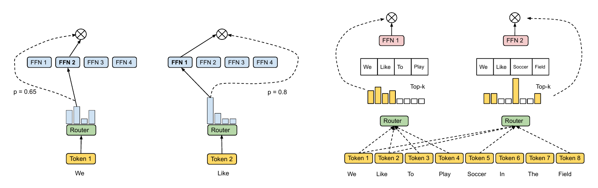<div class="a05-readable fragment" data-fragment-index="1"><div class="a05-readable-panel"><p class="a05-read-caption">Assignments from Figure 1 · enlarged</p><div class="a05-token-route"><b>Token 1</b><span>→</span><b>FFN 2</b><em>g = 0.65</em></div><div class="a05-token-route"><b>Token 2</b><span>→</span><b>FFN 1</b><em>g = 0.8</em></div><p class="a05-read-rule">A fixed number of experts<br>per token.</p></div><div class="a05-readable-panel"><p class="a05-read-caption">Selected token IDs</p><div class="a05-expert-route"><b>FFN 1</b><span>→</span><i>1</i><i>2</i><i>3</i><i>4</i></div><div class="a05-expert-route"><b>FFN 2</b><span>→</span><i>1</i><i>2</i><i>5</i><i>8</i></div><p class="a05-read-rule">A fixed batch size per expert.<br>Tokens 1 and 2 are selected twice.</p></div></div></div><div class="a05-explain fragment" data-fragment-index="1"><span>Each token selects a fixed number of experts</span><span>Each expert selects tokens for its batch</span></div><div class="a05-result fragment" data-fragment-index="2"><b>Published result</b><span>More than 2× faster convergence · 8B/64E<br>in the authors’ comparison with Switch / GShard.</span></div></div><div class="a05-systems"><div><b>Load balance</b><span>Who gets<br>more work?</span></div><div><b>Capacity</b><span>How many tokens<br>fit?</span></div><div><b>Communication</b><span>What is transferred<br>between devices?</span></div></div></div>
<div class="fv-takeaway">Routing determines both the model’s choices and the distribution of actual work.</div>
<div class="fv-source"><a href="https://arxiv.org/abs/2202.09368">Zhou et al., 2022, Fig. 1, §4</a> · Original and enlarged assignments from Fig. 1 · Authors’ conditions</div>
```

::: {.notes}
Когда токенов много, недостаточно выбрать полезных экспертов для каждого из них. Если один эксперт получит почти весь поток, другие устройства могут простаивать, а шаг будет ждать перегруженную часть системы. Поэтому маршрутизация одновременно влияет на качество модели и на выполнение.

Перед нами оригинальная Figure 1 из Expert Choice Routing. Слева токен выбирает фиксированное число экспертов; количество токенов у каждого эксперта может различаться. Справа направление назначения обратное: каждый эксперт выбирает наиболее подходящие токены в batch заданной вместимости. Один токен при этом может попасть к разному числу экспертов. Первый клик показывает те же назначения крупными подписями: в левой панели Token 1 идёт к FFN 2, Token 2 к FFN 1; справа FFN 1 выбирает токены 1–4, FFN 2 — 1, 2, 5 и 8. Увеличенная схема не добавляет вымышленных измерений загрузки.

Справа перечислены три системных вопроса. Балансировка определяет распределение нагрузки. Capacity ограничивает размер экспертного batch. Communication учитывает пересылку входов и результатов между устройствами. Схема статьи иллюстрирует назначения, а не замер равномерной загрузки оборудования.

Второй клик показывает ускорение сходимости более чем вдвое для конфигурации 8B/64E в сравнении авторов со Switch и GShard. Это результат их обучения, а не универсальное ускорение любого inference. Ни один способ маршрутизации нельзя назвать лучшим без условий качества, capacity и распределённого исполнения.

Источник: https://arxiv.org/abs/2202.09368 .
:::

## MoE: what it achieves and where it is used {#arch-08 .fv-slide .arch-slide background-color="#ffffff"}

```{=html}
<div class="fv-meta"><span class="fv-id">A 08 / 46</span><span class="fv-cluster active">Architecture</span><span class="fv-cluster">Data</span><span class="fv-cluster">Training</span><span class="fv-cluster">Inference</span><span class="fv-cluster">Tools</span></div>
<div class="fv-body a06-body"><div class="a06-evidence"><div class="fv-label">Controlled experiment · 2017</div><div class="a06-figure"><div class="a06-axis-label">Test perplexity ↓</div>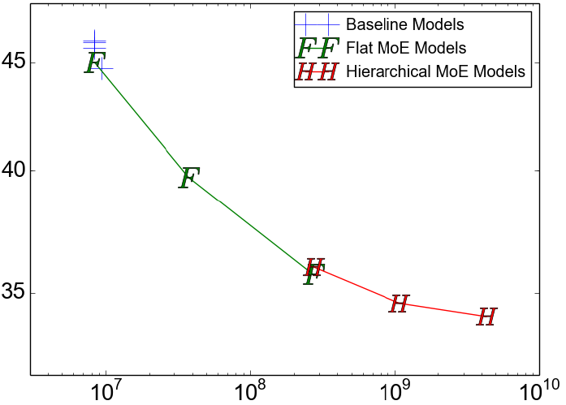<div class="a06-native-legend"><span><i class="a06-baseline">＋</i> Baseline</span><span><i class="a06-flat">F</i> Flat MoE</span><span><i class="a06-hier">H</i> Hierarchical MoE</span></div><div class="a06-x-label">Parameters excluding embeddings and softmax</div></div><div class="a06-gain"><b>up to −24%</b><span>test perplexity<br>at comparable compute</span></div></div><div class="a06-models"><div class="a06-modelhead"><span>Published model</span><span>Model parameters</span></div><div class="a06-model"><div><b>DeepSeek-V3</b><small>8 routed + 1 shared</small></div><div><strong>671B / 37B</strong><small>total / token</small></div></div><div class="a06-model fragment" data-fragment-index="1"><div><b>Qwen3.8-<br>Flash-Next</b><small>10 routed + 1 shared</small></div><div><strong>125B / 6B</strong><small>backbone / active<br>+ 51B n-gram · + 4B MTP</small></div></div><div class="a06-model fragment" data-fragment-index="2"><div><b>DeepSeek-<br>V4.1-Flash</b><small>6 routed + 1 shared</small></div><div><strong>552B / 8–16B</strong><small>backbone · + 196B Engram<br>active: 8B prefill · 16B decode</small></div></div><p class="a06-caveat">Active ≠ checkpoint size.<br>V4.1’s Causal Encoder-Decoder sets different budgets.</p></div></div>
<div class="fv-takeaway">MoE separates available capacity from the computation used for each token.</div>
<div class="fv-source"><a href="https://arxiv.org/abs/1701.06538">Shazeer, Fig. 2 left · enlarged labels</a> · <a href="https://arxiv.org/html/2412.19437v2#S4.SS2">V3</a> · <a href="https://huggingface.co/Qwen/Qwen3.8-Flash-Next#model-overview">Qwen card</a> · <a href="https://arxiv.org/html/2609.19969v1">V4.1 report</a></div>
```

::: {.notes}
Слева оригинальная левая панель Figure 2 из работы 2017 года. По горизонтали число параметров без embeddings и softmax, по вертикали test perplexity: ниже лучше. Здесь сопоставим вычислительный бюджет, а экспертная ёмкость увеличивается. Авторы сообщают улучшение perplexity до 24%. Это эксперимент с LSTM-моделью и MoE, а не сравнение современных Transformer-моделей из правой таблицы.

Справа показаны примеры внедрения. DeepSeek-V3 имеет 671 миллиард параметров и 37 миллиардов активных; на MoE-слой выбираются восемь routed experts и работает один shared expert. Первый клик добавляет Qwen3.8-Flash-Next: 125 миллиардов backbone, шесть активных, десять routed плюс один shared. Дополнительные 51 миллиард n-gram embeddings и четыре миллиарда MTP указаны отдельно.

Второй клик добавляет DeepSeek-V4.1-Flash. Его backbone — 552 миллиарда, Engram — ещё 196. Активный бюджет отличается: восемь миллиардов при prefill и шестнадцать при decode. Причина — Causal Encoder-Decoder и пропуск полного decoder для большинства prompt-токенов, не изменение top-k. Таблица показывает разные конфигурации, а график слева отдельно свидетельствует о механизме.

Источники: https://arxiv.org/abs/1701.06538 ; https://arxiv.org/html/2412.19437v2 ; https://huggingface.co/Qwen/Qwen3.8-Flash-Next ; https://arxiv.org/html/2609.19969v1 .
:::

## Attention: where does the bottleneck arise? {#arch-09 .fv-slide .arch-slide background-color="#ffffff"}

```{=html}
<div class="fv-meta"><span class="fv-id">A 09 / 46</span><span class="fv-cluster active">Architecture</span><span class="fv-cluster">Data</span><span class="fv-cluster">Training</span><span class="fv-cluster">Inference</span><span class="fv-cluster">Tools</span></div>
<div class="fv-body a07-body"><svg class="axa-attention" viewBox="0 0 1488 390" role="img" aria-label="Scaled dot-product attention: X to Q,K,V, QK transposed, scale, causal mask, softmax, multiply V, output projection">
<defs><marker id="a07-a07-arrow" markerWidth="7" markerHeight="7" refX="6" refY="3.5" orient="auto"><path d="M0 0L7 3.5L0 7Z" fill="#141414"/></marker></defs>
<rect x="171" y="28" width="997" height="323" fill="none" stroke="#c5c5c5" stroke-width="2" stroke-dasharray="6 5"/><text x="198" y="61" fill="#626262" font-size="22">one attention head · repeat h times</text>
<g stroke="#141414" stroke-width="2" fill="none" marker-end="url(#a07-a07-arrow)"><path d="M113 192H150V106H217"/><path d="M150 192H217"/><path d="M150 192V288H217"/><path d="M313 106H369V170H408"/><path d="M313 192H408"/><path d="M578 181H620"/><path d="M865 181H925"/><path d="M1039 181H1201"/><path d="M1329 181H1370"/></g>
<path d="M313 288H983V222" stroke="#ea580c" stroke-width="3" fill="none" marker-end="url(#a07-a07-arrow)"/>
<text x="410" y="331" fill="#626262" font-size="22">Q = XW<tspan baseline-shift="super" font-size="16">Q</tspan> · K = XW<tspan baseline-shift="super" font-size="16">K</tspan> · V = XW<tspan baseline-shift="super" font-size="16">V</tspan></text>
<g text-anchor="middle" font-size="27" fill="#141414">
<rect x="23" y="157" width="90" height="70" fill="#f3f3f3" stroke="#141414"/><text x="68" y="201">X</text>
<g class="axa-q"><rect x="219" y="75" width="94" height="62" fill="#141414"/><text x="266" y="115" fill="white">Q</text></g>
<g class="axa-k"><rect x="219" y="161" width="94" height="62" fill="#2563eb"/><text x="266" y="201" fill="white">K</text></g>
<g class="axa-v"><rect x="219" y="257" width="94" height="62" fill="#ea580c"/><text x="266" y="297" fill="white">V</text></g>
<g class="axa-qk"><rect x="410" y="142" width="168" height="78" fill="white" stroke="#141414" stroke-width="2"/><text x="494" y="191" font-size="33">QKᵀ</text><text x="494" y="258" font-size="22">scores</text></g>
<g class="axa-softmax"><rect x="622" y="112" width="243" height="137" fill="#f3f3f3" stroke="#141414"/><text x="744" y="147" font-size="24">÷ √dₖ</text><text x="744" y="182" font-size="24">causal mask</text><text x="744" y="224" font-size="27">softmax → A</text></g>
<g class="axa-av"><rect x="927" y="142" width="112" height="78" fill="white" stroke="#141414" stroke-width="2"/><text x="983" y="191" font-size="33">AV</text><text x="1100" y="258" font-size="22">output</text></g>
<g class="axa-output"><rect x="1203" y="125" width="126" height="112" fill="#f3f3f3" stroke="#141414"/><text x="1266" y="166" font-size="22">Concat</text><text x="1266" y="208" font-size="26">Wᴼ</text><text x="1410" y="190">Y</text></g>
</g></svg>

<div class="a07-under"><div class="a07-formula"><span class="math inline">\(A=\operatorname{softmax}\!\left(\frac{QK^{\top}}{\sqrt{d_k}}+M\right)\)</span></div><div class="a07-cost fragment" data-fragment-index="1"><b>Longer context → more position pairs</b><span>MHA: each head has its own <i class="a-k">K</i> and <i class="a-v">V</i></span></div></div></div>
<div class="fv-takeaway">Long contexts make both attention computation and K/V memory traffic important.</div>
<div class="fv-source"><a href="https://arxiv.org/abs/1706.03762">Vaswani et al., 2017, Fig. 2, §3.2</a> · <a href="https://arxiv.org/abs/2205.14135">FlashAttention, 2022</a> · Adapted</div>
```

::: {.notes}
Теперь перейдём от ёмкости FFN к смешиванию токенов. Из входных представлений X линейные проекции строят queries, keys и values. На схеме Q показаны чёрным, K синим, V оранжевым. Эти цвета останутся постоянными во всём разделе.

Для одной головы произведение QK транспонированное даёт оценки совместимости запросов и ключей. Затем делим на корень из размерности ключа, применяем causal mask и softmax. Маска запрещает смотреть на будущие позиции. Полученные веса A умножаются на V, создавая новые представления. В multi-head варианте процесс повторяется по головам, результаты соединяются и проходят выходную проекцию.

Первый клик связывает механизм с ресурсами: при увеличении длины последовательности растёт число пар позиций. В обычном MHA у каждой головы есть собственные K и V. Поэтому организация голов меняет количество представлений, которые нужно построить и передать через память. Пока мы не обсуждаем повторное использование между шагами генерации.

Attention не обязан доминировать при любой длине контекста. Соотношение стоимости зависит от модели, batch, prefill или decode и оборудования. FlashAttention отдельно подчёркивает стоимость обмена с памятью, которую нельзя оценить только количеством арифметических операций.

Источники: https://arxiv.org/abs/1706.03762 ; https://arxiv.org/abs/2205.14135 .
:::

## MQA: many queries, one K/V pair {#arch-10 .fv-slide .arch-slide background-color="#ffffff"}

```{=html}
<div class="fv-meta"><span class="fv-id">A 10 / 46</span><span class="fv-cluster active">Architecture</span><span class="fv-cluster">Data</span><span class="fv-cluster">Training</span><span class="fv-cluster">Inference</span><span class="fv-cluster">Tools</span></div>
<div class="fv-body a08-body"><div class="a08-pair"><div><h3>MHA · 4 K/V pairs</h3><svg viewBox="0 0 690 335" role="img"><defs><marker id="a08-a-head-MHA" markerWidth="7" markerHeight="7" refX="6" refY="3.5" orient="auto"><path d="M0 0L7 3.5L0 7Z" fill="#141414"/></marker></defs><g fill="#141414" font-size="26"><path d="M80 145V179M56 214V179H104V214" stroke="#8b8b8b" fill="none" stroke-width="2"/><g class=""><rect x="35.0" y="214" width="42" height="48" fill="#2563eb" stroke="#141414"/><text x="56.0" y="246.05" font-size="23" text-anchor="middle" fill="white">K</text></g><g class=""><rect x="83.0" y="214" width="42" height="48" fill="#ea580c" stroke="#141414"/><text x="104.0" y="246.05" font-size="23" text-anchor="middle" fill="white">V</text></g><path d="M250 145V179M226 214V179H274V214" stroke="#8b8b8b" fill="none" stroke-width="2"/><g class=""><rect x="205.0" y="214" width="42" height="48" fill="#2563eb" stroke="#141414"/><text x="226.0" y="246.05" font-size="23" text-anchor="middle" fill="white">K</text></g><g class=""><rect x="253.0" y="214" width="42" height="48" fill="#ea580c" stroke="#141414"/><text x="274.0" y="246.05" font-size="23" text-anchor="middle" fill="white">V</text></g><path d="M420 145V179M396 214V179H444V214" stroke="#8b8b8b" fill="none" stroke-width="2"/><g class=""><rect x="375.0" y="214" width="42" height="48" fill="#2563eb" stroke="#141414"/><text x="396.0" y="246.05" font-size="23" text-anchor="middle" fill="white">K</text></g><g class=""><rect x="423.0" y="214" width="42" height="48" fill="#ea580c" stroke="#141414"/><text x="444.0" y="246.05" font-size="23" text-anchor="middle" fill="white">V</text></g><path d="M590 145V179M566 214V179H614V214" stroke="#8b8b8b" fill="none" stroke-width="2"/><g class=""><rect x="545.0" y="214" width="42" height="48" fill="#2563eb" stroke="#141414"/><text x="566.0" y="246.05" font-size="23" text-anchor="middle" fill="white">K</text></g><g class=""><rect x="593.0" y="214" width="42" height="48" fill="#ea580c" stroke="#141414"/><text x="614.0" y="246.05" font-size="23" text-anchor="middle" fill="white">V</text></g><g class=""><rect x="52" y="85" width="56" height="60" fill="#141414" stroke="#141414"/><text x="80.0" y="123.05" font-size="23" text-anchor="middle" fill="white">Q1</text></g><g class=""><rect x="222" y="85" width="56" height="60" fill="#141414" stroke="#141414"/><text x="250.0" y="123.05" font-size="23" text-anchor="middle" fill="white">Q2</text></g><g class=""><rect x="392" y="85" width="56" height="60" fill="#141414" stroke="#141414"/><text x="420.0" y="123.05" font-size="23" text-anchor="middle" fill="white">Q3</text></g><g class=""><rect x="562" y="85" width="56" height="60" fill="#141414" stroke="#141414"/><text x="590.0" y="123.05" font-size="23" text-anchor="middle" fill="white">Q4</text></g></g></svg></div><div><h3>MQA · 1 shared K/V pair</h3><svg viewBox="0 0 690 335" role="img"><defs><marker id="a08-a-head-MQA" markerWidth="7" markerHeight="7" refX="6" refY="3.5" orient="auto"><path d="M0 0L7 3.5L0 7Z" fill="#141414"/></marker></defs><g fill="#141414" font-size="26"><path d="M80 179H590M80 145V179M250 145V179M420 145V179M590 145V179M311 179V214M359 179V214" stroke="#8b8b8b" fill="none" stroke-width="2"/><g class=""><rect x="290.0" y="214" width="42" height="48" fill="#2563eb" stroke="#141414"/><text x="311.0" y="246.05" font-size="23" text-anchor="middle" fill="white">K</text></g><g class=""><rect x="338.0" y="214" width="42" height="48" fill="#ea580c" stroke="#141414"/><text x="359.0" y="246.05" font-size="23" text-anchor="middle" fill="white">V</text></g><g class=""><rect x="52" y="85" width="56" height="60" fill="#141414" stroke="#141414"/><text x="80.0" y="123.05" font-size="23" text-anchor="middle" fill="white">Q1</text></g><g class=""><rect x="222" y="85" width="56" height="60" fill="#141414" stroke="#141414"/><text x="250.0" y="123.05" font-size="23" text-anchor="middle" fill="white">Q2</text></g><g class=""><rect x="392" y="85" width="56" height="60" fill="#141414" stroke="#141414"/><text x="420.0" y="123.05" font-size="23" text-anchor="middle" fill="white">Q3</text></g><g class=""><rect x="562" y="85" width="56" height="60" fill="#141414" stroke="#141414"/><text x="590.0" y="123.05" font-size="23" text-anchor="middle" fill="white">Q4</text></g></g></svg></div></div><div class="a08-result fragment" data-fragment-index="1"><span class="math inline">\(A_i=\operatorname{softmax}\!\left(\frac{Q_iK^\top}{\sqrt{d_k}}+M\right)\)</span><div><b>Each Qᵢ has its own distribution Aᵢ</b><span>Shared K/V preserve distinct head outputs.</span></div></div></div>
<div class="fv-takeaway">Shared K/V ≠ identical attention outputs.</div>
<div class="fv-source"><a href="https://arxiv.org/abs/1911.02150">Shazeer, 2019</a> · <a href="https://arxiv.org/abs/2305.13245">Ainslie et al., 2023, Fig. 2</a> · Adapted: 4 query heads</div>
```

::: {.notes}
В multi-query attention меняется количество независимых ключей и значений. Сравним две панели в одинаковом масштабе. В обеих четыре query-heads. Слева MHA: каждой Q соответствует собственная пара K и V. Справа MQA: четыре разных запроса обращаются к одной общей паре ключей и значений.

Это не превращает четыре головы в одну. Первый клик раскрывает формулу для i-й головы. В ней общие K, но разные Q_i. Поэтому произведения с ключами, распределения softmax и итоговые ответы могут различаться. Общий набор представлений прошлого не задаёт одинаковый способ его прочтения.

Потенциальная экономия связана с тем, что независимых K/V-представлений меньше. При этом архитектурная ёмкость внимания также меняется, и качество нужно проверять экспериментально. Исходная работа Shazeer рассматривает быстрый incremental decoding и показывает компромисс скорости и качества. Сейчас нам нужен именно механизм совместного использования K/V; к хранению между последовательными шагами генерации мы перейдём отдельно. Схема учебная: четыре головы выбраны ради читаемости, это не конфигурация конкретной опубликованной модели.

Источники: https://arxiv.org/abs/1911.02150 ; https://arxiv.org/abs/2305.13245 .
:::

## GQA: a trade-off between MHA and MQA {#arch-11 .fv-slide .arch-slide background-color="#ffffff"}

```{=html}
<div class="fv-meta"><span class="fv-id">A 11 / 46</span><span class="fv-cluster active">Architecture</span><span class="fv-cluster">Data</span><span class="fv-cluster">Training</span><span class="fv-cluster">Inference</span><span class="fv-cluster">Tools</span></div>
<div class="fv-body a09-body"><div class="a09-mechanism"><div class="a09-triplet"><div class="a09-headpanel "><h3>MHA</h3><svg viewBox="0 0 310 230" role="img"><defs><marker id="a09-a-head-MHA" markerWidth="7" markerHeight="7" refX="6" refY="3.5" orient="auto"><path d="M0 0L7 3.5L0 7Z" fill="#141414"/></marker></defs><g fill="#141414" font-size="26"><path d="M45 95V118M28 140V118H62V140" stroke="#8b8b8b" fill="none" stroke-width="2"/><g class=""><rect x="13.0" y="140" width="30" height="48" fill="#2563eb" stroke="#141414"/><text x="28.0" y="172.05" font-size="26" text-anchor="middle" fill="white">K</text></g><g class=""><rect x="47.0" y="140" width="30" height="48" fill="#ea580c" stroke="#141414"/><text x="62.0" y="172.05" font-size="26" text-anchor="middle" fill="white">V</text></g><path d="M115 95V118M98 140V118H132V140" stroke="#8b8b8b" fill="none" stroke-width="2"/><g class=""><rect x="83.0" y="140" width="30" height="48" fill="#2563eb" stroke="#141414"/><text x="98.0" y="172.05" font-size="26" text-anchor="middle" fill="white">K</text></g><g class=""><rect x="117.0" y="140" width="30" height="48" fill="#ea580c" stroke="#141414"/><text x="132.0" y="172.05" font-size="26" text-anchor="middle" fill="white">V</text></g><path d="M185 95V118M168 140V118H202V140" stroke="#8b8b8b" fill="none" stroke-width="2"/><g class=""><rect x="153.0" y="140" width="30" height="48" fill="#2563eb" stroke="#141414"/><text x="168.0" y="172.05" font-size="26" text-anchor="middle" fill="white">K</text></g><g class=""><rect x="187.0" y="140" width="30" height="48" fill="#ea580c" stroke="#141414"/><text x="202.0" y="172.05" font-size="26" text-anchor="middle" fill="white">V</text></g><path d="M255 95V118M238 140V118H272V140" stroke="#8b8b8b" fill="none" stroke-width="2"/><g class=""><rect x="223.0" y="140" width="30" height="48" fill="#2563eb" stroke="#141414"/><text x="238.0" y="172.05" font-size="26" text-anchor="middle" fill="white">K</text></g><g class=""><rect x="257.0" y="140" width="30" height="48" fill="#ea580c" stroke="#141414"/><text x="272.0" y="172.05" font-size="26" text-anchor="middle" fill="white">V</text></g><g class=""><rect x="17" y="35" width="56" height="60" fill="#141414" stroke="#141414"/><text x="45.0" y="73.05" font-size="26" text-anchor="middle" fill="white">Q1</text></g><g class=""><rect x="87" y="35" width="56" height="60" fill="#141414" stroke="#141414"/><text x="115.0" y="73.05" font-size="26" text-anchor="middle" fill="white">Q2</text></g><g class=""><rect x="157" y="35" width="56" height="60" fill="#141414" stroke="#141414"/><text x="185.0" y="73.05" font-size="26" text-anchor="middle" fill="white">Q3</text></g><g class=""><rect x="227" y="35" width="56" height="60" fill="#141414" stroke="#141414"/><text x="255.0" y="73.05" font-size="26" text-anchor="middle" fill="white">Q4</text></g></g></svg><span>G = H</span></div><div class="a09-headpanel a09-central"><h3>GQA</h3><svg viewBox="0 0 310 230" role="img"><defs><marker id="a09-a-head-GQA" markerWidth="7" markerHeight="7" refX="6" refY="3.5" orient="auto"><path d="M0 0L7 3.5L0 7Z" fill="#141414"/></marker></defs><g fill="#141414" font-size="26"><path d="M45 118H115M45 95V118M115 95V118M63 118V140M97 118V140" stroke="#8b8b8b" fill="none" stroke-width="2"/><g class=""><rect x="48.0" y="140" width="30" height="48" fill="#2563eb" stroke="#141414"/><text x="63.0" y="172.05" font-size="26" text-anchor="middle" fill="white">K</text></g><g class=""><rect x="82.0" y="140" width="30" height="48" fill="#ea580c" stroke="#141414"/><text x="97.0" y="172.05" font-size="26" text-anchor="middle" fill="white">V</text></g><path d="M185 118H255M185 95V118M255 95V118M203 118V140M237 118V140" stroke="#8b8b8b" fill="none" stroke-width="2"/><g class=""><rect x="188.0" y="140" width="30" height="48" fill="#2563eb" stroke="#141414"/><text x="203.0" y="172.05" font-size="26" text-anchor="middle" fill="white">K</text></g><g class=""><rect x="222.0" y="140" width="30" height="48" fill="#ea580c" stroke="#141414"/><text x="237.0" y="172.05" font-size="26" text-anchor="middle" fill="white">V</text></g><g class=""><rect x="17" y="35" width="56" height="60" fill="#141414" stroke="#141414"/><text x="45.0" y="73.05" font-size="26" text-anchor="middle" fill="white">Q1</text></g><g class=""><rect x="87" y="35" width="56" height="60" fill="#141414" stroke="#141414"/><text x="115.0" y="73.05" font-size="26" text-anchor="middle" fill="white">Q2</text></g><g class=""><rect x="157" y="35" width="56" height="60" fill="#141414" stroke="#141414"/><text x="185.0" y="73.05" font-size="26" text-anchor="middle" fill="white">Q3</text></g><g class=""><rect x="227" y="35" width="56" height="60" fill="#141414" stroke="#141414"/><text x="255.0" y="73.05" font-size="26" text-anchor="middle" fill="white">Q4</text></g></g></svg><span>1 < G < H</span></div><div class="a09-headpanel "><h3>MQA</h3><svg viewBox="0 0 310 230" role="img"><defs><marker id="a09-a-head-MQA" markerWidth="7" markerHeight="7" refX="6" refY="3.5" orient="auto"><path d="M0 0L7 3.5L0 7Z" fill="#141414"/></marker></defs><g fill="#141414" font-size="26"><path d="M45 118H255M45 95V118M115 95V118M185 95V118M255 95V118M133 118V140M167 118V140" stroke="#8b8b8b" fill="none" stroke-width="2"/><g class=""><rect x="118.0" y="140" width="30" height="48" fill="#2563eb" stroke="#141414"/><text x="133.0" y="172.05" font-size="26" text-anchor="middle" fill="white">K</text></g><g class=""><rect x="152.0" y="140" width="30" height="48" fill="#ea580c" stroke="#141414"/><text x="167.0" y="172.05" font-size="26" text-anchor="middle" fill="white">V</text></g><g class=""><rect x="17" y="35" width="56" height="60" fill="#141414" stroke="#141414"/><text x="45.0" y="73.05" font-size="26" text-anchor="middle" fill="white">Q1</text></g><g class=""><rect x="87" y="35" width="56" height="60" fill="#141414" stroke="#141414"/><text x="115.0" y="73.05" font-size="26" text-anchor="middle" fill="white">Q2</text></g><g class=""><rect x="157" y="35" width="56" height="60" fill="#141414" stroke="#141414"/><text x="185.0" y="73.05" font-size="26" text-anchor="middle" fill="white">Q3</text></g><g class=""><rect x="227" y="35" width="56" height="60" fill="#141414" stroke="#141414"/><text x="255.0" y="73.05" font-size="26" text-anchor="middle" fill="white">Q4</text></g></g></svg><span>G = 1</span></div></div><div class="a09-definition"><b>One K/V pair per query group</b><span>The number of query heads H is unchanged.</span></div><div class="a09-conditions fragment" data-fragment-index="1"><b>T5-XXL · GQA-8 · 5% uptraining</b><span>In this experiment: quality close to MHA,<br>inference time close to MQA.</span></div></div><div class="a09-plot">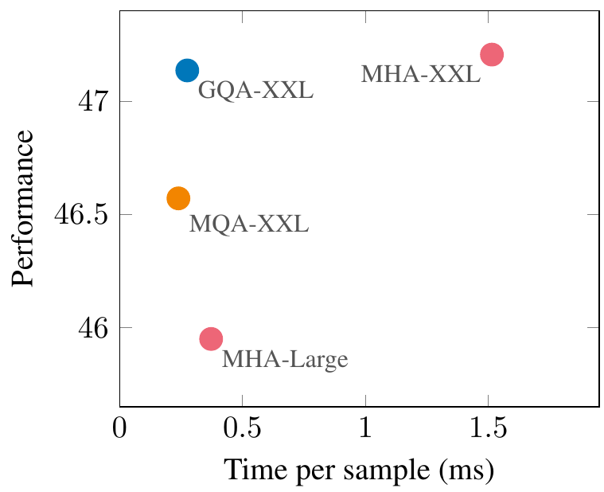<p>Figure 3 · average over 7 tasks · 8 TPUv4<br><small>The figure uses ms; Table 1 uses s.</small></p></div></div>
<div class="fv-takeaway">Fewer independent K/V pairs change the storage and read budgets.</div>
<div class="fv-source"><a href="https://arxiv.org/abs/2305.13245">Ainslie et al., 2023, Figs. 2–3 and 6</a> · Mechanism adapted · Original plot</div>
```

::: {.notes}
Grouped-query attention размещается между двумя крайними случаями. В MHA число независимых K/V-пар равно числу query-heads H. В MQA остаётся одна пара. GQA объединяет запросы в G групп, внутри каждой используются общие K и V. Центральная панель выделена: здесь две группы на четыре учебных запроса. Изменяется число представлений, а не число запросов.

Справа оригинальная Figure 3 статьи. Это сравнение на базе T5.1.1: MHA-Large, MHA-XXL и версии XXL с MQA и GQA-8. Последние получены преобразованием checkpoint и дополнительным pretraining объёмом 5% исходного обучения. Первый клик фиксирует эти условия. В данном эксперименте GQA приближается к качеству MHA-XXL при времени, близком к MQA.

Тайминг измеряли на восьми TPUv4 с настройкой batch и параллелизма для каждой модели. У исходного рисунка есть несогласованность единицы: на оси написано ms, а в Table 1 те же числа приведены в секундах; мы сохраняем оригинал и отмечаем расхождение. Это не универсальная гарантия для decoder-only моделей, других задач и оборудования. Figure 6 отдельно показывает рост времени с количеством групп.

Источник: https://arxiv.org/abs/2305.13245 .
:::

## What does the model retain between steps? {#arch-12 .fv-slide .arch-slide background-color="#ffffff"}

```{=html}
<div class="fv-meta"><span class="fv-id">A 12 / 46</span><span class="fv-cluster active">Architecture</span><span class="fv-cluster">Data</span><span class="fv-cluster">Training</span><span class="fv-cluster">Inference</span><span class="fv-cluster">Tools</span></div>
<div class="fv-body n06-body">
  <p class="n06-lead"><b>KV cache</b> stores intermediate representations<br>of positions already processed.</p>
  <div class="n06-cache" role="img" aria-label="Stored representations for positions one, two, and three are reused. Processing the new token adds a representation for position four.">
    <div class="n06-row"><span class="n06-row-label">Before the step</span><div class="n06-bank"><span>position 1</span><span>position 2</span><span>position 3</span></div><div class="n06-current">New token<br><b>position 4</b></div></div>
    <div class="n06-actions"><b>↓ reuse</b><b>↓ compute and append</b></div>
    <div class="n06-row"><span class="n06-row-label">After the step</span><div class="n06-bank"><span>position 1</span><span>position 2</span><span>position 3</span><span class="n06-added">position 4</span></div></div>
  </div>
  <div class="n06-purpose"><b>At the next step:</b><span>read the stored state + process the new token.</span></div>
  <div class="n06-boundary">This is neither a ready-made answer nor a knowledge base.</div>
</div>
<div class="fv-takeaway">The cache lets computation continue without recomputing past representations.</div>
<div class="fv-source"><a href="https://huggingface.co/docs/transformers/cache_explanation">Hugging Face Transformers · How caching works</a> · A simple growing cache for causal attention</div>
```

::: {.notes}
Рассмотрим состояние после обработки трёх позиций и новый токен на четвёртой позиции. Подписи внутри прямоугольников обозначают промежуточные представления соответствующих позиций, а не сами текстовые токены. Ранее вычисленное состояние используется при обработке нового токена; для него вычисляется и сохраняется новая запись. Затем обновлённое состояние доступно следующему шагу.

Название KV cache связано с ключами и значениями attention. Для основного рассказа достаточно видеть сохранённую работу: прошлые представления не вычисляются с нуля, но модель всё ещё должна читать нужное состояние и выполнять новые вычисления. Cache не является готовым ответом и не заменяет знания, закреплённые в весах. Он относится к обработанному контексту конкретного запроса.

На схеме выбран простой растущий cache причинного трансформера. Слои и attention heads скрыты; это не одна общая таблица, буквально существующая во всей модели. Детали оконного состояния и ограничений хранения здесь не нужны.

Переход: теперь раскроем, какие именно ключи и значения сохраняются. На следующем слайде проследим чтение прежних K и V и добавление новой пары при каждом шаге attention.

Источник: [Hugging Face Transformers, How caching works](https://huggingface.co/docs/transformers/cache_explanation), разделы Attention matrices, Cache class и Cache storage implementation. Проверено 7 октября 2026 года.
:::

## KV cache: avoid recomputing the past {#arch-13 .fv-slide .arch-slide background-color="#ffffff"}

```{=html}
<div class="fv-meta"><span class="fv-id">A 13 / 46</span><span class="fv-cluster active">Architecture</span><span class="fv-cluster">Data</span><span class="fv-cluster">Training</span><span class="fv-cluster">Inference</span><span class="fv-cluster">Tools</span></div>
<div class="fv-body a10-body"><div class="a10-timeline"><div class="a10-step"><h3>Step 3</h3><svg viewBox="0 0 400 255" role="img" aria-label="The new query reads accumulated K and V; a new entry is appended to the existing buffer"><rect x="15" y="15" width="95" height="53" fill="#141414"/><text x="62" y="50" text-anchor="middle" fill="white" font-size="27">Q3</text><path d="M110 42H360V146H210" fill="none" stroke="#141414" stroke-width="2"/><path d="M218 141L210 146L218 151" fill="none" stroke="#141414" stroke-width="2"/><text x="150" y="35" font-size="22">reads history</text><rect x="20" y="90" width="190" height="112" fill="none" stroke="#626262" stroke-width="1.5"/><rect x="25" y="100" width="54" height="42" fill="#2563eb" opacity="0.65"/><text x="52" y="129" text-anchor="middle" fill="white" font-size="24">K1</text><rect x="25" y="150" width="54" height="42" fill="#ea580c" opacity="0.65"/><text x="52" y="179" text-anchor="middle" fill="white" font-size="24">V1</text><rect x="85" y="100" width="54" height="42" fill="#2563eb" opacity="0.65"/><text x="112" y="129" text-anchor="middle" fill="white" font-size="24">K2</text><rect x="85" y="150" width="54" height="42" fill="#ea580c" opacity="0.65"/><text x="112" y="179" text-anchor="middle" fill="white" font-size="24">V2</text><rect x="145" y="100" width="54" height="42" fill="#2563eb" opacity="1"/><text x="172" y="129" text-anchor="middle" fill="white" font-size="24">K3</text><rect x="145" y="150" width="54" height="42" fill="#ea580c" opacity="1"/><text x="172" y="179" text-anchor="middle" fill="white" font-size="24">V3</text><rect x="141" y="95" width="62" height="102" fill="none" stroke="#7cb518" stroke-width="3"/><path d="M25 210H137" stroke="#141414" stroke-width="2"/><text x="81.0" y="240" text-anchor="middle" font-size="23">Reuse</text><text x="173" y="240" text-anchor="middle" font-size="23">Append</text></svg></div><div class="a10-flow fragment" data-fragment-index="1">→</div><div class="fragment" data-fragment-index="1"><div class="a10-step"><h3>Step 4</h3><svg viewBox="0 0 400 255" role="img" aria-label="The new query reads accumulated K and V; a new entry is appended to the existing buffer"><rect x="15" y="15" width="95" height="53" fill="#141414"/><text x="62" y="50" text-anchor="middle" fill="white" font-size="27">Q4</text><path d="M110 42H360V146H270" fill="none" stroke="#141414" stroke-width="2"/><path d="M278 141L270 146L278 151" fill="none" stroke="#141414" stroke-width="2"/><text x="150" y="35" font-size="22">reads history</text><rect x="20" y="90" width="250" height="112" fill="none" stroke="#626262" stroke-width="1.5"/><rect x="25" y="100" width="54" height="42" fill="#2563eb" opacity="0.65"/><text x="52" y="129" text-anchor="middle" fill="white" font-size="24">K1</text><rect x="25" y="150" width="54" height="42" fill="#ea580c" opacity="0.65"/><text x="52" y="179" text-anchor="middle" fill="white" font-size="24">V1</text><rect x="85" y="100" width="54" height="42" fill="#2563eb" opacity="0.65"/><text x="112" y="129" text-anchor="middle" fill="white" font-size="24">K2</text><rect x="85" y="150" width="54" height="42" fill="#ea580c" opacity="0.65"/><text x="112" y="179" text-anchor="middle" fill="white" font-size="24">V2</text><rect x="145" y="100" width="54" height="42" fill="#2563eb" opacity="0.65"/><text x="172" y="129" text-anchor="middle" fill="white" font-size="24">K3</text><rect x="145" y="150" width="54" height="42" fill="#ea580c" opacity="0.65"/><text x="172" y="179" text-anchor="middle" fill="white" font-size="24">V3</text><rect x="205" y="100" width="54" height="42" fill="#2563eb" opacity="1"/><text x="232" y="129" text-anchor="middle" fill="white" font-size="24">K4</text><rect x="205" y="150" width="54" height="42" fill="#ea580c" opacity="1"/><text x="232" y="179" text-anchor="middle" fill="white" font-size="24">V4</text><rect x="201" y="95" width="62" height="102" fill="none" stroke="#7cb518" stroke-width="3"/><path d="M25 210H197" stroke="#141414" stroke-width="2"/><text x="111.0" y="240" text-anchor="middle" font-size="23">Reuse</text><text x="233" y="240" text-anchor="middle" font-size="23">Append</text></svg></div></div><div class="a10-flow fragment" data-fragment-index="2">→</div><div class="fragment" data-fragment-index="2"><div class="a10-step"><h3>Step 5</h3><svg viewBox="0 0 400 255" role="img" aria-label="The new query reads accumulated K and V; a new entry is appended to the existing buffer"><rect x="15" y="15" width="95" height="53" fill="#141414"/><text x="62" y="50" text-anchor="middle" fill="white" font-size="27">Q5</text><path d="M110 42H360V146H330" fill="none" stroke="#141414" stroke-width="2"/><path d="M338 141L330 146L338 151" fill="none" stroke="#141414" stroke-width="2"/><text x="150" y="35" font-size="22">reads history</text><rect x="20" y="90" width="310" height="112" fill="none" stroke="#626262" stroke-width="1.5"/><rect x="25" y="100" width="54" height="42" fill="#2563eb" opacity="0.65"/><text x="52" y="129" text-anchor="middle" fill="white" font-size="24">K1</text><rect x="25" y="150" width="54" height="42" fill="#ea580c" opacity="0.65"/><text x="52" y="179" text-anchor="middle" fill="white" font-size="24">V1</text><rect x="85" y="100" width="54" height="42" fill="#2563eb" opacity="0.65"/><text x="112" y="129" text-anchor="middle" fill="white" font-size="24">K2</text><rect x="85" y="150" width="54" height="42" fill="#ea580c" opacity="0.65"/><text x="112" y="179" text-anchor="middle" fill="white" font-size="24">V2</text><rect x="145" y="100" width="54" height="42" fill="#2563eb" opacity="0.65"/><text x="172" y="129" text-anchor="middle" fill="white" font-size="24">K3</text><rect x="145" y="150" width="54" height="42" fill="#ea580c" opacity="0.65"/><text x="172" y="179" text-anchor="middle" fill="white" font-size="24">V3</text><rect x="205" y="100" width="54" height="42" fill="#2563eb" opacity="0.65"/><text x="232" y="129" text-anchor="middle" fill="white" font-size="24">K4</text><rect x="205" y="150" width="54" height="42" fill="#ea580c" opacity="0.65"/><text x="232" y="179" text-anchor="middle" fill="white" font-size="24">V4</text><rect x="265" y="100" width="54" height="42" fill="#2563eb" opacity="1"/><text x="292" y="129" text-anchor="middle" fill="white" font-size="24">K5</text><rect x="265" y="150" width="54" height="42" fill="#ea580c" opacity="1"/><text x="292" y="179" text-anchor="middle" fill="white" font-size="24">V5</text><rect x="261" y="95" width="62" height="102" fill="none" stroke="#7cb518" stroke-width="3"/><path d="M25 210H257" stroke="#141414" stroke-width="2"/><text x="141.0" y="240" text-anchor="middle" font-size="23">Reuse</text><text x="293" y="240" text-anchor="middle" font-size="23">Append</text></svg></div></div></div><div class="a10-rule"><p><b>Store</b><br><span class="math inline">\(K_{1:t}=[K_{1:t-1};k_t]\)</span><br><span class="math inline">\(V_{1:t}=[V_{1:t-1};v_t]\)</span></p><p><b>Read</b><br>new Q scores K and mixes V<br>in every attention layer</p></div></div>
<div class="fv-takeaway">Caching avoids recomputing K/V, but accessing them still has a cost.</div>
<div class="fv-source"><a href="https://huggingface.co/docs/transformers/cache_explanation">Hugging Face Transformers · How caching works</a> · Custom timeline diagram</div>
```

::: {.notes}
Начинаем с уже обработанного префикса. Слева видны записи для первого и второго токенов; третий токен добавляет собственные K и V и создаёт текущий query. Синие и оранжевые ячейки сохраняют значения и принадлежность позициям. На первом раскрытии весь прежний буфер переходит к следующему шагу: это те же представления, к которым дописана одна пара. Второе раскрытие повторяет операцию ещё раз. Важно проводить пальцем вдоль области Reuse, а не рисовать её заново.

Причина корректности — causal attention: последующие токены не меняют прошлые представления. Кэш существует отдельно для каждого attention-слоя. Здесь показана растущая история одной головы; группировка голов меняет количество её копий. Это логическая схема append, а не требование физически копировать весь массив памяти при обновлении. При этом новый запрос всё равно сравнивается с накопленными ключами и использует values. Поэтому устранение повторных проекций не устраняет чтение истории.

Источник: https://huggingface.co/docs/transformers/cache_explanation
:::

## KV cache compression: what can we reduce? {#arch-14 .fv-slide .arch-slide background-color="#ffffff"}

```{=html}
<div class="fv-meta"><span class="fv-id">A 14 / 46</span><span class="fv-cluster active">Architecture</span><span class="fv-cluster">Data</span><span class="fv-cluster">Training</span><span class="fv-cluster">Inference</span><span class="fv-cluster">Tools</span></div>
<div class="fv-body a11-body"><div class="a11-grid"><div class="a11-side"><button type="button" class="a11-card" data-arch-detail="quantization" aria-haspopup="dialog"><span class="a11-card-title">Quantization <span aria-hidden="true">↗</span></span>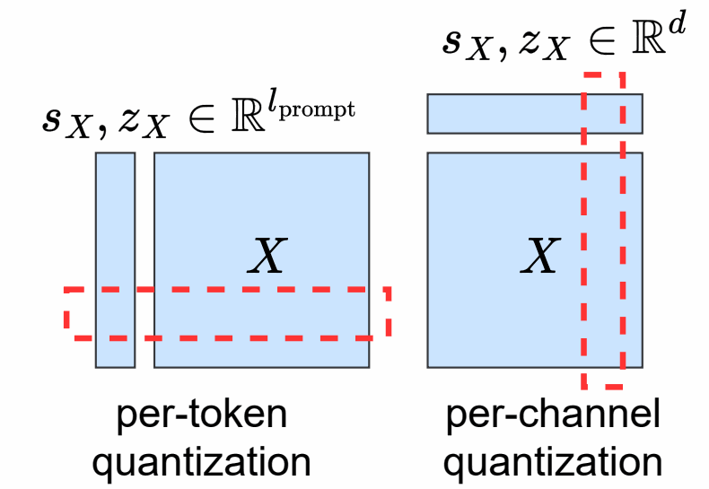<span class="a11-description">Fewer bits<br>per number</span><span class="a11-next">Open details</span></button><button type="button" class="a11-card" data-arch-detail="token-selection" aria-haspopup="dialog"><span class="a11-card-title">Token selection <span aria-hidden="true">↗</span></span>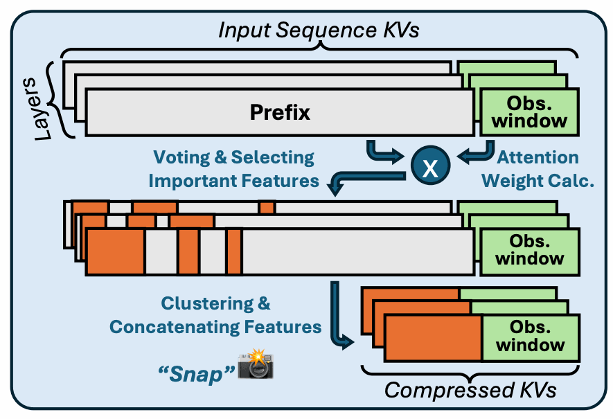<span class="a11-description">Fewer<br>positions</span><span class="a11-next">Open details</span></button></div><div class="a11-state"><svg viewBox="0 0 430 280" role="img" aria-label="State axes: layers, positions and channels"><g fill="#fff" stroke="#141414" stroke-width="2"><path d="M92 32H345V186H92Z"/><path d="M72 55H325V209H72Z"/><path d="M52 78H305V232H52Z"/></g><g stroke="#c5c5c5" stroke-width="1"><path d="M52 100H305"/><path d="M52 122H305"/><path d="M52 144H305"/><path d="M52 166H305"/><path d="M52 188H305"/><path d="M52 210H305"/><path d="M52 232H305"/><path d="M78 78V232"/><path d="M106 78V232"/><path d="M134 78V232"/><path d="M162 78V232"/><path d="M190 78V232"/><path d="M218 78V232"/><path d="M246 78V232"/><path d="M274 78V232"/><path d="M302 78V232"/></g><g fill="#2563eb" opacity=".65"><path d="M53 79H304V100H53Z"/><path d="M53 123H304V144H53Z"/></g><g fill="#ea580c" opacity=".65"><path d="M53 101H304V122H53Z"/><path d="M53 145H304V166H53Z"/></g><text x="96" y="266" font-size="23">channels →</text><text x="322" y="151" font-size="23">layers</text><text x="10" y="77" font-size="22">positions ↓</text></svg><p><b>K/V state</b><br>what and how much we store</p></div><div class="a11-side"><button type="button" class="a11-card" data-arch-detail="latent-compression" aria-haspopup="dialog"><span class="a11-card-title">Latent compression <span aria-hidden="true">↗</span></span><span class="a11-description">Fewer representation<br>dimensions</span><span class="a11-next">Open details</span></button><button type="button" class="a11-card" data-arch-detail="sharing" aria-haspopup="dialog"><span class="a11-card-title">Sharing <span aria-hidden="true">↗</span></span><span class="a11-description">Fewer independent<br>copies of state</span><span class="a11-next">Open details</span></button></div></div><p class="a11-placement"><b>Paging / offloading</b> manage placement; they do not compress information by themselves.</p></div>
<div class="fv-takeaway">A smaller cache can come from different transformations, with different losses and constraints.</div>
<div class="fv-source"><a href="https://arxiv.org/abs/2402.02750">KIVI, Fig. 1</a> · <a href="https://arxiv.org/abs/2404.14469">SnapKV, Fig. 1</a> · <a href="https://docs.vllm.ai/en/latest/design/hybrid_kv_cache_manager/">vLLM Hybrid KV Cache Manager</a> · Original thumbnails and enlargements; custom map</div>
```

::: {.notes}
Сразу показываем итоговую карту. У кэша есть позиции, каналы и слой, которому принадлежит запись. Число голов и точность хранения дают дополнительные множители. Четыре карточки кликабельны: Quantization открывает KIVI, Token selection — SnapKV, Latent compression — MLA и его результаты, Sharing — shared KV, CSA2 и результаты комбинаций. Внутри подробностей сохраняются последовательные раскрытия. Кнопка Back to KV cache или Escape возвращает к этому обзору. Стрелка вправо в основном показе сразу продолжает раздел об attention.

KIVI сокращает точность чисел, SnapKV меняет набор сохраняемых позиций, MLA использует компактное latent-представление, sharing переиспользует состояние между слоями. Одинаковая экономия памяти не означает одинаковых потерь качества: мы меняем разные свойства состояния. Миниатюры обозначают механизм, а не сравнение качества. Paging уменьшает потери от организации и фрагментации памяти, offloading переносит данные между устройствами и уровнями хранения. Их полезно комбинировать с компрессией, но перенос байтов сам по себе не сокращает представляемую информацию.

Источники: https://arxiv.org/abs/2402.02750 ; https://arxiv.org/abs/2404.14469 ; https://docs.vllm.ai/en/latest/design/hybrid_kv_cache_manager/
:::

## Revisiting attention: focus on matrix products {#arch-15 .fv-slide .arch-slide background-color="#ffffff"}

```{=html}
<div class="fv-meta"><span class="fv-id">A 15 / 46</span><span class="fv-cluster active">Architecture</span><span class="fv-cluster">Data</span><span class="fv-cluster">Training</span><span class="fv-cluster">Inference</span><span class="fv-cluster">Tools</span></div>
<div class="fv-body a17-body"><svg class="axa-attention" viewBox="0 0 1488 390" role="img" aria-label="Scaled dot-product attention: X to Q,K,V, QK transposed, scale, causal mask, softmax, multiply V, output projection">
<defs><marker id="a17-axa-arrow" markerWidth="7" markerHeight="7" refX="6" refY="3.5" orient="auto"><path d="M0 0L7 3.5L0 7Z" fill="#141414"/></marker></defs>
<rect x="171" y="28" width="997" height="323" fill="none" stroke="#c5c5c5" stroke-width="2" stroke-dasharray="6 5"/><text x="198" y="61" fill="#626262" font-size="22">one attention head · repeat h times</text>
<g stroke="#141414" stroke-width="2" fill="none" marker-end="url(#a17-axa-arrow)"><path d="M113 192H150V106H217"/><path d="M150 192H217"/><path d="M150 192V288H217"/><path d="M313 106H369V170H408"/><path d="M313 192H408"/><path d="M578 181H620"/><path d="M865 181H925"/><path d="M1039 181H1201"/><path d="M1329 181H1370"/></g>
<path d="M313 288H983V222" stroke="#ea580c" stroke-width="3" fill="none" marker-end="url(#a17-axa-arrow)"/>
<text x="410" y="331" fill="#626262" font-size="22">Q = XW<tspan baseline-shift="super" font-size="16">Q</tspan> · K = XW<tspan baseline-shift="super" font-size="16">K</tspan> · V = XW<tspan baseline-shift="super" font-size="16">V</tspan></text>
<g text-anchor="middle" font-size="27" fill="#141414">
<rect x="23" y="157" width="90" height="70" fill="#f3f3f3" stroke="#141414"/><text x="68" y="201">X</text>
<g class="axa-q"><rect x="219" y="75" width="94" height="62" fill="#141414"/><text x="266" y="115" fill="white">Q</text></g>
<g class="axa-k"><rect x="219" y="161" width="94" height="62" fill="#2563eb"/><text x="266" y="201" fill="white">K</text></g>
<g class="axa-v"><rect x="219" y="257" width="94" height="62" fill="#ea580c"/><text x="266" y="297" fill="white">V</text></g>
<g class="axa-qk"><rect x="410" y="142" width="168" height="78" fill="white" stroke="#141414" stroke-width="2"/><text x="494" y="191" font-size="33">QKᵀ</text><text x="494" y="258" font-size="22">scores</text></g>
<g class="axa-softmax"><rect x="622" y="112" width="243" height="137" fill="#f3f3f3" stroke="#141414"/><text x="744" y="147" font-size="24">÷ √dₖ</text><text x="744" y="182" font-size="24">causal mask</text><text x="744" y="224" font-size="27">softmax → A</text></g>
<g class="axa-av"><rect x="927" y="142" width="112" height="78" fill="white" stroke="#141414" stroke-width="2"/><text x="983" y="191" font-size="33">AV</text><text x="1100" y="258" font-size="22">output</text></g>
<g class="axa-output"><rect x="1203" y="125" width="126" height="112" fill="#f3f3f3" stroke="#141414"/><text x="1266" y="166" font-size="22">Concat</text><text x="1266" y="208" font-size="26">Wᴼ</text><text x="1410" y="190">Y</text></g>
</g></svg>
<div class="a17-dims"><div class="a17-dim fragment" data-fragment-index="1"><h3>Dense prefill · all positions</h3><div class="math inline">\(QK^\top:(N\!\times\!d_k)(d_k\!\times\!N)\to N\!\times\!N\)</div><div class="math inline">\(AV:(N\!\times\!N)(N\!\times\!d_v)\to N\!\times\!d_v\)</div><p>The number of valid pairs grows as <span class="math inline">\(N^2\)</span>.</p></div><div class="a17-dim fragment" data-fragment-index="2"><h3>Single-token decode · one query</h3><div class="math inline">\(qK^\top:(1\!\times\!d_k)(d_k\!\times\!N)\to1\!\times\!N\)</div><div class="math inline">\(aV:(1\!\times\!N)(N\!\times\!d_v)\to1\!\times\!d_v\)</div><p>One query reads a history of length <span class="math inline">\(N\)</span>.</p></div></div></div>
<div class="fv-source"><a href="https://arxiv.org/abs/1706.03762">Attention Is All You Need, §3.2</a> · <a href="https://arxiv.org/abs/2205.14135">FlashAttention, 2022</a> · Same custom diagram geometry as slide 7</div>
```

::: {.notes}
Возвращаем в точности ту же схему, что была перед обсуждением MQA и GQA. Не меняем расположение узлов и знакомые цвета K и V; переносим акцент на два матричных произведения. Первое создаёт оценки сходства, затем остаются масштабирование, causal mask и softmax. Второе смешивает values с полученными коэффициентами. Между этими операциями нельзя пропустить softmax или интерпретировать необработанные оценки как окончательные веса.

По первому клику показываем размерности одного dense prefill без batch и числа голов: взаимодействуют N запросов и N ключей. Causal mask исключает будущее, но порядок роста числа допустимых пар остаётся квадратичным. По второму клику сравниваем один decode-запрос, для которого длина строки оценок растёт вместе с историей. Компактность KV меняет объём данных, однако не отменяет соответствующие взаимодействия. FlashAttention организует точное вычисление через tiling и сокращает I/O; для этого не требуется материализовать всю матрицу attention в HBM. Это существенно, но плотность математической операции остаётся прежней.

Источники: https://arxiv.org/abs/1706.03762 ; https://arxiv.org/abs/2205.14135
:::

## Indexed sparse attention: select addresses first {#arch-16 .fv-slide .arch-slide background-color="#ffffff"}

```{=html}
<div class="fv-meta"><span class="fv-id">A 16 / 46</span><span class="fv-cluster active">Architecture</span><span class="fv-cluster">Data</span><span class="fv-cluster">Training</span><span class="fv-cluster">Inference</span><span class="fv-cluster">Tools</span></div>
<div class="fv-body a18-body"><div class="a18-overview fragment fade-out" data-fragment-index="1">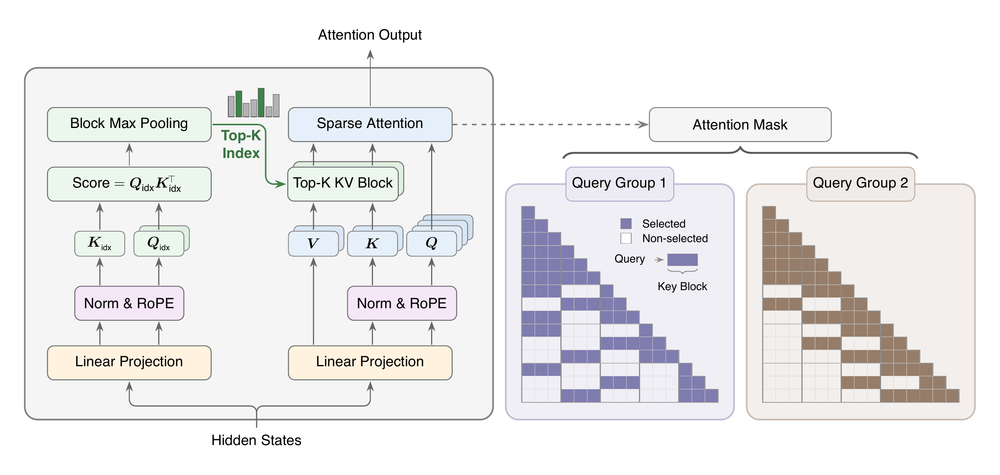<div><h3>Select addresses</h3><p>Index Branch<br>→ Top-K blocks</p><h3>Compute attention</h3><p>Main Branch<br>over selected KV</p></div></div><div class="a18-focus a18-index fragment current-visible" data-fragment-index="1"><div class="a18-crop">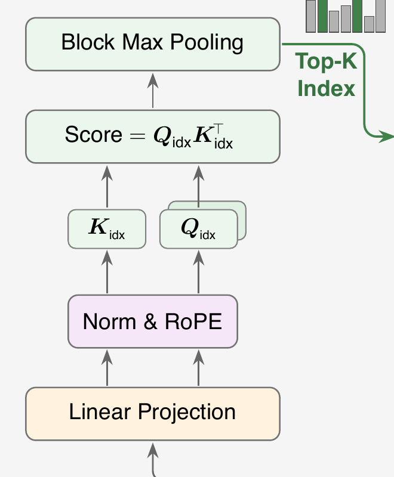</div><div><h3>1 · Index Branch</h3><p><b>Select addresses</b></p><p>Indexer Q and K<br>score positions.<br><br>Block Max Pooling<br>aggregates scores into blocks.</p><p class="a18-caption">Enlarged excerpt from the original Fig. 1.</p></div></div><div class="a18-focus a18-topk fragment current-visible" data-fragment-index="2"><div class="a18-crop">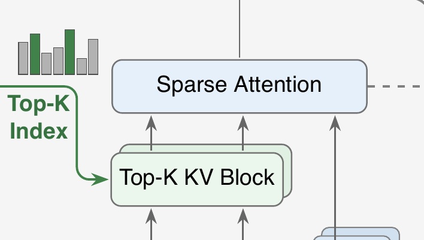</div><div><h3>2 · Top-K blocks</h3><p><b>Obtain a set of addresses</b></p><p>Main attention uses tokens<br>from the selected KV blocks.<br><br>Selection is for the current query.</p><p class="a18-caption">Enlarged excerpt from the original Fig. 1.</p></div></div><div class="a18-focus a18-main fragment current-visible" data-fragment-index="3"><div class="a18-crop">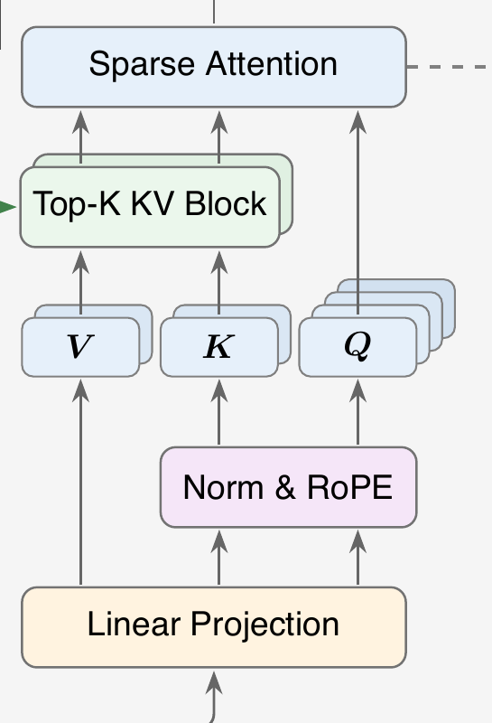</div><div><h3>3 · Main Branch</h3><p><b>Compute attention</b></p><p>Main Q, K, V<br>compute attention<br>over the selected blocks.<br><br>The causal mask excludes the future.</p><p class="a18-caption">Enlarged excerpt from the original Fig. 1.</p></div></div><div class="a18-focus a18-masks fragment" data-fragment-index="4"><div class="a18-crop">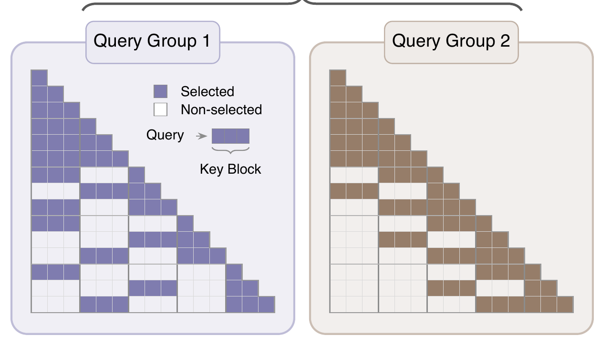</div><div><h3>4 · GQA groups</h3><p><b>Different queries, different addresses</b></p><p>Each group has its own set.<br><br>The current partial block<br>is always included;<br>the causal mask is retained.</p><p class="a18-caption">Enlarged excerpt from the original Fig. 1.</p></div></div></div>
<div class="fv-takeaway">Selecting addresses ≠ deleting history: the next query may read different entries.</div>
<div class="fv-source"><a href="https://arxiv.org/html/2606.13392v1#S0.F1">MiniMax Sparse Attention, 2026 · Fig. 1, §3.1</a> · Original figure and successive enlargements of its parts</div>
```

::: {.notes}
Первое раскрытие выделяет Index Branch в оригинальной Figure 1 MiniMax Sparse Attention. Небольшая ветвь получает индексирующие queries и keys и оценивает прошлые позиции. Затем оценки агрегируются на уровне блоков. Второй клик фокусирует Top-K: на выходе нужны адреса выбранных блоков. Третий клик переносит внимание на Main Branch, которая вычисляет собственный attention только по причинно доступным токенам этих блоков.

Четвёртое раскрытие выделяет две маски справа. Выбор выполняется отдельно для каждой GQA-группы; query-heads внутри группы используют один набор адресов, сохраняя собственные запросы. В финальном рецепте принудительно включён только текущий неполный блок, с causal mask; широкий локальный window и первый sink-блок не обязаны выбираться (Appendix C.2). Подчёркиваем различие доступа и хранения: белые клетки означают «не выбрано для этого запроса», а не «навсегда удалено из KV cache». Это учебный переход от бюджета состояния к бюджету его чтения. На следующем слайде нужно ещё точнее развести indexer scores и финальные attention weights: они принадлежат разным операциям.

Источник: https://arxiv.org/html/2606.13392v1#S3.SS1 , Figure 1.
:::

## Indexer scores are not attention weights {#arch-17 .fv-slide .arch-slide background-color="#ffffff"}

```{=html}
<div class="fv-meta"><span class="fv-id">A 17 / 46</span><span class="fv-cluster active">Architecture</span><span class="fv-cluster">Data</span><span class="fv-cluster">Training</span><span class="fv-cluster">Inference</span><span class="fv-cluster">Tools</span></div>
<div class="fv-body a19-body">
 <div class="a19-branches">
  <div class="a19-branch"><h3>Index Branch</h3><div class="fv-label">Addressing · per GQA group</div><div class="a19-math"><span class="math inline">\(Q^{\rm idx}(K^{\rm idx})^\top\)</span> → block max → Top-K</div><p class="fv-small">Scores rank blocks.<br>The current incomplete block is always included.</p><div class="a19-weights"><i style="height:20px"></i><i style="height:54px"></i><i style="height:31px"></i><i style="height:45px"></i><i style="height:16px"></i></div></div>
  <div class="a19-address fragment" data-fragment-index="1"><div class="a19-arrow">→</div><strong>Top-K indices<br><span class="math inline">\(\mathcal I\)</span></strong><div>addresses only</div><div class="a19-arrow">→</div></div>
  <div class="a19-branch fragment" data-fragment-index="2"><h3>Main Branch</h3><div class="fv-label">Mixing · each head has its own Q</div><div class="a19-math"><span class="math inline">\(\alpha=\operatorname{softmax}\!\left(\frac{QK[\mathcal I]^\top}{\sqrt{d_h}}\right)\)</span></div><div class="a19-math"><span class="math inline">\(O=\alpha\,V[\mathcal I]\)</span></div><p class="fv-small">K/V: causally available tokens from<br>selected blocks; weights are recomputed.</p></div>
 </div>
 <div class="a19-alg"><div class="fv-label">Algorithm 1 · lines 3–5 · original excerpt</div>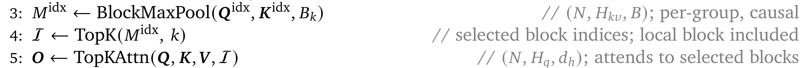</div>
</div>
<div class="fv-takeaway">The indexer chooses <b>where to look</b>. Main attention decides <b>how to mix the content</b>.</div>
<div class="fv-source"><a href="https://arxiv.org/abs/2606.13392">MiniMax Sparse Attention, 2026, §3.1, Algorithm 1</a> · Teaching diagram + original excerpt</div>
```

::: {.notes}
Здесь важно развести два набора чисел. В Index Branch есть собственные проекции запросов и ключей. Их скалярные произведения оценивают позиции, а max pooling переводит оценки на уровень блоков. Для каждой GQA-группы выбираются наиболее перспективные блоки; текущий неполный блок включается обязательно. Высота столбиков — только условная иллюстрация ранжирования, не измеренные attention weights.

Первый клик переносит между ветвями только множество индексов. Именно эти адреса определяют, какие K/V будут прочитаны. Мы не передаём оценки indexer как коэффициенты при values. Второй клик раскрывает основную ветвь: она берёт свой Q и выбранные K, заново вычисляет softmax, затем смешивает выбранные V. Выбор блоков общий внутри группы, но query heads сохраняют свои запросы и веса.

Внизу оригинальные строки алгоритма позволяют проверить эту границу: выход TopK входит в TopKAttn как отдельный аргумент. Упрощённая схема не показывает auxiliary KL loss, с которым учат indexer, и детали causal mask. Top-K отбор уменьшает доступное множество, поэтому это не тождество полному dense attention.

Источник: https://arxiv.org/html/2606.13392v1#S3.SS1
:::

## Indexed sparse attention: what the results show {#arch-18 .fv-slide .arch-slide background-color="#ffffff"}

```{=html}
<div class="fv-meta"><span class="fv-id">A 18 / 46</span><span class="fv-cluster active">Architecture</span><span class="fv-cluster">Data</span><span class="fv-cluster">Training</span><span class="fv-cluster">Inference</span><span class="fv-cluster">Tools</span></div>
<div class="fv-body a20-body">
 <div class="a20-focus-stage">
  <div class="a20-scene fragment fade-out" data-fragment-index="1">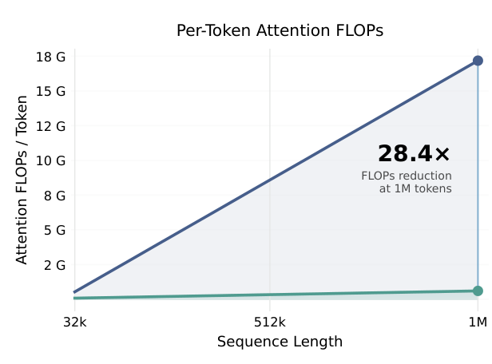</div>
  <div class="a20-scene fragment current-visible" data-fragment-index="1">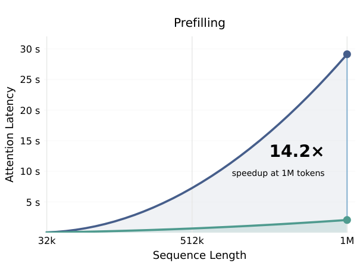</div>
  <div class="a20-scene fragment current-visible" data-fragment-index="2">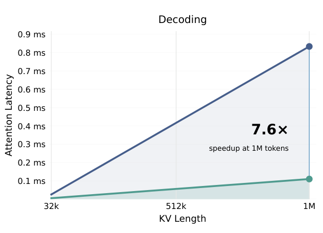</div>
  <div class="a20-scene a20-quality-focus fragment" data-fragment-index="3"><h3>128K · quality</h3><p>After long-context extension<br>Table 3 · Overall ↑</p><table><thead><tr><th></th><th>Full</th><th>MSA-CPT</th><th>Δ</th></tr></thead><tbody><tr><td>RULER</td><td>72.00</td><td><b>72.12</b></td><td>+0.12</td></tr><tr><td>HELMET</td><td>46.53</td><td><b>45.93</b></td><td>−0.60</td></tr></tbody></table><p class="a20-caveat">Quality at 128K; efficiency plots extend to 1M.</p></div>
 </div>
 <div class="a20-focus-facts"><h3>1M · efficiency</h3><p>2048 K/V tokens = 16 × 128<br>Attention on H800</p><div class="a20-legend"><span><i class="a20-gqa"></i>GQA</span><span><i class="a20-msa"></i>MSA</span></div><div class="a20-metric"><b>28.4×</b> fewer attention FLOPs</div><div class="a20-metric fragment" data-fragment-index="1"><b>14.2×</b> faster prefill</div><div class="a20-metric fragment" data-fragment-index="2"><b>7.6×</b> faster decode</div><p class="a20-limit">Attention operations in this configuration;<br>not a speedup of the whole model.</p></div>
</div>
<div class="fv-takeaway">Quality is close to dense attention in this experiment; the indexer and memory access limit speedup.</div>
<div class="fv-source"><a href="https://arxiv.org/abs/2606.13392">MiniMax Sparse Attention, 2026, Figure 4, Table 3, §5.4</a> · Original plots; abridged table</div>
```

::: {.notes}
Слева сначала видим оценку вычислений при одном миллионе токенов: MSA требует в 28,4 раза меньше attention FLOPs, чем GQA с тем же числом голов и той же размерностью. Бюджет основной ветви — максимум 2048 K/V токенов для одного запроса и GQA-группы: шестнадцать блоков по 128 токенов. Это бюджет выбранного чтения, а не весь объём KV cache.

Первый клик увеличивает оригинальный график prefill, второй — decode. Измерения времени на H800: 14,2 раза для prefill и 7,6 раза для decode. Эти числа относятся к attention-операциям данной конфигурации, а не автоматически ко всей модели. Время indexer, Top-K, построения индексов и менее регулярный доступ к памяти объясняют различие с FLOPs.

Третий клик открывает отдельно качество при 128K. После дополнительного long-context обучения MSA-CPT почти совпадает с полным attention на агрегатных RULER и HELMET, но отдельные подзадачи различаются. Мы не переносим эту таблицу на миллион токенов: графики эффективности и таблица качества отвечают на разные вопросы. Результат показывает осуществимость компромисса в опубликованном эксперименте, а не универсальную гарантию качества любой sparse модели.

Источник: https://arxiv.org/html/2606.13392v1#S5.SS4
:::

## Attention: results and the next cost bottleneck {#arch-19 .fv-slide .arch-slide background-color="#ffffff"}

```{=html}
<div class="fv-meta"><span class="fv-id">A 19 / 46</span><span class="fv-cluster active">Architecture</span><span class="fv-cluster">Data</span><span class="fv-cluster">Training</span><span class="fv-cluster">Inference</span><span class="fv-cluster">Tools</span></div>
<div class="fv-body a23-body">
 <div class="a23-top"><div class="a23-plot-stage"><div class="a23-plot-scene fragment fade-out" data-fragment-index="1"><div class="fv-label">Single-token · equivalent FP8 FLOPs</div>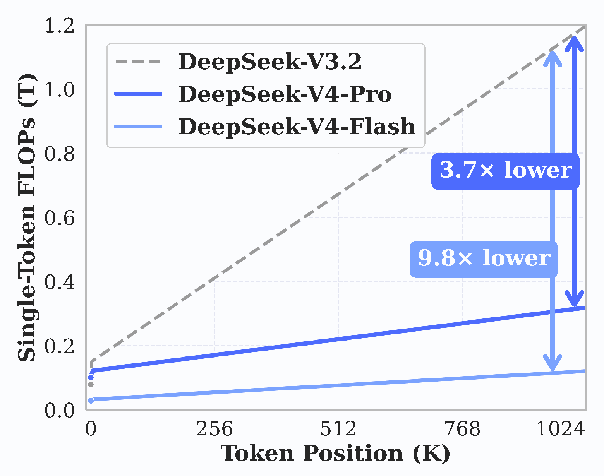</div><div class="a23-plot-scene fragment" data-fragment-index="1"><div class="fv-label">KV cache · GB</div>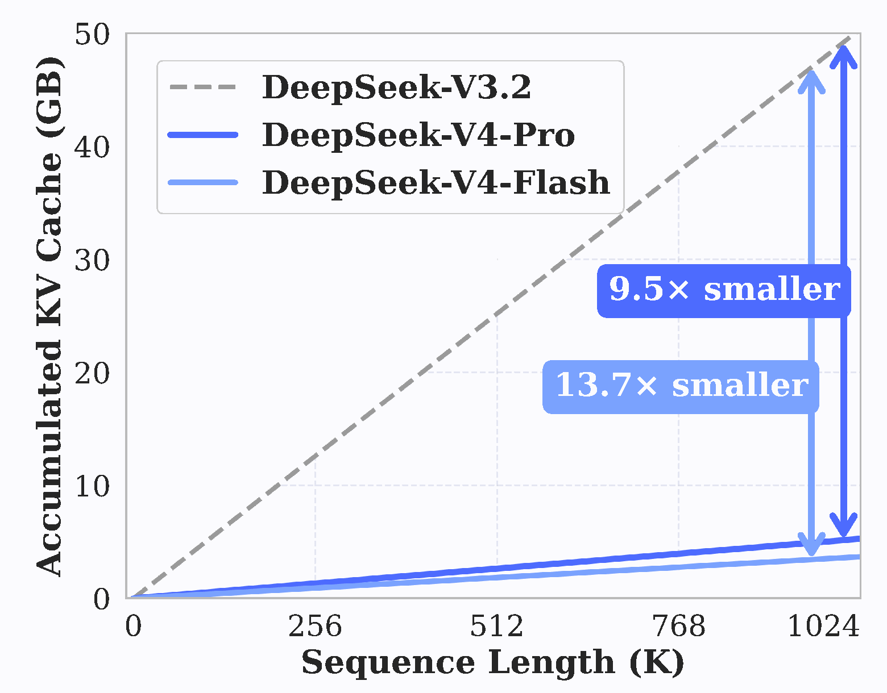</div></div><div class="a23-facts"><div class="fv-label">At 1M · relative to V3.2</div><div class="a23-fact"><strong>V4-Pro</strong><b>≈27%</b> FLOPs · <b>≈10%</b> KV</div><div class="a23-fact fragment" data-fragment-index="1"><strong>V4-Flash</strong><b>≈10%</b> FLOPs · <b>≈7%</b> KV</div><p class="fv-small" style="margin-top:19px">Estimates for the full architecture<br>with precision optimizations.<br>Not measured latency.</p></div></div>
 <div class="a23-chain fragment" data-fragment-index="2"><b>Sharing</b><span>→</span><b>Compression</b><span>→</span><b>Selection</b><span>→</span><b>Efficient kernels</b></div>
</div>
<div class="fv-takeaway">Less compute and KV leave more budget for long contexts and concurrent requests.</div>
<div class="fv-source"><a href="https://arxiv.org/abs/2606.19348">DeepSeek-V4, 2026, Figure 1, §2.3</a> · Original plots · Lower FLOPs do not imply an equal reduction in latency</div>
```

::: {.notes}
Рассмотрим опубликованный результат целой архитектуры, где сжатие и совместное использование KV сочетаются с выбором читаемых записей. На исходных графиках Figure 1 оставлены DeepSeek-V3.2 как baseline и кривые двух вариантов V4. Сначала увеличенная оригинальная панель показывает оценку single-token inference в equivalent FP8 FLOPs: единица позволяет авторам сопоставлять операции разной precision. На первом клике она сменяется увеличенной оригинальной панелью размера KV cache в гигабайтах.

При контексте один миллион токенов для V4-Pro авторы приводят около 27 процентов FLOPs и 10 процентов KV относительно V3.2. Этот же клик добавляет Flash: около 10 и 7 процентов соответственно. Это результаты совокупности архитектуры и precision-оптимизаций. Они не измеряют чистый эффект одной CSA, поскольку у моделей различаются и другие составляющие.

Второй клик собирает направления оптимизации: совместное использование, сжатие, выбор доступных записей и эффективные kernels. Освободившиеся вычисления и память дают пространство для более длинных контекстов и большего числа одновременных запросов. Но это ещё не обещание такого же сокращения задержки: latency зависит от GPU, движка, batch, доступа к памяти и остальных слоёв. После всех оптимизаций история по позициям всё равно остаётся отдельным растущим объектом — к этому ограничению переходим дальше.

Источник: https://arxiv.org/html/2606.19348v1
:::

## What is inside Qwen3.8? {#arch-20 .fv-slide .arch-slide background-color="#ffffff"}

```{=html}
<div class="fv-meta"><span class="fv-id">A 20 / 46</span><span class="fv-cluster active">Architecture</span><span class="fv-cluster">Data</span><span class="fv-cluster">Training</span><span class="fv-cluster">Inference</span><span class="fv-cluster">Tools</span></div>
<div class="fv-body aqt-body">
  <div class="aqt-original">
    <div class="aqt-mystery">
      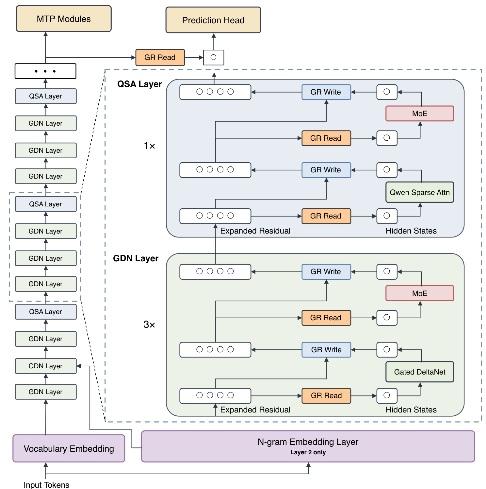
      <span class="aqt-veil" aria-hidden="true"></span>
      <span class="aqt-question" aria-hidden="true">?</span>
    </div>
  </div>
  <div class="aqt-copy">
    <div class="aqt-label">A model we can inspect</div>
    <h3>Qwen3.8-Flash-Next</h3>
    <p class="aqt-lead">Open weights. Published architecture.</p>
    <p>Proprietary OpenAI and Anthropic models do not offer the same public view of their full architecture.</p>
    <p>Here, we can follow a published design and examine its components step by step.</p>
  </div>
</div>
<div class="fv-takeaway">What changed inside the block? We will return to this diagram.</div>
<div class="fv-source"><a href="https://arxiv.org/abs/2608.30320">Qwen3.8-Next, 2026, Figure 1</a> · <a href="https://huggingface.co/Qwen/Qwen3.8-Flash-Next">Official model card and weights</a> · Architecture figure deliberately obscured</div>
```

::: {.notes}
Теперь введём конкретную модель, к которой будем возвращаться: Qwen3.8-Flash-Next. Слева показана намеренно скрытая архитектурная иллюстрация из технического отчёта. Пока не расшифровываем блоки и связи — сначала познакомимся с механизмами, которые нужны для её чтения. На этом слайде схема не раскрывается по клику.

Почему выбран этот пример? У модели есть публичное описание архитектуры и опубликованные веса. Это позволяет обсуждать конкретную задокументированную систему. «Открытые веса» здесь не означает полностью открытый исходный код или лицензию Apache: используется лицензия qwen-community-1.0. Для архитектурного разбора важно, что доступен опубликованный дизайн.

Сравнение касается именно проприетарных моделей OpenAI и Anthropic, а не всех релизов этих компаний. Их публичные материалы не дают такого же полного представления об устройстве архитектуры. Это не утверждение, что компании ничего не раскрывают; мы просто не будем подменять недостающие сведения догадками.

Сейчас достаточно запомнить название. По мере введения следующих механизмов мы подготовим язык для чтения полной схемы. Позже вернёмся к исходной иллюстрации и разберём опубликованный дизайн по частям.

Источники: https://arxiv.org/abs/2608.30320 ; https://huggingface.co/Qwen/Qwen3.8-Flash-Next ; https://cdn.openai.com/papers/gpt-4.pdf (раздел 2: ограничения раскрытия архитектуры GPT-4) ; https://www.anthropic.com/transparency (публичные сведения об архитектуре и обучении Claude; не полная схема модели).
:::

## Must we store history by position? {#arch-21 .fv-slide .arch-slide background-color="#ffffff"}

```{=html}
<div class="fv-meta"><span class="fv-id">A 21 / 46</span><span class="fv-cluster active">Architecture</span><span class="fv-cluster">Data</span><span class="fv-cluster">Training</span><span class="fv-cluster">Inference</span><span class="fv-cluster">Tools</span></div>
<div class="fv-body a24-body">
 <div class="a24-compare">
  <div class="a24-panel"><h3>Access to past positions</h3><svg viewBox="0 0 650 292" role="img" aria-label="KV cache growing with past positions"><text x="0" y="40" font-size="25">t = 4</text><text x="0" y="147" font-size="25">t = 8</text><g fill="#dbeafe" stroke="#2563eb"><rect x="110" y="8" width="50" height="60"/><rect x="166" y="8" width="50" height="60"/><rect x="222" y="8" width="50" height="60"/><rect x="278" y="8" width="50" height="60"/><rect x="110" y="115" width="50" height="60"/><rect x="166" y="115" width="50" height="60"/><rect x="222" y="115" width="50" height="60"/><rect x="278" y="115" width="50" height="60"/><rect x="334" y="115" width="50" height="60"/><rect x="390" y="115" width="50" height="60"/><rect x="446" y="115" width="50" height="60"/><rect x="502" y="115" width="50" height="60"/></g><g fill="#ffedd5" stroke="#ea580c"><rect x="110" y="70" width="50" height="22"/><rect x="166" y="70" width="50" height="22"/><rect x="222" y="70" width="50" height="22"/><rect x="278" y="70" width="50" height="22"/><rect x="110" y="177" width="50" height="22"/><rect x="166" y="177" width="50" height="22"/><rect x="222" y="177" width="50" height="22"/><rect x="278" y="177" width="50" height="22"/><rect x="334" y="177" width="50" height="22"/><rect x="390" y="177" width="50" height="22"/><rect x="446" y="177" width="50" height="22"/><rect x="502" y="177" width="50" height="22"/></g><text x="112" y="252" font-size="26">K / V addressed by position</text><text x="575" y="163" font-size="36">…</text></svg><p>New token → new cache entry</p></div>
  <div class="a24-panel fragment" data-fragment-index="1"><h3>An updated representation of the past</h3><svg viewBox="0 0 650 292" role="img" aria-label="Recurrent state of the same shape is updated using the input token"><defs><marker id="a24-a24-arrow" markerWidth="8" markerHeight="8" refX="7" refY="4" orient="auto"><path d="M0 0L8 4L0 8" fill="#141414"/></marker><pattern id="a24-a24-grid" width="35" height="35" patternUnits="userSpaceOnUse"><rect width="35" height="35" fill="#ecfccb" stroke="#9dc344"/></pattern></defs><rect x="50" y="83" width="140" height="140" fill="url(#a24-a24-grid)" stroke="#141414"/><rect x="445" y="83" width="140" height="140" fill="url(#a24-a24-grid)" stroke="#141414"/><text x="120" y="57" font-size="28" text-anchor="middle">hₜ₋₁</text><text x="515" y="57" font-size="28" text-anchor="middle">hₜ</text><rect x="242" y="114" width="148" height="77" fill="white" stroke="#141414"/><text x="316" y="161" font-size="26" text-anchor="middle">Update</text><path d="M196 152H236" fill="none" stroke="#141414" stroke-width="2" marker-end="url(#a24-a24-arrow)"/><path d="M396 152H438" fill="none" stroke="#141414" stroke-width="2" marker-end="url(#a24-a24-arrow)"/><path d="M316 61V107" fill="none" stroke="#141414" stroke-width="2" marker-end="url(#a24-a24-arrow)"/><text x="316" y="47" text-anchor="middle" font-size="28">xₜ</text><text x="97" y="268" font-size="26">State shape does not depend on t</text></svg><p>New token → shared memory update</p></div>
 </div>
 <div class="a24-question fragment" data-fragment-index="2">What do we gain — and which details of the past might be lost?</div>
</div>
<div class="fv-takeaway">We can change the memory mechanism itself: carry compact state between steps.</div>
<div class="fv-source"><a href="https://arxiv.org/abs/2312.00752">Gu &amp; Dao, Mamba, 2023, Introduction, §3</a> · Teaching comparison of mechanisms</div>
```

::: {.notes}
До этого мы оптимизировали одну идею: сохранить представления прошлых позиций и затем адресно читать их. GQA сокращает число наборов K/V, compression упаковывает историю, sparse selection ограничивает чтение. Но история остаётся объектом, связанным с числом позиций. Слева условный cache растёт от четырёх записей к восьми; цвет различает keys и values.

Первый клик показывает иной механизм. Новый вход вместе с предыдущим состоянием производит следующее состояние той же формы. Это recurrent execution: между шагами переносится компактное представление прошлого. Размер такого состояния определяется архитектурой и batch, а не длиной уже пройденной последовательности. Для иллюстрации выбрана матрица; конкретная форма зависит от модели.

Второй клик задаёт вопрос о цене перехода. Прошлое теперь надо закодировать в ограниченном пространстве. Это экономит переносимое состояние, но не гарантирует сохранения всех деталей и точного возврата к любой позиции. Поэтому важно обсуждать правило обновления, а не только размер памяти. Mamba даёт один ответ: вход управляет тем, как информацию записать, удержать и прочитать. Речь здесь об inference state; вся память обучения включает ещё активации, градиенты и состояние оптимизатора.

Источник: https://arxiv.org/abs/2312.00752
:::

## Selective state-space models: Mamba {#arch-22 .fv-slide .arch-slide background-color="#ffffff"}

```{=html}
<div class="fv-meta"><span class="fv-id">A 22 / 46</span><span class="fv-cluster active">Architecture</span><span class="fv-cluster">Data</span><span class="fv-cluster">Training</span><span class="fv-cluster">Inference</span><span class="fv-cluster">Tools</span></div>
<div class="fv-body a25-body">
 <div class="a25-original">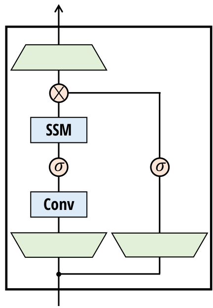<div class="a25-caption">Figure 3 · full Mamba block<br>Trapezoids: projections; ×: gating.</div></div>
 <div class="a25-zoom"><div class="fv-label">Enlarged SSM branch</div>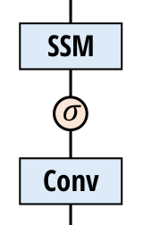<p class="fv-small">Conv → activation → SSM</p></div>
 <div class="a25-state fragment" data-fragment-index="1"><h3>Fixed-size recurrent state</h3><div class="a25-equation"><span class="math inline">\(h_t=\bar A_t h_{t-1}+\bar B_t x_t\)</span><br><span class="math inline">\(y_t=C_t h_t\)</span></div><svg viewBox="0 0 640 140" role="img" aria-label="SSM state h is carried between steps and receives new input"><defs><marker id="a25-a25-arrow" markerWidth="8" markerHeight="8" refX="7" refY="4" orient="auto"><path d="M0 0L8 4L0 8" fill="#141414"/></marker></defs><rect x="12" y="23" width="172" height="90" fill="#ecfccb" stroke="#141414"/><rect x="444" y="23" width="172" height="90" fill="#ecfccb" stroke="#141414"/><text x="98" y="78" text-anchor="middle" font-size="32">hₜ₋₁</text><text x="530" y="78" text-anchor="middle" font-size="32">hₜ</text><path d="M194 68H434" fill="none" stroke="#141414" stroke-width="2" marker-end="url(#a25-a25-arrow)"/><text x="315" y="44" text-anchor="middle" font-size="25">input-dependent</text><text x="315" y="111" text-anchor="middle" font-size="25">update</text></svg><p>The carried state does not grow<br>with context length.</p></div>
</div>
<div class="fv-takeaway">Selectivity changes input processing within a full block of projections, convolution and gating.</div>
<div class="fv-source"><a href="https://arxiv.org/abs/2312.00752">Gu &amp; Dao, Mamba, 2023, Figure 3, §3</a> · Original block details + teaching diagram of the state</div>
```

::: {.notes}
Слева исходная панель Mamba из Figure 3. Её полезно видеть целиком, чтобы не свести архитектуру к одной рекуррентной формуле. Вход проходит через проекции; в основной ветви находятся короткая convolution, активация и SSM. Параллельная ветвь формирует gate, а после перемножения выполняется выходная проекция. Увеличенный фрагмент в центре сохраняет окружение SSM.

Клик раскрывает переносимое состояние. На очередном шаге предыдущее h преобразуется, к нему добавляется вклад текущего входа, затем из нового состояния формируется выход. Черта над A и B обозначает дискретизированные параметры. В selective SSM часть параметров зависит от входа, поэтому правило не обязано одинаково обрабатывать каждый токен.

Фраза fixed-size относится к форме recurrent state при inference. Для одного слоя и фиксированного batch она не увеличивается с длиной прочитанной последовательности. Полный блок также имеет короткое convolution state; в обучении нужны другие временные данные, а эффективный scan организуется отдельно. Поэтому мы не утверждаем постоянную полную память обучения. Следующий слайд показывает конкретные места алгоритма, где вход управляет записью, чтением и динамикой.

Источник: https://arxiv.org/abs/2312.00752
:::

## Mamba: selectivity in the update rule {#arch-23 .fv-slide .arch-slide background-color="#ffffff"}

```{=html}
<div class="fv-meta"><span class="fv-id">A 23 / 46</span><span class="fv-cluster active">Architecture</span><span class="fv-cluster">Data</span><span class="fv-cluster">Training</span><span class="fv-cluster">Inference</span><span class="fv-cluster">Tools</span></div>
<div class="fv-body a26-body">
 <div class="a26-alg">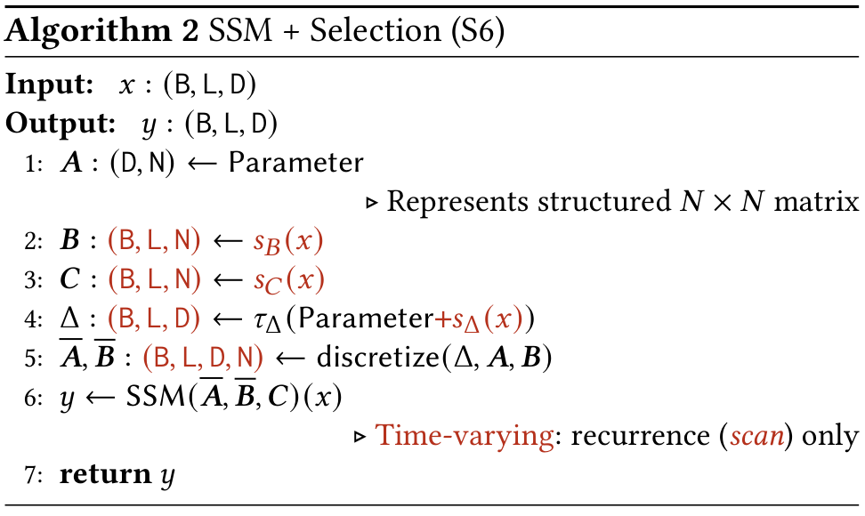<div class="a26-focus a26-bcd fragment" data-fragment-index="1"></div><div class="a26-focus a26-scan fragment" data-fragment-index="2"></div></div>
 <div class="a26-side"><div class="a26-roles fragment" data-fragment-index="1"><div class="a26-role"><strong>B · Write</strong>what to write</div><div class="a26-role"><strong>C · Read</strong>what to read</div><div class="a26-role"><strong>Δ · Dynamics</strong>how to carry state</div></div><div class="a26-ablation fragment" data-fragment-index="2"><div class="fv-label">Published ablation · ≈350M · perplexity ↓</div><table class="a26-table"><thead><tr><th>Δ</th><th>B</th><th>C</th><th>Perplexity ↓</th></tr></thead><tbody><tr><td>—</td><td>—</td><td>—</td><td>10.93</td></tr><tr><td>—</td><td>✓</td><td>—</td><td>10.15</td></tr><tr><td>—</td><td>—</td><td>✓</td><td>9.98</td></tr><tr><td>✓</td><td>—</td><td>—</td><td>9.81</td></tr><tr><td>✓</td><td>✓</td><td>✓</td><td><b>8.71</b></td></tr></tbody></table><div class="a26-key">✓ input-dependent · — constant</div></div></div>
</div>
<div class="fv-takeaway">The input controls writing, reading and dynamics; the state keeps the same shape.</div>
<div class="fv-source"><a href="https://arxiv.org/pdf/2312.00752v2">Mamba, Algorithm 2, Table 7, §4.6.2</a> · Algorithm 2: original PDF v2; Table 7 re-typeset</div>
```

::: {.notes}
На этом слайде основное место занимает исходный Algorithm 2. В отличие от постоянных параметров обычного линейного SSM, здесь B и C вычисляются из входа x, а величина дельта также получает входозависимый вклад. В сигнатурах алгоритма B в обозначении формы тензора означает batch size; жирная B в формуле означает параметр записи. Эти обозначения не следует смешивать.

Первый клик выделяет три строки. Для объяснения роли достаточно назвать B записью входа в состояние, C — чтением состояния в выход, а дельта — шагом дискретизации, который меняет перенос информации. Это функциональные подписи, а не полный математический вывод.

Второй клик переводит внимание к scan и опубликованной абляции. Параметры меняются по позициям, но форма recurrent state не меняется. В эксперименте примерно на 350 миллионах параметров входозависимость всех трёх компонентов даёт perplexity 8,71 против 10,93 для постоянных. Дельта сильнее отдельных B или C, но совместная селективность полезнее. Это результат конкретного языкового эксперимента, а не универсальное ранжирование для любых данных. Значения и все пять комбинаций Table 7 набраны крупно без изменения данных. HTML-версия преобразует эту таблицу в Figure 13.

Источник: https://arxiv.org/pdf/2312.00752v2
:::

## Delta rule: correct associations, not just add to them {#arch-24 .fv-slide .arch-slide background-color="#ffffff"}

```{=html}
<div class="fv-meta"><span class="fv-id">A 24 / 46</span><span class="fv-cluster active">Architecture</span><span class="fv-cluster">Data</span><span class="fv-cluster">Training</span><span class="fv-cluster">Inference</span><span class="fv-cluster">Tools</span></div>
<div class="fv-body a27-body"><div class="a27-overview fragment fade-out" data-fragment-index="3">
 <div class="a27-main"><div class="a27-eq"><span class="math inline">\(S_t=S_{t-1}+\beta_t\!\left(v_t-S_{t-1}k_t\right)k_t^\top\)</span></div><div class="a27-steps"><div class="a27-step"><h3>1 · Read<br>by key</h3><span class="math inline">\(\hat v_t=S_{t-1}k_t\)</span></div><div class="a27-step fragment" data-fragment-index="1"><h3>2 · Compute<br>the error</h3><span class="math inline">\(e_t=v_t-\hat v_t\)</span></div><div class="a27-step fragment" data-fragment-index="2"><h3>3 · Correct<br>the memory</h3><span class="math inline">\(\Delta S_t=\beta_t e_t k_t^\top\)</span></div></div><div class="a27-readout"><span>A separate query reads the output:</span><span class="math inline">\(o_t=S_tq_t\)</span></div><div class="a27-dims"><span class="math inline">\(S_t\in\mathbb R^{d_v\times d_k},\quad k_t,q_t\in\mathbb R^{d_k},\quad v_t\in\mathbb R^{d_v}\)</span><br>Association matrix · β controls write strength</div></div>
 <div class="a27-block">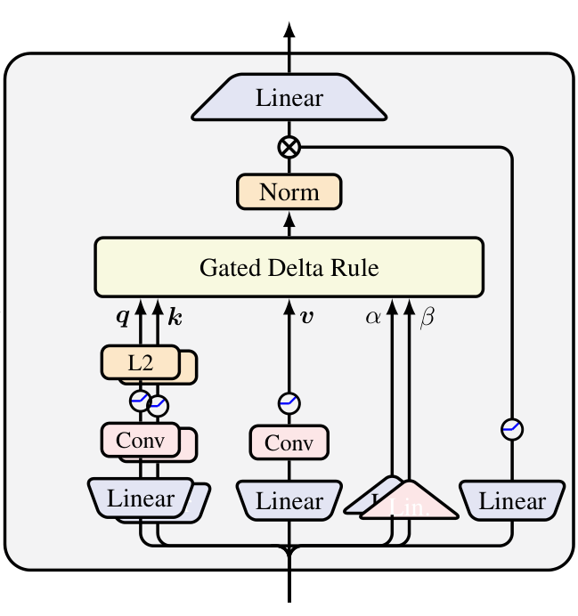<p>Figure 1 · Gated DeltaNet<br>Left equation: no forget gate.</p></div>
</div>
 <div class="a27-focus fragment" data-fragment-index="3"><div><h3>Figure 1 · enlarged detail of the block inputs</h3>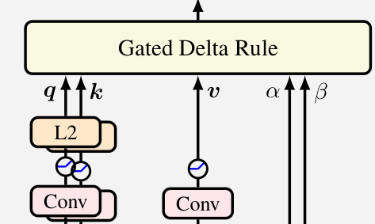</div><div class="a27-focus-legend"><p><b>q · query</b>reads the output</p><p><b>k · key</b>sets the write address</p><p><b>v · value</b>sets the target value</p><p><b>β · write strength</b>controls the correction</p><p><b>α · forget gate</b>added in the full block</p></div></div>
</div>
<div class="fv-takeaway">Prediction error drives the write: memory is corrected along the current key.</div>
<div class="fv-source"><a href="https://arxiv.org/abs/2412.06464">Yang et al., Gated Delta Networks, 2024, §2.3, Figure 1</a> · Equivalent delta-rule equation + original block</div>
```

::: {.notes}
Теперь изменим правило записи в ассоциативную память. S — матрица, которая по ключу возвращает вектор значения. Простое добавление внешнего произведения value и key каждый раз накапливает новый вклад, не проверяя, что по этому ключу уже хранится. Delta-rule сначала читает прежнее предсказание: S предыдущего шага, умноженная на текущий key.

Первый клик показывает ошибку между пришедшим value и этим предсказанием. Второй клик превращает ошибку во внешнее произведение с key и добавляет поправку в матрицу состояния. Бета регулирует силу обновления. Это направленная коррекция ассоциации, но при пересекающихся ключах она может затрагивать и другие чтения; нельзя обещать полностью независимые ячейки памяти.

Query остаётся отдельной величиной: после записи он читает выход из нового состояния. Поэтому на слайде явно сохранены размерности матрицы, key, value и query. Справа показан оригинальный реальный блок Gated DeltaNet, который добавляет ещё forget gate и другие операции. В центральном уравнении пока разобран чистый delta-rule из раздела 2.3, без глобального забывания. Третий клик увеличивает оригинальный фрагмент входов реального блока, чтобы прочитать q, k, v, альфа и бета. Это подготовка к последующему обсуждению удержания памяти, а не скалярная иллюстрация обычного веса.

Источник: https://arxiv.org/html/2412.06464v1#S2.SS3
:::

## Gated DeltaNet: forgetting and correction are separate operations {#arch-25 .fv-slide .arch-slide background-color="#ffffff"}

```{=html}
<div class="fv-meta"><span class="fv-id">A 25 / 46</span><span class="fv-cluster active">Architecture</span><span class="fv-cluster">Data</span><span class="fv-cluster">Training</span><span class="fv-cluster">Inference</span><span class="fv-cluster">Tools</span></div>
<div class="fv-body a28-body"><div class="a28-figure"><div class="a28-kicker">Gated DeltaNet · Figure 1, block</div>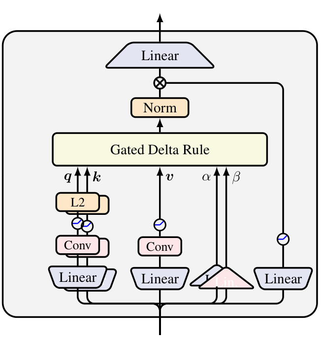</div><div class="a28-update"><div class="a28-equation"><span class="math inline">\(S_t=\alpha_t S_{t-1}(I-\beta_t k_t k_t^\top)+\beta_t v_t k_t^\top\)</span></div><div class="a28-steps"><div class="fragment a28-step" data-fragment-index="1"><b>1 · Decay</b><span class="math inline">\(\widetilde S_t=\alpha_t S_{t-1}\)</span></div><div class="fragment a28-step" data-fragment-index="2"><b>2 · Prediction error</b><span class="math inline">\(e_t=v_t-\widetilde S_t k_t\)</span></div><div class="fragment a28-step" data-fragment-index="3"><b>3 · Write</b><span class="math inline">\(S_t=\widetilde S_t+\beta_t e_t k_t^\top\)</span></div></div><p class="a28-gates">α — forgetting · β — correction strength</p><p class="a28-caption"><span class="math inline">\(\alpha_t,\beta_t\in(0,1)\)</span> · <span class="math inline">\(S_t\in\mathbb R^{d_v\times d_k}\)</span></p></div></div>
<div class="fv-takeaway">Decay weakens the past. The delta update corrects the association for the current key.</div>
<div class="fv-source"><a href="https://arxiv.org/abs/2412.06464">Gated Delta Networks, 2024/2025, Figure 1 and §3.1</a> · Original figure; equation expanded step by step</div>
```

::: {.notes}
Здесь важно разделить два управления памятью. Слева показан оригинальный вычислительный блок Gated DeltaNet: из входа получаются query, key и value, а также коэффициенты alpha и beta. Сначала покажите исходное правило обновления. Это матричное состояние с размерностями value на key; в литературе встречается и транспонированная конвенция.

Первый клик вводит decay. Мы умножаем прежнее состояние на alpha и обозначаем результат тильдой. Второй клик читает значение для текущего ключа именно из уже затухшего состояния. Ошибка — новый value минус это предсказание. Если прочитать из незатухшего состояния, получится другое обновление: эта мелочь принципиальна для последовательной анимации. Третий клик записывает коррекцию вдоль текущего ключа, с силой beta. Раскрыв скобки, получаем исходную формулу сверху.

При alpha, близком к единице, преобладает адресное исправление; маленькая alpha быстро ослабляет старые ассоциации, не меняя размер выделенной памяти. Это объяснение механизма, а не обещание безошибочного retrieval. Следующий слайд отдельно проверяет скорость и доступность деталей прошлого.

Источник: https://arxiv.org/html/2412.06464v3#S3.SS1 .
:::

## Recurrent architectures: results and limits {#arch-26 .fv-slide .arch-slide background-color="#ffffff"}

```{=html}
<div class="fv-meta"><span class="fv-id">A 26 / 46</span><span class="fv-cluster active">Architecture</span><span class="fv-cluster">Data</span><span class="fv-cluster">Training</span><span class="fv-cluster">Inference</span><span class="fv-cluster">Tools</span></div>
<div class="fv-body a29-body"><div class="a29-col"><div class="a29-head"><span>Experiment 1</span><b>Inference throughput</b></div>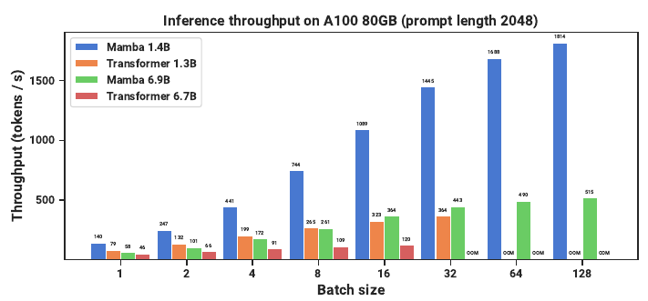<div class="a29-axis-key">Batch: 1 → 128 · Throughput: tokens/s</div><div class="a29-legend"><span><i style="background:#4878cf"></i>Mamba 1.4B</span><span><i style="background:#ee854a"></i>Transformer 1.3B</span><span><i style="background:#6acc64"></i>Mamba 6.9B</span><span><i style="background:#d65f5f"></i>Transformer 6.7B</span></div><div class="a29-result"><strong>≈ 4–5×</strong><span>peak throughput<br>at a feasible batch size</span></div><p class="a29-foot">A100 80 GB · prompt 2 048 · generation 128</p></div><div class="a29-col"><div class="a29-head"><span>Experiment 2</span><b>Retrieval · input capped at 2K</b></div>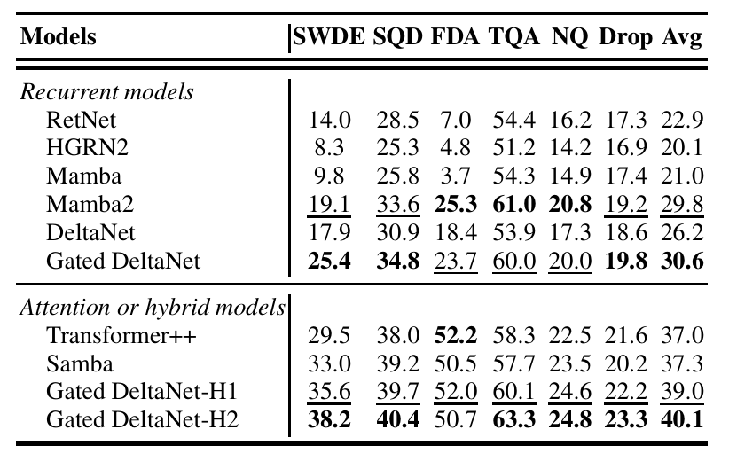<div class="fragment " data-fragment-index="1"><div class="a29-avg-label">Average across 6 retrieval tasks</div><div class="a29-metrics"><span>DeltaNet <b>26.2</b></span><span>Mamba2 <b>29.8</b></span><span>GDN <b>30.6</b></span><span>Transformer++ <b>37.0</b></span></div></div></div></div>
<div class="fv-takeaway">Compact state speeds up decode, but does not guarantee access to every past detail.</div>
<div class="fv-source"><a href="https://arxiv.org/html/2312.00752v2#S4.SS5">Mamba, §4.5, Fig. 12 HTML / Fig. 8 PDF</a> · <a href="https://arxiv.org/abs/2412.06464">Gated Delta Networks, Table 4</a> · Original excerpts; legend and averages repeated at larger size</div>
```

::: {.notes}
Здесь два разных эксперимента, поэтому нельзя читать слайд как единую кривую компромисса. Слева авторы Mamba измеряют генерацию на A100 80 GB PCIe: вход длиной 2048, затем 128 новых токенов, размеры batch от 1 до 128. Сравниваются Mamba 1.4B и 6.9B с Transformer 1.3B и 6.7B. Отсутствие растущего KV cache позволяет увеличить batch и получить примерно в четыре-пять раз больший throughput. Это не утверждение о задержке одного запроса и не сравнение со всеми современными inference engines. Большая Mamba в этом тесте не обучена: измеряется исполнение.

Справа другая статья и задачи извлечения информации. Сохраняем оригинальную таблицу и её ограничение: вход усечён до 2K. По клику подчеркните средние значения чисто recurrent моделей и Transformer++. Gated DeltaNet улучшает результат Mamba2 и DeltaNet, но разрыв до attention остаётся. В самой таблице гибриды дают ещё более высокий результат; это и есть переход к следующему вопросу.

Источники: https://arxiv.org/html/2312.00752v2#S4.SS5 ; https://arxiv.org/html/2412.06464v3#S4 .
:::

## Hybrid: why choose just one mechanism? {#arch-27 .fv-slide .arch-slide background-color="#ffffff"}

```{=html}
<div class="fv-meta"><span class="fv-id">A 27 / 46</span><span class="fv-cluster active">Architecture</span><span class="fv-cluster">Data</span><span class="fv-cluster">Training</span><span class="fv-cluster">Inference</span><span class="fv-cluster">Tools</span></div>
<div class="fv-body a30-body"><div class="a30-side"><h3>Recurrent memory</h3><div class="a30-state"><span class="math inline">\(S_{t-1}\longrightarrow S_t\)</span></div><p>Carries information forward<br>in a compact form</p><div class="a30-mini"><i></i><i></i><i></i><b>S</b></div><p class="a30-small">History compressed into state</p></div><div class="a30-center"><div class="a30-kicker">Real stack · Gated DeltaNet-H1</div>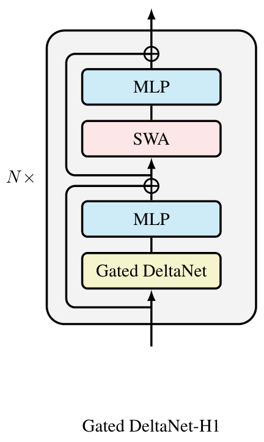<div class="a30-stack-label">GDN → MLP → SWA → MLP</div></div><div class="a30-side"><h3>Attention</h3><div class="a30-history"><i>1</i><i>2</i><i>3</i><i>…</i><i>t</i></div><p>Provides direct access<br>to stored positions</p><p class="a30-window-note">In H1, SWA reads only a window</p><div class="fragment " data-fragment-index="1"><div class="a30-retain">Keep attention layers<br><b>FFN remains a separate block</b></div></div></div><div class="fragment " data-fragment-index="2"><div class="a30-question">How much direct access to history should we retain?</div></div></div>
<div class="fv-takeaway">Hybrids divide the work between compact state and reading stored context.</div>
<div class="fv-source"><a href="https://arxiv.org/abs/2412.06464">Gated Delta Networks, Figure 1, H1</a> · <a href="https://arxiv.org/abs/2608.30320">Qwen3.8-Next, §2.1</a> · Original stack and explanatory diagrams</div>
```

::: {.notes}
Вернёмся к двум способам работы с прошлым. Слева recurrent memory сжимает информацию в фиксированное состояние. Справа attention сохраняет позиционные представления и может выбирать их при чтении. У этих механизмов разные сильные стороны, поэтому мы можем использовать их в разных слоях одной модели.

В центре не выдуманный универсальный гибрид, а оригинальный Gated DeltaNet-H1. В его повторяющемся блоке чередуются Gated DeltaNet и sliding-window attention. Между ними остаются обычные MLP. Первый клик отделяет замену token mixer от организации FFN: гибридизация внимания сама по себе не означает ни обязательного MoE, ни удаления FFN. В этом конкретном примере attention имеет окно, поэтому доступ прямой, но локальный. Другие гибриды сохраняют глобальные слои.

Второй клик формулирует инженерный вопрос: как часто нужен прямой доступ к истории и какой длины должна быть эта история? Ответ зависит от retrieval, качества, стоимости prefill и decode. На следующем слайде рассмотрим точное расписание другой реальной модели; затем проверим его отдельной абляцией.

Источники: https://arxiv.org/html/2412.06464v3#S3.SS4 ; https://arxiv.org/html/2608.30320v1#S2.SS1 .
:::

## What is inside Qwen3.8? {#arch-28 .fv-slide .arch-slide background-color="#ffffff"}

```{=html}
<div class="fv-meta"><span class="fv-id">A 28 / 46</span><span class="fv-cluster active">Architecture</span><span class="fv-cluster">Data</span><span class="fv-cluster">Training</span><span class="fv-cluster">Inference</span><span class="fv-cluster">Tools</span></div>
<div class="fv-body aqt-body">
  <div class="aqt-original">
    <div class="aqt-mystery">
      
      <span class="aqt-veil" aria-hidden="true"></span>
      <span class="aqt-question" aria-hidden="true">?</span>
    </div>
  </div>
  <div class="aqt-copy">
    <div class="aqt-label">A model we can inspect</div>
    <h3>Qwen3.8-Flash-Next</h3>
    <p class="aqt-lead">Open weights. Published architecture.</p>
    <p>Proprietary OpenAI and Anthropic models do not offer the same public view of their full architecture.</p>
    <p>Here, we can follow a published design and examine its components step by step.</p>
  </div>
</div>
<div class="fv-takeaway">What changed inside the block? We will return to this diagram.</div>
<div class="fv-source"><a href="https://arxiv.org/abs/2608.30320">Qwen3.8-Next, 2026, Figure 1</a> · <a href="https://huggingface.co/Qwen/Qwen3.8-Flash-Next">Official model card and weights</a> · Architecture figure deliberately obscured</div>
```

::: {.notes}
Вспомним вопрос, с которого начали этот блок: что находится внутри Qwen3.8-Flash-Next? Это та же опубликованная архитектура, которую мы намеренно скрыли раньше. Теперь мы познакомились с рекуррентным состоянием и сочетанием разных механизмов, поэтому можем вернуться к конкретной модели.

На этом слайде схема по-прежнему скрыта. Следующий слайд показывает оригинальную иллюстрацию из отчёта: разберём её по частям и свяжем с уже обсуждёнными идеями. Напомним, что у этого примера опубликованы архитектура и веса; поэтому опираемся на первоисточник, а не на предположения о закрытых моделях.

Источники: https://arxiv.org/abs/2608.30320 ; https://huggingface.co/Qwen/Qwen3.8-Flash-Next .
:::

## Hybrid: a real layer schedule {#arch-29 .fv-slide .arch-slide background-color="#ffffff"}

```{=html}
<div class="fv-meta"><span class="fv-id">A 29 / 46</span><span class="fv-cluster active">Architecture</span><span class="fv-cluster">Data</span><span class="fv-cluster">Training</span><span class="fv-cluster">Inference</span><span class="fv-cluster">Tools</span></div>
<div class="fv-body a31-body"><div class="a31-original"></div><div class="a31-explain"><div class="a31-label">Qwen3.8-Flash-Next · Figure 1</div><div class="a31-axis"><b>Token mixing</b><div class="a31-cycle"><span>GDN</span><span>GDN</span><span>GDN</span><span class="a31-qsa">QSA</span></div><p>One attention layer in every four</p></div><div class="fragment " data-fragment-index="1"><div class="a31-axis"><b>Expert capacity</b><p>MoE in every layer</p></div><div class="a31-other"><span>Residual pathways · GR</span><span>N-gram layer · layer 2</span></div></div><div class="a31-stage">Full attention in pretraining<br>switches to QSA in continued pretraining</div></div><div class="a31-focus fragment" data-fragment-index="2"><div><h3>GDN layer · repeated 3 times</h3><svg class="a31-detail" viewBox="505 770 930 510" role="img" aria-label="Enlarged original GDN layer panel · repeated 3 times"><defs><clipPath id="a31-review-a-crop-1"><rect x="505.0" y="770.0" width="930.0" height="510.0"/></clipPath></defs><g clip-path="url(#a31-review-a-crop-1)"><image href="assets/arch_20261007/a31_qwen_fig1.png" width="1488" height="1495"/></g></svg></div><div class="a31-focus-copy"><b>Gated DeltaNet<br>updates state</b><p>MoE is the expert FFN<br>in both layer types</p><p>GR Read / Write<br>read and update<br>residual streams</p><small>Detail from original Figure 1.<br>Flow runs bottom to top.</small></div></div><div class="a31-focus fragment" data-fragment-index="3"><div><h3>QSA layer · one in every four</h3><svg class="a31-detail" viewBox="505 235 930 510" role="img" aria-label="Enlarged original QSA layer panel · one in every four"><defs><clipPath id="a31-review-a-crop-2"><rect x="505.0" y="235.0" width="930.0" height="510.0"/></clipPath></defs><g clip-path="url(#a31-review-a-crop-2)"><image href="assets/arch_20261007/a31_qwen_fig1.png" width="1488" height="1495"/></g></svg></div><div class="a31-focus-copy"><b>Qwen Sparse Attention<br>reads selected positions</b><p>MoE is the expert FFN<br>in both layer types</p><p>GR Read / Write<br>read and update<br>residual streams</p><small>Detail from original Figure 1.<br>Flow runs bottom to top.</small></div></div></div>
<div class="fv-takeaway">Alternating GDN and attention defines token mixing. MoE determines where to use expert capacity.</div>
<div class="fv-source"><a href="https://arxiv.org/abs/2608.30320">Qwen3.8-Next, 2026, Figure 1</a> · <a href="https://github.com/QwenLM/Qwen3.8-Flash-Next">Official model card</a> · Original figure</div>
```

::: {.notes}
Теперь фиксируем конкретный порядок. В Qwen3.8-Flash-Next три Gated DeltaNet слоя сменяются одним Qwen Sparse Attention слоем, затем этот рисунок повторяется. Справа показываем повтор отдельно, потому что в полной архитектурной иллюстрации легко смешать несколько независимых решений.

Первым читаем только строку token mixing. У recurrent слоёв своё состояние, у attention слоёв есть доступ к позиционному контексту. По клику возвращаем остальные части: экспертные FFN, расширенные residual pathways с Gated Residual и n-gram embedding на втором слое. MoE выбирает вычислительную ёмкость внутри слоя и не определяет долю recurrent слоёв. Это две разные оси проектирования, которые могут комбинироваться.

Есть важная стадийность обучения. В исходном pretraining один из четырёх token mixers использует full attention; при continued pretraining эти слои переводят в QSA. Поэтому в следующей архитектурной абляции нельзя автоматически подписать все attention-слои как QSA. Второй клик увеличивает оригинальную GDN-панель, третий — QSA-панель. Связи и обозначения не перерисованы; читаем поток снизу вверх. Полная модель также включает MTP. Её итоговые показатели нельзя приписать только расписанию три к одному.

Источники: https://arxiv.org/html/2608.30320v1#S2 ; https://github.com/QwenLM/Qwen3.8-Flash-Next .
:::

## Hybrid: verify the gains with a dedicated ablation {#arch-30 .fv-slide .arch-slide background-color="#ffffff"}

```{=html}
<div class="fv-meta"><span class="fv-id">A 30 / 46</span><span class="fv-cluster active">Architecture</span><span class="fv-cluster">Data</span><span class="fv-cluster">Training</span><span class="fv-cluster">Inference</span><span class="fv-cluster">Tools</span></div>
<div class="fv-body a33-body"><div class="a33-condition">25B-A3B MoE · 28 layers · 400B tokens @ 4K + 80B @ 32K · same evaluation protocol</div><div class="a33-original">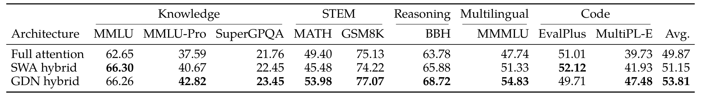</div><div class="a33-results"><div class="a33-avg"><span>Average across 9 tasks</span><div><span>Full <b>49.87</b></span><span>SWA <b>51.15</b></span><span class="fragment fv-highlight" data-fragment-index="1">GDN <b>53.81</b></span></div></div><div class="fragment " data-fragment-index="2"><div class="a33-exception"><b>GDN does not lead in every column</b><span>MMLU: 66.26 &lt; 66.30 for SWA</span><span>EvalPlus: 49.71 &lt; 52.12 for SWA</span></div></div></div><div class="a33-criteria"><span>Quality</span><span>Prefill</span><span>Decode</span></div></div>
<div class="fv-takeaway">Hybrids need a dedicated ablation: a higher average does not mean winning on every task.</div>
<div class="fv-source"><a href="https://arxiv.org/html/2608.30320v1#S2.T1">Qwen3.8-Next, 2026, Table 1 and Architecture Ablation</a> · Original table</div>
```

::: {.notes}
Это контролируемое сравнение архитектур, а не сравнение полной Qwen3.8 с предшественником. Авторы обучили три 28-слойные MoE модели с 25 миллиардами параметров, из которых активны три миллиарда. У них один оценочный pipeline, 400 миллиардов токенов при контексте 4K, затем 80 миллиардов при 32K. В обоих гибридах один full-attention слой на четыре; остальные используют GDN или sliding-window attention с окном 128. QSA здесь ещё не предмет сравнения.

Первый клик выделяет среднее: GDN hybrid получает 53,81 против 49,87 и 51,15. Это невзвешенное среднее девяти задач, а не универсальная мера интеллекта. Второй клик удерживает исключения: на MMLU SWA чуть выше, а на EvalPlus выше и SWA, и full attention. Поэтому нужно видеть распределение по задачам.

Три слова внизу задают критерии последующей проверки. Эта таблица отвечает на вопрос о качестве. Стоимость prefill и decode следует измерять отдельно в нужном режиме. Результаты полной модели включают и другие изменения, поэтому нельзя приписать их одной гибридизации.

Источник: https://arxiv.org/html/2608.30320v1#S2.T1 .
:::

## Looped Transformers: more compute with shared weights {#arch-31 .fv-slide .arch-slide background-color="#ffffff"}

```{=html}
<div class="fv-meta"><span class="fv-id">A 31 / 46</span><span class="fv-cluster active">Architecture</span><span class="fv-cluster">Data</span><span class="fv-cluster">Training</span><span class="fv-cluster">Inference</span><span class="fv-cluster">Tools</span></div>
<div class="fv-body lp1-body">
  <div class="lp1-heads"><div><h3>Different weights at each layer</h3><p>3 layers · 3 parameter sets</p></div><div><h3>One block, applied repeatedly</h3><p>3 passes · 1 shared parameter set</p></div></div>
  <svg class="lp1-stack" viewBox="0 0 1488 384" role="img" aria-label="Equal-depth comparison: three blocks with weights theta one, theta two, theta three on the left; three applications of the same theta on the right. Hidden states change after each application.">
    <defs><marker id="aloop-01-lp1-arrow" markerWidth="9" markerHeight="9" refX="7" refY="4" orient="auto"><path d="M0 0 L8 4 L0 8Z" fill="#141414"/></marker></defs>
    <g class="lp1-connections" fill="none" stroke="#141414" stroke-width="3" marker-end="url(#aloop-01-lp1-arrow)"><path d="M336 4V32"/><path d="M336 108V146"/><path d="M336 222V260"/><path d="M336 336V372"/><path d="M1118 4V32"/><path d="M1118 108V146"/><path d="M1118 222V260"/><path d="M1118 336V372"/></g>
    <g class="lp1-blocks" fill="#f3f3f3" stroke="#141414" stroke-width="2"><rect x="136" y="34" width="400" height="74"/><rect x="136" y="148" width="400" height="74"/><rect x="136" y="262" width="400" height="74"/><rect x="918" y="34" width="400" height="74"/><rect x="918" y="148" width="400" height="74"/><rect x="918" y="262" width="400" height="74"/></g>
    <g class="lp1-labels" font-size="27" fill="#141414"><text x="161" y="81">Transformer block</text><text x="161" y="195">Transformer block</text><text x="161" y="309">Transformer block</text><text x="943" y="81">Transformer block</text><text x="943" y="195">Transformer block</text><text x="943" y="309">Transformer block</text></g>
    <g class="lp1-weight fragment" data-fragment-index="1" font-size="32" text-anchor="middle" fill="#141414"><rect x="449" y="46" width="72" height="50"/><text x="485" y="82">θ₁</text><rect x="449" y="160" width="72" height="50"/><text x="485" y="196">θ₂</text><rect x="449" y="274" width="72" height="50"/><text x="485" y="310">θ₃</text><rect x="1231" y="46" width="72" height="50"/><text x="1267" y="82">θ</text><rect x="1231" y="160" width="72" height="50"/><text x="1267" y="196">θ</text><rect x="1231" y="274" width="72" height="50"/><text x="1267" y="310">θ</text></g>
    <g class="lp1-states fragment" data-fragment-index="2" font-size="27" fill="#141414"><text x="370" y="27">h₀</text><text x="370" y="140">h₁</text><text x="370" y="254">h₂</text><text x="370" y="370">h₃</text><text x="1152" y="27">s₀</text><text x="1152" y="140">s₁</text><text x="1152" y="254">s₂</text><text x="1152" y="370">s₃</text><text x="1350" y="142">state</text><text x="1350" y="178">changes</text></g>
  </svg>
  <div class="lp1-foot"><span>Each pass costs compute.</span><span class="fragment" data-fragment-index="2">Universal Transformer can learn when each position stops.</span></div>
</div>
<div class="fv-takeaway">Parameter depth ≠ Computational depth.</div>
<div class="fv-source"><a href="https://arxiv.org/abs/1807.03819">Universal Transformers, 2018 / ICLR 2019, §§2.1–2.2</a> · Explanatory diagram with equal numbers of block applications</div>
```

::: {.notes}
До этого мы обсуждали recurrence по последовательности: состояние меняется при переходе к следующей позиции. Теперь вводим другую ось — recurrence по глубине вычисления. Для обработки того же представления можно применить один и тот же блок несколько раз. Это не требует создавать новый независимый набор весов для каждого показанного шага.

В обеих колонках ровно три применения блока. Слева у каждого слоя свои параметры: theta один, theta два, theta три. Справа все три прямоугольника обозначают разные применения одного блока с общими весами. Первым кликом подсветите обозначения параметров. Вторым появляются промежуточные состояния: общий оператор не означает, что состояние остаётся прежним. Каждый новый проход получает результат предыдущего и выполняет новое вычисление.

Universal Transformer сочетает такой принцип с механизмом адаптивной остановки для отдельных позиций. Эта возможность требует соответствующего устройства и обучения; её нельзя автоматически приписать любому стеку со связанными весами. На схеме показано фиксированное число проходов, чтобы сначала отделить количество параметров от количества вычислений. Каждый проход расходует compute, а качество не обязано расти бесконечно.

Источник: https://arxiv.org/html/1807.03819v3 , §§2.1–2.2.
:::

## Recurrent depth: what passes through the loop? {#arch-32 .fv-slide .arch-slide background-color="#ffffff"}

```{=html}
<div class="fv-meta"><span class="fv-id">A 32 / 46</span><span class="fv-cluster active">Architecture</span><span class="fv-cluster">Data</span><span class="fv-cluster">Training</span><span class="fv-cluster">Inference</span><span class="fv-cluster">Tools</span></div>
<div class="fv-body lp2-body">
  <div class="lp2-label">Geiping et al. · Figure 2 · original architecture</div>
  <svg class="lp2-paper" viewBox="0 0 1865.7014 304" role="img" aria-label="Original Figure 2: Prelude P creates e, which is injected into every recurrent block R. Random initial state s zero is repeatedly updated. Coda C emits next-token probabilities only after the selected final recurrence.">
    <defs><clipPath id="aloop-02-lp2-figure-crop"><rect width="1865.7014" height="304"/></clipPath></defs>
    <g clip-path="url(#aloop-02-lp2-figure-crop)"><image href="assets/arch_20261007/looped/l02_geiping_fig2.svg" width="1865.7014" height="493.4379"/></g>
    <rect class="fragment fade-out lp2-coda-mask" data-fragment-index="2" x="1342" y="0" width="524" height="304" fill="#fff"/>
  </svg>
  <div class="lp2-equations">
    <div class="lp2-prelude"><b>Prelude</b><span class="math inline">\(e=P(x)\)</span><small>Input representation, reused</small></div>
    <div class="lp2-recurrent fragment" data-fragment-index="1"><b>Shared recurrent block · θ</b><span class="math inline">\(s_{r+1}=R_\theta(e,s_r)\)</span><small>State changes at every pass</small></div>
    <div class="lp2-coda fragment" data-fragment-index="2"><b>Coda</b><span class="math inline">\(p=C(s_R)\)</span><small>Then predict the next token</small></div>
  </div>
  <div class="lp2-axes fragment" data-fragment-index="1"><div><b>Token position</b><span>1 → 2 → 3 → … → n</span></div><div><b>Recurrence step</b><span>0 → 1 → 2 → … → R</span></div><p>Two independent axes.<br>Internal passes produce latent states.</p></div>
</div>
<div class="fv-takeaway">Repeat the computation on an evolving state; feed the same input representation into every pass.</div>
<div class="fv-source"><a href="https://arxiv.org/html/2502.05171v2#S2.F2">Scaling up Test-Time Compute with Latent Reasoning, 2025, Figure 2 and §3.1</a> · Original figure cropped above legend; staged reveal and equations added</div>
```

::: {.notes}
Это исходная архитектура Geiping и соавторов, а не универсальная схема всех looped моделей. Prelude преобразует входные токены в представление e. Отдельно задаётся случайное начальное состояние s ноль: в оригинальной иллюстрации его распределение показано слева внизу. Не следует отождествлять s ноль с выходом Prelude.

Первый клик раскрывает правило обновления состояния. Повторяемый блок получает и текущее состояние, и e. Пунктирные стрелки в исходной Figure 2 принципиальны: неизменное входное представление подаётся на каждом повторе, а не только при инициализации. Веса theta остаются общими, хотя состояния s один, s два и последующие меняются. Один recurrent block сам содержит несколько Transformer-слоёв.

Разведите две независимые оси: позицию в токенной последовательности и номер внутреннего прохода. Повторы не создают новые текстовые шаги рассуждения. Вторым кликом появляются Coda и выход: после выбранного числа R проходов итоговое состояние преобразуется в вероятности следующего токена. Надпись «World» — оригинальный иллюстративный пример авторов, а не промежуточный результат каждого повторения. Цвета, геометрия и подача e сохранены из исходной фигуры; легенда заменена крупными подписями под схемой.

Источник: https://arxiv.org/html/2502.05171v2#S3.SS1 .
:::

## Adaptive depth: which tokens need another pass? {#arch-33 .fv-slide .arch-slide background-color="#ffffff"}

```{=html}
<div class="fv-meta"><span class="fv-id">A 33 / 46</span><span class="fv-cluster active">Architecture</span><span class="fv-cluster">Data</span><span class="fv-cluster">Training</span><span class="fv-cluster">Inference</span><span class="fv-cluster">Tools</span></div>
<div class="fv-body lp3-body">
  <div class="lp3-original">
    <div class="lp3-kicker">Mixture-of-Recursions · shared stack + router</div>
    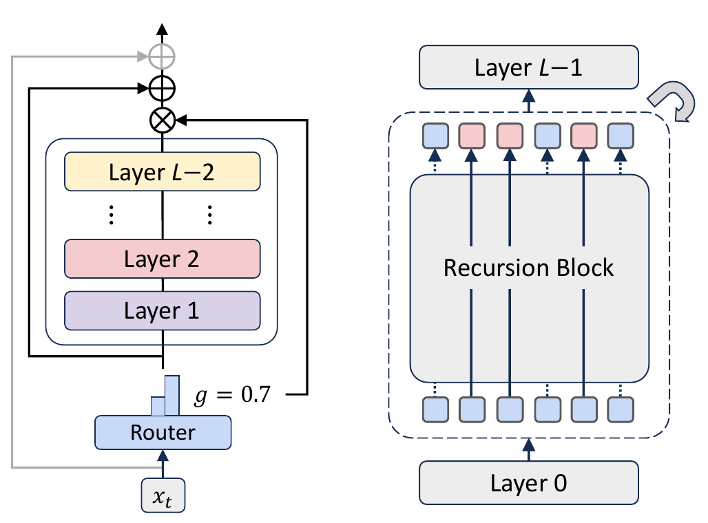
    <div class="lp3-caption">Original Figure 1 · read from bottom to top</div>
  </div>
  <div class="lp3-explain">
    <h3>One stack. Different token budgets.</h3>
    <div class="lp3-routes fragment" data-fragment-index="1">
      <div class="lp3-kicker">Example: expert-choice routing · shared weights</div>
      <div class="lp3-grid" role="table" aria-label="Illustrative token routes across three passes. Finished tokens keep their final state.">
        <div class="lp3-grid-head"></div><div class="lp3-grid-head">Pass 1</div><div class="lp3-grid-head">Pass 2</div><div class="lp3-grid-head">Pass 3</div>
        <b>Token A</b><span class="lp3-active">Active</span><span class="lp3-finished">Finished</span><span class="lp3-finished">Finished</span>
        <b>Token B</b><span class="lp3-active">Active</span><span class="lp3-active">Active</span><span class="lp3-finished">Finished</span>
        <b>Token C</b><span class="lp3-active">Active</span><span class="lp3-active">Active</span><span class="lp3-active">Active</span>
      </div>
      <p class="lp3-state-note">Finished positions retain their state.<br><b>Recursion-wise cache:</b> attention reads active tokens at that depth.</p>
    </div>
    <div class="lp3-comparison fragment" data-fragment-index="2"><div><b>MoE</b><span>Which expert?</span></div><div><b>MoR</b><span>How many passes?</span></div></div>
    <div class="lp3-trained fragment" data-fragment-index="2">The routing policy is learned during training.</div>
  </div>
</div>
<div class="fv-takeaway">Inference question: where is another pass worth its compute?</div>
<div class="fv-source"><a href="https://arxiv.org/html/2507.10524v1">Bae et al., Mixture-of-Recursions, 2025 · Figure 1; §2.2</a> · Original figure crop + illustrative token routes</div>
```

::: {.notes}
Здесь общий стек получает обучаемую маршрутизацию. Сначала читаем оригинальную схему снизу вверх: router определяет участие позиции в повторяемом блоке. Первый клик показывает условный пример expert-choice: на каждом проходе отбирается подмножество ещё активных токенов. Серые позиции уже завершили вычисление; их последнее представление сохраняется. Пример справа объясняет механизм, это не результат измерения на конкретном предложении.

Для recursion-wise caching attention на данной глубине использует ключи и значения активных позиций; завершившиеся токены не получают новый KV на последующих глубинах. В статье отдельно исследована recursive KV sharing — другая схема с общим кэшем первого прохода. Не смешиваем её с показанным вариантом. Token-choice тоже отличается: глубина назначается заранее одним решением. Второй клик разделяет вопросы MoE и MoR. Обученная маршрутизация — часть архитектуры и обучения, а не универсальный переключатель готовой модели. Переход к Inference: где дополнительное вычисление полезнее всего?

Источник: https://arxiv.org/html/2507.10524v1#S2.SS2 .
:::

## Looped blocks: results, costs and limits {#arch-34 .fv-slide .arch-slide background-color="#ffffff"}

```{=html}
<div class="fv-meta"><span class="fv-id">A 34 / 46</span><span class="fv-cluster active">Architecture</span><span class="fv-cluster">Data</span><span class="fv-cluster">Training</span><span class="fv-cluster">Inference</span><span class="fv-cluster">Tools</span></div>
<div class="fv-body lp4-body">
  <div class="lp4-huginn">
    <div class="lp4-kicker">Experiment 1 · Huginn-0125</div>
    <h3>More passes, diminishing returns</h3>
    <div class="lp4-condition">3.5B parameters · 0.8T training tokens · zero-shot</div>
    <div class="lp4-table-label">Table 1 · original selected rows and columns</div>
    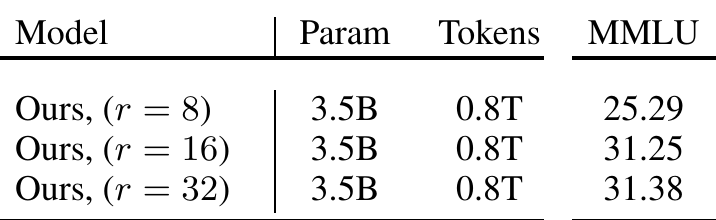
    <div class="lp4-gains fragment" data-fragment-index="1"><div><span>8 → 16 passes</span><strong>+5.96 <small>pp</small></strong></div><div><span>16 → 32 passes</span><strong>+0.13 <small>pp</small></strong></div></div>
    <p class="lp4-same fragment" data-fragment-index="1">One model; only the inference budget changes.</p>
  </div>
  <div class="lp4-cache fragment" data-fragment-index="2">
    <div class="lp4-kicker">Experiment 2 · LoopLM · decode only</div>
    <h3>Shared weights ≠ shared KV</h3>
    <div class="lp4-cache-summary"><b>4 cache sets → 1</b><span>Keep only the last recurrence’s KV</span></div>
    <table class="lp4-results" aria-label="LoopLM Table 14, decoding KV-cache reuse"><thead><tr><th>Strategy</th><th>GSM8K</th><th>MATH-500</th></tr></thead><tbody><tr><td>Full cache</td><td>78.92</td><td>82.40</td></tr><tr><td>Last-step cache</td><td>78.85</td><td>80.40</td></tr><tr class="lp4-delta"><td>Change</td><td>−0.07 pp</td><td>−2.00 pp</td></tr></tbody></table>
    <div class="lp4-caveat"><b>4× less KV-cache memory.</b><br>Prefill reuse caused a &gt;10-point GSM8K drop.</div>
    <div class="lp4-separate">Separate experiments; no common efficiency scale.</div>
  </div>
</div>
<div class="fv-takeaway lp4-takeaway">Shared weights save parameters. Extra passes spend compute.<br>KV reuse needs its own design.</div>
<div class="fv-source"><a href="https://arxiv.org/html/2502.05171v2">Geiping et al., 2025 · Table 1 (v2)</a> · <a href="https://arxiv.org/html/2510.25741v1#S5.SS4.SSS2">Zhu et al., LoopLM, 2025 · §5.4.2, Table 14</a></div>
```

::: {.notes}
Слева показаны реальные строки и столбцы Table 1 из второй версии Huginn; остальные строки и столбцы вырезаны для читаемости. Число весов и объём обучения одинаковы. Первый клик выделяет разницу MMLU: 8→16 даёт 5,96 процентного пункта, 16→32 — 0,13. Это насыщение на данной задаче, не универсальный предел полезной глубины. Первая версия статьи содержала другие числа для 8 и 16; поэтому ссылка явно закреплена на v2.

Второй клик открывает независимый эксперимент LoopLM. Четырём проходам соответствуют четыре набора KV. При decode хранение только последнего уменьшает именно KV-кэш в четыре раза: GSM8K теряет 0,07 пункта, MATH-500 — 2,00. Не называем это отсутствием потери качества или уменьшением всей памяти модели вчетверо. Для prefill авторы сообщают ухудшение GSM8K более чем на десять пунктов. Эти результаты относятся к другой модели и другому вмешательству; общей шкалы эффективности здесь нет. Общие веса, дополнительные вычисления и политика кэширования — три отдельных решения.

Источники: https://arxiv.org/html/2502.05171v2 ; https://arxiv.org/html/2510.25741v1#S5.SS4.SSS2 .
:::

## Residual: from token mixing to depth {#arch-35 .fv-slide .arch-slide background-color="#ffffff"}

```{=html}
<div class="fv-meta"><span class="fv-id">A 35 / 46</span><span class="fv-cluster active">Architecture</span><span class="fv-cluster">Data</span><span class="fv-cluster">Training</span><span class="fv-cluster">Inference</span><span class="fv-cluster">Tools</span></div>
<div class="fv-body a34-body"><div class="a34-model"><svg class="axb-backbone" viewBox="0 0 820 520" role="img" aria-label="Generalized decoder-only architecture: embeddings, repeated token mixing and FFN with residual connections, output projection">
<defs><marker id="a34-a34-backbone-arrow" markerUnits="userSpaceOnUse" markerWidth="8" markerHeight="8" refX="7" refY="4" orient="auto"><path d="M0 0L8 4L0 8Z" fill="#141414"/></marker></defs>
<g fill="none" stroke="#141414" stroke-width="2" marker-end="url(#a34-a34-backbone-arrow)"><path d="M370 482V460"/><path d="M370 406V366"/><path d="M370 304V295"/><path d="M370 271V257"/><path d="M370 195V186"/><path d="M370 162V144"/><path d="M370 82V52"/></g>
<rect x="150" y="160" width="520" height="225" fill="none" stroke="#c5c5c5" stroke-width="2" stroke-dasharray="6 5"/>
<g font-size="25" text-anchor="middle" fill="#141414">
<text x="370" y="514">Token IDs</text>
<g class="axb-embedding"><rect x="235" y="406" width="270" height="54" fill="#f3f3f3" stroke="#141414"/><text x="370" y="441">Embeddings</text></g>
<g class="axb-mix"><rect x="235" y="304" width="270" height="62" fill="white" stroke="#141414"/><text x="370" y="331">Token mixing</text><text x="370" y="354" font-size="20">Norm → causal mixing</text></g>
<g class="axb-ffn"><rect x="235" y="195" width="270" height="62" fill="white" stroke="#141414"/><text x="370" y="222">FFN</text><text x="370" y="246" font-size="20">Norm → transformation</text></g>
<g class="axb-output"><rect x="235" y="82" width="270" height="62" fill="#f3f3f3" stroke="#141414"/><text x="370" y="108">Output projection</text><text x="370" y="131" font-size="20">Norm → logits</text></g>
<text x="370" y="35">Next-token scores</text>
<text x="83" y="250" font-size="34" font-weight="650">× N</text><text x="83" y="281" font-size="21">blocks</text>
<g class="axb-residual"><path d="M370 385H590V283H383" fill="none" stroke="#141414" stroke-width="2" marker-end="url(#a34-a34-backbone-arrow)"/><path d="M370 264H590V174H383" fill="none" stroke="#141414" stroke-width="2" marker-end="url(#a34-a34-backbone-arrow)"/><circle cx="370" cy="283" r="12" fill="white" stroke="#141414"/><text x="370" y="291">+</text><circle cx="370" cy="174" r="12" fill="white" stroke="#141414"/><text x="370" y="182">+</text><text x="714" y="245" font-size="22">Residual</text><text x="714" y="274" font-size="22">paths</text></g>
</g></svg>
<div class="a34-depth">Depth ↑</div></div><div class="a34-right"><div class="a34-equation"><span class="math inline">\(h_{\ell+1}=h_\ell+F_\ell(\operatorname{Norm}(h_\ell))\)</span></div><div class="a34-chart"><div class="a34-plot"><div class="a34-axis-label">Output magnitude</div>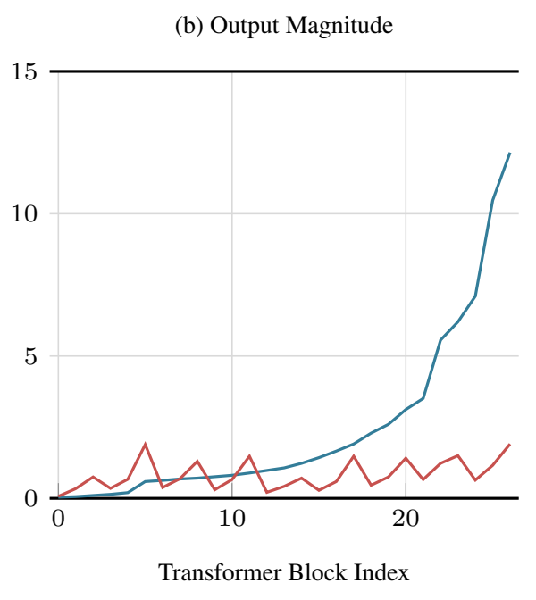<div class="a34-axis-label">Block index →</div></div><div><h3>Accumulation<br>across depth</h3><p><i class="a34-blue"></i>Baseline<br><i class="a34-red"></i>Block AttnRes</p><div class="fragment " data-fragment-index="1"><p class="a34-callout">Activation magnitude grows<br>in the tested baseline</p></div></div></div></div></div>
<div class="fv-takeaway">We changed connections between tokens. Now we examine information flow between layers.</div>
<div class="fv-source"><a href="https://arxiv.org/abs/2603.15031">Attention Residuals, 2026, Figure 5(b)</a> · Original plot; decoder-only backbone adapted</div>
```

::: {.notes}
Возвращаемся к той же нейтральной архитектуре, с которой начинали раздел. Теперь подсвечены только межслойные residual pathways. Направление глубины сохранено: снизу вверх. Token mixing внутри слоя и передача информации между слоями — разные вопросы, даже если оба решения используют слово attention.

Справа стандартная PreNorm residual-сумма. Каждый новый выход прибавляется к накопленному представлению. Это чрезвычайно успешная схема, но она не содержит явного выбора, какой из прежних выходов читать для следующего преобразования. В статье Attention Residuals авторы связывают накопление с ростом масштаба активаций и ослаблением относительного вклада новых слоёв, называя этот эффект PreNorm dilution.

По клику рассмотрите оригинальный фрагмент Figure 5: синий baseline и красный Block AttnRes. График относится к исследованным авторами моделям и метрике output magnitude. Он мотивирует изучение межслойных связей, но не доказывает, что все residual networks не работают или что рост нормы сам по себе объясняет качество. Следующий слайд вводит конкретную альтернативу.

Источник: https://arxiv.org/abs/2603.15031 , Figure 5 и §5.4.1.
:::

## Attention Residuals: choosing sources across depth {#arch-36 .fv-slide .arch-slide background-color="#ffffff"}

```{=html}
<div class="fv-meta"><span class="fv-id">A 36 / 46</span><span class="fv-cluster active">Architecture</span><span class="fv-cluster">Data</span><span class="fv-cluster">Training</span><span class="fv-cluster">Inference</span><span class="fv-cluster">Tools</span></div>
<div class="fv-body a35-body"><div class="a35-panels"><div class="a35-panel"><h3>Standard</h3>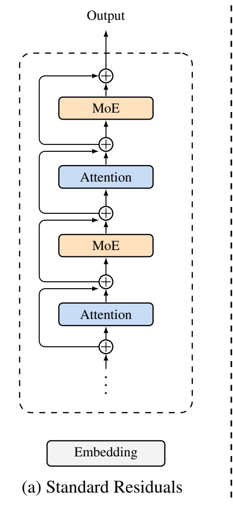<p>Fixed addition</p></div><div class="a35-panel fragment" data-fragment-index="1"><h3>Full AttnRes</h3>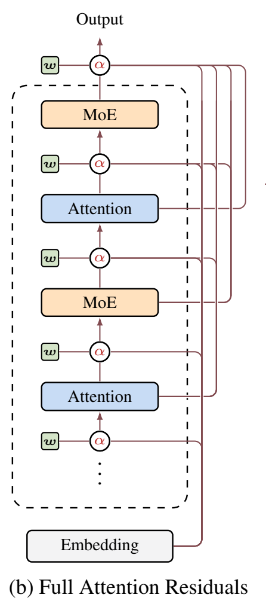<p>Select from past outputs</p></div><div class="a35-panel fragment" data-fragment-index="2"><h3>Block AttnRes</h3>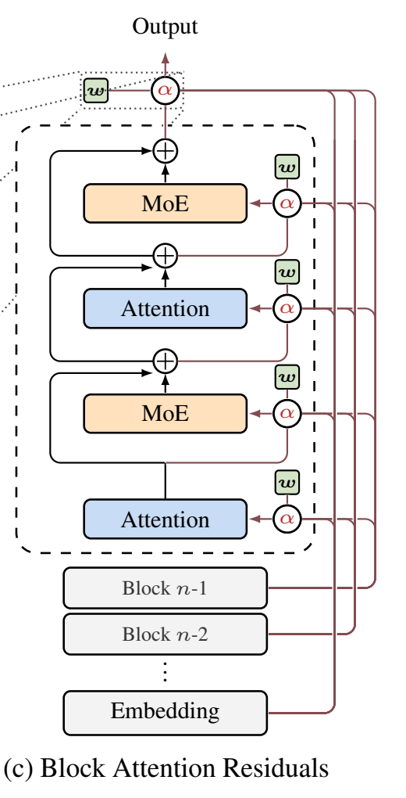<p>Sources grouped into blocks</p></div></div><div class="a35-axis"><span aria-hidden="true">↑</span><b>Depth</b></div><div class="a35-focus fragment" data-fragment-index="3"><div class="a35-focus-title">Original detail · top two sublayers</div><div class="a35-focus-panels"><div><h3>Standard</h3><svg viewBox="0 85 470 390" role="img" aria-label="Enlarged original Standard detail"><defs><clipPath id="a35-review-a-crop-3"><rect x="0.0" y="85.0" width="470.0" height="390.0"/></clipPath></defs><g clip-path="url(#a35-review-a-crop-3)"><image href="assets/arch_20261007/a35_attnres_standard.png" width="470" height="1020"/></g></svg><p>+ adds the two paths</p></div><div><h3>Full AttnRes</h3><svg viewBox="0 85 446 390" role="img" aria-label="Enlarged original Full AttnRes detail"><defs><clipPath id="a35-review-a-crop-4"><rect x="0.0" y="85.0" width="446.0" height="390.0"/></clipPath></defs><g clip-path="url(#a35-review-a-crop-4)"><image href="assets/arch_20261007/a35_attnres_full.png" width="446" height="1020"/></g></svg><p>α mixes past outputs</p></div><div><h3>Block AttnRes</h3><svg viewBox="0 85 520 390" role="img" aria-label="Enlarged original Block AttnRes detail"><defs><clipPath id="a35-review-a-crop-5"><rect x="0.0" y="85.0" width="520.0" height="390.0"/></clipPath></defs><g clip-path="url(#a35-review-a-crop-5)"><image href="assets/arch_20261007/a35_attnres_block.png" width="520" height="1020"/></g></svg><p>α mixes blocks; + within a block</p></div></div><div class="a35-focus-key">w — learned query for mixing across depth · connections to earlier sources continue below</div></div></div>
<div class="fv-takeaway">Attention over depth, not over token positions. Block AttnRes reduces the number of stored sources.</div>
<div class="fv-source"><a href="https://arxiv.org/abs/2603.15031">Attention Residuals, 2026, Figure 1</a> · Original panels, enlarged separately</div>
```

::: {.notes}
Читаем три оригинальные архитектурные панели в одном направлении глубины, снизу вверх. Сначала видна стандартная схема: attention и MoE вычисляют выходы, которые прибавляются к residual stream. Здесь MoE просто часть backbone примера; AttnRes не требует отдельной замены FFN на экспертов.

Первый клик открывает Full Attention Residuals. Следующий слой формирует смесь предыдущих представлений с нормированными весами. Источниками становятся embedding и выходы прежних слоёв. Это attention по глубине для текущей позиции, а не ещё один механизм чтения разных token positions. Внутренний sequence attention остаётся отдельной операцией.

Второй клик показывает Block AttnRes. Слои объединяются в блоки, внутри блока сохраняется обычное накопление, а выбор происходит среди представлений блоков и текущего частичного блока. Так уменьшается число источников, которые необходимо хранить и читать. На слайде удалён только увеличительный inset оператора из Figure 1 ради крупного отображения трёх панелей; направления связей и сами панели сохранены. Третий клик увеличивает два верхних подслоя всех трёх исходных панелей. Знак плюс обозначает сложение, alpha — взвешенное смешивание, w — обучаемый query. Нижние источники остаются за границей фрагмента. Практический вопрос теперь не только в наличии пути, но и в том, какие пути модель использует.

Источник: https://arxiv.org/abs/2603.15031 , Figure 1 и §3.
:::

## AttnRes: which depths does the model use? {#arch-37 .fv-slide .arch-slide background-color="#ffffff"}

```{=html}
<div class="fv-meta"><span class="fv-id">A 37 / 46</span><span class="fv-cluster active">Architecture</span><span class="fv-cluster">Data</span><span class="fv-cluster">Training</span><span class="fv-cluster">Inference</span><span class="fv-cluster">Tools</span></div>
<div class="fv-body a36-body"><div class="a36-images"><div class="a36-panel"><h3>Full AttnRes · Pre-Attn</h3><div class="a36-chart-wrap"><div class="a36-y-label"><em>Layer</em><span class="a36-first">1</span><span class="a36-mid">8</span><b>16</b></div><svg class="a36-map" viewBox="72.206 64.349 809.748 404.874" role="img" aria-label="Full AttnRes: layers 1–16, sources 0–30"><defs><clipPath id="a36-review-a-crop-6"><rect x="72.206" y="64.349" width="809.748" height="404.874"/></clipPath></defs><g clip-path="url(#a36-review-a-crop-6)"><image href="assets/arch_20261007/a36_attnres_fig8_full_pre_attn.png" width="896" height="548"/><g><rect x="150.5684" y="114.9584" width="365.6924" height="177.1316" fill="none" stroke="#4d7c0f" stroke-width="5"/><rect x="150.5684" y="114.9584" width="32" height="34" fill="#bef264"/><text x="166.5684" y="140.95839999999998" text-anchor="middle" font-size="29" font-weight="700" fill="#141414">1</text></g><g><rect x="150.5684" y="292.09" width="130.6044" height="126.5232" fill="none" stroke="#4d7c0f" stroke-width="5"/><rect x="150.5684" y="292.09" width="32" height="34" fill="#bef264"/><text x="166.5684" y="318.09" text-anchor="middle" font-size="29" font-weight="700" fill="#141414">3</text></g></g></svg></div><p class="a36-x-label">Source: 0 → 30</p></div><div class="a36-panel"><h3>Block AttnRes · Pre-Attn</h3><div class="a36-chart-wrap"><div class="a36-y-label"><em>Layer</em><span class="a36-first">1</span><span class="a36-mid">8</span><b>16</b></div><svg class="a36-map" viewBox="72.206 57.213 809.748 404.874" role="img" aria-label="Block AttnRes: layers 1–16, blocks 0–8"><defs><clipPath id="a36-review-a-crop-7"><rect x="72.206" y="57.213" width="809.748" height="404.874"/></clipPath></defs><g clip-path="url(#a36-review-a-crop-7)"><image href="assets/arch_20261007/a36_attnres_fig8_block_pre_attn.png" width="896" height="540"/><g><rect x="72.206" y="57.2132" width="89.9692" height="404.8744" fill="none" stroke="#4d7c0f" stroke-width="5"/><rect x="72.206" y="57.2132" width="32" height="34" fill="#bef264"/><text x="88.206" y="83.2132" text-anchor="middle" font-size="29" font-weight="700" fill="#141414">2</text></g></g></svg></div><p class="a36-x-label">Block: 0 → 8 · 0 = embedding</p></div><div class="a36-native-scale"><b>Weight</b><svg viewBox="25 82 15 864" role="img" aria-label="Original color scale"><defs><clipPath id="a36-review-a-crop-8"><rect x="25.0" y="82.0" width="15.0" height="864.0"/></clipPath></defs><g clip-path="url(#a36-review-a-crop-8)"><image href="assets/arch_20261007/a36_attnres_fig8_weight_scale.png" width="96" height="964"/></g></svg><span style="top:72px">0.8</span><span style="top:137px">0.6</span><span style="top:202px">0.4</span><span style="top:267px">0.2</span><span style="top:332px">0</span></div></div><div class="a36-overview-key"><div><b>1 · Nearby</b><span>Layers 3–9 · sources 3–16</span></div><div><b>2 · Embedding</b><span>Block 0 · layers 1–16</span></div><div><b>3 · Early outputs</b><span>Layers 10–14 · sources 3–7</span></div></div><p class="a36-average">Weights averaged over tokens · 16 attention + 16 MLP layers</p><div class="a36-focus fragment" data-fragment-index="1"><h3>1 · Nearby sources</h3><div class="a36-focus-layout"><div class="a36-focus-main">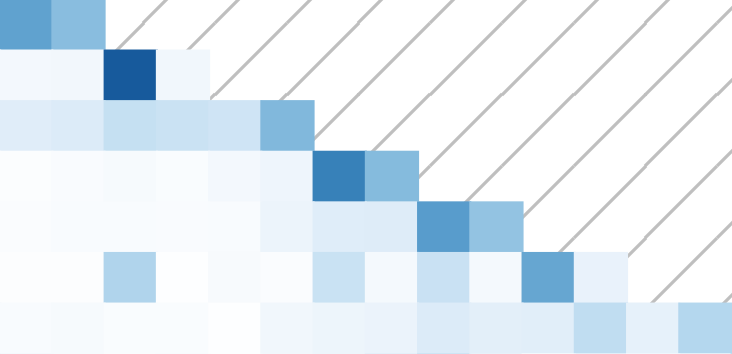</div><div class="a36-focus-copy"><b>Full AttnRes · Pre-Attn</b><p>Layers 3–9<br>Sources 3–16</p><p>High weights near<br>the boundary of<br>available sources</p><small>Layers increase top to bottom.<br>Sources run left to right.</small></div><div class="a36-native-scale"><b>Weight</b><svg viewBox="25 82 15 864" role="img" aria-label="Original weight color scale"><defs><clipPath id="a36-review-a36-scale-1"><rect x="25" y="82" width="15" height="864"/></clipPath></defs><g clip-path="url(#a36-review-a36-scale-1)"><image href="assets/arch_20261007/a36_attnres_fig8_weight_scale.png" width="96" height="964"/></g></svg><span style="top:84px">0.8</span><span style="top:169px">0.6</span><span style="top:253px">0.4</span><span style="top:338px">0.2</span><span style="top:422px">0</span></div></div><p class="a36-focus-foot">Original Figure 8 values · weights averaged over tokens</p></div><div class="a36-focus fragment" data-fragment-index="2"><h3>2 · Embedding source</h3><div class="a36-focus-layout"><div class="a36-focus-main"><div class="a36-embedding-halves"><div><h4>Layers 1–8 ↓</h4><svg viewBox="0 0 180 405" role="img" aria-label="Embedding source, original layers 1–8 from top to bottom"><defs><clipPath id="a36-review-a36-embed-top"><rect x="0" y="0" width="180" height="405"/></clipPath></defs><g clip-path="url(#a36-review-a36-embed-top)"><image href="assets/arch_20261007/a36_attnres_zoom_embedding.png" width="180" height="810"/></g></svg></div><div><h4>Layers 9–16 ↓</h4><svg viewBox="0 405 180 405" role="img" aria-label="Embedding source, original layers 9–16 from top to bottom"><defs><clipPath id="a36-review-a36-embed-bottom"><rect x="0" y="405" width="180" height="405"/></clipPath></defs><g clip-path="url(#a36-review-a36-embed-bottom)"><image href="assets/arch_20261007/a36_attnres_zoom_embedding.png" width="180" height="810"/></g></svg></div></div></div><div class="a36-focus-copy"><b>Block AttnRes · Pre-Attn</b><p>Block 0 = embedding<br>Layers 1–16</p><p>One original column:<br>upper and lower halves<br>shown side by side.</p><small>The embedding still contributes<br>in deeper layers.</small></div><div class="a36-native-scale"><b>Weight</b><svg viewBox="25 82 15 864" role="img" aria-label="Original weight color scale"><defs><clipPath id="a36-review-a36-scale-2"><rect x="25" y="82" width="15" height="864"/></clipPath></defs><g clip-path="url(#a36-review-a36-scale-2)"><image href="assets/arch_20261007/a36_attnres_fig8_weight_scale.png" width="96" height="964"/></g></svg><span style="top:84px">0.8</span><span style="top:169px">0.6</span><span style="top:253px">0.4</span><span style="top:338px">0.2</span><span style="top:422px">0</span></div></div><p class="a36-focus-foot">Original Figure 8 values · weights averaged over tokens</p></div><div class="a36-focus fragment" data-fragment-index="3"><h3>3 · Early outputs</h3><div class="a36-focus-layout"><div class="a36-focus-main"></div><div class="a36-focus-copy"><b>Full AttnRes · Pre-Attn</b><p>Layers 10–14<br>Sources 3–7</p><p>Some early sources<br>receive noticeable<br>weight</p><small>Layers increase top to bottom.<br>Sources run left to right.</small></div><div class="a36-native-scale"><b>Weight</b><svg viewBox="25 82 15 864" role="img" aria-label="Original weight color scale"><defs><clipPath id="a36-review-a36-scale-3"><rect x="25" y="82" width="15" height="864"/></clipPath></defs><g clip-path="url(#a36-review-a36-scale-3)"><image href="assets/arch_20261007/a36_attnres_fig8_weight_scale.png" width="96" height="964"/></g></svg><span style="top:84px">0.8</span><span style="top:169px">0.6</span><span style="top:253px">0.4</span><span style="top:338px">0.2</span><span style="top:422px">0</span></div></div><p class="a36-focus-foot">Original Figure 8 values · weights averaged over tokens</p></div></div>
<div class="fv-takeaway">Local connections coexist with access to early sources. High weight alone does not prove causal importance.</div>
<div class="fv-source"><a href="https://arxiv.org/abs/2603.15031">Attention Residuals, 2026, Figure 8 and §5.4.2</a> · Original Pre-Attn heatmaps; axes, scale and boxes adapted</div>
```

::: {.notes}
Здесь показаны две оригинальные Pre-Attn панели Figure 8: слева Full, справа Block. В статье также есть панели перед MLP; мы выбираем одну и ту же позицию чтения для сопоставимости. Цветовая шкала сохранена; её значения и оси набраны крупно. Нумерованные рамки связывают три последующих увеличения с исходными областями. Горизонтальная ось слева — индекс источника, справа — индекс блока. Вертикальная ось — слой, который читает смесь. Значения усреднены по токенам, поэтому это агрегированная картина, а не поведение на одном конкретном примере.

Первый клик крупно показывает область рядом с границей допустимых источников: заметен сильный вклад ближайших выходов. Второй клик увеличивает embedding source: один исходный столбец разделён на верхнюю половину, слои 1–8, и нижнюю, слои 9–16. Их порядок внутри каждой половины идёт сверху вниз; значения не меняются. Третий клик увеличивает область вне диагонали: некоторые слои читают более ранние представления, а не только последнее доступное. Во всех деталях сохранены исходные пиксели, пропорции и общая шкала весов.

Эта иллюстрация помогает понять, чем управляемое смешивание отличается от фиксированного накопления. Но веса attention — наблюдение о маршрутизации, а не доказательство причинной важности. Для причинного вывода нужны отдельные вмешательства, например удаление источника и измерение изменения результата. Усреднение также может скрывать различия между токенами.

Источник: https://arxiv.org/abs/2603.15031 , Figure 8 и §5.4.2.
:::

## Residual: quality and cost results {#arch-38 .fv-slide .arch-slide background-color="#ffffff"}

```{=html}
<div class="fv-meta"><span class="fv-id">A 38 / 46</span><span class="fv-cluster active">Architecture</span><span class="fv-cluster">Data</span><span class="fv-cluster">Training</span><span class="fv-cluster">Inference</span><span class="fv-cluster">Tools</span></div>
<div class="fv-body a37-body"><div class="a37-left"><div class="a37-label">Scaling · training compute</div>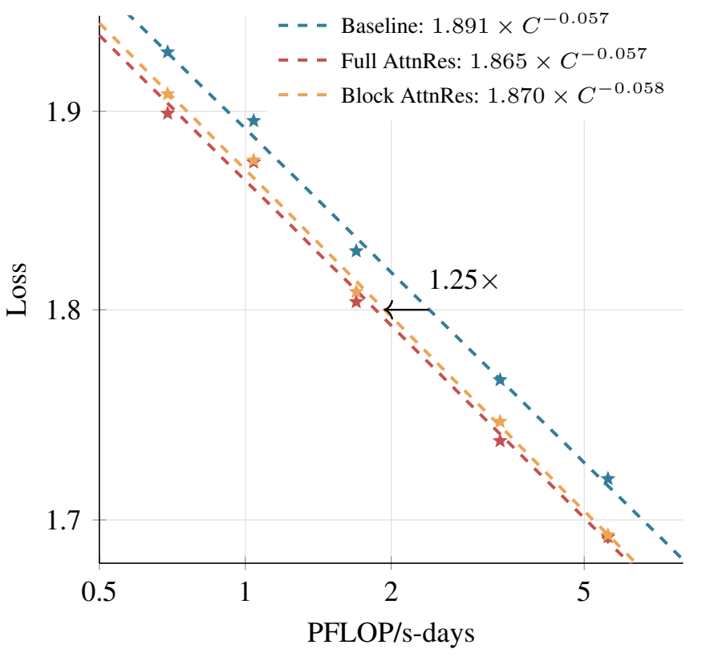</div><div class="a37-right"><div class="a37-legend"><span><i style="background:#3183a4"></i>Baseline</span><span><i style="background:#dc4b4f"></i>Full AttnRes</span><span><i style="background:#f6a04d"></i>Block AttnRes</span></div><div class="a37-config">Kimi Linear · 48B / 3B active<br>1.4T training tokens · Table 3</div><div class="a37-table"><div class="a37-table-head"><span>Benchmark</span><span>Baseline</span><span>AttnRes</span></div><div><span>GPQA-Diamond</span><span>36.9</span><b>44.4</b></div><div><span>HumanEval</span><span>59.1</span><b>62.2</b></div></div><div class="fragment " data-fragment-index="1"><div class="a37-cost"><strong>&lt; 2%</strong><span>inference latency overhead<br>with the two-phase implementation<br>in the authors’ workloads</span></div></div><p class="a37-caveat">1.25× in the plot: the baseline needs more<br><b>training compute</b> for the same loss.</p></div></div>
<div class="fv-takeaway">Connections across depth affect quality with the same core backbone.</div>
<div class="fv-source"><a href="https://arxiv.org/abs/2603.15031">Attention Residuals, 2026, Figure 4, Table 3, §4.2</a> · Original plot; selected table rows retypeset</div>
```

::: {.notes}
Слева оригинальные scaling curves. Указанные 1,25 раза относятся к вычислениям при обучении: в исследованном диапазоне baseline требует примерно на четверть больше compute, чтобы получить loss Block AttnRes. Это эквивалентность по training compute, а не ускорение inference в 1,25 раза. Full и Block близки на этой серии, что мотивирует более экономную блочную реализацию.

Справа отдельное крупное сравнение. Backbone Kimi Linear имеет 48 миллиардов параметров и три миллиарда активных; обе модели обучены на 1,4 триллиона токенов. Выбранные строки Table 3 показывают GPQA-Diamond 36,9 против 44,4 и HumanEval 59,1 против 62,2. Это примеры downstream-результатов, не все задачи исследования и не новая суммарная метрика.

По клику добавляем стоимость реализации. Авторы сообщают менее двух процентов end-to-end inference latency overhead при своей two-phase схеме в типичных для их измерений workloads. Сюда входят инженерные условия, поэтому число нельзя переносить на любой batch, контекст или оборудование без измерения. Главный вывод ограничен: изменение связей по глубине дало выигрыш в этих экспериментах при сохранении основного backbone.

Источник: https://arxiv.org/abs/2603.15031 , Figure 4, Table 3 и §4.2.
:::

## Lookup memory: accessing capacity by address {#arch-39 .fv-slide .arch-slide background-color="#ffffff"}

```{=html}
<div class="fv-meta"><span class="fv-id">A 39 / 46</span><span class="fv-cluster active">Architecture</span><span class="fv-cluster">Data</span><span class="fv-cluster">Training</span><span class="fv-cluster">Inference</span><span class="fv-cluster">Tools</span></div>
<div class="fv-body a38-body"><div class="a38-example">Qwen3.8-Flash-Next <span>n-gram layer · Layer 2</span></div>
<svg class="a38-flow" viewBox="0 0 1488 340" role="img" aria-label="Local token IDs address a few rows of a learned table; the retrieved vectors are combined with the hidden state">
<defs><marker id="a38-a38-arrow" markerWidth="7" markerHeight="7" refX="6" refY="3.5" orient="auto"><path d="M0 0L7 3.5L0 7Z" fill="#141414"/></marker></defs>
<g fill="none" stroke="#141414" stroke-width="2" marker-end="url(#a38-a38-arrow)"><path d="M205 120H250"/><path class="fragment" data-fragment-index="1" d="M475 120H526"/><g class="fragment" data-fragment-index="2"><path d="M870 120H966"/><path d="M1117 230V181"/><path d="M1240 120H1285"/></g></g>
<g fill="#141414" font-size="27" text-anchor="middle">
<rect x="0" y="75" width="205" height="90" fill="#f3f3f3" stroke="#141414"/><text x="102" y="112">Token IDs</text><text x="102" y="144" font-size="22">… xₜ₋₂, xₜ₋₁, xₜ</text>
<rect x="253" y="75" width="222" height="90" fill="white" stroke="#141414"/><text x="364" y="112">n-gram address</text><text x="364" y="144" font-size="22">multi-head hashing</text>
<g class="fragment" data-fragment-index="1"><rect x="530" y="20" width="340" height="258" fill="#f3f3f3" stroke="#141414"/><text x="700" y="57">Embedding tables</text><g stroke="#c5c5c5"><path d="M550 82H850M550 113H850M550 144H850M550 175H850M550 206H850M550 237H850"/></g><rect x="550" y="113" width="300" height="31" fill="#bef264"/><rect x="550" y="206" width="300" height="31" fill="#bef264"/><text x="700" y="302" font-size="25">Host memory</text><text x="700" y="330" font-size="25">+51B parameters</text><text class="fragment" data-fragment-index="2" x="920" y="92" font-size="21">rows</text></g>
<g class="fragment" data-fragment-index="2"><rect x="969" y="75" width="271" height="106" fill="#bef264" stroke="#141414"/><text x="1104" y="117">Contextual fusion</text><text x="1104" y="150" font-size="23">gate + hidden state</text><rect x="1005" y="233" width="224" height="62" fill="white" stroke="#141414"/><text x="1117" y="273">Hidden state</text><text x="1385" y="113">Residual</text><text x="1385" y="146">stream</text></g></g>
</svg>
<div class="a38-bottom"><strong>Addressed capacity, not full-table computation</strong><span>Read learned vectors at addresses defined by local n-grams.</span></div></div>
<div class="fv-takeaway">Capacity can be accessed by reading parameters at specific addresses.</div>
<div class="fv-source"><a href="https://arxiv.org/abs/2608.30320">Qwen Team, 2026, §2.3</a> · <a href="https://huggingface.co/Qwen/Qwen3.8-Flash-Next">Model card</a> · Author’s diagram</div>
```

::: {.notes}
До этого дополнительная ёмкость чаще означала больше сетей, например экспертов MoE. Теперь появляется другой путь: модель хранит обученные векторы в больших таблицах и получает нужные строки по локальному сочетанию token IDs. N-грамма здесь означает несколько соседних токенов, заканчивающихся текущей позицией. Хеширование превращает такой ключ в адрес; таблица не просматривается целиком.

Первый клик показывает таблицы и выбранные строки. В Qwen3.8-Flash-Next к backbone с 125B параметров добавлены 51B параметров n-gram embeddings вне ускорителя. На схеме две выделенные строки служат только иллюстрацией разреженного доступа, а не точным числом чтений модели. Второй клик раскрывает contextual fusion: прочитанные векторы дополняют представление токена с учётом текущего hidden state. Слой размещён вторым, что даёт время для prefetch во время первого слоя.

Это параметрическая память, обучаемая вместе с моделью. Здесь нет внешнего корпуса документов или поисковой выдачи RAG. Lookup memory обозначает семейство решений; далее Engram даст конкретный вариант его реализации.

Источники: https://arxiv.org/html/2608.30320v1#S2.SS3 ; https://huggingface.co/Qwen/Qwen3.8-Flash-Next .
:::

## Lookup memory: larger tables do not always improve results {#arch-40 .fv-slide .arch-slide background-color="#ffffff"}

```{=html}
<div class="fv-meta"><span class="fv-id">A 40 / 46</span><span class="fv-cluster active">Architecture</span><span class="fv-cluster">Data</span><span class="fv-cluster">Training</span><span class="fv-cluster">Inference</span><span class="fv-cluster">Tools</span></div>
<div class="fv-body a39-body"><div class="a39-grid">
<div class="a39-panel"><div class="a39-kicker">TABLE 8 · FIXED TOTAL BUDGET</div><h3>Larger tables, fewer experts</h3><table><thead><tr><th>Vocab / share<br>of parameters</th><th>Loss ↓</th><th>MATH ↑</th></tr></thead><tbody><tr><td>None / 0%</td><td>1.202</td><td>46.02</td></tr><tr><td>5× / 10%</td><td>1.200</td><td>45.64</td></tr><tr><td>10× / 25%</td><td><b>1.197</b></td><td><b>46.56</b></td></tr><tr><td>30× / 50%</td><td>1.201</td><td>44.62</td></tr></tbody></table><p class="a39-note">Downstream gains over MoE-only<br>are inconclusive.</p></div>
<div class="a39-panel fragment" data-fragment-index="1"><div class="a39-kicker">TABLE 9 · FIXED MoE BUDGET</div><h3>The table adds parameters</h3><table><thead><tr><th>Vocab</th><th>Loss ↓</th><th>MATH ↑</th></tr></thead><tbody><tr><td>None</td><td>1.585</td><td>32.52</td></tr><tr><td>20×</td><td>1.553</td><td><b>37.38</b></td></tr><tr><td>50×</td><td>1.541</td><td>37.32</td></tr><tr><td>100×</td><td>1.534</td><td>36.98</td></tr><tr><td>200×</td><td><b>1.526</b></td><td>35.34</td></tr></tbody></table><p class="a39-note fragment fv-highlight" data-fragment-index="2">Loss falls; MATH declines beyond 20×.</p></div></div><div class="a39-context">Vocabulary scale relative to 250K tokens · §2.3 experiments: 300 tokens / active parameter</div></div>
<div class="fv-takeaway">Loss, table size and useful capabilities do not share a single scale.</div>
<div class="fv-source"><a href="https://arxiv.org/abs/2608.30320">Qwen Team, 2026, Tables 8–9, §2.3.2</a> · Selected columns from the original tables</div>
```

::: {.notes}
Здесь важно сначала прочитать условия, а уже затем числа. Левая таблица отвечает на вопрос о распределении фиксированного общего бюджета. Увеличивая таблицы, авторы сокращают число экспертов. Доля в первом столбце — доля параметров, отведённая n-gram embeddings. Лучший loss получается при 10×, но по полной совокупности downstream-задач ясного преимущества над MoE-only авторы не находят. На экран вынесен MATH как один пример, а не средний балл исследования.

Первый клик показывает другой эксперимент справа. Здесь число параметров MoE сохраняется, а таблицы добавляются сверху. Поэтому значения loss между левой и правой таблицей непосредственно сравнивать нельзя. Второй клик выделяет расхождение метрик: loss монотонно убывает от 1,585 до 1,526, но MATH сначала растёт с 32,52 до 37,38 и затем снижается до 35,34. В других столбцах насыщение может выглядеть иначе; китайские бенчмарки продолжают улучшаться.

Вывод касается конкретной реализации и бюджетов. Нельзя заключать, что любая lookup-память бесполезна или что её увеличение автоматически улучшает все способности.

Источник: https://arxiv.org/html/2608.30320v1#S2.SS3.SSS2 .
:::

## Engram: addresses known early, contributions set by context {#arch-41 .fv-slide .arch-slide background-color="#ffffff"}

```{=html}
<div class="fv-meta"><span class="fv-id">A 41 / 46</span><span class="fv-cluster active">Architecture</span><span class="fv-cluster">Data</span><span class="fv-cluster">Training</span><span class="fv-cluster">Inference</span><span class="fv-cluster">Tools</span></div>
<div class="fv-body a40-body">
<div class="a40-overview fragment fade-out" data-fragment-index="1"><div class="a40-tag">FIGURE 1 · MODULE WITHIN THE BACKBONE</div>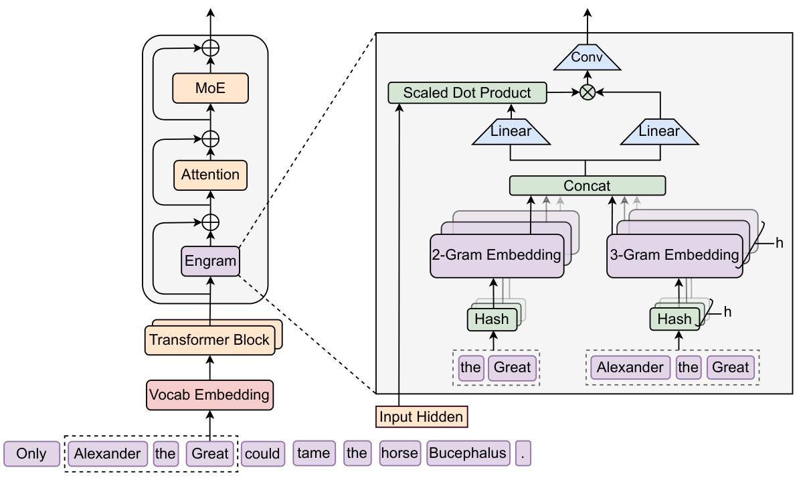<div class="a40-overview-labels"><strong>1. Which rows to fetch?</strong><p>Local token IDs<br>define table addresses.</p><strong>2. How to use them now?</strong><p>The current hidden state<br>controls memory’s contribution.</p></div></div>
<div class="a40-detailstage fragment" data-fragment-index="1"><div class="a40-detailinner fragment fade-out" data-fragment-index="2"><div class="a40-backbone-detail"><div class="a40-tag">BACKBONE</div>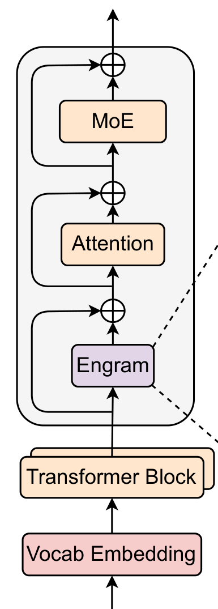</div><div class="a40-lookup-detail"><h3>Which rows to fetch?</h3>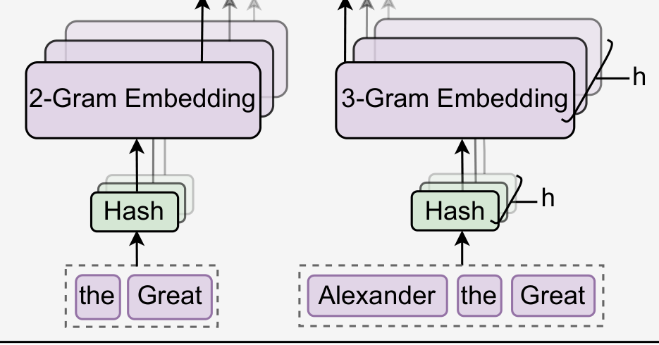<p>Deterministic lookup:<br>addresses depend on token IDs.</p></div><div class="a40-fusion-detail"><h3>How to use them now?</h3>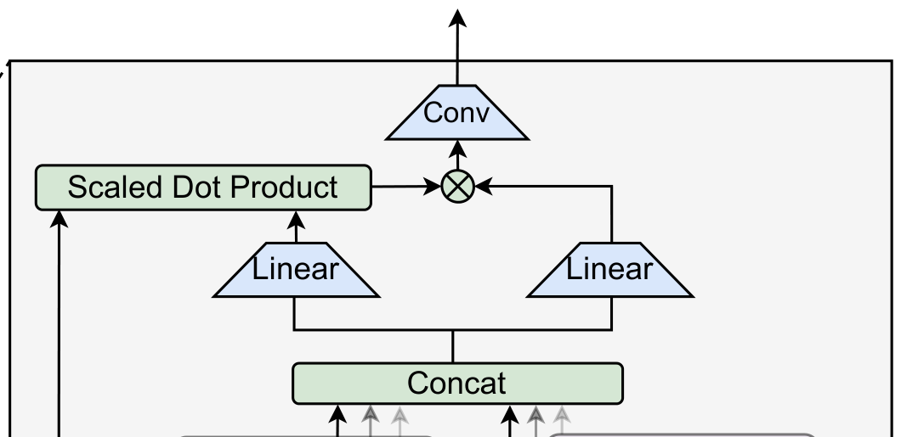<p>Hidden state informs the gate;<br>then convolution and residual addition.</p><span class="a40-input-note">Inputs from below: embeddings + hidden state</span></div></div></div>
<div class="a40-systemstage fragment" data-fragment-index="2"><div class="a40-system-original"><div class="a40-tag">FIGURE 2b · INFERENCE</div><div class="a40-system-schematic">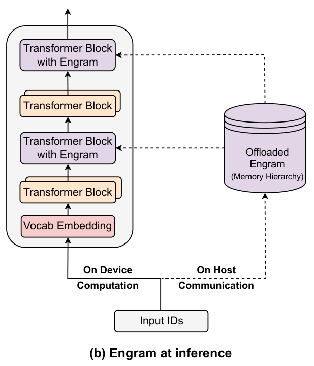<span class="a40-key a40-key-device">1</span><span class="a40-key a40-key-host">2</span><span class="a40-key a40-key-engram-top">3</span><span class="a40-key a40-key-engram-bottom">3</span></div></div><div class="a40-system-read"><h3>Addresses are known before the block runs</h3><div><b>1 · Accelerator computation</b><span>Early Transformer blocks<br>prepare the hidden state.</span></div><div><b>2 · Host memory and transfer</b><span>Selected rows reach Engram<br>along dashed lines from the tables.</span></div><div><b>3 · Blocks with Engram</b><span>Combine the fetched rows<br>with the current hidden state.</span></div><p>Prefetch overlaps with the early layers.</p><p class="a40-prefetch-limit">Transfer still occurs; its latency can be hidden.</p></div></div>
</div>
<div class="fv-takeaway">Addresses depend on token IDs; memory’s contribution depends on the current context.</div>
<div class="fv-source"><a href="https://arxiv.org/abs/2601.07372">Cheng et al., 2026, Figures 1–2, §2.5</a> · Original figures and enlarged details</div>
```

::: {.notes}
На Figure 1 сохранён весь путь в backbone: стандартные embeddings, ранние Transformer blocks, затем Engram перед attention и MoE выбранного блока. В увеличении справа видны две разные операции. Снизу n-граммы детерминированно адресуют обученные embeddings. Сверху текущий hidden state участвует в gate, регулирующем вклад полученной памяти; затем используется лёгкая свёртка и residual-добавление. Одни и те же локальные token IDs могут давать одинаковые адреса, но другой контекст изменит полезность полученного вектора.

Первый клик заменяет обзор двумя увеличенными исходными фрагментами retrieval и fusion; backbone остаётся слева. «Какие строки доставить?» можно решить до исполнения этого блока; «как их использовать?» требует текущего hidden state. Нижняя граница crop fusion разрезает входящие линии: embeddings и hidden state продолжаются из нижней части исходной Figure 1. Это разделение имеет системное следствие. Второй клик показывает увеличенную оригинальную inference-панель Figure 2: таблицы находятся в host memory, выбранные embeddings передаются на ускоритель заранее, параллельно вычислению предыдущих блоков.

Prefetch не уничтожает передачу данных. Её задержку удаётся скрыть лишь при подходящем размещении модуля и достаточном объёме предшествующих вычислений. Поэтому расположение Engram выбирается с учётом и качества, и оборудования.

Источник: https://arxiv.org/html/2601.07372v1#S2 .
:::

## Engram: results with comparable budgets {#arch-42 .fv-slide .arch-slide background-color="#ffffff"}

```{=html}
<div class="fv-meta"><span class="fv-id">A 42 / 46</span><span class="fv-cluster active">Architecture</span><span class="fv-cluster">Data</span><span class="fv-cluster">Training</span><span class="fv-cluster">Inference</span><span class="fv-cluster">Tools</span></div>
<div class="fv-body a41-body"><div class="a41-quality"><div class="a41-condition">TABLE 1 · 262B tokens · 3.8B active parameters*</div><table><thead><tr><th>Benchmark</th><th>MoE-27B</th><th>Engram-27B</th><th>Δ, pp</th></tr></thead><tbody><tr><td>BBH · 3-shot EM</td><td>50.9</td><td>55.9</td><td class="fragment fv-highlight" data-fragment-index="1">+5.0</td></tr><tr><td>HumanEval · 0-shot pass@1</td><td>37.8</td><td>40.8</td><td class="fragment fv-highlight" data-fragment-index="1">+3.0</td></tr><tr><td>MATH · 4-shot EM</td><td>28.3</td><td>30.7</td><td class="fragment fv-highlight" data-fragment-index="1">+2.4</td></tr></tbody></table><div class="a41-budget"><span>26.7B total → 26.7B total</span><span>72 → 55 routed experts + 5.7B Engram</span></div><p class="a41-foot">Same data and data order · iso-parameter / iso-FLOPs<br>* Active parameters exclude token embeddings.</p></div>
<div class="a41-system fragment" data-fragment-index="2"><div class="a41-condition">SEPARATE SYSTEMS TEST</div><div class="a41-big">100B <span>table in host DRAM</span></div><div class="a41-overhead">−1.9% / −2.8%<span>throughput · Dense-4B / Dense-8B</span></div><p>NVIDIA H800 · 512 sequences<br>lengths Uniform(100, 1024)<br>nano-vLLM · Table 4, §6.4</p></div></div>
<div class="fv-takeaway">Allocating some capacity to lookup memory can help; results depend on the module and budget.</div>
<div class="fv-source"><a href="https://arxiv.org/abs/2601.07372">Engram, 2026, Table 1, §4.2; Table 4, §6.4</a> · Selected rows from two separate experiments</div>
```

::: {.notes}
В основном сравнении Engram-27B имеет столько же total parameters и сопоставимые FLOPs, сколько MoE-27B. Все модели получили 262B обучающих токенов в одинаковом порядке; активный бюджет равен 3,8B без входных token embeddings. Для Engram число routed experts уменьшено с 72 до 55, а освободившиеся параметры выделены под 5,7B памяти. Первый клик подчёркивает прирост: пять процентных пунктов BBH, три HumanEval и 2,4 MATH. Так видно, что эффект не ограничивается фактологическими вопросами.

Второй клик намеренно показывает отдельный эксперимент. Его нельзя приписывать той же Engram-27B: авторы исследовали Dense-4B и Dense-8B с дополнительной 100B таблицей в host DRAM. На H800 для 512 последовательностей со случайными длинами от 100 до 1024 throughput снизился примерно на 1,9 и 2,8 процента. Это результат конкретного inference harness, размера batch и оборудования, а не универсальная гарантия задержки.

Эти результаты не противоречат предыдущему слайду: способ fusion, placement и распределение параметров меняют эффект lookup-памяти.

Источники: https://arxiv.org/html/2601.07372v1#S4 ; https://arxiv.org/html/2601.07372v1#S6.SS4 .
:::

## Titans: memory that adapts during processing {#arch-43 .fv-slide .arch-slide background-color="#ffffff"}

```{=html}
<div class="fv-meta"><span class="fv-id">A 43 / 46</span><span class="fv-cluster active">Architecture</span><span class="fv-cluster">Data</span><span class="fv-cluster">Training</span><span class="fv-cluster">Inference</span><span class="fv-cluster">Tools</span></div>
<div class="fv-body a42-body"><div class="a42-kicker">RESEARCH ARCHITECTURE · 2025 <span>Memory as a Context · MAC</span><strong class="a42-adapts fragment" data-fragment-index="1">Neural memory adapts</strong></div><div class="a42-role-legend"><span><b>1</b> Read</span><span><b>2</b> Local attention</span><span><b>3</b> Update</span><span><b>4</b> Persistent memory: fixed during inference</span></div><div class="a42-figure">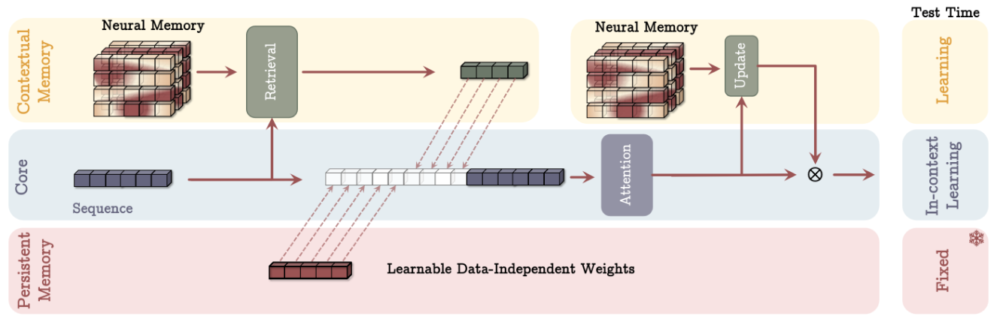<span class="a42-key a42-key-read">1</span><span class="a42-key a42-key-attn">2</span><span class="a42-key a42-key-update">3</span><span class="a42-key a42-key-fixed">4</span><div class="a42-focus a42-neural fragment" data-fragment-index="1"></div><div class="a42-focus a42-core fragment" data-fragment-index="2"></div><div class="a42-focus a42-persistent fragment" data-fragment-index="3"></div></div><div class="a42-compare"><div><b>KV cache</b><span>Stored representations</span></div><div><b>Lookup memory</b><span>Learned tables</span></div><div><b>Titans memory</b><span>Adaptive neural module</span></div></div></div>
<div class="fv-takeaway">In Titans, past context changes the parameters of a dedicated memory module.</div>
<div class="fv-source"><a href="https://arxiv.org/abs/2501.00663">Behrouz et al., 2025, Figure 2, §4.1</a> · Original MAC architecture + author’s highlights</div>
```

::: {.notes}
Мы переходим от фиксированных таблиц к памяти, которая меняется при обработке самой последовательности. На оригинальной Figure 2 показана конкретная архитектура Titans — Memory as a Context. Вход делится на сегменты. Для текущего сегмента модель читает подходящее представление из долгосрочной neural memory. Attention получает текущие токены, прочитанную память и постоянные обученные векторы. Его результат участвует в дальнейшем обновлении neural memory.

Первый клик выделяет верхнюю ветвь: именно её параметры адаптируются на входном потоке. Второй клик выделяет core, где attention связывает информацию в текущем расширенном сегменте. Третий показывает persistent memory — параметры, обученные заранее и фиксированные при inference. Надпись «in-context learning» у core не означает градиентное обновление его весов на каждом входе.

Нижняя полоса сопоставляет три разных объекта. KV cache хранит представления отдельных позиций; lookup хранит обученные строки таблиц; Titans сжимает текущую историю в параметры нейронного модуля. Название «память» общее, но операции записи и чтения различаются. Следующий слайд покажет, что именно означает обновление neural memory.

Источник: https://arxiv.org/html/2501.00663v1#S4.SS1 .
:::

## Titans: what changes during inference {#arch-44 .fv-slide .arch-slide background-color="#ffffff"}

```{=html}
<div class="fv-meta"><span class="fv-id">A 44 / 46</span><span class="fv-cluster active">Architecture</span><span class="fv-cluster">Data</span><span class="fv-cluster">Training</span><span class="fv-cluster">Inference</span><span class="fv-cluster">Tools</span></div>
<div class="fv-body a43-body"><div class="a43-equations"><div class="a43-step"><span class="a43-stepname">01 · Association loss</span><span class="math inline">\(\ell(\mathcal M_{t-1};x_t)=\|\mathcal M_{t-1}(\mathbf k_t)-\mathbf v_t\|_2^2\)</span></div><div class="a43-step fragment" data-fragment-index="1"><span class="a43-stepname">02 · Gradient</span><span class="math inline">\(g_t=\nabla_{\mathcal M}\ell(\mathcal M_{t-1};x_t)\)</span></div><div class="a43-step fragment" data-fragment-index="2"><span class="a43-stepname">03 · Momentum</span><span class="math inline">\(S_t=\eta_t S_{t-1}-\theta_t g_t\)</span></div><div class="a43-step fragment" data-fragment-index="3"><span class="a43-stepname">04 · Forgetting + update</span><span class="math inline">\(\mathcal M_t=(1-\alpha_t)\mathcal M_{t-1}+S_t\)</span></div><div class="a43-read"><b>Read:</b> <span class="math inline">\(y_t=\mathcal M^{*}(\mathbf q_t)\)</span><span>without updating memory weights</span></div></div><div class="a43-side"><div class="a43-thumbnail"><span class="a43-memory-outline" aria-hidden="true"></span></div><div class="a43-object">What gets updated<br><strong>Neural memory <span class="math inline">\(\mathcal M\)</span></strong></div><p><span class="math inline">\(\theta_t\)</span> — step size<br><span class="math inline">\(\eta_t\)</span> — momentum retention<br><span class="math inline">\(\alpha_t\)</span> — forgetting</p><div class="a43-distinction">Memory parameters<br>≠ backbone parameters</div></div></div>
<div class="fv-takeaway">Only local associative memory is updated; backbone parameters stay fixed.</div>
<div class="fv-source"><a href="https://arxiv.org/abs/2501.00663">Titans, 2025, §3.1, Eqs. 12–15; §§3.2–3.3</a> · gₜ is shorthand for the gradient</div>
```

::: {.notes}
В статье символом M обозначается нейронная память; в правиле обновления речь идёт о её параметрах. Она получает ключ и значение из текущего входа и пытается воспроизвести значение по ключу. Квадрат ошибки задаёт локальную association loss. Это другой сигнал, чем глобальная ошибка предсказания следующего токена всей языковой моделью.

Первый клик добавляет градиент по параметрам памяти. Для компактности на слайде он обозначен g. Второй клик показывает накопленное обновление S: прошлое направление сохраняется с коэффициентом eta, а новое добавляется с шагом theta. Третий раскрывает забывание: коэффициент alpha ослабляет прежние параметры перед добавлением S. Эти коэффициенты зависят от входа и обучаются во внешнем контуре. Формулы передают исходное правило статьи; память может быть многослойной сетью, а не одним скалярным весом.

Чтение выделено отдельно: звёздочка в обозначениях авторов означает forward pass без изменения весов. На inference обновляется выделенный модуль neural memory. Параметры backbone и persistent memory не проходят такое online fine-tuning. В §3.2 авторы обсуждают, как организовать вычисления обновлений блоками и распараллелить обучение.

Источник: https://arxiv.org/html/2501.00663v1#S3 .
:::

## Titans: results and limits of extrapolation {#arch-45 .fv-slide .arch-slide background-color="#ffffff"}

```{=html}
<div class="fv-meta"><span class="fv-id">A 45 / 46</span><span class="fv-cluster active">Architecture</span><span class="fv-cluster">Data</span><span class="fv-cluster">Training</span><span class="fv-cluster">Inference</span><span class="fv-cluster">Tools</span></div>
<div class="fv-body a44-body"><div class="a44-table"><div class="a44-kicker">TABLE 1 · RESEARCH SCALE</div><div class="a44-scale">760M <span>parameters</span><br>30B <span>FineWeb-Edu tokens</span></div><table><thead><tr><th>Model</th><th>Avg. ↑</th></tr></thead><tbody><tr><td>Transformer++</td><td>48.69</td></tr><tr class="a44-titans"><td>Titans MAC</td><td>52.51</td></tr></tbody></table><p>Mean of 8 accuracy metrics.<br>Table 1 also reports perplexity.</p></div><div class="a44-plots"><div class="a44-plot a44-few fragment fade-out" data-fragment-index="1"><h3>Figure 6a · BABILong · few-shot</h3><div class="a44-chartrow">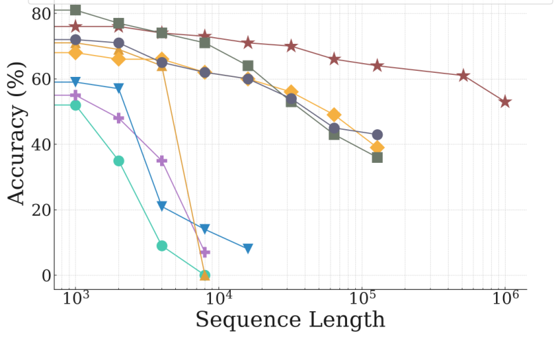<div class="a44-legend"><div><i style="color:#ad5758">★</i><span>Titans (MAC)</span></div><div><i style="color:#41c7ad">●</i><span>Mamba2.8B</span></div><div><i style="color:#b579c9">✚</i><span>RWKV-6-7B</span></div><div><i style="color:#2887c2">▼</i><span>RecurrentGemma-9B</span></div><div><i style="color:#ed9e24">▲</i><span>Gemma-9B</span></div><div><i style="color:#f9ac32">◆</i><span>Llama3.1-8B</span></div><div><i style="color:#6e7b6b">■</i><span>GPT-4</span></div><div><i style="color:#686a85">●</i><span>GPT4o-mini</span></div></div></div><p>Few-shot setup · pretrained models</p></div><div class="a44-plot fragment" data-fragment-index="1"><h3>Figure 6b · BABILong · fine-tuning</h3><div class="a44-chartrow">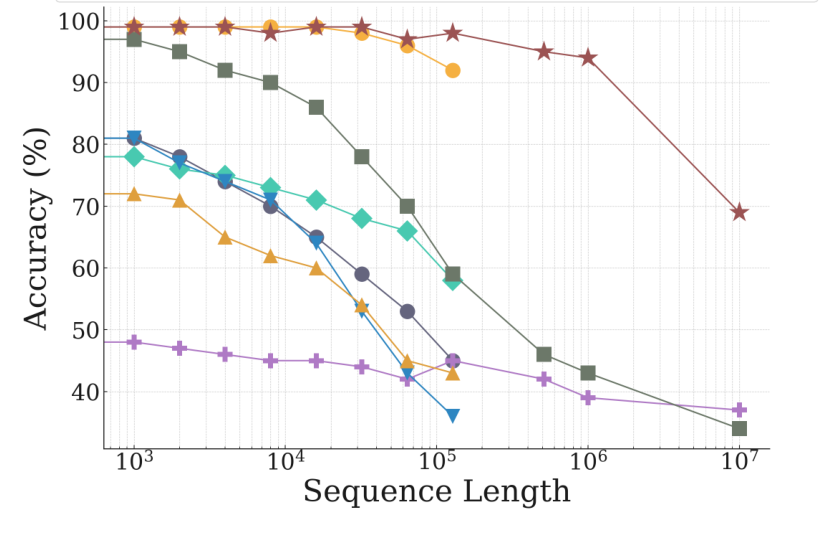<div class="a44-legend"><div><i style="color:#686a85">●</i><span>Llama3.1-70B</span></div><div><i style="color:#41c7ad">◆</i><span>Qwen2.5-72B</span></div><div><i style="color:#b579c9">✚</i><span>Llama3.1-8B + RAG</span></div><div><i style="color:#2887c2">▼</i><span>GPT-4</span></div><div><i style="color:#ed9e24">▲</i><span>GPT4o-mini</span></div><div><i style="color:#f9ac32">●</i><span>Mamba-FT</span></div><div><i style="color:#6e7b6b">■</i><span>RMT-FT</span></div><div><i style="color:#ad5758">★</i><span>Titans (MAC)-FT</span></div></div></div><p>Titans MAC fine-tuned · baselines from Kuratov et al.</p></div></div></div>
<div class="fv-takeaway">Evaluate memory adaptation alongside update cost and scalability.</div>
<div class="fv-source"><a href="https://arxiv.org/abs/2501.00663">Titans, 2025, Table 1; Figure 6a–b; §§5.1–5.4</a> · Table 1 values · original plots with enlarged legends</div>
```

::: {.notes}
Слева — конкретное сопоставимое сравнение, а не оценка всех современных frontier-моделей. Речь о масштабе 760M параметров и 30B токенов FineWeb-Edu. В Table 1 средний показатель Titans MAC равен 52,51 против 48,69 у Transformer++. Это среднее восьми accuracy-метрик, а не среднее с perplexity; в полной таблице perplexity вынесена отдельно. Разница среднего составляет 3,82 пункта.

Справа сначала показана увеличенная область исходной Figure 6a для BABILong; её легенда перенесена справа крупным текстом с теми же маркерами, названиями и цветами. Данные, оси и пределы графиков сохранены. Она проверяет работу с фактами, распределёнными по длинным документам, в few-shot setup. Клик переключает на Figure 6b, где используется отдельный fine-tuning setup. Не следует объединять точки этих графиков в один рейтинг: режимы подготовки моделей и наборы baselines различаются. Раздел 5.4 сообщает, что результаты baselines заимствованы из работы о BABILong. Условия 760M и 30B слева относятся к Table 1 и не автоматически переносятся на все линии справа.

Это свидетельство полезности механизма в исследовательских экспериментах. Для широкого применения ещё нужно проверять качество на нужных задачах, стоимость градиентных обновлений и поведение при большем масштабе.

Источник: https://arxiv.org/html/2501.00663v1#S5 .
:::

## Architecture: resource allocation, not one winner {#arch-46 .fv-slide .arch-slide background-color="#ffffff"}

```{=html}
<div class="fv-meta"><span class="fv-id">A 46 / 46</span><span class="fv-cluster active">Architecture</span><span class="fv-cluster">Data</span><span class="fv-cluster">Training</span><span class="fv-cluster">Inference</span><span class="fv-cluster">Tools</span></div>
<div class="fv-body a45-body"><div class="a45-backbone"><svg class="axb-backbone" viewBox="0 0 820 520" role="img" aria-label="Generalized decoder-only architecture: embeddings, repeated token mixing and FFN blocks with residual paths, output projection">
<defs><marker id="a45-a45-arrow" markerUnits="userSpaceOnUse" markerWidth="8" markerHeight="8" refX="7" refY="4" orient="auto"><path d="M0 0L8 4L0 8Z" fill="#141414"/></marker></defs>
<g fill="none" stroke="#141414" stroke-width="2" marker-end="url(#a45-a45-arrow)"><path d="M370 482V460"/><path d="M370 406V366"/><path d="M370 304V295"/><path d="M370 271V257"/><path d="M370 195V186"/><path d="M370 162V144"/><path d="M370 82V52"/></g>
<rect x="150" y="160" width="520" height="225" fill="none" stroke="#c5c5c5" stroke-width="2" stroke-dasharray="6 5"/>
<g font-size="25" text-anchor="middle" fill="#141414">
<text x="370" y="514">Token IDs</text>
<g class="axb-embedding"><rect x="235" y="406" width="270" height="54" fill="#f3f3f3" stroke="#141414"/><text x="370" y="441">Embeddings</text></g>
<g class="axb-mix"><rect x="235" y="304" width="270" height="62" fill="white" stroke="#141414"/><g class="fragment fade-out" data-fragment-index="2"><text x="370" y="331">Token mixing</text><text x="370" y="354" font-size="20">Norm → causal mixing</text></g><g class="fragment" data-fragment-index="2"><rect x="235" y="304" width="270" height="62" fill="#bef264" stroke="#141414"/><text x="370" y="330" font-size="23">Attention / recurrent</text><text x="370" y="354" font-size="20">dense / sparse / hybrid</text></g></g>
<g class="axb-ffn"><rect x="235" y="195" width="270" height="62" fill="white" stroke="#141414"/><g class="fragment fade-out" data-fragment-index="1"><text x="370" y="222">FFN</text><text x="370" y="246" font-size="20">Norm → transformation</text></g><g class="fragment" data-fragment-index="1"><rect x="235" y="195" width="270" height="62" fill="#bef264" stroke="#141414"/><text x="370" y="235">Dense / MoE</text></g></g>
<g class="axb-output"><rect x="235" y="82" width="270" height="62" fill="#f3f3f3" stroke="#141414"/><text x="370" y="108">Output projection</text><text x="370" y="131" font-size="20">Norm → logits</text></g>
<text x="370" y="35">Next-token scores</text>
<text x="83" y="250" font-size="34" font-weight="650">× N</text><text x="83" y="281" font-size="21">blocks</text>
<g class="axb-residual"><path d="M370 385H590V283H383" fill="none" stroke="#141414" stroke-width="2" marker-end="url(#a45-a45-arrow)"/><path d="M370 264H590V174H383" fill="none" stroke="#141414" stroke-width="2" marker-end="url(#a45-a45-arrow)"/><circle cx="370" cy="283" r="12" fill="white" stroke="#141414"/><text x="370" y="291">+</text><circle cx="370" cy="174" r="12" fill="white" stroke="#141414"/><text x="370" y="182">+</text><g class="fragment fade-out" data-fragment-index="3"><text x="714" y="245" font-size="22">Residual</text><text x="714" y="274" font-size="22">paths</text></g><g class="fragment" data-fragment-index="3"><text x="714" y="231" font-size="20">Residual</text><text x="714" y="257" font-size="20">addition /</text><text x="714" y="283" font-size="20">mixing</text></g></g>
<g class="fragment" data-fragment-index="3"><rect x="17" y="408" width="190" height="65" fill="#bef264" stroke="#141414"/><text x="112" y="434" font-size="20">Lookup / adaptive</text><text x="112" y="460" font-size="20">memory module</text><path d="M208 441H223V385H352" fill="none" stroke="#626262" stroke-dasharray="5 4"/><text x="113" y="393" font-size="20">Module option</text></g></g></svg>
</div><div class="a45-options"><div class="a45-intro">Options for each component</div><div class="a45-choice fragment" data-fragment-index="1"><span>FFN · compute capacity</span><strong>Dense / MoE</strong></div><div class="a45-choice fragment" data-fragment-index="2"><span>Token mixing · access to the past</span><strong>MQA / GQA / MLA · compressed KV<br>Sparse attention · recurrent / hybrid</strong></div><div class="a45-choice fragment" data-fragment-index="3"><span>Residual paths · information across depth</span><strong>Residual addition / residual mixing</strong></div><div class="a45-choice fragment" data-fragment-index="3"><span>Memory · additional capacity</span><strong>Lookup / adaptive memory</strong></div></div></div>
<div class="fv-takeaway">Architecture defines how experience is processed. Next: what experience does the model receive?</div>
<div class="fv-source">Author’s synthesis of this section · <a href="https://arxiv.org/abs/2608.30320">Qwen Team, 2026, §5: quality, efficiency, stability</a></div>
```

::: {.notes}
Мы возвращаемся к той же нейтральной архитектуре, с которой начали раздел. Embeddings превращают token IDs в представления; повторяющиеся блоки смешивают информацию между токенами и преобразуют её внутри токена; residual paths передают информацию по глубине. Геометрия схемы сохранена, чтобы новые названия можно было поставить на знакомые места.

Первый клик открывает варианты FFN: плотное вычисление или выбор экспертов. Второй возвращает варианты token mixing и хранения контекста: организация KV, сжатие, разреженный доступ, recurrent-состояния и hybrid-комбинации. Третий показывает варианты residual-путей и дополнительных модулей памяти. Это набор решений для соответствующих узлов, а не схема одной модели, в которую одновременно включены все механизмы. Lookup и adaptive memory также различаются тем, что именно хранится и меняется во время обработки.

Маршрут раздела замыкается: мы рассмотрели распределение вычислений, хранимых представлений и доступной ёмкости. Полезность каждого решения зависит от других компонентов, задач и аппаратных условий. Qwen отдельно подчёркивает совместную оценку качества, эффективности и стабильности. Теперь переходим к данным: какой опыт получает модель, устройство которой мы выбираем?

Источник принципа совместного проектирования: https://arxiv.org/html/2608.30320v1#S5 .
:::

## Quantization: fewer bits per number {#arch-detail-quantization .fv-slide .arch-detail-source data-detail-group="quantization" .arch-slide background-color="#ffffff"}

```{=html}
<div class="fv-meta"><span class="fv-id">Detail 01</span><span class="fv-cluster active">Architecture</span><span class="fv-cluster">Data</span><span class="fv-cluster">Training</span><span class="fv-cluster">Inference</span><span class="fv-cluster">Tools</span></div>
<div class="fv-body a11-body"><div class="a11-focus a11-quant"><div><h3>Quantization · KIVI</h3><p>Fewer bits per number.</p><p>For <b>K</b>: per channel.<br>For <b>V</b>: per token.</p><p>Quantization axes differ,<br>but positions stay in the cache.</p></div></div></div>
<div class="fv-takeaway">KIVI uses different quantization axes for keys and values.</div>
<div class="fv-source"><a href="https://arxiv.org/abs/2402.02750">KIVI, Figure 1</a> · Original figure</div>
```

::: {.notes}
KIVI сокращает точность чисел, учитывая разную структуру распределений ключей и значений. На оригинальной схеме сравниваем per-token и per-channel quantization. В KIVI ключи квантуются по каналам, значения — по токенам; набор позиций остаётся в кэше. Это схема механизма, а не универсальное сравнение качества.
:::

## Token selection: fewer stored positions {#arch-detail-token-selection .fv-slide .arch-detail-source data-detail-group="token-selection" .arch-slide background-color="#ffffff"}

```{=html}
<div class="fv-meta"><span class="fv-id">Detail 01</span><span class="fv-cluster active">Architecture</span><span class="fv-cluster">Data</span><span class="fv-cluster">Training</span><span class="fv-cluster">Inference</span><span class="fv-cluster">Tools</span></div>
<div class="fv-body a11-body"><div class="a11-focus a11-select"><div><h3>Token selection · SnapKV</h3><p>Fewer stored positions.</p><p>Attention in an observation window<br>helps select entries<br>from the preceding prefix.</p><p>This changes the cache contents.</p></div></div></div>
<div class="fv-takeaway">SnapKV selects prefix entries using attention observed in a recent window.</div>
<div class="fv-source"><a href="https://arxiv.org/abs/2404.14469">SnapKV, Figure 1</a> · Original mechanism diagram</div>
```

::: {.notes}
SnapKV использует внимание в observation window для выбора записей из предыдущего префикса, затем выполняет pooling и объединение с наблюдаемым окном. В отличие от quantization здесь меняется набор сохраняемых позиций, а не только точность чисел. Возвращаемся к обзорной карте кнопкой Back to KV cache или Escape.
:::

## MLA: compress representations, not just head count {#arch-detail-12 .fv-slide .arch-detail-source data-detail-group="latent-compression" .arch-slide background-color="#ffffff"}

```{=html}
<div class="fv-meta"><span class="fv-id">Detail 01</span><span class="fv-cluster active">Architecture</span><span class="fv-cluster">Data</span><span class="fv-cluster">Training</span><span class="fv-cluster">Inference</span><span class="fv-cluster">Tools</span></div>
<div class="fv-body a12-body"><div class="a12-stage"><div class="a12-comparison fragment fade-out" data-fragment-index="1">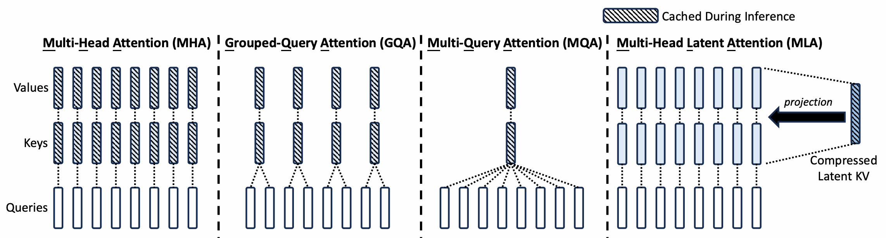<p>Original comparison: KV head count and latent compression are different axes.</p></div><div class="a12-focus fragment" data-fragment-index="1">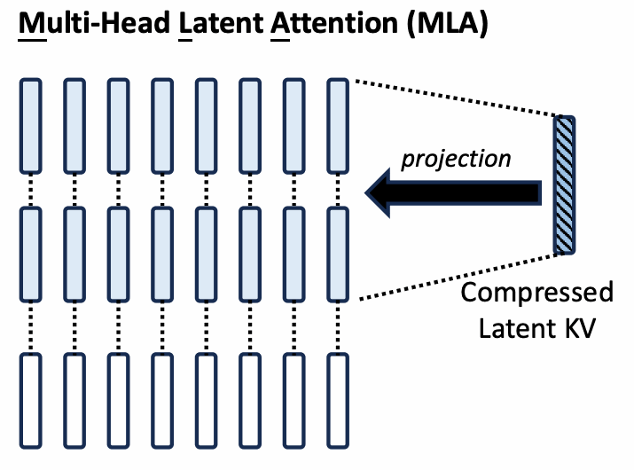<div class="a12-explain"><p><b>Joint latent</b><br>represents K/V content.</p><p><b>Positional key</b><br>is stored separately.</p><p>Projections remain part of<br>the attention computation.</p></div></div></div><div class="a12-labels"><div class="a12-label"><h3>What is stored</h3><p>Latent KV +<br>RoPE key</p><span class="math inline">\(c_t^{KV},\ k_t^R\)</span></div><div class="a12-label"><h3>What enters<br>the computation</h3><p>Queries, content keys,<br>values and the positional<br>component</p></div></div></div>
<div class="fv-takeaway">A compact history representation does not mean fewer query heads.</div>
<div class="fv-source"><a href="https://arxiv.org/abs/2405.04434">DeepSeek-V2, 2024 · Fig. 3, §2.1</a> · Original figure and enlarged MLA panel</div>
```

::: {.notes}
Вначале показываем полный сравнительный ряд авторов DeepSeek-V2. MHA, GQA и MQA различаются тем, как много независимых наборов K/V используется запросами. MLA ставит другой вопрос: можно ли сохранять совместное компактное представление, достаточное для последующих вычислений? По клику увеличиваем правую панель исходной фигуры, сохраняя две постоянные подписи: что действительно находится в кэше и какие величины участвуют в attention.

В MLA content-компоненты keys и values связаны с одним низкоразмерным latent. Для работы с позиционной информацией в показанной архитектуре отдельно сохраняется decoupled RoPE key. Поэтому нельзя ограничиться формулой «сохранили один вектор» и забыть о позиционной части. Проекции на рисунке объясняют математическую связь представлений, но не задают обязательный порядок операций конкретного kernel. В частности, алгебраическое поглощение некоторых матриц позволяет не материализовать постоянно все развёрнутые K/V. Мы обсуждаем объём переносимого состояния, а не универсальную реализацию всех промежуточных тензоров.

Источник: https://arxiv.org/abs/2405.04434 , §2.1 и Figure 3.
:::

## MLA: memory and performance results {#arch-detail-13 .fv-slide .arch-detail-source data-detail-group="latent-compression" .arch-slide background-color="#ffffff"}

```{=html}
<div class="fv-meta"><span class="fv-id">Detail 02</span><span class="fv-cluster active">Architecture</span><span class="fv-cluster">Data</span><span class="fv-cluster">Training</span><span class="fv-cluster">Inference</span><span class="fv-cluster">Tools</span></div>
<div class="fv-body a13-body"><div class="a13-grid"><div class="a13-left"><h3>Cache size · per token, across all layers</h3><div class="a13-table-stage"><div class="a13-original fragment fade-out" data-fragment-index="1">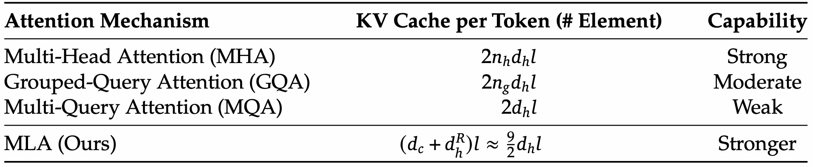<p>Original Table 1 → enlarged formulas next</p></div><div class="a13-readable fragment" data-fragment-index="1"><div><b>MHA</b><span class="math inline">\(2n_h d_h l\)</span></div><div><b>GQA</b><span class="math inline">\(2n_g d_h l\)</span></div><div><b>MQA</b><span class="math inline">\(2d_h l\)</span></div><div><b>MLA</b><span class="math inline">\((d_c+d_h^R)l\)</span></div></div></div><p class="a13-symbols"><span class="math inline">\(l\)</span> — layers; <span class="math inline">\(n_h,n_g\)</span> — heads and KV groups<br><span class="math inline">\(d_h\)</span> — head dimension; <span class="math inline">\(d_c\)</span> — latent; <span class="math inline">\(d_h^R\)</span> — RoPE key<br>Element counts, before choosing precision.</p></div><div><div class="fv-label">DeepSeek-V2 vs DeepSeek 67B</div><div class="a13-metrics"><div class="a13-metric"><p>KV cache</p><b>−93.3%</b><p>state size</p></div><div class="a13-metric fragment" data-fragment-index="2"><p>Maximum generation<br>throughput</p><b>×5.76</b><p>maximum reported</p></div></div><p class="a13-baseline">Published comparison of complete models.</p></div></div><div class="a13-caveat fragment" data-fragment-index="3"><b>This is a system-level result.</b> Architecture, batch size and implementation determine actual throughput.</div></div>
<div class="fv-takeaway">Compact state makes room for larger batches. Speed must be measured separately.</div>
<div class="fv-source"><a href="https://arxiv.org/abs/2405.04434">DeepSeek-V2, 2024 · Table 1, Fig. 1 and Abstract</a> · Original Table 1 and enlarged formulas; baseline stated</div>
```

::: {.notes}
Слева таблица из DeepSeek-V2 сравнивает размер состояния разных механизмов. В ней считается число элементов кэша на токен по всем слоям, поэтому перед переводом в байты нужно отдельно определить формат хранения. Формулы отвечают на архитектурный вопрос, не являясь замером скорости. Отмечаем, что в строке MLA присутствует не только latent dimension, но и размерность позиционного ключа.

По первому клику формулы исходной таблицы показаны крупно; столбец Capability остаётся авторской качественной оценкой, а не метрикой этого слайда. Далее справа появляются опубликованные показатели: относительно DeepSeek 67B авторы сообщают сокращение KV cache на 93,3 процента и рост максимальной пропускной способности генерации до 5,76 раза. Между числами намеренно нет знака равенства. Последнее раскрытие делает крупной оговорку: сравниваются полные модели, а не два варианта одной MLA-абляции. Меньшее состояние может позволить больше одновременно обслуживаемых последовательностей и изменить рабочую точку системы. Но конкретный результат зависит от batch, длины контекста, оборудования и реализации. Нельзя переносить множитель throughput на latency любого запроса либо целиком приписывать его одной архитектурной детали.

Источник: https://arxiv.org/abs/2405.04434 , Table 1, Figure 1, Abstract.
:::

## Shared KV: reuse history across layers {#arch-detail-14 .fv-slide .arch-detail-source data-detail-group="sharing" .arch-slide background-color="#ffffff"}

```{=html}
<div class="fv-meta"><span class="fv-id">Detail 01</span><span class="fv-cluster active">Architecture</span><span class="fv-cluster">Data</span><span class="fv-cluster">Training</span><span class="fv-cluster">Inference</span><span class="fv-cluster">Tools</span></div>
<div class="fv-body a14-body"><div class="a14-figure"><div class="a14-overview fragment fade-out" data-fragment-index="1"></div><div class="a14-focus fragment" data-fragment-index="1">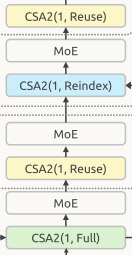<div class="a14-flow"><h3>Source: encoder H₂₀</h3><div class="a14-flow-box">Full layer<br><b>creates global KV</b></div><div class="a14-arrow">↓</div><div class="a14-flow-box fragment" data-fragment-index="2">Later layers<br><b>read shared global KV</b></div><p>Each consumer has its own<br>Q, SWA K/V<br>and attention output.</p><p class="a14-caption">Left: original excerpt from Fig. 3.<br>Right: conceptual sharing diagram.</p></div></div></div><div class="a14-text"><div class="a14-line"><h3>1 · Prepare</h3><p>The causal encoder creates<br>representation <span class="math inline">\(H_{20}\)</span>.</p></div><div class="a14-line fragment" data-fragment-index="1"><h3>2 · Project</h3><p>Decoder global KV:<br>from the encoder, in a Full layer.</p></div><div class="a14-line fragment" data-fragment-index="2"><h3>3 · Reuse</h3><p>CSA2 layers use<br>shared global KV.</p></div><p class="a14-local">Each layer has its own<br>Q and SWA K/V.</p></div></div>
<div class="fv-takeaway">Shared representations do not imply shared outputs.</div>
<div class="fv-source"><a href="https://arxiv.org/html/2609.19969v1#S1.F3">DeepSeek-V4.1-Flash, 2026 · Fig. 3, §§2.2–2.3</a> · Original architecture and enlarged excerpt; sharing diagram</div>
```

::: {.notes}
Теперь меняем ось: смотрим вдоль глубины. Оригинальная архитектура показывает causal encoder и decoder. Сначала выделяем выход encoder: нижняя половина сети подготавливает представления контекста. В CED global KV decoder строятся из последнего скрытого состояния encoder с проекциями, зависящими от слоя. Это важно: общий источник ещё не означает, что все полученные проекции автоматически одинаковы.

По первому клику прослеживаем источник до Full-слоя decoder. На втором клике добавляем следующий механизм — CSA2. Он позволяет другим слоям использовать global KV, созданные предыдущим Full-слоем. Так разделяются подготовка информации и количество её сохранённых копий. Query текущего слоя остаётся собственным, а значит он может иначе прочитать общее представление и получить другой результат. Локальная SWA-ветвь также сохраняет слой-зависимое состояние. Цвета и подписи Full, Reindex, Reuse оставляем как в оригинале; следующий слайд расшифрует их. Здесь не нужно обсуждать точную математику sparse selection: главный вопрос — кто создаёт состояние и кто становится его потребителем.

Источник: https://arxiv.org/html/2609.19969v1#S2 , Figure 3, §§2.2–2.3.
:::

## CSA2: create, reindex or reuse {#arch-detail-15 .fv-slide .arch-detail-source data-detail-group="sharing" .arch-slide background-color="#ffffff"}

```{=html}
<div class="fv-meta"><span class="fv-id">Detail 02</span><span class="fv-cluster active">Architecture</span><span class="fv-cluster">Data</span><span class="fv-cluster">Training</span><span class="fv-cluster">Inference</span><span class="fv-cluster">Tools</span></div>
<div class="fv-body a15-body"><div class="a15-figure"><div class="a15-overview fragment fade-out" data-fragment-index="1">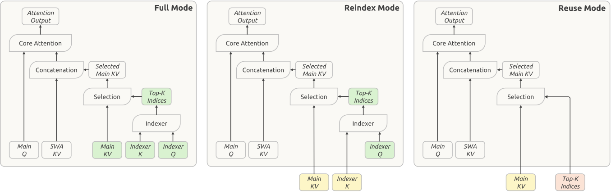</div><div class="a15-focus fragment current-visible" data-fragment-index="1">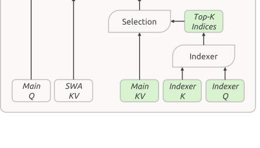<div><h3>Full</h3><p><b>Create state and addresses</b></p><p>New main KV and indexer K.</p><p>Indexer Q selects new Top-K indices.</p><p class="a15-own">Every mode has its own<br>main Q and SWA K/V.</p><p class="a15-caption">Focus on inputs and selection.<br>The upper attention path is in the overview.</p></div></div><div class="a15-focus fragment current-visible" data-fragment-index="2">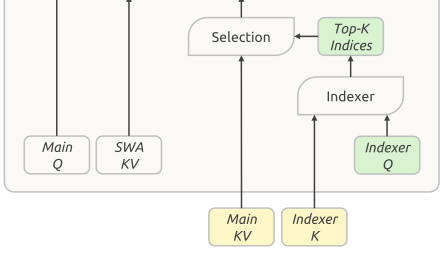<div><h3>Reindex</h3><p><b>Save storage</b></p><p>Main KV and indexer K from Full.</p><p>New indexer Q → new Top-K indices.</p><p class="a15-own">Every mode has its own<br>main Q and SWA K/V.</p><p class="a15-caption">Focus on inputs and selection.<br>The upper attention path is in the overview.</p></div></div><div class="a15-focus fragment" data-fragment-index="3">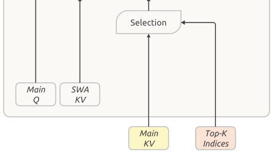<div><h3>Reuse</h3><p><b>Save storage and selection work</b></p><p>Main KV from Full.</p><p>Top-K indices from the latest Full / Reindex.</p><p class="a15-own">Every mode has its own<br>main Q and SWA K/V.</p><p class="a15-caption">Focus on inputs and selection.<br>The upper attention path is in the overview.</p></div></div></div><div class="a15-legend"><span><i style="background:#daf0cc"></i>computed in the current layer</span><span><i style="background:#fff7c6"></i>KV / indexer K from a Full layer</span><span><i style="background:#fbe1d0"></i>indices from Full / Reindex</span></div></div>
<div class="fv-takeaway">Sharing reduces storage; reusing indices reduces selection work.</div>
<div class="fv-source"><a href="https://arxiv.org/html/2609.19969v1#S2.F4">DeepSeek-V4.1-Flash, 2026 · Fig. 4, §2.3.1</a> · Original figure and color legend from its caption</div>
```

::: {.notes}
Сначала показываем три режима исходной Figure 4 целиком, затем три раскрытия увеличивают нижнюю часть каждой панели: входы и отбор. Верхний путь Core Attention одинаков по смыслу и остаётся в исходном обзоре. Full создаёт собственные main KV и indexer K, затем получает новые Top-K indices. На втором клике переходим к Reindex: main KV и соответствующий indexer K берутся из ближайшего предыдущего Full-слоя, но новый indexer query заново оценивает адреса. Значит экономия хранения не запрещает следующему слою выбрать другой набор записей.

Третий клик выделяет Reuse. Теперь переиспользуются и global KV, и уже вычисленный набор адресов, поэтому повторное индексирование не выполняется. Во всех трёх панелях оставлены собственные main Q и локальные SWA K/V. Повторное использование истории нельзя спутать с повторным использованием самого результата attention. Зелёный, жёлтый и персиковый соответствуют легенде авторов: новое вычисление, общее состояние, общие индексы. Эти режимы статически назначены слоям архитектуры, а не выбираются произвольно для каждого токена. Сейчас фиксируем границы reuse; далее отдельно разберём, как индексирующая ветвь находит адреса.

Источник: https://arxiv.org/html/2609.19969v1#S2.SS3.SSS1 , Figure 4.
:::

## KV cache: results and current combinations {#arch-detail-16 .fv-slide .arch-detail-source data-detail-group="sharing" .arch-slide background-color="#ffffff"}

```{=html}
<div class="fv-meta"><span class="fv-id">Detail 03</span><span class="fv-cluster active">Architecture</span><span class="fv-cluster">Data</span><span class="fv-cluster">Training</span><span class="fv-cluster">Inference</span><span class="fv-cluster">Tools</span></div>
<div class="fv-body a16-body"><div class="a16-chart"><div class="a16-original fragment fade-out" data-fragment-index="1">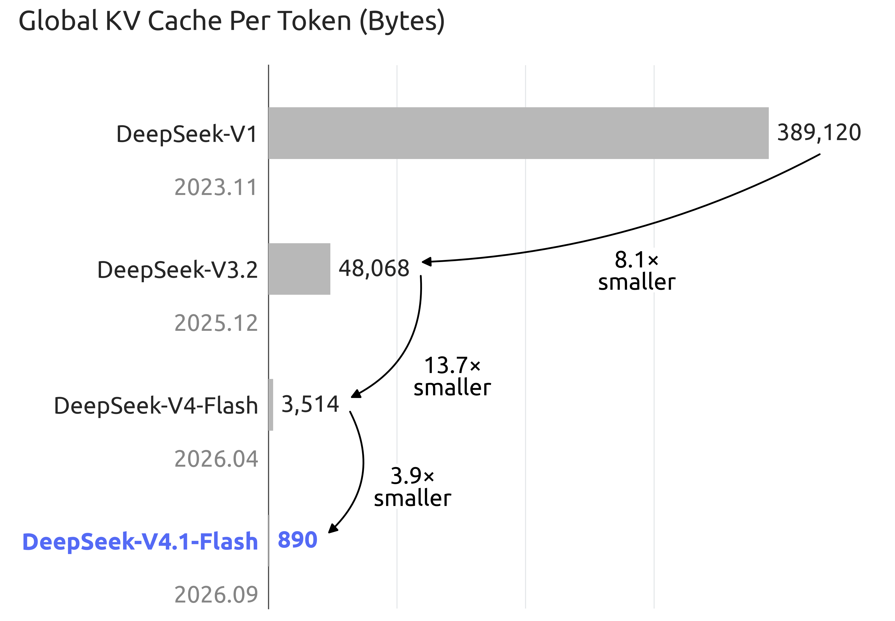</div><div class="a16-values fragment" data-fragment-index="1"><h3>Global KV · bytes per token</h3><div><span>DeepSeek-V1</span><b>389 120</b></div><div><span>DeepSeek-V3.2</span><b>48 068</b></div><div><span>DeepSeek-V4-Flash</span><b>3 514</b></div><div class="a16-current"><span>DeepSeek-V4.1-Flash</span><b>890</b></div><p>Values from Fig. 1b.<br>All global KV across layers;<br>local SWA is counted separately.</p></div></div><div class="a16-map"><div class="a16-map-row"><b>DeepSeek-V3</b><span>MLA</span></div><div class="a16-map-row"><b>DeepSeek-V4</b><span>Compressed attention</span></div><div class="a16-map-row"><b>DeepSeek-V4.1</b><span>CSA2 + sharing<br>+ FP4 main KV</span></div><div class="a16-map-row"><b>Qwen3.8-<br>Flash-Next</b><span>GQA in QSA<br>recurrent state in GDN</span></div><div class="a16-budgets fragment" data-fragment-index="1"><div class="a16-budget">Global KV · HBM<strong>890 B/token</strong>≈ ¼ of V4-Flash</div><div class="a16-budget">Persistent · SSD/host<strong>≈ ⅛</strong>of V4-Flash<br><small>includes SWA Bounded Replay</small></div></div></div></div>
<div class="fv-takeaway">Compact history reduces storage; reading it has a separate cost.</div>
<div class="fv-source"><a href="https://arxiv.org/html/2609.19969v1">DeepSeek-V4.1-Flash, Fig. 1b and §3.2</a> · <a href="https://arxiv.org/abs/2412.19437">DeepSeek-V3</a> · <a href="https://huggingface.co/Qwen/Qwen3.8-Flash-Next">Qwen model card</a></div>
```

::: {.notes}
Слева опубликованный график показывает global KV в байтах на токен. Сохраняем его название, значения и поколения моделей: это конкретная составляющая состояния, не вся память сервера. Справа сопоставляем опубликованные варианты механизмов. MLA меняет представление записи; compressed attention — организацию глобальной истории; CSA2 добавляет sharing, а FP4 меняет точность хранения. У Qwen рядом существуют позиционное состояние QSA с GQA и recurrent state GDN; к гибридным жизненным циклам вернёмся позже.

По клику разводим два результата DeepSeek-V4.1-Flash. Global KV занимает 890 байт на токен, примерно четверть соответствующего состояния V4-Flash, и находится в HBM. Persistent cache служит для повторного использования префиксов на SSD или в host memory; его примерно восьмикратное сокращение связано также с отдельной оптимизацией SWA Bounded Replay. Эти коэффициенты относятся к разным бюджетам, их нельзя перемножать или заменять один другим. Завершаем вопросом: когда состояние уже компактно, сколько из него всё ещё нужно прочитать одному query?

Источники: https://arxiv.org/html/2609.19969v1 ; https://arxiv.org/abs/2412.19437 ; https://huggingface.co/Qwen/Qwen3.8-Flash-Next
:::
