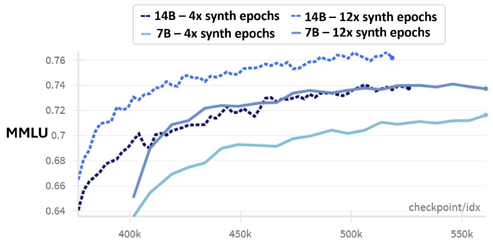
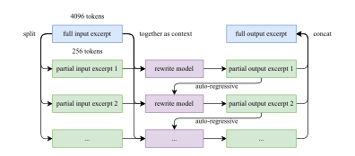
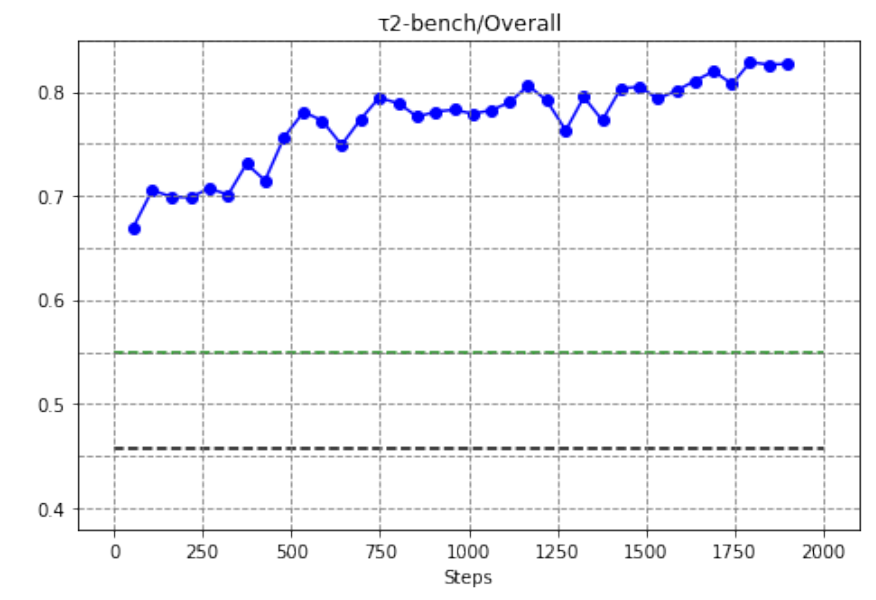

## Data mixtures and domain sampling {#frontier-f14 .fv-slide background-color="#ffffff"}

```{=html}
<div class="fv-meta"><span class="fv-id">F14</span><span class="fv-cluster">Architecture</span><span class="fv-cluster active">Data</span><span class="fv-cluster">Training</span><span class="fv-cluster">Inference</span><span class="fv-cluster">Tools</span></div>
<div class="fv-body f14-body">
  <div class="f14-storage"><div class="fv-label">Source pools</div>
    <div class="f14-pool"><b>Web</b><span style="width:100%"></span></div>
    <div class="f14-pool"><b>Code</b><span style="width:67%"></span></div>
    <div class="f14-pool"><b>Mathematics</b><span style="width:50%"></span></div>
    <div class="f14-pool"><b>Knowledge</b><span style="width:73%"></span></div>
    <div class="f14-pool"><b>Multimodal</b><span style="width:56%"></span></div>
    <div class="fv-small fv-muted">Pool sizes stay fixed</div>
  </div>
  <svg class="f14-fan" viewBox="0 0 110 340" width="110" height="340" role="img" aria-label="Five pools feed into the sampler"><path d="M0 25L86 168M0 88L86 168M0 151L86 168M0 214L86 168M0 277L86 168M86 168H108" fill="none" stroke="#777" stroke-width="2"/><path d="M97 160L108 168L97 176" fill="none" stroke="#141414" stroke-width="2"/></svg>
  <div class="f14-sampler"><div class="fv-label">How to split the budget?</div><div class="f14-dial">Sampler</div><div class="f14-weights fv-accent">Sampling weights</div><p class="fv-small">Kimi K3: ablations<br>on smaller models</p></div>
  <div class="fv-arrow f14-output-arrow">→</div>
  <div class="f14-batches"><div class="fv-label">Token budget stays fixed</div><div class="f14-batch-caption">Initial mixture</div>
    <div class="f14-batch"><span>Web</span><span>Web</span><span>Code</span><span>Math</span></div>
    <div class="f14-batch"><span>Web</span><span>Know.</span><span>Web</span><span>Vision</span></div>
    <div class="fragment" data-fragment-index="1"><div class="f14-batch-caption f14-changed">After changing weights</div><div class="f14-batch"><span>Web</span><span class="fv-accent">Code</span><span class="fv-accent">Math</span><span class="fv-accent">Code</span></div></div>
  </div>
  <div class="f14-bottom"><span>Corpus size</span><b>≠</b><span>Effective training mixture</span></div>
</div>
<div class="fv-takeaway">The sampler allocates a limited training budget across domains.</div>
<div class="fv-source"><a href="https://arxiv.org/html/2607.24653v1#S3.SS1">Kimi K3, §3.1, 2026</a> · <a href="https://arxiv.org/abs/2305.10429">DoReMi, 2023</a> · Teaching diagram</div>
```

::: {.notes}
Architecture determines how a model stores information and allocates computation. But the computation scheme alone does not determine what the model learns: that depends on the data it receives. With a limited number of steps, we cannot freely increase exposure to every source at once. How much of the training budget should go to code, mathematics, the web, and other data? Even with an unchanged architecture, this choice changes what the model sees during training.

The pools on the left contain web, code, mathematics, knowledge, and multimodal data. Their storage sizes are illustrative. A sampler sits between these pools and the training batches. It first selects a domain with a given probability, then draws material from that domain. Sampling weights control how often each source appears during training.

*First click: show the batch after changing the weights.*

Notice that the pools on the left have not grown, but the domain balance in the new batch has changed: it now contains two code examples. Corpus size and the effective training mixture are different quantities. With a fixed token budget, increasing one domain's share reduces the shares of others. A small pool may therefore be presented repeatedly.

A single illustrated batch cannot reveal the probabilities: it is just one possible sampling outcome. The weights themselves must be chosen for the task and checked experimentally. The key mechanism here is allocating a finite training budget across domains. Now let us calculate what this means for one source example.

**Sources:** [Kimi K3, §3.1, 2026](https://arxiv.org/html/2607.24653v1#S3.SS1), [DoReMi, 2023](https://arxiv.org/abs/2305.10429).
:::

## Sampling weights: how often one example is seen {#frontier-f14-detail .fv-slide .fv-detail background-color="#ffffff"}

```{=html}
<div class="fv-meta"><span class="fv-id">F14.1</span><span class="fv-cluster">Architecture</span><span class="fv-cluster active">Data</span><span class="fv-cluster">Training</span><span class="fv-cluster">Inference</span><span class="fv-cluster">Tools</span></div>
<div class="fv-body d14-body">
  <div class="d14-assumption"><b>Toy corpus:</b> 1,000 equal-length sequences · sampling with replacement</div>
  <div class="d14-main">
    <div class="d14-table-wrap"><table class="d14-table"><thead><tr><th>Domain</th><th>Size<br>Nᵢ</th><th>Weight<br>wᵢ</th><th>pᵢ</th><th>Expected<br>exposure</th></tr></thead><tbody><tr><td>Web</td><td>800</td><td>1</td><td>½</td><td class="fragment fv-highlight" data-fragment-index="1">500</td></tr><tr><td>Code</td><td>200</td><td>1</td><td>½</td><td class="fragment fv-highlight" data-fragment-index="1">500</td></tr></tbody></table><div class="d14-policy">1. Select a domain with probability pᵢ<br>2. Sample uniformly within that domain</div></div>
    <div class="d14-formulas"><div><span class="math inline">\(p_i=\frac{w_i}{\sum_j w_j}\)</span><span>wᵢ: domain weight; pᵢ: probability</span></div><div class="fragment" data-fragment-index="1"><span class="math inline">\(\mathbb{E}[M_i]=B\,p_i\)</span><span>B = 1,000 draws; Mᵢ: draws from domain i</span></div></div>
  </div>
  <div class="d14-per-item fragment" data-fragment-index="2"><b>Per source example</b><div><span>Web</span><strong>500 / 800 = 0.625</strong></div><div><span>Code</span><strong>500 / 200 = 2.5</strong></div><em>On average, across the full budget B</em></div>
</div>
<div class="fv-takeaway">With equal weights, the smaller domain repeats more often: here, 4× per example.</div>
<div class="fv-source"><a href="https://arxiv.org/abs/2305.10429">DoReMi, 2023 — domain reweighting</a> · Teaching calculation, not a specific model's recipe</div>
```

::: {.notes}
Take one thousand sequences of equal length: eight hundred from the web and two hundred containing code. Equal length ensures that the number of sampled sequences directly corresponds to the amount of text presented. We sample with replacement: an example remains available after it has been selected.

In the table, N denotes the domain size, w its weight, and p the probability of selecting that domain. Both weights are one. Dividing each weight by the sum of the weights gives one half. This makes the domain probabilities equal; no individual examples have been selected yet. Once a domain is chosen, each example within it has the same chance.

*First click: reveal the expected exposure.*

The budget B is one thousand draws. M denotes the number of draws from a domain. Its expected value is the budget multiplied by the probability: one thousand times one half gives five hundred. We expect five hundred presentations from each domain. An individual random run may produce different counts.

*Second click: show the calculation per example.*

For the web, divide five hundred by eight hundred to get 0.625. For code, divide five hundred by two hundred to get 2.5. On average, a code example is presented four times as often. This does not promise to show each example exactly that many times. There are no fractional presentations: a particular item appears an integer number of times, possibly zero.

We have seen how the sampler increases exposure to a small pool. Now let us compare this arithmetic with Phi-4's actual mixture, where the budget is measured in tokens rather than equal-length sequences. Then we will look at an experiment that tests the value of repetition.

**Optional detail.** The formula assumes fixed domain probabilities, uniform sampling within each domain, and sampling with replacement. With documents of different lengths, the number of draws and the token share diverge. This calculation describes the consequences of given weights; it does not include an algorithm for finding optimal weights.

**Optional comprehension check.** If we double the sampling budget, how does the ratio of exposure per example change? The expected counts double, while the ratio stays the same: four to one.

**Sources:** [DoReMi, 2023 — domain reweighting](https://arxiv.org/abs/2305.10429).
:::

## A small source can take a large share of training {#frontier-f14-case .fv-slide background-color="#ffffff"}

```{=html}
<div class="fv-meta"><span class="fv-id">F14.C1</span><span class="fv-cluster">Architecture</span><span class="fv-cluster active">Data</span><span class="fv-cluster">Training</span><span class="fv-cluster">Inference</span><span class="fv-cluster">Tools</span></div>
<div class="fv-body dc-body">
  <div class="dc-kicker"><b>Phi-4 · pretraining mixture</b><span>Reported recipe · Table 5</span></div>
  <div class="dc-mixture">
    <table class="dc-table" aria-label="Phi-4 Table 5: source sizes, training shares, and epoch counts"><thead><tr><th>Source</th><th>Unique<br>tokens</th><th>Training<br>share</th><th>Passes through<br>the source</th></tr></thead><tbody>
      <tr class="dc-reference"><td>Web</td><td>1.3 trillion</td><td>15%</td><td>1.2</td></tr>
      <tr><td>Web rewrites</td><td>290 billion</td><td>15%</td><td>5.2</td></tr>
      <tr class="dc-em"><td>Synthetic</td><td>290 billion</td><td>40%</td><td>13.8</td></tr>
      <tr><td>Code data</td><td>820 billion</td><td>20%</td><td>2.4</td></tr>
      <tr><td>Acquired sources</td><td>580 billion</td><td>10%</td><td>1.7</td></tr>
    </tbody></table>
    <div class="dc-aside">
      <div><div class="dc-number">13.8×</div><p>Average number of passes through the Synthetic source.</p></div>
      <div class="dc-rule"><p>With a 10-trillion-token budget:</p><div class="dc-formula">10 trillion × 40%<br>÷ 290 billion ≈ 13.8</div></div>
    </div>
  </div>
  <p class="dc-caption">Table 5 reproduced with adapted column headings. Values are rounded in the report; Web rewrites and Synthetic are separate categories.</p>
</div>
<div class="fv-takeaway">Corpus size and share of the training budget are different quantities.</div>
<div class="fv-source"><a href="https://arxiv.org/pdf/2412.08905#page=10">Phi-4 Technical Report, §3.2, Table 5, 2024</a> · All five sources from the report's table</div>
```

::: {.notes}
In our toy calculation, equal weights produced different exposure per example. The same principle applies to Phi-4's mixture: instead of counting sequences, we count unique and presented tokens. The table shows three distinct properties: how many unique tokens a source contains, what share of training it receives, and how many passes through it occur on average.

The web contains 1.3 trillion unique tokens and receives 15% of training. The Synthetic category contains only 290 billion unique tokens but receives 40%. With a budget of 10 trillion tokens, that means roughly four trillion synthetic tokens presented during training. Divide that by 290 billion to get about 13.8 passes. Values in the report are rounded, so other rows may not match a manual calculation to the last decimal place.

Synthetic data means artificially created training examples; we will discuss how to generate and check them later. Keep the category names distinct: Web rewrites and Synthetic appear separately in Table 5. We cannot merge them and assign 40% to the combined category. A pass here means effective exposure to the source, not a promise to show every document the same integer number of times.

This is the recipe for a particular run. By itself, it does not prove that the chosen share is better than other choices. The next slide adds an experiment: the authors compared different numbers of passes through synthetic data while keeping the total token budget fixed.

**Source:** [Phi-4 Technical Report, §3.2, Table 5, PDF p.10](https://arxiv.org/pdf/2412.08905#page=10).
:::

## More unique data is not always better {#frontier-f14-experiment .fv-slide .fv-detail background-color="#ffffff"}

```{=html}
<div class="fv-meta"><span class="fv-id">F14.C2</span><span class="fv-cluster">Architecture</span><span class="fv-cluster active">Data</span><span class="fv-cluster">Training</span><span class="fv-cluster">Inference</span><span class="fv-cluster">Tools</span></div>
<div class="fv-body dc-body">
  <div class="dc-kicker"><b>Phi-4 · repeating synthetic data</b><span>Experiment · Figure 2</span></div>
  <div class="dc-evidence">
    <figure class="dc-figure"><figcaption>Original Figure 2. Dashed lines: 14B; solid lines: 7B.<br>MMLU tests knowledge across subjects; higher is better.</figcaption></figure>
    <div class="dc-aside">
      <div class="dc-metric"><b class="dc-number">4 / 12</b><span>passes through<br>synthetic data</span></div>
      <p><b>The token budget is fixed</b> within each 4/12 pair. Four passes leave more room for unique web text.</p>
      <p class="dc-highlight">Twelve passes achieve higher MMLU at both model sizes.</p>
      <small>A result for this mixture and these models. It says nothing about the quality of arbitrary synthetic data.</small>
    </div>
  </div>
</div>
<div class="fv-takeaway">In this experiment, repeating high-quality synthetic data helps more than adding unique web text.</div>
<div class="fv-source"><a href="https://arxiv.org/pdf/2412.08905#page=9">Phi-4 Technical Report, §3.1, Figure 2</a> · Original plot, not redrawn</div>
```

::: {.notes}
The previous slide showed the mixture used for the main training run. Now we examine the separate experiment in Figure 2: phase-two training of 7B and 14B models from phase-one checkpoints. The authors fix the set of unique synthetic data and compare four and twelve passes through it, keeping the same total token budget within each pair of models of the same size. In the four-pass variant, more unique web text fills the remaining share.

First, read the legend. Dashed lines represent 14B models; solid lines represent 7B models. Each pair compares the number of passes. MMLU tests answers across different academic subjects; the plot uses a 5-shot setting, where the model receives five examples before the question. The vertical axis is MMLU; the horizontal axis is labeled checkpoint/idx and should not be called the number of unique tokens. At both model sizes, the twelve-pass variant achieves a better result.

This supports a limited but useful conclusion: with this budget and data preparation, increasing diversity through web data was less useful than repeating the synthetic source. We are not saying that any synthetic data should be repeated twelve times. The properties of the source and the sampling policy work together here.

The 13.8 in Table 5 and the twelve in Figure 2 refer to different things: the first describes the final mixture; the second is a setting in an experimental comparison. Once we have chosen how often to present a source, the next question is how the team decides which text deserves a place in the mixture.

**Source:** [Phi-4 Technical Report, §3.1, Figure 2](https://arxiv.org/pdf/2412.08905#page=9). The slide uses the original plot; no exact numerical differences are claimed from it.
:::

## Filtering, quality scoring, and deduplication {#frontier-f15 .fv-slide background-color="#ffffff"}

```{=html}
<div class="fv-meta"><span class="fv-id">F15</span><span class="fv-cluster">Architecture</span><span class="fv-cluster active">Data</span><span class="fv-cluster">Training</span><span class="fv-cluster">Inference</span><span class="fv-cluster">Tools</span></div>
<div class="fv-body f15-body">
  <div class="f15-pipeline">
    <div class="f15-stage"><div class="f15-stage-title">Raw<br>collection</div><div class="f15-pages"><i></i><i></i><i class="fv-accent"></i></div></div><div class="fv-arrow">→</div>
    <div class="f15-stage"><div class="f15-stage-title">Domain<br>filters</div><div class="f15-pages"><i></i><i class="fv-accent"></i></div><div class="f15-drop">↓<span>format / language</span></div></div><div class="fv-arrow">→</div>
    <div class="f15-stage"><div class="f15-stage-title">Quality<br>scorer</div><div class="f15-score">score ≈ quality</div><div class="f15-drop">↓<span>below threshold</span></div></div><div class="fv-arrow">→</div>
    <div class="f15-stage"><div class="f15-stage-title">Exact / fuzzy<br>dedup</div><div class="f15-pages"><i class="fv-accent"></i><i class="f15-duplicate"></i></div><div class="f15-drop">↓<span>duplicates</span></div></div><div class="fv-arrow">→</div>
    <div class="f15-stage"><div class="f15-stage-title">Curated<br>pool</div><div class="f15-pages"><i class="fv-accent"></i></div></div>
  </div>
  <div class="f15-lineage fragment" data-fragment-index="1"><b>Source ID: s17</b><span>→ extracted</span><span>→ normalized</span><span>→ scored</span><span>→ kept</span><em>Provenance retained</em></div>
  <div class="f15-errors fragment" data-fragment-index="2"><div><b>Useful removed</b><span>A useful example is lost</span></div><div><b>Unwanted retained</b><span>An unwanted example remains</span></div></div>
</div>
<div class="fv-takeaway">A quality score guides selection; provenance lets us audit the consequences.</div>
<div class="fv-source"><a href="https://arxiv.org/abs/2406.11794">DataComp-LM, 2024</a> · <a href="https://www.w3.org/TR/prov-overview/">W3C PROV, 2013</a> · Teaching diagram</div>
```

::: {.notes}
Now follow a record from the raw collection to the training pool. Rules first check its format or language. A quality scorer then provides a signal for selection. Deduplication removes exact or near copies. The stages are arranged here for explanation; an actual pipeline may use a different order.

A quality score does not establish that a text is true. Noise may include broken markup or incorrect content. A rare, useful document, such as one containing unusual formulas, may also look suspicious to the scorer.

*First click: reveal the source history; second click: show the two kinds of error.*

The log retains provenance: the record's origin and the sequence of transformations applied to it. We can find out where a passage came from, how it was normalized, and why it was kept. This helps investigate both errors: useful material removed and unwanted material retained.

Contamination is a separate issue: evaluation material has entered the training data. Even high-quality text then compromises the independence of evaluation. Removing duplicates only within the training pool does not resolve this problem by itself.

The final pool results from decisions that can be wrong. First, we will examine how Llama 3 trains a quality scorer. Then we will return to removing near duplicates.

**Sources:** [DataComp-LM, 2024](https://arxiv.org/abs/2406.11794), [W3C PROV, 2013](https://www.w3.org/TR/prov-overview/).
:::

## Who defines the quality of training text? {#frontier-f15-case-quality .fv-slide background-color="#ffffff"}

```{=html}
<div class="fv-meta"><span class="fv-id">F15.C1</span><span class="fv-cluster">Architecture</span><span class="fv-cluster active">Data</span><span class="fv-cluster">Training</span><span class="fv-cluster">Inference</span><span class="fv-cluster">Tools</span></div>
<div class="fv-body dc-body">
  <div class="dc-kicker"><b>Llama 3 · one quality filter</b><span>Reported recipe · §3.1.1</span></div>
  <blockquote class="dc-quote">“We use DistilRoberta … to generate quality scores for each document for efficiency reasons.”<cite>Original description of model-based quality filtering; a bibliographic citation is omitted.</cite></blockquote>
  <div class="dc-pipeline">
    <div class="dc-step"><div class="fv-label">Set the criteria</div><h3>Llama 2</h3><p>Receives quality requirements and labels cleaned web documents.</p></div>
    <div class="dc-arrow">→</div>
    <div class="dc-step"><div class="fv-label">Train a classifier</div><h3>DistilRoBERTa</h3><p>Learns to reproduce these document labels.</p></div>
    <div class="dc-arrow">→</div>
    <div class="dc-step"><div class="fv-label">Apply to the corpus</div><h3>Quality score</h3><p>A small classifier scores documents across the full corpus.</p></div>
  </div>
  <div class="dc-bottom"><b>Code and mathematics:</b> separate classifiers, specialized HTML extraction and filtering rules.</div>
</div>
<div class="fv-takeaway">The requirements define “quality”; a compact model makes selection scalable.</div>
<div class="fv-source"><a href="https://arxiv.org/html/2407.21783v3#S3.SS1.SSS1">The Llama 3 Herd of Models, §3.1.1, 2024</a> · Diagram based on the authors' description</div>
```

::: {.notes}
Let us make the idea of a quality score concrete by examining one Llama 3 filter. The team collects cleaned web documents, specifies quality requirements, and asks the Llama 2 chat model whether each document meets them. These labels are used to train the compact DistilRoBERTa model, which then scores the large corpus.

There are two distinct roles. Llama 2 helps create the training labels, while the small classifier makes processing at scale computationally affordable. Its score reflects the chosen requirements and the annotator's decisions. It is not a universal measure of truth.

The same section describes separate pipelines for code and mathematics, with different target criteria, HTML processing, and heuristics. Even within one team, there is no single universal filter for every document type.

This slide shows the published mechanism. We do not report a separate numerical gain attributable to this pipeline. Now we return to the next operation in the general diagram: removing duplicates. First, we will calculate similarity between two short strings, then examine Llama 3's actual deduplication levels.

**Source:** [The Llama 3 Herd of Models, v3, §3.1.1](https://arxiv.org/html/2407.21783v3#S3.SS1.SSS1). The short quotation refers to the general quality classifier.
:::

## Near-dedup: from shingles to a selection decision {#frontier-f15-detail .fv-slide .fv-detail background-color="#ffffff"}

```{=html}
<div class="fv-meta"><span class="fv-id">F15.1</span><span class="fv-cluster">Architecture</span><span class="fv-cluster active">Data</span><span class="fv-cluster">Training</span><span class="fv-cluster">Inference</span><span class="fv-cluster">Tools</span></div>
<div class="fv-body d15-body">
  <div class="d15-left"><div class="d15-doc"><b>A</b><code>a b c d e</code><span>→</span><div class="d15-shingles"><i>ab</i><i>bc</i><i>cd</i><i class="d15-unique">de</i></div></div><div class="d15-doc"><b>B</b><code>a b c d x</code><span>→</span><div class="d15-shingles"><i>ab</i><i>bc</i><i>cd</i><i class="d15-unique">dx</i></div></div><p class="d15-definition">Here, a shingle is a pair of adjacent tokens.<br>S(A), S(B) are sets of unique shingles.</p><div class="d15-jaccard fragment" data-fragment-index="1"><span class="math inline">\(J=\frac{|S(A)\cap S(B)|}{|S(A)\cup S(B)|}=\frac{3}{5}=0.6\)</span></div><div class="d15-decision fragment" data-fragment-index="1">Example threshold 0.5 → near-duplicate pair<br><span>An illustration of the rule, not a recommended setting.</span></div></div>
  <div class="d15-provenance fragment" data-fragment-index="2"><div class="fv-label">Record the decision in the provenance log</div><pre><code>{
  "source_id": "docB",
  "canonical_id": "docA",
  "rule": "bigram-J&gt;=0.5",
  "similarity": 0.6,
  "decision": "skip_in_pool"
}</code></pre><div class="d15-keep">A remains in the training pool.<br>The log preserves the link B → A.</div></div>
</div>
<div class="fv-takeaway">Near-dedup applies a similarity threshold; it does not prove equivalent meaning.</div>
<div class="fv-source"><a href="https://doi.org/10.1109/SEQUEN.1997.666900">Broder, 1997</a> · <a href="https://arxiv.org/abs/2107.06499">Lee et al., 2022</a> · <a href="https://www.w3.org/TR/prov-overview/">W3C PROV</a> · Teaching example</div>
```

::: {.notes}
We have two short documents. The first contains five tokens: a, b, c, d, e. In the second, the last token is replaced by x. Exact string comparison says the documents differ. To find near copies, we need a similarity measure.

Here, a shingle is a pair of adjacent tokens. The first document gives ab, bc, cd, and de; the second gives ab, bc, cd, and dx. S(A) and S(B) denote the sets of these pairs. Repeating a pair within a document would not increase the size of its set.

*First click: reveal the similarity and the decision.*

Jaccard similarity divides the number of shared elements by the number of distinct elements in the union. There are three shared pairs: ab, bc, and cd. There are five distinct pairs in total, including de and dx. The result is three fifths, or 0.6. The threshold of 0.5 is chosen only for this teaching example; it is not a recommended setting. Under this rule, the documents form a near-duplicate pair.

*Second click: show the decision record.*

We keep document A in the pool and skip document B. The log records both identifiers, the rule applied, the computed similarity, and the decision. We can now reconstruct the reason for selection and reconsider it if the rule proves too coarse.

Similarity here concerns token sequences. Changing an important number or a negation can alter the meaning while leaving many shared pairs. A threshold is therefore an engineering decision that can be wrong, not proof of equivalence. This teaching calculation explains similarity and thresholds. At corpus scale, comparing every document pair exactly is expensive, so MinHash is used to find near duplicates. Next, we will examine the deduplication levels and rules described in Llama 3.

**Optional detail.** The threshold of 0.5 makes the arithmetic simple and is not recommended as a universal setting. Jaccard similarity is computed exactly on this slide. MinHash supports approximate search for similar documents in large collections. Normalization, shingle size, and threshold should be retained with the rule version; the JSON shown is a teaching example of a log record.

**Sources:** [Broder, 1997](https://doi.org/10.1109/SEQUEN.1997.666900), [Lee et al., 2022](https://arxiv.org/abs/2107.06499), [W3C PROV](https://www.w3.org/TR/prov-overview/).
:::

## A filter can remove good text and improve training {#frontier-f15-case-dedup .fv-slide .fv-detail background-color="#ffffff"}

```{=html}
<div class="fv-meta"><span class="fv-id">F15.C2</span><span class="fv-cluster">Architecture</span><span class="fv-cluster active">Data</span><span class="fv-cluster">Training</span><span class="fv-cluster">Inference</span><span class="fv-cluster">Tools</span></div>
<div class="fv-body dc-body">
  <div class="dc-kicker"><b>Llama 3 · three levels of deduplication</b><span>Reported recipe · §3.1.1</span></div>
  <div>
    <div class="dc-dedup"><b>URL</b><p>Keep the most recent version of a page.</p><span>One URL<br>across the dataset</span></div>
    <div class="dc-dedup"><b>Document</b><p><b>Global MinHash</b> for near duplicates.</p><span>Comparison<br>across the corpus</span></div>
    <div class="dc-dedup"><b>Line</b><p>Remove text appearing <strong>&gt; 6 times</strong><br>in a bucket of <strong>30 million documents</strong>.</p><span>Apply the threshold<br>within each bucket</span></div>
  </div>
  <div class="dc-two dc-rule"><p><b>What is lost:</b> boilerplate<br>and some high-quality repeated text.</p><p><b>What the authors observe:</b> better evaluation scores.<br><span class="dc-caption">No numerical gain is given for this threshold.</span></p></div>
</div>
<div class="fv-takeaway">Judge a filter by its effect on training; it may also remove good text.</div>
<div class="fv-source"><a href="https://arxiv.org/html/2407.21783v3#S3.SS1.SSS1">The Llama 3 Herd of Models, §3.1.1 — De-duplication</a></div>
```

::: {.notes}
We have examined one illustrative selection decision. Now consider the three deduplication levels in the Llama 3 report; the teaching example's Jaccard threshold of 0.5 is not part of this recipe. URL-level deduplication keeps the most recent version of each page. Document-level deduplication uses global MinHash to remove near copies. Line-level deduplication removes text appearing more than six times within each bucket of 30 million documents.

The phrases “more than six” and “within each bucket” matter. Do not turn them into “six or more” or a global frequency across the entire corpus. Those would be different rules. MinHash also does not prove semantic equivalence: it is a tool for finding similar text.

Manual inspection showed that the line-level filter removes both leftover boilerplate and frequently occurring high-quality material. Yet empirical evaluations improved. Losing some good text can therefore accompany a beneficial change in the overall data distribution. The section gives no numerical gain isolated to this threshold, so we do not draw a percentage improvement or present six as a universal setting.

We have covered exposure frequency and the cleaning of existing sources. Now we move from cleaning existing records to creating new candidates: first generation and verification, then knowledge rephrasing.

**Source:** [The Llama 3 Herd of Models, §3.1.1, De-duplication](https://arxiv.org/html/2407.21783v3#S3.SS1.SSS1).
:::

## Synthetic data with verification {#frontier-f16 .fv-slide background-color="#ffffff"}

```{=html}
<div class="fv-meta"><span class="fv-id">F16</span><span class="fv-cluster">Architecture</span><span class="fv-cluster active">Data</span><span class="fv-cluster">Training</span><span class="fv-cluster">Inference</span><span class="fv-cluster">Tools</span></div>
<div class="fv-body f16-body">
  <div class="f16-flow">
    <div class="f16-source"><span class="fv-label">Basis</span><b>Source /<br>Specification</b><span class="fv-small">facts · constraints</span></div><div class="fv-arrow">→</div>
    <div class="f16-generator"><span class="fv-label">Generation</span><b>Generator</b><span class="fv-small">different phrasings<br>and solutions</span></div><div class="fv-arrow">→</div>
    <div class="f16-variants fragment" data-fragment-index="1"><span>Variant A</span><span>Variant B</span><span>Variant C</span></div><div class="fv-arrow">→</div>
    <div class="f16-verifier"><span class="fv-label">Verification</span><b>Verifier</b><span class="fv-small">a separate step</span></div><div class="fv-arrow">→</div>
    <div class="f16-outcomes fragment" data-fragment-index="2"><div class="f16-selected"><b>Selected pool</b><span>Variant A</span></div><div class="f16-rejected"><b>Rejected</b><span>B: distorted fact<br>C: failed test</span></div></div>
  </div>
  <div class="f16-checks"><div><b>Source fidelity</b><span>Is the meaning preserved?</span></div><div><b>Executable result</b><span>Does it pass the check?</span></div><div><b>Quality judgment</b><span>Is the example suitable?</span></div></div>
  <div class="f16-bottom">Tests, source comparisons, and quality judgments answer different questions.</div>
</div>
<div class="fv-takeaway">Generation creates candidates; verification determines what enters training.</div>
<div class="fv-source"><a href="https://arxiv.org/html/2607.24653v1#S3.SS1">Kimi K3, §3.1, 2026</a> · <a href="https://arxiv.org/abs/2410.24198">SelfCodeAlign, 2024</a> · Teaching diagram</div>
```

::: {.notes}
When the examples we need are scarce, we can generate candidates. But fluent text does not automatically make good training data. The pipeline therefore starts with a basis: source material or a specification that states the facts and constraints.

The generator proposes different phrasings or solutions. The verifier then decides which candidates are acceptable to retain. Verification is a separate role in the process; it does not necessarily require a different model.

*First click: show the variants; second click: show the selection results.*

In this teaching diagram, variant A passes. Variant B distorts a fact, and C fails a test. These are three illustrative outcomes, not a measured generation success rate.

The bottom row separates three questions. Is the meaning of the source preserved? Does the program produce the required result when executed? Is the example clear and suitable for our task? These checks provide different evidence. Use checks that apply to the particular data type; there is no need to apply all three mechanically.

Verification has limits too: a judge can make mistakes, and tests cover only selected cases. Generation expands the candidate set; selection determines what actually enters training. Next, we will examine another teaching example in which one additional test changes the selection decision.

**Sources:** [Kimi K3, §3.1, 2026](https://arxiv.org/html/2607.24653v1#S3.SS1), [SelfCodeAlign, 2024](https://arxiv.org/abs/2410.24198).
:::

## Synthetic code: a counterexample changes the selection {#frontier-f16-detail .fv-slide .fv-detail background-color="#ffffff"}

```{=html}
<div class="fv-meta"><span class="fv-id">F16.1</span><span class="fv-cluster">Architecture</span><span class="fv-cluster active">Data</span><span class="fv-cluster">Training</span><span class="fv-cluster">Inference</span><span class="fv-cluster">Tools</span></div>
<div class="fv-body d16-body">
  <div class="d16-spec"><b>Specification:</b> return the sum of all even integers in xs, including negative values.</div>
  <div class="d16-candidates"><div><b>Generated A</b><pre><code>sum(x for x in xs
    if x &gt; 0 and x % 2 == 0)</code></pre></div><div><b>Generated B</b><pre><code>sum(x for x in xs
    if x % 2 == 0)</code></pre></div></div>
  <table class="d16-tests"><thead><tr><th>Test input: xs</th><th>Expected</th><th>Result A</th><th>Result B</th><th>Observation</th></tr></thead><tbody><tr><td><code>[2, 4]</code></td><td>6</td><td>6</td><td>6</td><td>Both pass</td></tr><tr class="fragment" data-fragment-index="1"><td><code>[-2, 0, 4]</code></td><td><b>2</b></td><td class="d16-fail">4 ≠ 2</td><td class="d16-pass">2</td><td>A violates the spec</td></tr><tr class="fragment" data-fragment-index="1"><td><code>[]</code></td><td>0</td><td>0</td><td>0</td><td>Empty input is valid</td></tr></tbody></table>
  <div class="d16-selection fragment" data-fragment-index="2"><b>Selected: B</b><span>Passed all 3 tests shown. This does not prove correctness for every valid input.</span></div>
</div>
<div class="fv-takeaway">A verifier must test the requirements: one convenient test can admit a wrong solution.</div>
<div class="fv-source"><a href="https://arxiv.org/abs/2410.24198">SelfCodeAlign, 2024 — execution-based selection</a> · Author-created example; results computed in Python</div>
```

::: {.notes}
Start with the specification: the function must return the sum of all even integers in the input list, including negative values. The list on the slide is called xs. The variable x refers to each number in turn. Checking that the remainder after division by two equals zero selects even values.

Candidate A adds another condition: x must be greater than zero. The specification does not require this. Candidate B keeps only the evenness check. Given two and four, both return six. If our test set contains only this example, the incorrect solution passes selection.

*First click: add a negative number and an empty input.*

Now supply minus two, zero, and four. All three numbers are even, and their sum is two. A discards the negative number and returns four. B returns two. Executing the code has exposed a specific violation of the specification. Minus two is what distinguishes the candidates: excluding zero would not change the sum.

An empty list is another valid input. Both expressions return zero. This test covers a different case, but does not distinguish the candidates on its own.

*Second click: show the selection of B.*

Our conclusion is narrow: B passed the three tests shown, while A violated one of the task requirements. A finite test set does not prove that a program is correct for every valid input. The example shows why a verifier should follow the requirements, including difficult cases. Here, we checked an executable result. When rewriting knowledge, the question is different: does the new text preserve the source content? Let us examine this kind of verification in Kimi K2.

**Optional detail.** The table contains results from executing Python, not judgments made by a language model. These candidates form a separate example, so A and B do not inherit the outcomes from the previous diagram. In a real pipeline, the tests themselves should be checked against the specification: the solution generator and the test generator may share the same mistake.

**Sources:** [SelfCodeAlign, 2024 — execution-based selection](https://arxiv.org/abs/2410.24198).
:::

## One source of knowledge, several training representations {#frontier-f16-case .fv-slide background-color="#ffffff"}

```{=html}
<div class="fv-meta"><span class="fv-id">F16.C1</span><span class="fv-cluster">Architecture</span><span class="fv-cluster active">Data</span><span class="fv-cluster">Training</span><span class="fv-cluster">Inference</span><span class="fv-cluster">Tools</span></div>
<div class="fv-body dc-body">
  <div class="dc-kicker"><b>Kimi K2 · rewriting documents in chunks</b><span>Reported recipe · Figure 4 and §2.2</span></div>
  <div class="dc-evidence">
    <figure class="dc-figure"><figcaption>Figure 4 shows sequential rewriting of document chunks.<br>Fidelity verification is described separately in the text of §2.2.</figcaption></figure>
    <div class="dc-aside">
      <p>Document chunks are rewritten sequentially, using different styles and perspectives.</p>
      <div class="dc-highlight"><h3>Fidelity verification</h3><p>Check that the rewritten text preserves the source content.</p></div>
      <small>This check guards against distorting knowledge when changing its wording.</small>
    </div>
  </div>
</div>
<div class="fv-takeaway">Rewriting aims to preserve the knowledge while changing how it is presented.</div>
<div class="fv-source"><a href="https://arxiv.org/html/2507.20534#S2.SS2">Kimi K2: Open Agentic Intelligence, §2.2, Figure 4, 2025</a> · Original figure; right: a separate step described in the text</div>
```

::: {.notes}
In the previous example, the verifier checked a program by executing it. That check is usually not applicable to factual text: we need to check fidelity to the source. Kimi K2 provides a concrete way to expand such a corpus. Documents are rewritten sequentially in chunks. Generation takes the previously processed context into account and produces variants in different styles and perspectives. Figure 4 shows how this rewriting works.

The right side highlights a separate step described in section 2.2: fidelity verification, or checking that the source content is preserved. This step is not part of the original Figure 4, so we do not add it to the published diagram. The slide distinguishes the original figure from our summary of the process description.

The aim is to change the representation of knowledge while preserving the knowledge itself. If rewriting drops a condition or changes a fact, the new text does not automatically become a useful training example. Checking fidelity to the source is therefore part of data preparation.

But a plausible process diagram does not establish a measured effect. The authors ran a separate ablation: they compared repeating the original text, repeating one rewritten version, and presenting ten versions once each. That is our next slide.

**Source:** [Kimi K2: Open Agentic Intelligence, §2.2, Figure 4](https://arxiv.org/html/2507.20534#S2.SS2). Fidelity verification is described in the text, not in Figure 4.
:::

## Rewriting helps more than repeating the original text {#frontier-f16-experiment .fv-slide .fv-detail background-color="#ffffff"}

```{=html}
<div class="fv-meta"><span class="fv-id">F16.C2</span><span class="fv-cluster">Architecture</span><span class="fv-cluster active">Data</span><span class="fv-cluster">Training</span><span class="fv-cluster">Inference</span><span class="fv-cluster">Tools</span></div>
<div class="fv-body dc-body">
  <div class="dc-kicker"><b>Kimi K2 · ablation at an early checkpoint</b><span>Experiment · Table 1</span></div>
  <table class="dc-table dc-ablation" aria-label="Kimi K2 Table 1: ablation of knowledge data rewriting"><thead><tr><th>Knowledge corpus preparation</th><th>Passes</th><th>SimpleQA, %</th></tr></thead><tbody>
    <tr class="dc-reference"><td>Original text (raw wiki-text)</td><td>10</td><td>23.76</td></tr>
    <tr><td>One rewritten version</td><td>10</td><td>27.39</td></tr>
    <tr class="dc-em"><td>Ten rewritten versions</td><td>1</td><td>28.94</td></tr>
  </tbody></table>
  <div class="dc-delta"><b>+5.18 pp</b><span>Ten variants versus ten repetitions of the original text.</span></div>
  <p class="dc-caption">SimpleQA measures accuracy on short factual answers. Ten variants are used in the ablation; the main recipe uses at most two rewrites.</p>
</div>
<div class="fv-takeaway">In this ablation, changing how knowledge is presented helps the model learn it.</div>
<div class="fv-source"><a href="https://arxiv.org/html/2507.20534#S2.SS2">Kimi K2, §2.2, Table 1</a> · Reported values; the difference 28.94 − 23.76 is calculated from the table</div>
```

::: {.notes}
The table reproduces all three conditions from Table 1. SimpleQA evaluates short answers to factual questions; the numbers are percentages of correct answers, so higher is better. All three rows matter. The source in this ablation is raw wiki-text. Presenting it ten times yields a SimpleQA score of 23.76. Rewriting the source once and then presenting that corpus ten times raises the score to 27.39. Preparing ten rewritten versions and making one pass through them yields 28.94.

Thus, a single change of wording already outperforms simple repetition of the source, and diversity across several variants adds another gain. The difference between the third and first rows is 5.18 percentage points. This is a difference between published values; we did not run a new model evaluation.

The comparison uses an early K2 checkpoint. It should not be presented as the released model's final score or as a description of its full training run. In particular, the ten variants belong to the ablation. For large knowledge corpora in the main run, the authors report at most two rewrites. Also, the number of passes alone does not establish an equal token count, because rewritten documents can differ in length.

After text corpora, we will turn to multimodal data. There, a program can create the visual objects that we want the model to learn to read.

**Source:** [Kimi K2, §2.2, Table 1](https://arxiv.org/html/2507.20534#S2.SS2). Teaching calculation: 28.94 − 23.76 = 5.18; the difference between the second and first rows is 3.63.
:::

## Programmatic multimodal data {#frontier-f17 .fv-slide background-color="#ffffff"}

```{=html}
<div class="fv-meta"><span class="fv-id">F17</span><span class="fv-cluster">Architecture</span><span class="fv-cluster active">Data</span><span class="fv-cluster">Training</span><span class="fv-cluster">Inference</span><span class="fv-cluster">Tools</span></div>
<div class="fv-body f17-body">
  <div class="f17-pair"><div class="f17-code"><b>SVG source</b><code>&lt;<mark class="fragment fv-highlight" data-fragment-index="1">circle</mark> cx="80" cy="50" r="32" /&gt;</code></div><div class="f17-render">→ <span>Renderer</span> →</div><div class="f17-result"><b>Image</b><svg viewBox="0 0 250 100" width="250" height="100" role="img" aria-label="A circle rendered from SVG"><rect x="8" y="8" width="234" height="84" fill="#fff" stroke="#c5c5c5"/><circle class="f17-shape fragment fv-highlight" data-fragment-index="1" cx="80" cy="50" r="32" fill="#e5e5e5" stroke="#141414"/></svg></div></div>
  <div class="f17-pair"><div class="f17-code"><b>Webpage structure</b><code>&lt;header /&gt; &lt;<mark class="fragment fv-highlight" data-fragment-index="2">button</mark>&gt;Go&lt;/button&gt;</code></div><div class="f17-render">→ <span>Renderer</span> →</div><div class="f17-result"><b>Screenshot</b><svg viewBox="0 0 250 100" width="250" height="100" role="img" aria-label="Page markup rendered as a screenshot with a button"><rect x="8" y="8" width="234" height="84" fill="#fff" stroke="#c5c5c5"/><rect x="8" y="8" width="234" height="17" fill="#141414"/><path d="M25 40H150M25 50H125" stroke="#bcbcbc" stroke-width="3"/><rect class="f17-shape fragment fv-highlight" data-fragment-index="2" x="150" y="52" width="74" height="30" fill="#e5e5e5" stroke="#141414"/><text x="187" y="76" text-anchor="middle" font-size="24" fill="#141414">Go</text></svg></div></div>
  <div class="f17-pair"><div class="f17-code"><b>Scene description</b><code>plane + <mark class="fragment fv-highlight" data-fragment-index="3">sphere</mark> + camera + light</code></div><div class="f17-render">→ <span>Renderer</span> →</div><div class="f17-result"><b>Rendered scene</b><svg viewBox="0 0 250 100" width="250" height="100" role="img" aria-label="A scene description linked to an image of a sphere on a plane"><defs><radialGradient id="f17-sphere-light" cx="32%" cy="25%"><stop offset="0" stop-color="#fff"/><stop offset="1" stop-color="#141414"/></radialGradient></defs><path d="M15 84L87 35L238 71L190 94Z" fill="#eee" stroke="#c5c5c5"/><ellipse cx="134" cy="78" rx="44" ry="9" fill="#c5c5c5"/><circle cx="121" cy="49" r="31" fill="url(#f17-sphere-light)"/><circle class="f17-sphere-ring fragment" data-fragment-index="3" cx="121" cy="49" r="35" fill="none" stroke="#bef264" stroke-width="5"/></svg></div></div>
  <div class="f17-other">Complements the corpus: <span>Caption</span><span>OCR</span><span>Interleaved documents</span><span>Video</span></div>
</div>
<div class="fv-takeaway">Rendering creates a controlled link between structure and visual output.</div>
<div class="fv-source"><a href="https://arxiv.org/html/2607.24653v1#S3.SS1">Kimi K3, §3.1, 2026</a> · <a href="https://arxiv.org/abs/2206.06994">ProcTHOR, 2022</a> · Teaching illustrations</div>
```

::: {.notes}
An image can have a structured source: a vector description, page markup, or scene parameters. If we control that source, we can produce linked data through the process that creates the image.

Look at the three independent rows. In the first, SVG describes a circle through its center and radius. A renderer turns that description into an image. In the second, the page structure defines the elements that appear in the screenshot. In the third, scene objects, a camera, and lighting determine the visual output.

*Three clicks link circle to the circle, button to the button, and sphere to the sphere, in sequence.*

Programmatic annotation means computing the required label from known structure or geometry. For example, object coordinates are available before any visual recognition takes place. This lets us produce consistent pairs of images and descriptions or coordinate labels.

The image also depends on rendering conditions: fonts, scale, camera, and lighting. We need to account for the actual output the model will see. Controlled examples complement the captions, OCR, documents, and video listed below. They do not automatically cover the full diversity of real images. Next, we will change one parameter and see how the label must change with the image.

**Sources:** [Kimi K3, §3.1, 2026](https://arxiv.org/html/2607.24653v1#S3.SS1), [ProcTHOR, 2022](https://arxiv.org/abs/2206.06994).
:::

## Programmatic data: move the object and its label together {#frontier-f17-detail .fv-slide .fv-detail background-color="#ffffff"}

```{=html}
<div class="fv-meta"><span class="fv-id">F17.1</span><span class="fv-cluster">Architecture</span><span class="fv-cluster active">Data</span><span class="fv-cluster">Training</span><span class="fv-cluster">Inference</span><span class="fv-cluster">Tools</span></div>
<div class="fv-body d17-body">
  <div class="d17-top"><div class="d17-source"><div class="fv-label">Structure + parameters</div><pre><code>canvas: W=200, H=100
rect: x=20, y=20,
      w=40, h=20</code></pre><div class="d17-change fragment" data-fragment-index="1"><b>Controlled change</b><code>x ← x + 80</code><span>y, w, h stay fixed</span></div></div><div class="d17-renderer"><span>→</span><b>Renderer</b><span>→</span></div><div class="d17-images"><div class="d17-image"><b>Before: x = 20</b><svg viewBox="0 0 200 100" width="380" height="190" role="img" aria-label="Rectangle at 20,20 on a 200 by 100 canvas"><rect x="0" y="0" width="200" height="100" fill="#f3f3f3"/><rect x="20" y="20" width="40" height="20" fill="#bef264"/></svg></div><div class="d17-image fragment" data-fragment-index="1"><b>After: x = 100</b><svg viewBox="0 0 200 100" width="380" height="190" role="img" aria-label="After the shift, the rectangle is at 100,20 on the same canvas"><rect x="0" y="0" width="200" height="100" fill="#f3f3f3"/><rect x="100" y="20" width="40" height="20" fill="#bef264"/></svg></div></div></div>
  <div class="d17-labels"><div><b>Normalized bbox</b><span class="math inline">\(b=[x/W,\ y/H,\ (x+w)/W,\ (y+h)/H]\)</span><span>Order: [xmin, ymin, xmax, ymax]</span></div><div class="d17-values"><code>Before: [0.1, 0.2, 0.3, 0.4]</code><code class="fragment" data-fragment-index="2">After: [0.5, 0.2, 0.7, 0.4]</code><span>Image and label come from the same structure.</span></div></div>
</div>
<div class="fv-takeaway">A controlled source change produces a consistent pair: new image + new label.</div>
<div class="fv-source"><a href="https://www.w3.org/TR/SVG2/shapes.html#RectElement">SVG 2: rect geometry</a> · <a href="https://arxiv.org/html/2607.24653v1#S3.SS1">Kimi K3, §3.1</a> · Teaching example</div>
```

::: {.notes}
Here we know the full geometry of the image. The canvas width W is 200 and its height H is 100. The rectangle starts at coordinates x and y: 20 and 20. Lowercase w and h are the object width and height: 40 and 20. The horizontal coordinate increases to the right; the vertical coordinate increases downward.

The bbox label is a bounding box. We store four numbers in this order: left, top, right, bottom. Normalization divides horizontal coordinates by the canvas width and vertical coordinates by its height.

The left edge is 20 divided by 200: 0.1. The top edge is 20 divided by 100: 0.2. The right edge is at 20 plus 40, or 60; divided by 200, that is 0.3. The bottom edge is 20 plus 20, divided by 100: 0.4. This gives us the first four values on screen.

*First click: move the object. Second click: reveal the new label.*

We add 80 to x. The new horizontal start is 100 and the end is 140. Normalized, these become 0.5 and 0.7. The vertical boundaries remain 0.2 and 0.4. The image and label change consistently because both are computed from the same structure.

This is a simple case with no clipping or additional transformations. More complex rendering requires checking the geometry again. Here, we controlled a spatial change and knew the correct label. Next, we will see how Qwen2.5-VL prepares corpora of charts, tables, and full pages. The normalized bbox was a convention in our example; we cannot assume that Qwen uses the same annotation format.

**Optional detail.** The source and image use the same coordinate system here. The object has no stroke; there is no clipping, no CSS transform, and no overlapping object. In general, source parameters do not always match the boundaries of visible pixels. The labeling rule must therefore account for the chosen annotation definition and the transformations applied by the renderer.

**Sources:** [SVG 2: rect geometry](https://www.w3.org/TR/SVG2/shapes.html#RectElement), [Kimi K3, §3.1](https://arxiv.org/html/2607.24653v1#S3.SS1).
:::

## To teach chart reading, build a chart corpus {#frontier-f17-case-charts .fv-slide background-color="#ffffff"}

```{=html}
<div class="fv-meta"><span class="fv-id">F17.C1</span><span class="fv-cluster">Architecture</span><span class="fv-cluster active">Data</span><span class="fv-cluster">Training</span><span class="fv-cluster">Inference</span><span class="fv-cluster">Tools</span></div>
<div class="fv-body dc-body">
  <div class="dc-kicker"><b>Qwen2.5-VL · different pipelines for charts and tables</b><span>Reported recipe · OCR Data</span></div>
  <blockquote class="dc-quote">“we synthesized 1 million samples using visualization libraries including matplotlib, seaborn, and plotly”</blockquote>
  <div class="dc-two">
    <div class="dc-recipe"><h3>Charts: programmatic generation</h3><div class="dc-metric"><b class="dc-number">1 million</b><span>synthetic examples</span></div><p><code>matplotlib · seaborn · plotly</code></p><p>Bar charts, heatmaps,<br>and other visualizations.</p></div>
    <div class="dc-recipe"><h3>Tables: recognition and filtering</h3><div class="dc-metric"><b class="dc-number">6 million</b><span>real examples<br>before filtering</span></div><p>A model recognizes table structure.</p><p class="dc-caption">Filter out low confidence, overlaps,<br>and low cell density.</p></div>
  </div>
</div>
<div class="fv-takeaway">Choose the data pipeline for the specific visual skill.</div>
<div class="fv-source"><a href="https://arxiv.org/html/2502.13923#S2.SS2.SSS1.Px4">Qwen2.5-VL Technical Report, §2.2.1, OCR Data, 2025</a> · Quote from the chart generation description</div>
```

::: {.notes}
The rectangle example showed where a consistent label can come from. Qwen2.5-VL applies this principle to more complex visual data, with different preparation pipelines for charts and tables. To teach chart reading, the authors programmatically synthesize one million examples using matplotlib, seaborn, and plotly. Controlling the visualization type and data parameters produces material suited to the skill the model needs to learn.

Tables follow a different path. A recognition model processes six million real examples, then filtering removes low-confidence cases, overlapping tables, and cases with insufficient cell density. Six million is the number of input examples processed before filtering. This passage does not report the final size after filtering.

This describes the published data preparation process. We do not attribute a separately measured gain to the one million charts: this passage reports no such experiment. The practical lesson is that different types of visual data require different annotation and quality-control methods.

The next step is a full document page containing text, formulas, tables, and images together. We need to define what the model should reconstruct as its output.

**Source:** [Qwen2.5-VL Technical Report, §2.2.1, OCR Data](https://arxiv.org/html/2502.13923#S2.SS2.SSS1.Px4).
:::

## What should the model reconstruct from a document page? {#frontier-f17-case-html .fv-slide .fv-detail background-color="#ffffff"}

```{=html}
<div class="fv-meta"><span class="fv-id">F17.C2</span><span class="fv-cluster">Architecture</span><span class="fv-cluster active">Data</span><span class="fv-cluster">Training</span><span class="fv-cluster">Inference</span><span class="fv-cluster">Tools</span></div>
<div class="fv-body dc-body">
  <div class="dc-kicker"><b>Qwen2.5-VL · Document Omni-Parsing Data</b><span>Reported recipe · §2.2.1</span></div>
  <blockquote class="dc-quote">“integrates layout box information and descriptions of illustrations into HTML tag structures.”</blockquote>
  <div class="dc-document">
    <div class="dc-page"><h3>Synthetic page</h3><div class="dc-page-block">Text and formulas</div><div class="dc-page-pair"><span>Table</span><span>Chart</span></div><div class="dc-page-block">Image and its description</div><div class="dc-caption">Schematic document contents</div></div>
    <div class="dc-arrow">→</div>
    <div class="dc-structure"><h3>Target representation: HTML</h3><table aria-label="What Qwen2.5-VL document HTML annotations contain"><tbody><tr><td>Content</td><td>Recognized text and formulas</td></tr><tr><td>Structure</td><td>Page blocks and tables</td></tr><tr><td>Coordinates</td><td>Positions of blocks on the page</td></tr><tr><td>Illustrations</td><td>Descriptions of visual content</td></tr></tbody></table></div>
  </div>
</div>
<div class="fv-takeaway">Target annotations define the skill: reconstruct content and page structure together.</div>
<div class="fv-source"><a href="https://arxiv.org/html/2502.13923#S2.SS2.SSS1.Px3">Qwen2.5-VL, §2.2.1 — Document Omni-Parsing Data</a> · Schematic based on the report’s HTML format description</div>
```

::: {.notes}
For document omni-parsing, the authors synthesize pages with mixed content: tables, charts, formulas, and images. Both the input page and the target representation the model must reconstruct matter.

The report uses an HTML format that combines document structure, block positions, and illustration descriptions. The task therefore goes beyond recognizing a string of characters: the model must connect content to its organization on the page. Geometric consistency is familiar from our bbox example, but the target HTML follows its own specification.

The left side shows a schematic of document contents, not a published sample page. The right side lists properties of the target annotations supported by the report. We do not invent specific HTML tags or coordinate syntax: this slide shows which information the team preserves in the training answer.

As on the previous slide, this is a data preparation recipe, not a separate ablation of each HTML element. Next, we will expand the input: from page structure to preparing long documents and dependencies between distant parts.

**Source:** [Qwen2.5-VL, §2.2.1, Document Omni-Parsing Data](https://arxiv.org/html/2502.13923#S2.SS2.SSS1.Px3).
:::

## Long-context data and curriculum {#frontier-f18 .fv-slide background-color="#ffffff"}

```{=html}
<div class="fv-meta"><span class="fv-id">F18</span><span class="fv-cluster">Architecture</span><span class="fv-cluster active">Data</span><span class="fv-cluster">Training</span><span class="fv-cluster">Inference</span><span class="fv-cluster">Tools</span></div>
<div class="fv-body f18-body">
  <svg class="f18-document" viewBox="0 0 1488 250" width="1488" height="250" role="img" aria-label="A long document with links between distant passages">
    <text x="0" y="25" font-size="24" fill="#626262">One document — several long-range dependencies</text>
    <rect x="0" y="113" width="353" height="88" fill="#f3f3f3" stroke="#c5c5c5"/>
    <path d="M22 140H326M22 156H300M22 172H320" stroke="#d1d1d1" stroke-width="4"/>
    <g class="fragment" data-fragment-index="1"><rect x="353" y="113" width="1134" height="88" fill="#f3f3f3" stroke="#c5c5c5"/><path d="M380 140H640M380 156H676M380 172H652M726 140H1010M726 156H999M726 172H1030M1100 140H1450M1100 156H1434M1100 172H1455" stroke="#d1d1d1" stroke-width="4"/><text x="1458" y="237" text-anchor="end" font-size="24" fill="#626262">Sequence length →</text></g>
    <g class="fragment" data-fragment-index="2"><path d="M128 113Q330 1 597 113M597 113Q900 -14 1285 113M128 201Q710 271 1285 201" stroke="#141414" stroke-width="2" fill="none"/><rect x="59" y="123" width="138" height="67" fill="#bef264" stroke="#141414"/><text x="128" y="163" text-anchor="middle" font-size="26">Premise A</text><rect x="519" y="123" width="156" height="67" fill="#bef264" stroke="#141414"/><text x="597" y="163" text-anchor="middle" font-size="26">Link B</text><rect x="1205" y="123" width="160" height="67" fill="#bef264" stroke="#141414"/><text x="1285" y="163" text-anchor="middle" font-size="26">Result A+B</text></g>
  </svg>
  <div class="f18-curriculum"><div class="fv-label">Kimi K3<br>Training length</div><div><b>8K</b><span>pre-training</span></div><i>→</i><div><b>64K</b><span>pre-training</span></div><i>→</i><div><b>256K</b><span>cooldown</span></div><i>→</i><div class="f18-last"><b>1M</b><span>cooldown</span></div></div>
  <div class="f18-dimensions"><div><b>Data dependencies</b><span>What must be connected?</span></div><div><b>Training length</b><span>What length was used in training?</span></div><div><b>Architectural state</b><span>What stays stored and accessible?</span></div></div>
</div>
<div class="fv-takeaway">A large context window does not guarantee use of distant information.</div>
<div class="fv-source"><a href="https://arxiv.org/html/2607.24653v1#S3.SS4">Kimi K3, §3.4, 2026</a> · <a href="https://arxiv.org/abs/2404.06654">RULER, 2024</a> · Document: teaching schematic</div>
```

::: {.notes}
After the architecture block, it is tempting to say: expand the available window, and the model will handle long documents. But fitting a sequence and using distant information are different requirements. The data must create a task that actually needs that information to be solved.

*First click: reveal the document's length; second click: reveal the links between passages.*

At first, we simply added text. Now we have premise A, a distant link B, and a result that requires both. The arcs represent dependencies in the task, not measured attention weights. A long sequence could consist of independent short tasks and never test this kind of connection.

The middle row shows a curriculum: a sequence of training stages with different lengths. The Kimi K3 report specifies eight thousand, sixty-four thousand, two hundred and fifty-six thousand, and one million tokens.

The bottom row separates three questions: what the data requires us to connect, what length was used in training, and what the architecture keeps accessible. A large window alone does not guarantee the required quality. It makes a long input possible. We need a separate task to test whether the model uses the connection. Next, we will build such a task with an exact answer and distracting records.

**Optional detail.** The length schedule comes from a specific report; it is not a universal recipe. The final two stages are called cooldown; here, it is enough to understand them as the concluding stages of training. Distances in the diagram are not proportional to token counts. Training length, available context window, and performance on long-range dependencies are separate characteristics.

**Sources:** [Kimi K3, §3.4, 2026](https://arxiv.org/html/2607.24653v1#S3.SS4), [RULER, 2024](https://arxiv.org/abs/2404.06654).
:::

## Long context: two facts, distractors, and an exact answer {#frontier-f18-detail .fv-slide .fv-detail background-color="#ffffff"}

```{=html}
<div class="fv-meta"><span class="fv-id">F18.1</span><span class="fv-cluster">Architecture</span><span class="fv-cluster active">Data</span><span class="fv-cluster">Training</span><span class="fv-cluster">Inference</span><span class="fv-cluster">Tools</span></div>
<div class="fv-body d18-body">
  <div class="d18-question"><b>Task:</b> what is the code for project Lyra? Reply with the code only.</div>
  <div class="d18-context"><div class="d18-fact"><small>Early passage</small><code>Lyra → key K7</code></div><div class="d18-noise"><small>Distractors</small><code>Lyra2 → K8 · K8 → 38</code></div><div class="d18-fact"><small>Distant passage</small><code>K7 → code 83</code></div><div class="d18-noise d18-tail"><small>Distractors</small><span>… other records …</span></div></div>
  <div class="d18-reasoning fragment" data-fragment-index="1"><b>Both facts are needed:</b><code>Lyra</code><span>→</span><code>K7</code><span>→</span><code class="d18-answer">83</code><em>Key K8 does not apply.</em></div>
  <div class="d18-protocol fragment" data-fragment-index="2"><div class="d18-curriculum"><b>Curriculum: harder data</b><div><span>2K</span><i>→</i><span>8K</span><i>→</i><span>32K</span></div><p>More distractors; facts placed further apart.<br>The link Lyra → K7 → 83 stays intact.</p></div><div class="d18-eval"><b>Evaluation: vary conditions</b><p>New names and codes · different fact positions · different lengths L</p><span class="math inline">\(\text{Exact match}=\frac{\text{correct codes}}{\text{total tasks}}\)</span></div></div>
</div>
<div class="fv-takeaway">A long-context test must require a distant connection and vary the relevant facts' positions.</div>
<div class="fv-source"><a href="https://arxiv.org/abs/2404.06654">RULER, 2024 — retrieval and variable tracking</a> · Original teaching task; illustrative lengths: 2K/8K/32K</div>
```

::: {.notes}
The answer must contain only the code for project Lyra. An early passage states that the project is linked to key K7. A distant passage states that key K7 corresponds to code 83. Neither fact alone provides the complete path from the project name to the code.

Between them are distractors: irrelevant records. There is a similar name, Lyra2, linked to K8, and a mapping from K8 to code 38. These records do not contradict the relevant facts. They create the risk of selecting a similar name or the nearest number instead of following the correct connection.

*First click: reveal the answer chain.*

We start with the exact name Lyra, obtain K7, and then look up the value for that specific key. The answer is 83. Key K8 is not part of this chain.

*Second click: show the curriculum and evaluation.*

In this teaching curriculum, lengths grow from two thousand tokens to eight thousand and then thirty-two thousand. We increase the number of distractors and the distance between the facts. The required connection stays intact. These lengths belong to our example, not to the Kimi K3 schedule.

For evaluation, we vary names and codes, the positions of both facts, and the total context length, denoted by L. Exact match is the fraction of tasks that return the correct code. We define the comparison rule in advance, such as trimming leading and trailing whitespace. We inspect results separately for each length so that an overall average does not hide failures on long inputs.

The slide shows a protocol, not measured model success. This task tests one specific distant connection; it does not cover every kind of reasoning. Now we return to Kimi K3: how can we ensure that long examples appear in the training mix and distribute the required information across those examples?

**Optional detail.** If we always keep the answer 83 or use the same fact positions, a shortcut becomes available without finding the required connection. New names, codes, and positions help test the mechanism itself. This example is inspired by retrieval and variable-tracking tasks, but is not presented as an official RULER test.

**Sources:** [RULER, 2024 — retrieval and variable tracking](https://arxiv.org/abs/2404.06654).
:::

## Long examples need a place in the training mix {#frontier-f18-case-sampling .fv-slide background-color="#ffffff"}

```{=html}
<div class="fv-meta"><span class="fv-id">F18.C1</span><span class="fv-cluster">Architecture</span><span class="fv-cluster active">Data</span><span class="fv-cluster">Training</span><span class="fv-cluster">Inference</span><span class="fv-cluster">Tools</span></div>
<div class="fv-body dc-body">
  <div class="dc-kicker"><b>Kimi K3 · context length and sampling frequency</b><span>Reported recipe · §3.4</span></div>
  <div class="dc-sampling dc-highlight"><b>Long, coherent<br>documents and videos</b><p>Sampled more often so that short sequences do not crowd them out of the training mix.</p></div>
  <div class="dc-schedule">
    <div class="dc-phase">Pre-training</div><div class="dc-phase">Cooldown: final training stage</div>
    <div class="dc-length">8K<small>Initial length</small></div><div class="dc-length">64K<small>Pre-training expansion</small></div><div class="dc-length">256K<small>First cooldown stage</small></div><div class="dc-length">1M<small>Final expansion</small></div>
  </div>
  <p class="dc-caption">The familiar length schedule is paired with sampler adjustments. Block widths do not represent stage durations.</p>
</div>
<div class="fv-takeaway">The length schedule works together with sampling the data that uses those lengths.</div>
<div class="fv-source"><a href="https://arxiv.org/html/2607.24653#S3.SS4">Kimi K3: Open Frontier Intelligence, §3.4, 2026</a> · Lengths and stages from the report</div>
```

::: {.notes}
We now add the team's second decision to the familiar Kimi K3 schedule: sampling long, coherent documents and videos more often. This returns us to the sampler at the start of the block: an example's presence in the corpus and how often it is shown are different things. The stage lengths already appeared on the overview slide; here they provide context, so there is no need to list them again.

The four equally sized blocks show the order of the stages. They do not imply that the stages take the same time or use the same number of tokens. We do not provide those proportions here.

The authors also increase the probability of sampling long, coherent documents and videos. This connects to the block's first case: having long documents in storage does not mean the model will see enough of them. If the mix is dominated by short sequences, a large length limit may rarely be used.

In the Lyra teaching task, we placed the two required facts far apart ourselves. Large multimodal documents need a way to create a similar requirement to use distant information. The next slide shows the operation on documents and subtasks described by the authors.

**Source:** [Kimi K3: Open Frontier Intelligence, §3.4](https://arxiv.org/html/2607.24653#S3.SS4).
:::

## Solving the task must require the million-token context {#frontier-f18-case-dependencies .fv-slide .fv-detail background-color="#ffffff"}

```{=html}
<div class="fv-meta"><span class="fv-id">F18.C2</span><span class="fv-cluster">Architecture</span><span class="fv-cluster active">Data</span><span class="fv-cluster">Training</span><span class="fv-cluster">Inference</span><span class="fv-cluster">Tools</span></div>
<div class="fv-body dc-body">
  <div class="dc-kicker"><b>Kimi K3 · constructing long-range dependencies</b><span>Reported recipe · §3.4</span></div>
  <blockquote class="dc-quote">“the embedded tasks can be solved only by attending to information scattered across the full 1M-token context.”</blockquote>
  <div><div class="dc-context-label"><span>Start of sequence</span><span>Full context: 1M tokens</span></div>
    <div class="dc-context"><div><b>Document</b><span>Required information</span></div><div><b>Subtask</b>Uses information<br>from different parts</div><div><b>Another document</b><span>Required information</span></div><div><b>Another subtask</b>Links to distant<br>passages</div></div>
  </div>
  <div class="dc-dependency"><b>Reorder and combine</b><p>Multimodal documents and subtasks are arranged so that a local passage is not enough.</p></div>
  <p class="dc-caption">Schematic of the reported process. Section 3.4 does not quantify this operation's individual contribution.</p>
</div>
<div class="fv-takeaway">The training task must require information from distant parts of the long input.</div>
<div class="fv-source"><a href="https://arxiv.org/html/2607.24653#S3.SS4.SSS0.Px2">Kimi K3, §3.4 — Long-Context Data</a> · Original excerpt and schematic based on the authors' description</div>
```

::: {.notes}
In the Lyra example, a local passage was not enough to obtain the code. Now we can read how the Kimi K3 authors express a similar requirement for a multimodal corpus: embedded tasks should be solvable only by using information spread across the full million-token context. This is a requirement for the design of the training data, not just for sequence length.

To achieve this, the authors reorder and combine multimodal documents and subtasks. The diagram illustrates this principle: the information required for the solution is located in different parts. The specific positions and distances in the diagram are illustrative; it contains no invented benchmark or measured attention results.

Why does this operation matter? If each subtask can be solved entirely from a small nearby passage, the model can rely on local processing even within a long input. Distributed dependencies make distant information necessary.

This is the team's stated recipe. Section 3.4 does not quantify the individual contribution of reordering and combining, so we should not present this slide as evidence of a specific quality gain. Next, we expand the unit of data from a document to a trajectory of actions in an environment. First, we will examine what to record about an episode, then look at a published environment and a transfer evaluation.

**Source:** [Kimi K3, §3.4, Long-Context Data](https://arxiv.org/html/2607.24653#S3.SS4.SSS0.Px2).
:::

## Interaction trajectories and synthetic environments {#frontier-f19 .fv-slide background-color="#ffffff"}

```{=html}
<div class="fv-meta"><span class="fv-id">F19</span><span class="fv-cluster">Architecture</span><span class="fv-cluster active">Data</span><span class="fv-cluster">Training</span><span class="fv-cluster">Inference</span><span class="fv-cluster">Tools</span></div>
<div class="fv-body f19-body">
  <div class="f19-head"><div>Environment specifications<br><span>+ Initial states</span></div><div>Independent trajectories</div><div>Recorded outcomes</div></div>
  <div class="f19-trajectory"><div class="f19-seed">env A · state a₀</div><div class="f19-tape"><span>Observation</span><i>→</i><span>Action</span><i>→</i><span>Result</span></div><div class="f19-outcome">completed</div></div>
  <div class="f19-trajectory"><div class="f19-seed">env B · state b₀</div><div class="f19-tape"><span>Observation</span><i>→</i><span class="fragment fv-highlight" data-fragment-index="1">Action</span><i>→</i><span class="fragment fv-highlight" data-fragment-index="1">Result</span><i>→</i><span>…</span></div><div class="f19-outcome">recovered</div></div>
  <div class="f19-trajectory"><div class="f19-seed">env C · state c₀</div><div class="f19-tape"><span>Observation</span><i>→</i><span>Action</span><i>→</i><span>Result</span><i>→</i><span>…</span><i>→</i><span>Result</span></div><div class="f19-outcome">timeout</div></div>
  <div class="f19-detail fragment" data-fragment-index="1"><b>One recorded step</b><code>Action: run(test)</code><i>→</i><code>Result: exit 1 + error log</code></div>
  <div class="f19-process"><span>Generation</span><i>→</i><span>Execution</span><i>→</i><span>Logging</span><i>→</i><span>Selection</span></div>
</div>
<div class="fv-takeaway">The corpus preserves actions, observed results, and the course of the interaction.</div>
<div class="fv-source"><a href="https://arxiv.org/html/2607.24653v1#S4.SS2">Kimi K3, §4.2, 2026</a> · <a href="https://arxiv.org/abs/2210.03629">ReAct, 2022</a> · Teaching diagram</div>
```

::: {.notes}
A correct final answer alone is not enough to train tool interaction. We need to know what the agent observed, which action it chose, and what the environment actually returned. The unit of data therefore becomes a trajectory: a sequence of these steps.

The left column specifies the environment conditions and initial state. The three rows are independent: they represent separate episodes. Observation is what the agent can see, action is what it does, and result is the execution outcome. The result becomes part of the next observation and shapes what happens next.

The right column records different outcomes: completion, recovery from an error, and termination at a limit. The final status alone does not tell us how the agent got there.

*First click: reveal a specific recorded step.*

The agent ran a test. The environment returned exit code one and an error log. If we keep only the intention, "run the test," we lose the actual observation that should explain the next step.

The bottom chain shows data collection: candidate generation, execution, event logging, and selection. A useful episode may contain a failed attempt followed by recovery. Whether we retain an error therefore depends on the purpose of the data. For now, we are deciding what to record; how to train on that record is a separate choice. Let us examine a small file interaction where the distinction between action, result, and state is directly visible.

**Sources:** [Kimi K3, §4.2, 2026](https://arxiv.org/html/2607.24653v1#S4.SS2), [ReAct, 2022](https://arxiv.org/abs/2210.03629).
:::

## Trajectory record: preserve failure and recovery {#frontier-f19-detail .fv-slide .fv-detail background-color="#ffffff"}

```{=html}
<div class="fv-meta"><span class="fv-id">F19.1</span><span class="fv-cluster">Architecture</span><span class="fv-cluster active">Data</span><span class="fv-cluster">Training</span><span class="fv-cluster">Inference</span><span class="fv-cluster">Tools</span></div>
<div class="fv-body d19-body">
  <div class="d19-goal"><b>Environment specification:</b> result.txt must contain the string <code>42</code>.<br><span>Initial state: no file. Observation is the part of the state available to the agent.</span></div>
  <table class="d19-log"><thead><tr><th>Step</th><th>Observation</th><th>Action</th><th>Result / next observation</th><th>done</th></tr></thead><tbody><tr><td>0</td><td>File not checked</td><td><code>read("result.txt")</code></td><td><code>ENOENT</code> · no file</td><td>false</td></tr><tr class="fragment" data-fragment-index="1"><td>1</td><td>No file</td><td><code>write("result.txt", "42")</code></td><td><code>ok</code> · verifier: content = 42</td><td>true</td></tr></tbody></table>
  <div class="d19-transition fragment" data-fragment-index="1"><div><b>Failure</b><span>File absent → absent</span></div><div><b>Recovery</b><span>File absent → contains 42</span></div><div><b>Log</b><span>Preserves both transitions</span></div></div>
  <div class="d19-selection fragment" data-fragment-index="2"><div><b>Episode selection rule</b><code>goal_verified &amp;&amp; log_complete</code></div><div><b>Keep trajectory: [step 0, step 1]</b><span>The error provides context for recovery.<br>Keeping a record ≠ choosing a training signal.</span></div></div>
</div>
<div class="fv-takeaway">A full trajectory shows how the agent reached a verified goal, including failure and recovery.</div>
<div class="fv-source"><a href="https://gymnasium.farama.org/api/env/">Gymnasium: step / observation / termination</a> · <a href="https://arxiv.org/abs/2210.03629">ReAct, 2022</a> · Teaching protocol</div>
```

::: {.notes}
The environment has a simple goal: result.txt must contain the string "42". Initially, the file does not exist. The collection system knows that state, but the agent receives only observations and has not yet checked whether the file exists. This distinguishes the state of the world from the information available to the agent.

At step zero, the agent calls the file-reading tool. The result, ENOENT, means the file does not exist. The failed read leaves the file system unchanged, but the agent's observation changes: the absence of the file is now known. The done field, which indicates whether the episode has ended, is still false.

*First click: show the recovery and state transitions.*

At the next step, the agent writes the string "42". The environment confirms execution, and the verifier checks the contents. The goal has been reached, so done becomes true in our protocol. The external state has now changed too: the file exists with the required contents. The log preserves both transitions.

*Second click: reveal the selection rule.*

The rule requires both a verified goal and a complete log. Both conditions are met, so we keep steps zero and one. The failed read explains the subsequent recovery. Removing it would discard part of the decision context.

But recording an action does not mean training the model to repeat it. An error can remain as context while the training signal is assigned separately. Similarly, stopping at a limit must not be treated as achieving the goal.

The file episode showed what to record about an interaction. Next, we examine a published DeepSeek-V3.2 example that creates the environment, tools, task, and verifier together. We will then check whether training in such environments helped on other tasks.

**Optional detail.** The done field is simplified for this teaching table. For example, Gymnasium distinguishes natural termination from a cutoff imposed by an external limit using terminated and truncated. Keeping a full trajectory does not define the loss function or automatically imply reinforcement learning: the data format and training algorithm are separate choices.

**Optional comprehension check.** After the failed read, did the environment state change, or the agent's observation? The file is still absent, but the agent has learned this. The step result is what connects the next action to the information available to the agent.

**Sources:** [Gymnasium: step / observation / termination](https://gymnasium.farama.org/api/env/), [ReAct, 2022](https://arxiv.org/abs/2210.03629).
:::

## Agent data: task, environment, and verification {#frontier-f19-case .fv-slide background-color="#ffffff"}

```{=html}
<div class="fv-meta"><span class="fv-id">F19.C1</span><span class="fv-cluster">Architecture</span><span class="fv-cluster active">Data</span><span class="fv-cluster">Training</span><span class="fv-cluster">Inference</span><span class="fv-cluster">Tools</span></div>
<div class="fv-body dc-body">
  <div class="dc-kicker"><b>DeepSeek-V3.2 · 〈environment, tools, task, verifier〉</b><span>Published example · PDF p.12</span></div>
  <div class="dc-trip">
    <div><h3>Trip on October 1–3, 2025</h3><p>Start in Hangzhou. No repeated cities, hotels, restaurants, or attractions.</p><div class="dc-constraints"><div><b>All venues in that day's city:</b><br>hotel, both restaurants, and attraction.</div><div><b>One branch of the day-two conditions:</b><br>if hotel ≥ 800 CNY, both restaurants together &lt; 350 CNY, each rated ≥ 4.0, attraction &lt; 120 CNY.</div></div></div>
    <div><h3>Tools from the same task</h3><div class="dc-tools">get_all_cities()<br>get_all_hotels_by_city(city)<br>get_infos_by_hotel(info_keywords, hotel)<br>get_all_restaurants_by_city(city)<br>get_all_attractions_by_city(city)<br>submit_result(answer_text)</div><div class="dc-answer"><b>Answer:</b> JSON with 3 objects and fields<br><code>time, city, hotel, afternoon_restaurant,<br>afternoon_attraction, evening_restaurant</code></div></div>
  </div>
  <div class="dc-dataset"><span><b>1,827</b>environments</span><span><b>4,417</b>tasks</span><span>After selection: <b>pass@100 &gt; 0</b></span></div>
</div>
<div class="fv-takeaway">The reference solution uses tools; the verifier checks the task constraints.</div>
<div class="fv-source"><a href="https://arxiv.org/pdf/2512.02556#page=12">DeepSeek-V3.2, §3.2.3, example on p.12, 2025</a> · Conditions and tools abridged; one price branch shown</div>
```

::: {.notes}
The file example already had a state, actions, and a verifiable goal. DeepSeek-V3.2 scales the creation of these conditions: in its general-agent dataset, the unit of data comprises an environment, tools, a task, and a verifier. After selection for nonzero pass@100, the authors obtain 1,827 synthetic environments and 4,417 tasks. At least one of one hundred attempts must succeed. This selects solvable tasks; it does not require the agent to succeed every time.

Let us examine the published PDF example, rather than inventing a task. The agent must plan a three-day trip starting in Hangzhou. Cities and selected venues must not repeat, and all locations on each day must be in that day's city. The hotel price on day two determines additional requirements. The slide retains one exact branch: if the hotel costs at least 800 yuan, the two restaurants must cost less than 350 in total, each must have a rating of at least 4.0, and the attraction must cost less than 120.

The original also includes branches for the 500–800 and 200–500 yuan ranges. They are omitted for readability, as the caption explicitly states. The text does not formalize the boundaries of those ranges, so we do not redefine them.

The right column lists actual names of some of the tools and the answer fields. There are also tools for retrieving details about restaurants and attractions. The reference solution must use the tool interface; direct database access is prohibited. The result is submitted as a JSON array of three objects through submit_result(answer_text), and the verifier checks it.

Creating an environment does not by itself establish that training on it is useful. The next slide examines transfer to external agent tasks.

**Sources:** [DeepSeek-V3.2, §3.2.3](https://arxiv.org/html/2512.02556#S3.SS2.SSS3), [full published example, PDF p.12](https://arxiv.org/pdf/2512.02556#page=12). The HTML version omits the box containing the full example, so the conditions were taken from the PDF.
:::

## Training in synthetic environments transfers to other tasks {#frontier-f19-experiment .fv-slide .fv-detail background-color="#ffffff"}

```{=html}
<div class="fv-meta"><span class="fv-id">F19.C2</span><span class="fv-cluster">Architecture</span><span class="fv-cluster active">Data</span><span class="fv-cluster">Training</span><span class="fv-cluster">Inference</span><span class="fv-cluster">Tools</span></div>
<div class="fv-body dc-body">
  <div class="dc-kicker"><b>DeepSeek-V3.2 · external test of tool use</b><span>Experiment · §4.3, Figure 5</span></div>
  <div class="dc-evidence dc-transfer">
    <figure class="dc-figure"><figcaption>τ²-bench / Overall: external agent-task benchmark. Blue: RL;<br>green dashed: SFT; black: Exp. <a href="assets/data_cases_20261007/deepseek-figure5-original.png">Full Figure 5</a>.</figcaption></figure>
    <div class="dc-aside">
      <div class="dc-highlight"><div class="dc-number">≈55% → ≈83%</div><p>SFT: learning from examples.<br>RL: learning from rewards.</p></div>
      <p><b>During RL:</b> only synthetic general-agent tasks from this process.</p>
      <p><b>Non-thinking mode:</b> other RL data and long reasoning excluded.</p>
      <small>Approximate values read from the plot.<br>A separate ablation, not the final run.</small>
    </div>
  </div>
</div>
<div class="fv-takeaway">The synthetic dataset's value is tested through transfer to an external agent benchmark.</div>
<div class="fv-source"><a href="https://arxiv.org/pdf/2512.02556#page=16">DeepSeek-V3.2, §4.3, Figure 5, p.16</a> · Original panel; ≈55% and ≈83% estimated from the plot</div>
```

::: {.notes}
The final case adds a test of transfer. SFT learns from examples of correct behavior; RL learns from a reward signal for the result. We will examine these algorithms in the next section; for now, distinguishing the two stages is enough. In Section 4.3 of DeepSeek-V3.2, the authors take an SFT model and run RL only on synthetic general-agent tasks. The external τ²-bench tests agent tasks involving tools; these are separate from the training environments just generated. The authors use non-thinking mode to isolate the effect of this dataset from long reasoning and other RL data.

The slide shows the original τ²-bench Overall panel from Figure 5. The green dashed line marks the SFT baseline at about 55%. The blue curve shows performance as RL proceeds, reaching about 83% by the end. These are visual estimates from the plot, hence the approximation signs. The black dashed line is the additional Exp line from the original; the main conclusion here relies on the comparison with SFT.

We do not present this experiment as the performance of the full released DeepSeek-V3.2, or claim that different training methods were compared at equal budgets. The supported claim is narrower: training on this synthetic dataset improved performance on external agent tasks under the stated conditions.

This block included three cases with explicit experiments: the frequency of synthetic data repetition in Phi-4, knowledge rewriting in Kimi K2, and transfer from agent RL in DeepSeek-V3.2. Llama 3, Qwen2.5-VL, and Kimi K3 illustrated how data preparation processes work. This distinction helps us see where we examined a published recipe and where we considered an effect tested separately.

The data is ready. The next question is how training examples lead to parameter changes: predictions, the loss function, gradients, and an optimizer step.

**Source:** [DeepSeek-V3.2, §4.3, Figure 5, PDF p.16](https://arxiv.org/pdf/2512.02556#page=16). The [full Figure 5](assets/data_cases_20261007/deepseek-figure5-original.png) is saved locally. The values ≈55% and ≈83% are approximate readings from the Overall panel.
:::
