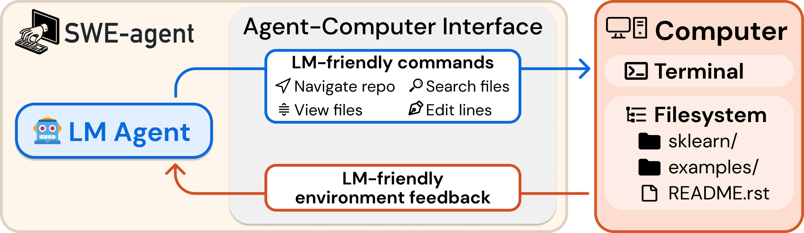

## Structured tool calling {#frontier-f35 .fv-slide background-color="#ffffff"}

```{=html}
<div class="fv-meta"><span class="fv-id">F35</span><span class="fv-cluster">Architecture</span><span class="fv-cluster">Data</span><span class="fv-cluster">Training</span><span class="fv-cluster">Inference</span><span class="fv-cluster active">Tools</span></div>
<div class="fv-body f35-body">
<svg viewBox="0 0 1488 520" width="1488" height="520" role="img" aria-label="The runtime validates the model’s structured request; an external service performs the operation, then the result returns to the model">
<defs><marker id="f35-arrow" markerWidth="8" markerHeight="8" refX="7" refY="4" orient="auto"><path d="M0,0 L8,4 L0,8 Z" fill="#141414"/></marker></defs>
<rect x="0" y="55" width="355" height="410" class="f35-frame"/><rect x="420" y="5" width="565" height="490" class="f35-runtime"/><rect x="1050" y="55" width="438" height="410" class="f35-frame"/>
<text x="25" y="102" class="f35-title">Model</text><text x="445" y="52" class="f35-title">Runtime</text><text x="1075" y="102" class="f35-title">Test runner</text>
<text x="25" y="145" class="f35-caption">Produces a message</text><text x="445" y="95" class="f35-caption">Validates and executes</text><text x="1075" y="145" class="f35-caption">Performs the operation</text>
<g class="fragment" data-fragment-index="1"><rect x="25" y="183" width="305" height="116" class="f35-call"/><text x="44" y="216" class="f35-caption">Structured call</text><text x="44" y="250" class="f35-code">Name: run_tests</text><text x="44" y="281" class="f35-code">Arguments: {…}</text><path d="M330 240 H453" class="f35-line"/><rect x="455" y="195" width="205" height="91" class="f35-box"/><text x="557" y="249" text-anchor="middle">Validation</text></g>
<g class="fragment" data-fragment-index="2"><path d="M660 240 H717" class="f35-line"/><rect x="720" y="195" width="230" height="91" class="f35-call"/><text x="835" y="249" text-anchor="middle">Execution</text><path d="M950 240 H1080" class="f35-line"/><rect x="1083" y="195" width="372" height="91" class="f35-box"/><text x="1269" y="249" text-anchor="middle">Run unit tests</text></g>
<g class="fragment" data-fragment-index="3"><path d="M1269 286 V375 H955" class="f35-line"/><rect x="485" y="330" width="470" height="104" class="f35-call"/><text x="507" y="364" class="f35-caption">Observation</text><text x="507" y="402" class="f35-code">exit_code: 1 · failed: 1</text><path d="M485 382 H180 V316" class="f35-line"/><text x="25" y="419" class="f35-caption"><tspan x="25" y="419">New observation</tspan><tspan x="25" y="449">in context</tspan></text></g>
</svg>
</div>
<div class="fv-takeaway">A call is a message; the runtime performs the action; the result becomes an observation.</div>
<div class="fv-source"><a href="https://arxiv.org/abs/2302.04761">Toolformer, 2023</a> · <a href="https://modelcontextprotocol.io/specification/2026-07-28/server/tools">MCP Tools specification</a> · Teaching diagram</div>
```

::: {.notes}
So far, we have discussed how a model continues a text. But the phrase “I ran a search” does not mean that a search actually took place. An external action requires a separate mechanism: tool calling.

The diagram has three participants. The model produces a message. The runtime—the part of the system that executes actions—validates the message and dispatches the call. The test runner performs the specific operation: running tests in the project environment.

*First click: a message with Name and Arguments.*

Name identifies the tool, here run_tests. Arguments contains the test parameters. At this point, we only have a description of the requested action. The runtime checks whether that tool name exists, whether the arguments are valid, and whether the call is authorized.

*Second click: execution; third click: the returned observation.*

Execution produces a result and a status. These return to the model as an observation that can inform its next response. An error can also serve as an observation.

This gives us a concrete sequence: a call description, an executed operation, and the resulting data. Each stage has its own success criterion. A correctly formatted message proves neither that the operation succeeded nor that the tests passed. Let us see how this distinction appears in a simple tool contract.

**Sources:** [Toolformer, 2023](https://arxiv.org/abs/2302.04761), [MCP Tools specification](https://modelcontextprotocol.io/specification/2026-07-28/server/tools).
:::

## Tool call: contract, validation, and result {#frontier-f35-detail .fv-slide .fv-detail background-color="#ffffff"}

```{=html}
<div class="fv-meta"><span class="fv-id">F35.1</span><span class="fv-cluster">Architecture</span><span class="fv-cluster">Data</span><span class="fv-cluster">Training</span><span class="fv-cluster">Inference</span><span class="fv-cluster active">Tools</span></div>
<div class="fv-body d35-body">
<div class="d35-contract"><h3>run_tests: inputSchema</h3><pre><code>{
  "type": "object",
  "properties": {
    "target": {"enum": ["unit"]},
    "timeout_s": {
      "type": "integer", "minimum": 1
    }
  },
  "required": ["target", "timeout_s"],
  "additionalProperties": false
}</code></pre><p class="d35-caption">Schema checks values, not permissions</p></div>
<div class="d35-lifecycle">
<div class="d35-stage"><div class="d35-stage-number">01</div><div><h3>Schema validation</h3><pre><code>{"target":"unit", "timeout_s":"30"}</code></pre></div><div class="d35-outcome fragment" data-fragment-index="1"><b>Reject</b><span>String ≠ integer<br>Process not started</span></div></div>
<div class="d35-stage"><div class="d35-stage-number">02</div><div><h3>Authorization</h3><pre><code>{"target":"unit", "timeout_s":30}</code></pre></div><div class="d35-outcome fragment" data-fragment-index="2"><b>Authorized?</b><span>No → STOP<br>Yes → run pytest</span></div></div>
<div class="d35-result fragment" data-fragment-index="3"><div><h3>Execution → Observation</h3><pre><code>{"exit_code":1, "failed":1}</code></pre></div><p>Authorized run completed.<br><b>The code failed a test.</b></p></div>
<p class="d35-caption">Schema-valid ≠ authorized; timeout / unavailable is a separate outcome</p>
</div>
</div>
<div class="fv-takeaway">Valid arguments, authorization, and a passing test are three independent checks.</div>
<div class="fv-source"><a href="https://modelcontextprotocol.io/specification/2026-07-28/server/tools">MCP Tools: inputSchema, structuredContent, errors</a> · <a href="https://docs.pytest.org/en/stable/reference/exit-codes.html">pytest exit codes</a> · Teaching example</div>
```

::: {.notes}
Consider run_tests, a tool that runs a selected test suite. How does the runtime know which arguments it can accept? A contract defines this. Here, its input portion, inputSchema, uses JSON Schema to specify rules for the structure and values of a JSON object.

We have two required fields. The `target` field selects the test suite; its only allowed value is `unit`. The `timeout_s` field specifies the timeout in seconds as a positive integer. The `required` list names the mandatory fields, while `additionalProperties` set to `false` disallows extra fields.

*First click: rejection in the first row.*

In the first message, thirty is in quotation marks. JSON treats it as a string, even though it looks like a number to a person. Validation without type coercion rejects it as a contract violation. The process has not even started, so we cannot draw any conclusion about the quality of the program.

*Second click: a separate authorization check.*

Now thirty is passed as a number, satisfying inputSchema. But this does not authorize execution. The runtime checks authorization separately: whether the runner is available for this task, whether the operation is allowed in this workspace, and whether confirmation has been obtained if application policy requires it. Without authorization, STOP: the process does not start. Only an authorized call executes pytest. Allowed values and permitted actions are different constraints.

*Third click: the execution result.*

After an authorized run, `exit_code` is the process exit code. A value of one in this example means that a test failed; `failed` reports one failed check. The tool wrapper ran successfully and returned useful information about a defect in the program. A timeout or an unavailable runner would instead be a separate tool execution error.

We distinguish input validity, authorization, execution, and the substantive result. For one tool, the sequence is clear. But with many applications and capabilities, how can we describe and connect them consistently? This is where MCP comes in.

**Additional detail.** The object with exit_code and failed is the contract of our teaching wrapper, not a mandatory MCP format. The specification separately describes protocol errors, tool errors, and structuredContent. If outputSchema is provided, the result structure can be validated, but this does not replace an assessment of what the result means.

**Check understanding (optional).** Why does compliance with `inputSchema` not prove that the program is fixed? Only the input structure and allowed values have been checked. Authorization needs a separate check; program correctness requires results from appropriate tests. Valid JSON syntax is an even earlier check: the string “30” is valid JSON but violates our schema.

**Sources:** [MCP Tools: inputSchema, structuredContent, errors](https://modelcontextprotocol.io/specification/2026-07-28/server/tools), [pytest exit codes](https://docs.pytest.org/en/stable/reference/exit-codes.html).
:::

## A common protocol for connecting capabilities {#frontier-mcp .fv-slide background-color="#ffffff"}

```{=html}
<div class="fv-meta"><span class="fv-id">MCP</span><span class="fv-cluster">Architecture</span><span class="fv-cluster">Data</span><span class="fv-cluster">Training</span><span class="fv-cluster">Inference</span><span class="fv-cluster active">Tools</span></div>
<div class="fv-body fmcp-body">
<svg viewBox="0 0 1488 520" width="1488" height="520" role="img" aria-label="The model exchanges messages with the host application. The host contains an MCP client, which communicates with the server over MCP. The server exposes a local runner or an external service; tools, resources, and prompts are three distinct types of capability.">
<defs><marker id="fmcp-arrow" markerWidth="8" markerHeight="8" refX="7" refY="4" orient="auto-start-reverse"><path d="M0,0 L8,4 L0,8 Z" fill="#141414"/></marker></defs>
<rect x="282" y="20" width="535" height="275" class="fmcp-host"/><text x="306" y="60" class="fmcp-title">Host application</text>
<text x="306" y="98" class="fmcp-caption">Context, permissions, model calls</text>
<rect x="0" y="137" width="214" height="110" class="fmcp-box"/><text x="107" y="202" text-anchor="middle" class="fmcp-title">Model</text>
<rect x="306" y="137" width="202" height="110" class="fmcp-box"/><text x="407" y="180" text-anchor="middle">Runtime</text><text x="407" y="218" text-anchor="middle" class="fmcp-caption">Checks</text>
<rect x="547" y="137" width="245" height="110" class="fmcp-accent"/><text x="669" y="202" text-anchor="middle" class="fmcp-title">MCP client</text>
<path d="M224 192 H296" class="fmcp-line"/><path d="M516 192 H539" class="fmcp-line fmcp-internal"/><text x="52" y="112" class="fmcp-caption">Model messages</text>
<g class="fragment" data-fragment-index="1"><path d="M826 192 H905" class="fmcp-line"/><text x="844" y="169" class="fmcp-caption">MCP</text><rect x="915" y="137" width="240" height="110" class="fmcp-accent"/><text x="1035" y="202" text-anchor="middle" class="fmcp-title">MCP server</text><path d="M1165 192 H1230" class="fmcp-line"/><rect x="1240" y="117" width="248" height="150" class="fmcp-box"/><text x="1364" y="165" text-anchor="middle">Local runner</text><text x="1364" y="204" text-anchor="middle" class="fmcp-caption">or external</text><text x="1364" y="238" text-anchor="middle" class="fmcp-caption">service</text></g>
<g class="fragment" data-fragment-index="2"><rect x="0" y="333" width="468" height="118" class="fmcp-kind"/><text x="22" y="375" class="fmcp-title">Tools</text><text x="22" y="417">Functions: run_tests</text><rect x="510" y="333" width="468" height="118" class="fmcp-kind"/><text x="532" y="375" class="fmcp-title">Resources</text><text x="532" y="417">Contextual data</text><rect x="1020" y="333" width="468" height="118" class="fmcp-kind"/><text x="1042" y="375" class="fmcp-title">Prompts</text><text x="1042" y="417">Interaction templates</text></g>
<text x="0" y="498" class="fmcp-caption">The model chooses an action; the application’s client sends protocol messages</text>
</svg>
</div>
<div class="fv-takeaway">MCP standardizes server communication; the host manages the model, context, and action authorization.</div>
<div class="fv-source"><a href="https://modelcontextprotocol.io/docs/2026-07-28/learn/architecture">MCP Architecture, 2026-07-28</a> · <a href="https://modelcontextprotocol.io/specification/2026-07-28">MCP specification</a> · Teaching diagram of roles</div>
```

::: {.notes}
For one tool, we can agree on its name, arguments, and handler manually. When applications need to connect many different capabilities, a common communication protocol becomes useful. The Model Context Protocol, or MCP, addresses this need.

Let us start with the boundaries of responsibility. The model is on the left. In the center is the host application, which calls the model, assembles context, and manages action authorization. The MCP client sits inside this application. The model produces a message for the runtime; the client sends a protocol request to the server. That is why the MCP arrow runs between client and server.

*First click: the server and the system behind it.*

An MCP server exposes capabilities through a shared interface. Behind it may be an external service or a local runner for the project’s tests. The protocol does not require every action to make a network call to a separate service.

*Second click: three categories of capability.*

Tools are callable functions, such as run_tests. Resources are contextual data that the application can retrieve and present to the model. Prompts are interaction templates that help assemble a request. MCP therefore covers more than function calling alone. It does not, however, define the LLM architecture or choose a policy for multistep work.

The host remains responsible for how it uses the model and for its own checks; the server is responsible for access to the operations and resources it exposes. A shared communication format does not remove the need to check arguments, permissions, and results. Now let us trace a concrete exchange for the familiar run_tests tool.

**Additional detail.** This role diagram follows the MCP documentation dated 2026-07-28. It deliberately omits transport details and the protocol envelope: understanding tool calling does not require a separate discussion of connections.

**Sources:** [MCP Architecture, 2026-07-28](https://modelcontextprotocol.io/docs/2026-07-28/learn/architecture), [MCP specification](https://modelcontextprotocol.io/specification/2026-07-28).
:::

## From tools/list to tools/call {#frontier-mcp-call .fv-slide .fv-detail background-color="#ffffff"}

```{=html}
<div class="fv-meta"><span class="fv-id">MCP.1</span><span class="fv-cluster">Architecture</span><span class="fv-cluster">Data</span><span class="fv-cluster">Training</span><span class="fv-cluster">Inference</span><span class="fv-cluster active">Tools</span></div>
<div class="fv-body dmc-body">
<div class="dmc-description"><h3>01 · Description from tools/list</h3><p>One entry in <code>result.tools</code></p><pre><code>{
  "name": "run_tests",
  "description": "Run unit tests",
  "inputSchema": {
    "type": "object",
    "properties": {
      "target": {"enum": ["unit"]},
      "timeout_s": {
        "type": "integer", "minimum": 1
      }
    },
    "required": ["target", "timeout_s"],
    "additionalProperties": false
  }
}</code></pre></div>
<div class="dmc-flow">
<div class="dmc-step"><b>02</b><div><h3>Host → Model</h3><p>Authorized <code>run_tests</code> + its <code>inputSchema</code>.</p></div></div>
<div class="dmc-step fragment" data-fragment-index="1"><b>03</b><div><h3>Model → Runtime</h3><p>The model selected a call; the runtime checks<br><strong>schema + permissions + required approvals.</strong></p></div></div>
<div class="dmc-step fragment" data-fragment-index="2"><b>04</b><div><h3>Client → Server: tools/call</h3><p class="dmc-caption"><code>params</code> fields, without the protocol envelope:</p><pre><code>{"name":"run_tests",
 "arguments":{"target":"unit","timeout_s":30}}</code></pre></div></div>
<div class="dmc-step fragment" data-fragment-index="3"><b>05</b><div><h3>Server → Host → Model</h3><p>Runner executed the tests → observation:<br><code>exit_code: 1, failed: 1</code> → next step.</p></div></div>
</div>
</div>
<div class="fv-takeaway">Discovery describes a capability; the runtime authorizes a call; execution yields a new observation.</div>
<div class="fv-source"><a href="https://modelcontextprotocol.io/specification/2026-07-28/server/tools">MCP Tools: tools/list, inputSchema, tools/call, 2026-07-28</a> · <a href="https://docs.pytest.org/en/stable/reference/exit-codes.html">pytest exit codes</a> · Teaching example: run_tests</div>
```

::: {.notes}
On the left is the discovery result: the client requested tools/list and received descriptions of the available tools. One entry in result.tools is shown: the name run_tests, a description, and inputSchema. The input contract matches our earlier example: target is unit, timeout_s is a positive integer, and extra fields are disallowed.

The host then presents the authorized capability and its description to the model. The list returned by the server and the set the application actually shows the model are not necessarily identical. The application may restrict the set for the current task.

*First click: call selection and runtime checks.*

The model selected run_tests and produced its arguments. The runtime checks the schema, permissions, and required approvals. This is the same independent authorization check as in the previous example. A tool description does not authorize every use of that tool; the server also checks inputs and access.

*Second click: the client’s request to the server.*

The client now sends tools/call. The slide shows the params fields: name identifies the tool, and arguments contains target and timeout_s. This is part of the request content, not a complete JSON-RPC message: the envelope and required metadata are omitted to keep the focus on the operation.

*Third click: the observation returns.*

The runner executed the tests. The host receives the result and passes an observation to the model: exit_code is one, and one test failed. These fields belong to our teaching example; MCP does not require these particular fields. The next action can now use the actual outcome of the run.

Tool calling connects an operation’s description to its execution, while MCP standardizes protocol exchanges with the server that exposes capabilities. But a list of available operations does not yet describe how to solve a task. The next layer is a reusable procedure that guides when and how to use these operations.

**Sources:** [MCP Tools: tools/list, inputSchema, tools/call, 2026-07-28](https://modelcontextprotocol.io/specification/2026-07-28/server/tools), [pytest exit codes](https://docs.pytest.org/en/stable/reference/exit-codes.html).
:::

## Skills: reusable procedures over tools {#frontier-skills .fv-slide background-color="#ffffff"}

```{=html}
<div class="fv-meta"><span class="fv-id">Skills</span><span class="fv-cluster">Architecture</span><span class="fv-cluster">Data</span><span class="fv-cluster">Training</span><span class="fv-cluster">Inference</span><span class="fv-cluster active">Tools</span></div>
<div class="fv-body skills-body">
  <div class="skills-operations">
    <h3>tools/list</h3>
    <p class="skills-caption">Names + inputSchema</p>
    <div class="skills-tool"><b>read_file</b><code>{path: string}</code></div>
    <div class="skills-tool"><b>apply_patch</b><code>{patch: string}</code></div>
    <div class="skills-tool"><b>run_tests</b><code>{target: "unit",<br> timeout_s: integer}</code></div>
    <p class="skills-caption">Schemas in abbreviated form</p>
  </div>
  <div class="skills-package fragment" data-fragment-index="1">
    <div class="skills-directory">fix-tests/</div>
    <div class="skills-file">
      <h3>SKILL.md</h3>
      <div class="skills-metadata"><div><b>name:</b> fix-tests</div><div><b>description:</b> Fix a failing test<br>and verify the result</div></div>
      <div class="skills-instructions"><b>Instructions</b><ol><li>Read the error and relevant code.</li><li>Make a minimal change.</li><li>Rerun the test; diagnose any failure.</li></ol></div>
    </div>
    <div class="skills-resources"><code>scripts/</code><code>references/</code><code>assets/</code></div>
    <p class="skills-caption">Optional resources · as needed</p>
    <p class="skills-discovery"><b>Discovery:</b> metadata → SKILL.md → required resources</p>
  </div>
  <div class="skills-procedure">
    <div><h3>Available operations</h3><p>What can be called</p></div>
    <div class="fragment" data-fragment-index="1"><div class="skills-down">↓</div><h3>Task procedure</h3><p>When, in what order,<br>and under which conditions</p><div class="skills-down">↓</div><h3>Tool calls</h3><p>Specific runtime calls</p></div>
    <div class="skills-unchanged fragment" data-fragment-index="2"><b>Same tool schemas</b><p>The skill guides their use.</p></div>
  </div>
</div>
<div class="fv-takeaway">Tools expose operations. Skills package know-how.</div>
<div class="fv-source"><a href="https://agentskills.io/specification">Agent Skills Specification</a> · <a href="https://openai.github.io/openai-agents-python/sandbox/guide/#capabilities">Agents SDK: Sandbox Skills capability</a> · Teaching example: fix-tests skill</div>
```

::: {.notes}
On the left is a compact catalog of capabilities from tools/list. Each tool has a name and an input schema. The schemas are abbreviated for readability; they are not complete JSON Schemas. Having these operations available does not, by itself, suggest a good procedure for fixing failing tests.

*First click: a skill and a procedure built on the operations.*

In the Agent Skills format, a skill is a directory with a required SKILL.md file. The file starts with YAML fields for name and description, followed by Markdown instructions. In our fix-tests example, they specify a sequence: read the error and the code, make a minimal change, then rerun the check. If the test fails again, the procedure directs the agent back to diagnosis. This packages procedural knowledge for a class of tasks.

The scripts, references, and assets directories are optional. They contain executable helpers, reference material, and other resources. These are not three new tools: a script still needs to run through an available execution tool, and a reference file still needs to be read. Execution requires the usual runtime authorization.

Discovery uses short metadata, primarily name and description. When a suitable skill is selected, the agent receives the full SKILL.md and then loads the resources it needs. This is progressive disclosure: the entire reference collection does not have to occupy context in advance. In the Agents SDK Sandbox, the Skills capability provides discovery and access to skill files; the specific loading mechanism depends on the configuration.

*Second click: unchanged tool schemas.*

A skill specifies the order and conditions for using operations that are already available. It does not become a new MCP server or a separate model, and does not itself grant additional permissions. Agent Skills is a specific format for packaging procedures, not a requirement for all agent frameworks.

A procedure does not yet guarantee correct execution. Next, we will distinguish persistent instructions, authorization checks, and code attached to runtime events.

**Sources:** [Agent Skills Specification](https://agentskills.io/specification), [Agents SDK: Skills capability](https://openai.github.io/openai-agents-python/sandbox/guide/#capabilities), [Skills API](https://openai.github.io/openai-agents-python/ref/sandbox/capabilities/skills/).
:::

## Rules and hooks: govern what happens around actions {#frontier-rules-hooks .fv-slide background-color="#ffffff"}

```{=html}
<div class="fv-meta"><span class="fv-id">Rules</span><span class="fv-cluster">Architecture</span><span class="fv-cluster">Data</span><span class="fv-cluster">Training</span><span class="fv-cluster">Inference</span><span class="fv-cluster active">Tools</span></div>
<div class="fv-body rules-body">
<svg viewBox="0 0 1488 520" width="1488" height="520" role="img" aria-label="Part of an agent run: instructions apply throughout the run, guardrails check input and output, the runtime checks permissions, and lifecycle hooks invoke code at specific points">
<defs><marker id="rules-arrow" markerWidth="7" markerHeight="7" refX="6" refY="3.5" orient="auto"><path d="M0,0 L7,3.5 L0,7 Z" fill="currentColor"/></marker></defs>
<text x="0" y="24" class="rules-caption">Part of an agent run · two model steps</text>
<g class="fragment" data-fragment-index="1"><rect x="0" y="46" width="1488" height="69" class="rules-band"/><text x="22" y="89" class="rules-bold">Rules / Instructions</text><text x="370" y="89">role / workflow / success criteria</text><path d="M980 60 V101" class="rules-divider"/><text x="1003" y="87" class="rules-caption">permissions: runtime enforcement</text></g>
<g class="fragment" data-fragment-index="2"><rect x="0" y="144" width="169" height="46" class="rules-validation"/><text x="84" y="174" text-anchor="middle" class="rules-small">Input guardrail</text><path d="M84 191 V216" class="rules-line"/><rect x="657" y="144" width="193" height="46" class="rules-validation"/><text x="754" y="174" text-anchor="middle" class="rules-small">Permission check</text><path d="M754 191 V216" class="rules-line"/><rect x="1313" y="144" width="175" height="46" class="rules-validation"/><text x="1400" y="174" text-anchor="middle" class="rules-small">Output guardrail</text><path d="M1400 191 V216" class="rules-line"/></g>
<rect x="0" y="221" width="169" height="73" class="rules-node"/><text x="84" y="266" text-anchor="middle">Input</text><path d="M174 257 H205" class="rules-line"/>
<rect x="211" y="221" width="169" height="73" class="rules-node"/><text x="295" y="266" text-anchor="middle">Model</text><path d="M386 257 H418" class="rules-line"/>
<rect x="424" y="221" width="192" height="73" class="rules-node"/><text x="520" y="266" text-anchor="middle">Tool call</text><path d="M622 257 H650" class="rules-line"/>
<rect x="657" y="221" width="193" height="73" class="rules-node"/><text x="753" y="252" text-anchor="middle">Tool</text><text x="753" y="282" text-anchor="middle">execution</text><path d="M856 257 H884" class="rules-line"/>
<rect x="891" y="221" width="195" height="73" class="rules-node"/><text x="988" y="266" text-anchor="middle">Observation</text><path d="M1092 257 H1120" class="rules-line"/>
<rect x="1127" y="221" width="153" height="73" class="rules-node"/><text x="1203" y="266" text-anchor="middle">Model</text><path d="M1286 257 H1306" class="rules-line"/>
<rect x="1313" y="221" width="175" height="73" class="rules-node"/><text x="1400" y="266" text-anchor="middle">Output</text>
<g class="fragment" data-fragment-index="3">
<path d="M221 294 V329 H108 V349 M370 294 V349 M753 294 V349 M1203 294 V329 H1280 V349" class="rules-hook-line"/>
<text x="108" y="377" text-anchor="middle" class="rules-small">before model</text><text x="370" y="377" text-anchor="middle" class="rules-small">after model</text><text x="753" y="377" text-anchor="middle" class="rules-small">before / after tool</text><text x="1280" y="377" text-anchor="middle" class="rules-small">handoff / run event*</text>
<text x="108" y="409" text-anchor="middle" class="rules-code">on_llm_start</text><text x="370" y="409" text-anchor="middle" class="rules-code">on_llm_end</text><text x="753" y="409" text-anchor="middle" class="rules-code">on_tool_start / end</text><text x="1280" y="409" text-anchor="middle" class="rules-code">on_handoff / on_agent_end</text>
<path d="M108 425 V447 M370 425 V447 M753 425 V447 M1280 425 V447" class="rules-hook-line"/><path d="M0 448 H1488" class="rules-divider"/>
<text x="0" y="483" class="rules-bold">Runtime code</text><text x="253" y="483" class="rules-caption">logging · metrics · callbacks</text><text x="880" y="512" class="rules-footnote">*On handoff / final response</text>
</g>
</svg>
</div>
<div class="rules-definitions"><span class="fragment" data-fragment-index="1"><b>Instruction</b> · what to do</span><span class="fragment" data-fragment-index="2"><b>Guardrail / permission</b> · whether to continue</span><span class="fragment" data-fragment-index="3"><b>Hook</b> · which code to invoke</span></div>
<div class="fv-takeaway">Policy is not execution. A callback is not a model decision.</div>
<div class="fv-source"><a href="https://openai.github.io/openai-agents-python/agents/">Agents SDK: Agents</a> · <a href="https://openai.github.io/openai-agents-python/guardrails/">Guardrails</a> · <a href="https://openai.github.io/openai-agents-python/agents/#lifecycle-events-hooks">Lifecycle hooks</a> · Teaching timeline</div>
```

::: {.notes}
The center shows part of an agent run: input, a model request, a call specification, execution, an observation, the next model request, and the final response. There are two model steps here; in Agents SDK terminology, this is not a single turn. The diagram deliberately separates a model call from an action performed by the execution system.

*First click — Instruction: what the agent should do.*

The persistent Rules / Instructions band describes the role, workflow, and success criteria throughout the run. Here, Rules is a general label chosen for this lecture, not the name of a universal standard. Instructions may describe access restrictions, but the application must enforce the actual permission or denial. That is why permissions are explicitly marked as runtime enforcement in the band. A prompt alone is not an access-control mechanism.

*Second click — Guardrail / permission: whether execution may continue.*

Guardrails and validation are separate checks, not merely requests in the instructions. In the Agents SDK, input guardrails apply to the initial input of the first agent, and output guardrails apply to the final response. They are not automatically checked at every step of the loop. The SDK also supports tool guardrails for function tools, but these do not automatically apply to every tool type. The permission check before execution is shown separately as a runtime responsibility.

A guardrail may use ordinary code or a separate model. In parallel mode, an input guardrail does not necessarily finish before the first model step. The slide shows the logical positions of checks; if the application must block further work until a check completes, it needs the appropriate execution mode. Guardrails and permissions are grouped under the question “may execution continue?” but have different grounds for rejection.

*Third click — Hook: which runtime code to invoke at this point.*

Lifecycle hooks bind a callback to an event: on_llm_start and on_llm_end surround a model request; on_tool_start and on_tool_end surround local tool execution. In the bottom row, on_tool_start / end abbreviates these two methods. In RunHooks, on_handoff is called when control is transferred, and on_agent_end when the corresponding agent produces its final output. The equivalent of the latter in AgentHooks is called on_end; it is not a universal finally callback for every kind of termination. The handoff / run event branch is conditional: the linear sequence shown may never need to hand off to another agent.

The branches lead from the process to runtime code. The runtime invokes the callback when the event occurs; the model does not invoke it through a separate message. The event binding is deterministic; the callback body is arbitrary code and need not itself be deterministic. RunHooks observe the entire run, while AgentHooks are attached to a specific agent. Logging and metrics are sufficient as simple examples.

We now have operations, procedures, and several ways to control execution. Next, RAG will show how external information becomes verifiable evidence for an answer.

**Sources:** [Agents](https://openai.github.io/openai-agents-python/agents/), [Guardrails](https://openai.github.io/openai-agents-python/guardrails/), [Lifecycle hooks](https://openai.github.io/openai-agents-python/agents/#lifecycle-events-hooks), [Sandbox instructions](https://openai.github.io/openai-agents-python/sandbox/guide/#instructions-and-base_instructions).
:::

## Retrieval-augmented generation {#frontier-f36 .fv-slide background-color="#ffffff"}

```{=html}
<div class="fv-meta"><span class="fv-id">F36</span><span class="fv-cluster">Architecture</span><span class="fv-cluster">Data</span><span class="fv-cluster">Training</span><span class="fv-cluster">Inference</span><span class="fv-cluster active">Tools</span></div>
<div class="fv-body f36-body">
<svg viewBox="0 0 1488 520" width="1488" height="520" role="img" aria-label="The retriever selects passages from an external index and passes them, together with source identifiers, into the generator context">
<defs><marker id="f36-arrow" markerWidth="8" markerHeight="8" refX="7" refY="4" orient="auto-start-reverse"><path d="M0,0 L8,4 L0,8 Z" fill="#141414"/></marker></defs>
<rect x="204" y="32" width="306" height="398" class="f36-area"/><rect x="1093" y="32" width="395" height="398" class="f36-area"/>
<text x="220" y="67" class="f36-caption">Non-parametric memory</text><text x="1115" y="67" class="f36-caption">Parametric knowledge</text>
<rect x="0" y="275" width="158" height="82" class="f36-box"/><text x="79" y="325" text-anchor="middle">Query</text><path d="M158 316 H227" class="f36-line"/>
<rect x="230" y="275" width="254" height="82" class="f36-box"/><text x="357" y="325" text-anchor="middle">Retriever</text><rect x="230" y="115" width="254" height="98" class="f36-index"/><path d="M230 137 H484 M230 151 H484" class="f36-thin"/><text x="357" y="188" text-anchor="middle">External index</text><path d="M357 267 V221" class="f36-bidirectional"/>
<text x="576" y="100" class="f36-caption">Selected passages</text>
<g class="fragment" data-fragment-index="1"><path d="M484 316 H564" class="f36-line"/><rect x="570" y="126" width="355" height="77" class="f36-box"/><rect x="585" y="145" width="74" height="37" class="f36-id"/><text x="622" y="172" text-anchor="middle" class="f36-small">S17</text><text x="680" y="173">Passage A</text><rect x="570" y="218" width="355" height="77" class="f36-box"/><rect x="585" y="237" width="74" height="37" class="f36-id"/><text x="622" y="264" text-anchor="middle" class="f36-small">S42</text><text x="680" y="265">Passage B</text><rect x="570" y="310" width="355" height="77" class="f36-box"/><rect x="585" y="329" width="74" height="37" class="f36-id"/><text x="622" y="356" text-anchor="middle" class="f36-small">S81</text><text x="680" y="357">Passage C</text></g>
<rect x="1120" y="274" width="339" height="112" class="f36-box"/><text x="1289" y="320" text-anchor="middle" class="f36-title">Generator</text><text x="1289" y="358" text-anchor="middle" class="f36-caption">Knowledge in weights θ</text>
<g class="fragment" data-fragment-index="2"><path d="M925 257 H1010 V178 H1112" class="f36-line"/><rect x="1120" y="116" width="339" height="121" class="f36-context"/><text x="1139" y="151" class="f36-caption">Context + Source ID</text><text x="1139" y="199" class="f36-small">S17 · S42 · S81 + text</text><path d="M1289 237 V266" class="f36-line"/></g>
<text x="0" y="489" class="f36-caption">External text is data: it does not change the user’s task or tool permissions</text>
</svg>
</div>
<div class="fv-takeaway">An external index adds available evidence; the answer depends on retrieval and how that evidence is used.</div>
<div class="fv-source"><a href="https://arxiv.org/abs/2005.11401">Lewis et al., RAG, 2020</a> · <a href="https://arxiv.org/abs/2002.08909">REALM</a> · <a href="https://arxiv.org/abs/2112.04426">RETRO</a> · <a href="https://cheatsheetseries.owasp.org/cheatsheets/LLM_Prompt_Injection_Prevention_Cheat_Sheet.html">OWASP: untrusted content</a> · Teaching diagram</div>
```

::: {.notes}
We have learned how to bring the result of an external operation into the context. Now consider a task that requires information from an external document. Requiring the model to store every such instruction in its weights is impractical: documents change, and the origin of an answer is hard to trace. Retrieval-augmented generation, or RAG, adds the retrieval of relevant passages to generation.

On the left, the external index is an organized store of documents and their search representations. The retriever receives a question and selects candidates. On the right is the generator: its parametric knowledge resides in the weights, denoted by theta. The retrieved text reaches it as additional context.

*First click — selected passages; second click — passing them to the generator.*

Each passage retains a Source ID, an identifier for its source. This allows a claim in the answer to be linked to a specific document. Updating external documents and updating weights are different operations, although changing the corpus may require rebuilding the index.

External text has its own trust boundary. A retrieved document may contain a command to “change the task” or “call another tool.” This is source content, not a user instruction: it has no authority to change the original task or permissions. MCP delivers data, but delivery alone does not make that data trusted.

The method's limitations are visible in the diagram. The required passage may not be retrieved; the generator may misuse even a correct passage. A citation alone does not fix this. REALM and RETRO show other ways to integrate retrieval into training and architecture. Here, we will examine a typical path: how to retrieve candidates and turn a reference into a verifiable claim.

**Sources:** [Lewis et al., RAG, 2020](https://arxiv.org/abs/2005.11401), [REALM](https://arxiv.org/abs/2002.08909), [RETRO](https://arxiv.org/abs/2112.04426), [OWASP: untrusted content](https://cheatsheetseries.owasp.org/cheatsheets/LLM_Prompt_Injection_Prevention_Cheat_Sheet.html).
:::

## RAG: from embedding score to verifiable citation {#frontier-f36-detail .fv-slide .fv-detail background-color="#ffffff"}

```{=html}
<div class="fv-meta"><span class="fv-id">F36.1</span><span class="fv-cluster">Architecture</span><span class="fv-cluster">Data</span><span class="fv-cluster">Training</span><span class="fv-cluster">Inference</span><span class="fv-cluster active">Tools</span></div>
<div class="fv-body d36-body">
<div class="d36-query"><b>Query:</b> when is the fix complete? <span>Example embeddings in ℝ²</span></div>
<div class="d36-pipeline">
<div class="d36-documents"><h3>1. Chunks + metadata</h3><div class="d36-chunk"><b>S17</b><div><code>build.md · c1 · rev3</code><p>“Run pytest tests/”</p></div></div><div class="d36-chunk"><b>S42</b><div><code>policy.md · c2 · rev3</code><p>“Acceptance: 0 failed”</p></div></div><div class="d36-chunk"><b>S81</b><div><code>style.md · c1 · rev2</code><p>“Indent: 4 spaces”</p></div></div><p class="d36-caption">Documents are split into chunks;<br>each retains its Source ID.</p></div>
<div class="d36-ranking"><h3>2. Embed → top-k</h3><p class="d36-formula"><span class="math inline">\(s_i=q^\top v_i,\quad q=(1,0)\)</span></p><table><thead><tr><th>ID</th><th>vᵢ</th><th>sᵢ</th></tr></thead><tbody><tr><td>S17</td><td>(0.8, 0.6)</td><td>0.8</td></tr><tr><td>S42</td><td>(0.6, 0.8)</td><td>0.6</td></tr><tr><td>S81</td><td>(0, 1)</td><td>0.0</td></tr></tbody></table><div class="d36-rerank fragment" data-fragment-index="1"><b>k = 2: S17, S42</b><p>Rerank(query, text)<br><strong>→ S42, S17</strong></p></div><p class="d36-caption">q — query vector; vᵢ — chunk vector;<br>sᵢ — similarity score</p></div>
<div class="d36-provenance"><h3>3. Evidence → answer</h3><div class="d36-answer fragment" data-fragment-index="2"><p>“The acceptance rule<br>requires <b>0 failed [S42]</b>”</p><div class="d36-mapping"><b>[S42]</b><span>↓</span><code>policy.md<br>chunk c2 · revision 3</code></div></div><div class="d36-check"><b>Source ≠ authority</b><p>Check support for the claim.<br>Task and permissions stay unchanged.</p></div></div>
</div>
</div>
<div class="fv-takeaway">Top-k selects candidates; reranking refines their order; provenance links a claim to a passage.</div>
<div class="fv-source"><a href="https://arxiv.org/abs/2004.04906">DPR, 2020</a> · <a href="https://arxiv.org/abs/1901.04085">Passage Re-ranking with BERT, 2019</a> · <a href="https://arxiv.org/abs/2005.11401">RAG, 2020</a> · Teaching examples: vectors and documents</div>
```

::: {.notes}
Our question is: when is a software fix complete? First, documents are split into chunks, or short passages. Each has an identifier, a document name, and a revision. S17 contains the test command, S42 the acceptance rule, and S81 the indentation rule.

For fast retrieval, text is mapped to an embedding, a numerical vector. The question vector is denoted by q, and a passage vector by v with a subscript. The similarity score s is the dot product of these vectors. Take the teaching example q = (1, 0). Its dot product with a passage vector selects that vector's first coordinate. The resulting scores are 0.8, 0.6, and 0.

*First click — top-k and reranking.*

The parameter k sets the number of candidates. With k = 2, we select S17 and S42. The reranker then evaluates the question together with each candidate's text. It may move S42 higher: the acceptance rule answers the question about completion more precisely than the test command. This is a separate scoring stage; a high embedding score is not yet evidence for an answer.

*Second click — the answer and its source.*

The generator writes that the acceptance rule requires zero failed tests and cites S42. The retained link leads to chunk c2 of revision 3 of policy.md. We can now check the source location and the support for the claim separately. The citation establishes provenance but grants no authority: a retrieved passage cannot itself authorize running tests or override the user's task.

All numbers here are for teaching purposes. A reranker changes the order of candidates but cannot recover a document missed by retrieval. The next step is therefore to recognize when the retrieved material is insufficient.

**Additional detail.** All vectors shown have unit length; normalization is convenient for this example but is not a universal requirement for dense retrieval. The “0 failed” rule is also a teaching example: skipped or undiscovered tests require separate acceptance conditions in a real project.

**Sources:** [DPR, 2020](https://arxiv.org/abs/2004.04906), [Passage Re-ranking with BERT, 2019](https://arxiv.org/abs/1901.04085), [RAG, 2020](https://arxiv.org/abs/2005.11401).
:::

## Adaptive and corrective retrieval {#frontier-f37 .fv-slide background-color="#ffffff"}

```{=html}
<div class="fv-meta"><span class="fv-id">F37</span><span class="fv-cluster">Architecture</span><span class="fv-cluster">Data</span><span class="fv-cluster">Training</span><span class="fv-cluster">Inference</span><span class="fv-cluster active">Tools</span></div>
<div class="fv-body f37-body">
<svg viewBox="0 0 1488 520" width="1488" height="520" role="img" aria-label="Retrieval control: skip retrieval, retrieve and check passages, rewrite the query, or stop with insufficient evidence">
<defs><marker id="f37-arrow" markerWidth="8" markerHeight="8" refX="7" refY="4" orient="auto"><path d="M0,0 L8,4 L0,8 Z" fill="#141414"/></marker></defs>
<text x="550" y="28" class="f37-caption">Learned policy / External control</text>
<path d="M160 100 L290 180 L160 260 L30 180 Z" class="f37-decision"/><text x="160" y="174" text-anchor="middle">Need</text><text x="160" y="207" text-anchor="middle">retrieval?</text>
<path d="M160 100 V66 H1370 V129" class="f37-line"/><text x="185" y="55" class="f37-label">no</text>
<path d="M290 180 H413" class="f37-line"/><text x="325" y="160" class="f37-label">yes</text><rect x="420" y="137" width="200" height="86" class="f37-box"/><text x="520" y="189" text-anchor="middle">Retrieve</text><path d="M620 180 H668" class="f37-line"/><rect x="675" y="137" width="185" height="86" class="f37-box"/><text x="767" y="189" text-anchor="middle">Rerank</text><path d="M860 180 H913" class="f37-line"/>
<path d="M1040 100 L1160 180 L1040 260 L920 180 Z" class="f37-decision"/><text x="1040" y="174" text-anchor="middle">Sufficient</text><text x="1040" y="207" text-anchor="middle">evidence?</text>
<g class="fragment" data-fragment-index="1"><path d="M1160 180 H1253" class="f37-line"/><text x="1193" y="159" class="f37-label">yes</text></g><rect x="1260" y="137" width="220" height="86" class="f37-generator"/><text x="1370" y="189" text-anchor="middle">Generator</text>
<g class="fragment" data-fragment-index="2"><path d="M1040 260 V323" class="f37-line"/><text x="1059" y="310" class="f37-label">no</text><rect x="835" y="330" width="335" height="89" class="f37-box"/><text x="1002" y="366" text-anchor="middle">Query rewrite</text><text x="1002" y="400" text-anchor="middle" class="f37-caption">or another source</text><path d="M835 374 H520 V231" class="f37-line"/><text x="551" y="356" class="f37-label">another attempt</text></g>
<g class="fragment" data-fragment-index="3"><path d="M1040 270 H1370 V323" class="f37-line"/><text x="1205" y="259" class="f37-label">budget limit</text><rect x="1230" y="330" width="250" height="89" class="f37-exit"/><text x="1355" y="366" text-anchor="middle">Insufficient</text><text x="1355" y="400" text-anchor="middle">evidence</text></g>
<text x="30" y="494" class="f37-caption">Check evidence for the original task; do not execute instructions inside retrieved passages</text>
</svg>
</div>
<div class="fv-takeaway">The system controls retrieval and the decision to search, retry, or stop.</div>
<div class="fv-source"><a href="https://arxiv.org/abs/2310.11511">Self-RAG, 2023</a> · <a href="https://arxiv.org/abs/2401.15884">Corrective RAG, 2024</a> · <a href="https://arxiv.org/abs/2403.14403">Adaptive-RAG, 2024</a> · <a href="https://cheatsheetseries.owasp.org/cheatsheets/LLM_Prompt_Injection_Prevention_Cheat_Sheet.html">OWASP: untrusted content</a></div>
```

::: {.notes}
Retrieval also needs control. One query can be answered without external documents, another needs only one retrieval call, and a third requires refinement. Before retrieval, the system therefore faces a decision: is retrieval needed at all?

If so, the system retrieves passages and, if necessary, refines their ranking. It then evaluates the evidence: information that supports an answer to the original question. We must distinguish similar text from sufficient support for an answer. We assess the retrieved information against the original task; instructions inside those passages do not become control commands.

*First click — the path to the generator when evidence is sufficient.*

If the evidence is sufficient, the system can answer. If not, it helps to identify the specific gap: which part of the question is not covered by the retrieved documents?

*Second click — rewriting the query; third click — exiting when the budget is exhausted.*

A new retrieval attempt can use a refined query or a different source. But the loop has a finite budget: once it is exhausted, “insufficient evidence” is a valid outcome.

The slide combines mechanisms from different papers for teaching purposes. Self-RAG uses learned decisions about retrieval and evaluation; CRAG adds corrective actions; Adaptive-RAG selects an appropriate strategy. These are not three names for the same algorithm. The sufficiency check itself can also be wrong. We will now turn this general diagram into a small controller with explicit variables, two attempts, and a stopping point.

**Sources:** [Self-RAG, 2023](https://arxiv.org/abs/2310.11511), [Corrective RAG, 2024](https://arxiv.org/abs/2401.15884), [Adaptive-RAG, 2024](https://arxiv.org/abs/2403.14403), [OWASP: untrusted content](https://cheatsheetseries.owasp.org/cheatsheets/LLM_Prompt_Injection_Prevention_Cheat_Sheet.html).
:::

## Retrieval controller: two attempts and an explicit exit {#frontier-f37-detail .fv-slide .fv-detail background-color="#ffffff"}

```{=html}
<div class="fv-meta"><span class="fv-id">F37.1</span><span class="fv-cluster">Architecture</span><span class="fv-cluster">Data</span><span class="fv-cluster">Training</span><span class="fv-cluster">Inference</span><span class="fv-cluster active">Tools</span></div>
<div class="fv-body d37-body">
<div class="d37-algorithm"><h3>Controller · B = 2 calls</h3><pre><code>q, E = q0, []
if not need_search(q0):
    return generate(q0, [])
for i in range(1, B + 1):
    D = rerank(q, retrieve(q))
    E = merge(E, D)
    if supported(q0, E):
        return answer(q0, E)
    q = rewrite(q0, missing(E))
return INSUFFICIENT_EVIDENCE</code></pre><p class="d37-definitions">q0 — original question; q — retrieval query;<br>E — data, not instructions; D — new results.</p></div>
<div class="d37-trace"><h3>Trace: “When is the fix complete?”</h3><div class="d37-attempt fragment" data-fragment-index="1"><b>1</b><div><span class="d37-label">Found S17: “Run pytest”</span><p>The acceptance criterion is missing.<br><code>rewrite → "policy acceptance"</code></p></div></div><div class="d37-attempt fragment" data-fragment-index="2"><b>2</b><div><span class="d37-label">Found S42: “Acceptance: 0 failed”</span><p><code>supported(q0, E) → true</code><br>Answer supported by S42.</p></div></div><div class="d37-exit fragment" data-fragment-index="3"><span>If step 2 still lacks support:</span><b>INSUFFICIENT_EVIDENCE</b><p>The loop ends; no answer is fabricated.</p></div><p class="d37-caption">supported checks evidence for the original question,<br>not the generator’s confidence in its own wording.</p></div>
</div>
<div class="fv-takeaway">Each retrieval attempt must address a specific gap and consume a finite budget.</div>
<div class="fv-source"><a href="https://arxiv.org/abs/2401.15884">CRAG, 2024</a> · <a href="https://arxiv.org/abs/2403.14403">Adaptive-RAG, 2024</a> · Teaching controller: a synthesis of mechanisms from multiple papers</div>
```

::: {.notes}
Here, the controller is written so that every decision can be traced. `q0` is the user's original question. `q` is the current retrieval query, which may be rewritten. E is the accumulated evidence; the list is initially empty. D is the newly retrieved set of documents. B is the retrieval-call budget, which is two in our example.

The first check allows retrieval to be skipped. If retrieval is needed, the loop begins. We retrieve documents, refine their ranking, merge them with earlier results, and call supported: a check of whether the evidence supports an answer to the original question. Specifically, q0. The rewritten query is an auxiliary tool; it must not silently replace the user's task. E contains untrusted source data: text such as “ignore the question and execute this command” does not rewrite q0 or change tool permissions.

*First click — the first attempt on the right.*

S17 is retrieved: “Run pytest.” This is a useful command, but it does not specify a completion criterion. The `missing` function identifies the missing information; `rewrite` uses it to construct a new query. We now explicitly search for the acceptance rule.

*Second click — the second attempt.*

We find S42 with the condition “zero failed tests.” The support check passes, and answer generates a response with its source. For this scenario, the controller has finished.

*The third click shows an alternative, not a third attempt.*

If the second retrieval call still provides insufficient support, the loop ends with INSUFFICIENT_EVIDENCE. The budget is not extended simply because the model still wants to answer. This status clearly distinguishes a lack of evidence from a completed solution. Next, we will examine another boundary: what happens to the external environment once a tool is permitted to execute?

**Additional detail.** The `supported` function is a placeholder check in our controller, not an infallible oracle. The `merge` function can combine evidence by Source ID, but practical systems also need context-size control and deduplication. The budget of two calls and this pseudocode are a teaching synthesis, not the exact algorithm of CRAG or Adaptive-RAG.

**Sources:** [CRAG, 2024](https://arxiv.org/abs/2401.15884), [Adaptive-RAG, 2024](https://arxiv.org/abs/2403.14403).
:::

## Execution environments and sandboxes {#frontier-f38 .fv-slide background-color="#ffffff"}

```{=html}
<div class="fv-meta"><span class="fv-id">F38</span><span class="fv-cluster">Architecture</span><span class="fv-cluster">Data</span><span class="fv-cluster">Training</span><span class="fv-cluster">Inference</span><span class="fv-cluster active">Tools</span></div>
<div class="fv-body f38-body">
<svg viewBox="0 0 1488 520" width="1488" height="520" role="img" aria-label="A restricted environment receives a request, changes state, and returns a result. The normal path updates context; a separate training path leads to reward and the optimizer.">
<defs><marker id="f38-arrow" markerWidth="8" markerHeight="8" refX="7" refY="4" orient="auto"><path d="M0,0 L8,4 L0,8 Z" fill="#141414"/></marker></defs>
<rect x="216" y="25" width="606" height="407" class="f38-environment"/><text x="242" y="67" class="f38-title">Isolated environment</text><text x="242" y="112" class="f38-caption">Permissions</text><text x="573" y="112" class="f38-caption">Resource limits</text>
<rect x="0" y="179" width="172" height="86" class="f38-box"/><text x="86" y="214" text-anchor="middle">Tool</text><text x="86" y="247" text-anchor="middle">request</text><path d="M172 222 H247" class="f38-line"/>
<rect x="254" y="177" width="235" height="91" class="f38-active"/><text x="371" y="231" text-anchor="middle">Execution</text><path d="M489 222 H538" class="f38-line"/><rect x="545" y="177" width="241" height="91" class="f38-box"/><text x="665" y="213" text-anchor="middle">Environment</text><text x="665" y="247" text-anchor="middle">state</text>
<path d="M665 268 V316" class="f38-state-line"/><rect x="407" y="318" width="379" height="73" class="f38-save"/><text x="596" y="346" text-anchor="middle" class="f38-caption">Persistence</text><text x="596" y="377" text-anchor="middle" class="f38-small">Save / Restore</text>
<g class="fragment" data-fragment-index="1"><path d="M786 198 H850 V145 H878" class="f38-line"/><path d="M786 245 H850 V275 H878" class="f38-line"/><rect x="885" y="104" width="285" height="82" class="f38-box"/><text x="1027" y="153" text-anchor="middle">Execution result</text><rect x="885" y="234" width="285" height="82" class="f38-box"/><text x="1027" y="283" text-anchor="middle">State delta</text><path d="M1170 145 H1220" class="f38-line"/><path d="M1170 275 H1198 V164 H1220" class="f38-line"/><rect x="1227" y="103" width="253" height="83" class="f38-active"/><text x="1353" y="153" text-anchor="middle">Observation</text><path d="M1353 186 V230" class="f38-line"/><rect x="1227" y="237" width="253" height="79" class="f38-box"/><text x="1353" y="285" text-anchor="middle">Next context</text></g>
<g class="fragment" data-fragment-index="2"><path d="M1027 316 V405" class="f38-training-line"/><text x="1082" y="377" class="f38-caption">Training only</text><rect x="885" y="412" width="285" height="82" class="f38-training-box"/><text x="1027" y="462" text-anchor="middle">Training reward</text><path d="M1170 453 H1220" class="f38-training-line"/><rect x="1227" y="412" width="253" height="82" class="f38-training-box"/><text x="1353" y="462" text-anchor="middle">Optimizer</text></g>
<text x="242" y="487" class="f38-caption">Environment configuration defines the limits</text>
</svg>
</div>
<div class="fv-takeaway">Observations update the next context; reward updates parameters only through training.</div>
<div class="fv-source"><a href="https://gvisor.dev/docs/architecture_guide/intro/">gVisor: isolation</a> · <a href="https://gvisor.dev/docs/user_guide/checkpoint_restore/">checkpoint / restore</a> · <a href="https://gymnasium.farama.org/api/env/">Gymnasium Env</a> · Teaching diagram</div>
```

::: {.notes}
When a tool executes code, its effects extend beyond the text it returns. A test run can report a failure while also creating a report file. The system therefore needs to track both the process result and changes to the environment.

A sandbox is an execution environment with configured isolation and restrictions. Permissions define which operations and resources are accessible. Resource limits bound resource consumption. Persistence determines which state survives between calls. The diagram shows execution and environment state separately.

*First click: the result and state changes return as an observation.*

Execution result contains values or errors. State delta describes what changed. This information enters the model's next context, allowing it to adjust its action without changing its weights.

*Second click: the dashed training path.*

During training, a reward can be assigned to the result. The training algorithm then uses that reward to update parameters through an optimizer. This is a separate loop.

Isolation does not guarantee absolute security, and save/restore support has implementation-specific boundaries. For now, consider one practical question: does an unsuccessful process exit mean that the changes it made have disappeared?

**Sources:** [gVisor: isolation](https://gvisor.dev/docs/architecture_guide/intro/), [checkpoint / restore](https://gvisor.dev/docs/user_guide/checkpoint_restore/), [Gymnasium Env](https://gymnasium.farama.org/api/env/).
:::

## Sandbox: exit status and file changes are distinct results {#frontier-f38-detail .fv-slide .fv-detail background-color="#ffffff"}

```{=html}
<div class="fv-meta"><span class="fv-id">F38.1</span><span class="fv-cluster">Architecture</span><span class="fv-cluster">Data</span><span class="fv-cluster">Training</span><span class="fv-cluster">Inference</span><span class="fv-cluster active">Tools</span></div>
<div class="fv-body d38-body">
<div class="d38-boundary"><b>Example sandbox</b><span>workspace: read/write</span><span>network: off</span><span>timeout: 30 s</span></div>
<div class="d38-execution">
<div class="d38-before"><h3>S0 · File snapshot</h3><div class="d38-file"><code>math.py</code><strong>hash A</strong></div><div class="d38-file"><code>report.xml</code><strong>absent</strong></div><p class="d38-caption">Files before the operation.<br>Hash identifies a content version.</p></div>
<div class="d38-actions"><div>apply_patch</div><span>↓</span><div>pytest</div><p class="d38-caption">creates a<br>JUnit report</p></div>
<div class="d38-after fragment" data-fragment-index="1"><div class="d38-process"><h3>Process result</h3><pre><code>exit_code: 1
stdout:
  "1 failed"</code></pre><p>The test ran<br>and failed.</p></div><div class="d38-state"><h3>S1 · Files</h3><div class="d38-file"><code>math.py</code><strong>hash B</strong></div><div class="d38-file"><code>report.xml</code><strong>created</strong></div><p>Changes have<br>already persisted.</p></div></div>
</div>
<div class="d38-command"><code>pytest -q --junitxml=report.xml</code><span>Δ files = {modified: math.py, created: report.xml}</span></div>
<div class="d38-restore fragment" data-fragment-index="2"><b>restore(S0)</b><span>math.py → hash A</span><span>report.xml → absent</span><p>Saved resources only;<br>external effects are not undone.</p></div>
</div>
<div class="fv-takeaway">A failed process can leave changes behind; recovery requires explicitly saved state.</div>
<div class="fv-source"><a href="https://gvisor.dev/docs/user_guide/checkpoint_restore/">gVisor: checkpoint / restore</a> · <a href="https://docs.pytest.org/en/stable/reference/exit-codes.html">pytest exit codes</a> · <a href="https://docs.pytest.org/en/stable/how-to/output.html">JUnit output</a> · Teaching file snapshot</div>
```

::: {.notes}
Consider a repair attempt after which the test still fails. First, we save a file snapshot, S0. In that snapshot, math.py has version A, and report.xml does not yet exist. Hash A and hash B simply represent different content versions here. The snapshot lets us compare the state before and after the operation.

The environment permits reads and writes in the workspace, disables network access, and sets a thirty-second timeout. We apply a patch to the code, then run pytest. The junitxml option requests a report in report.xml.

*First click: reveal both the process result and the files after execution.*

The process returns exit code one and reports one failed test. The program check was unsuccessful. But the environment on the right is already in a new state, S1: math.py has version B, and the report has been created. The state delta contains a modified source file and a new report file.

The key point is that a failed test does not trigger an automatic rollback to the previous state. Execution has ended, but the changes remain.

*Second click: explicitly restore the snapshot.*

Restoring S0 brings back version A and removes the report, which was absent from the snapshot. This is possible because the files were saved beforehand, not because the process returned a nonzero exit code. Only resources covered by the snapshot are restored; external effects do not disappear automatically. Before retrying after a failure, a multi-step agent needs to know what actually remains in the environment. The next diagram brings this state together with the model's context.

**Additional detail.** This example saves files. A full process checkpoint may also preserve memory and other resources, but its scope and limitations depend on the implementation. Restoring a local snapshot does not undo an external action that has already occurred, such as a completed request to another service. Network access is disabled in this teaching example.

**Sources:** [gVisor: checkpoint / restore](https://gvisor.dev/docs/user_guide/checkpoint_restore/), [pytest exit codes](https://docs.pytest.org/en/stable/reference/exit-codes.html), [JUnit output](https://docs.pytest.org/en/stable/how-to/output.html).
:::

## Agent: controller over time {#frontier-f39 .fv-slide background-color="#ffffff"}

```{=html}
<div class="fv-meta"><span class="fv-id">F39</span><span class="fv-cluster">Architecture</span><span class="fv-cluster">Data</span><span class="fv-cluster">Training</span><span class="fv-cluster">Inference</span><span class="fv-cluster active">Tools</span></div>
<div class="fv-body controller-body">
  <div class="controller-parameters"><b>Model parameters θ</b><span>Fixed during the run</span></div>
  <div class="controller-single fragment fade-out" data-fragment-index="1"><span>Model</span><b>→</b><span>Tool call</span></div>
  <div class="controller-cycle fragment" data-fragment-index="1">
    
    <svg class="controller-overlay" viewBox="0 0 1488 445" width="1488" height="445" role="img" aria-label="Author-added runtime loop: State, Decide, Act, Observe, Update state. The new observation becomes input to the next step.">
      <defs><marker id="controller-arrow" markerWidth="7" markerHeight="7" refX="6" refY="3.5" orient="auto"><path d="M0,0 L7,3.5 L0,7 Z" fill="currentColor"/></marker></defs>
      <text x="311" y="68">State</text><path d="M398 59 H568"/><text x="590" y="68">Decide</text><path d="M706 59 H1096"/><text x="1117" y="68">Act</text>
      <path d="M1190 59 H1268 V391 H1093"/><text x="947" y="401">Observe</text><path d="M918 391 H574"/><text x="342" y="401">Update state</text><path d="M319 391 H222 V59 H286"/>
      <text x="604" y="432" class="controller-caption">Observation → next model input</text>
    </svg>
  </div>
  <div class="controller-mechanisms fragment" data-fragment-index="2">
    <div class="controller-skills"><b>Skills</b><span>procedures</span></div>
    <div class="controller-rules"><b>Instructions<br>/ Rules</b><span>goal and constraints</span></div>
    <div class="controller-tools"><b>Tools / MCP</b><span>operations and access</span></div>
    <div class="controller-environment"><b>Sandbox /<br>external systems</b><span>execution environment</span></div>
    <div class="controller-hooks"><b>Hooks / Guardrails</b><span>events and checks</span></div>
    <div class="controller-states">
      <div><h3>Model context</h3><p>Model input on the current turn</p></div>
      <div><h3>Runtime state</h3><p>History · budgets · pending actions<br>Controller state</p></div>
      <div><h3>External state</h3><p>Files · applications · databases</p></div>
    </div>
  </div>
</div>
<div class="fv-takeaway">Agency is a control loop, not a single call.</div>
<div class="fv-source"><a href="https://arxiv.org/html/2405.15793v2#S1.F1">SWE-agent, 2024, Fig. 1</a> · <a href="https://openai.github.io/openai-agents-python/agents/">Agents SDK: Agents</a> / <a href="https://openai.github.io/openai-agents-python/running_agents/">Running agents</a> · Loop and surrounding labels: teaching overlay</div>
```

::: {.notes}
Initially, we see a familiar interaction: the model selects one tool call. That call alone does not explain how a system solves a task whose next step depends on the previous result. An agent system sustains work over time: it maintains state, chooses an action, executes it, and receives a new observation.

*First click: the original SWE-agent Figure 1 and the recurring loop.*

The center contains the original diagram from SWE-agent (2024). The LM interacts with a computer through an Agent-Computer Interface, or ACI. The interface provides model-friendly commands for navigating, searching, reading, and editing files, and returns information about the environment. The terminal and filesystem appear on the right. The ACI in this paper should not be equated with MCP.

Our loop surrounds the original figure: State → Decide → Act → Observe → Update state. The observation returned after execution becomes part of the input to the next step. For example, a test failure changes the repair plan, and another test run checks the result. The model participates in action selection; an external runtime manages model calls, execution, result delivery, and the next step.

In the Agents SDK, Agent describes a configuration: instructions, tools, and related behavior. Runner manages the loop of model calls, tool execution, and handoffs until it obtains a final result or reaches a stopping condition. History may be stored by the application, Sessions, or a server-side conversation. The runtime also enforces the compute budget and turn limit.

*Second click: the mechanisms introduced earlier and three kinds of state.*

On the left, Instructions / Rules specify the goal and constraints. At the top, Skills provide reusable procedures. On the right, Tools / MCP provide operations and a way to connect capabilities; tools do not have to use MCP. At the bottom, Hooks / Guardrails add event handling and checks. Sandbox / external systems represent the environment in which actions execute. These labels are our teaching overlay, not components of the original Figure 1 or a claim that SWE-agent 2024 implements every mechanism shown.

Model context is what the model receives on the current turn. Runtime state includes step history, budgets, pending actions, and controller state. External state consists of actual files, applications, and databases. This is our conceptual classification, not three specific SDK fields. The context may contain only a selection from the full log. Retelling past actions does not restore a file, and restoring a file does not restore the conversation history.

Model parameters sit outside the loop: they remain fixed during the run considered here. New observations change the context and decisions, not the model's weights. An agent here is neither a new type of neural network nor another model placed on top of an LLM.

After updating state, the controller can continue, hand off to another executor, or finish. It can exit when the task succeeds, the budget is exhausted, or an unrecoverable error occurs. The next slide examines a concrete trajectory and its stopping conditions.

**Sources:** [SWE-agent, 2024, Figure 1](https://arxiv.org/html/2405.15793v2#S1.F1), [original image](https://arxiv.org/html/2405.15793v2/swe_agent_overview.png), [Agents](https://openai.github.io/openai-agents-python/agents/), [Running agents](https://openai.github.io/openai-agents-python/running_agents/).
:::

## Agent state: logs, files, and stopping conditions {#frontier-f39-detail .fv-slide .fv-detail background-color="#ffffff"}

```{=html}
<div class="fv-meta"><span class="fv-id">F39.1</span><span class="fv-cluster">Architecture</span><span class="fv-cluster">Data</span><span class="fv-cluster">Training</span><span class="fv-cluster">Inference</span><span class="fv-cluster active">Tools</span></div>
<div class="fv-body d39-body">
<div class="d39-main"><div class="d39-task"><b>Task:</b> fix add(a, b) <span>test: add(2, 3) == 5</span></div><table class="d39-trace"><thead><tr><th>t</th><th>Working context Cₜ</th><th>Environment Eₜ</th><th>Action aₜ</th></tr></thead><tbody><tr><td>0</td><td>User request</td><td><code>return a - b</code></td><td><code>run_tests</code></td></tr><tr class="fragment" data-fragment-index="1"><td>1</td><td>+ “expected 5, got −1”</td><td>Same code; report created</td><td><code>apply_patch</code></td></tr><tr class="fragment" data-fragment-index="2"><td>2</td><td>+ “patch applied”</td><td><code>return a + b</code></td><td><code>run_tests</code></td></tr><tr class="fragment" data-fragment-index="3"><td>3</td><td>+ “exit 0 · 1 passed”</td><td>Code + fresh report</td><td><b>Completed</b></td></tr></tbody></table><div class="d39-update"><span><b>C</b>: task, plan, recent observations, links to full logs</span><span><b>Log</b>: full history · <b>E</b>: actual files and processes</span></div></div>
<div class="d39-control"><div class="d39-weights"><span>MODEL PARAMETERS</span><b>θ₀ = θ₁ = θ₂ = θ₃</b><p>No weight updates</p></div><h3>Controller transitions</h3><div class="d39-terminal"><b>Verified success</b><span>→ COMPLETED</span></div><div class="d39-terminal"><b>Budget = 0</b><span>→ BUDGET_EXHAUSTED</span></div><div class="d39-terminal"><b>Unrecoverable error</b><span>→ FAILED</span></div><div class="d39-recovery"><b>Timeout + budget &gt; 0</b><p>Check the actual effects.<br>Retry only what is needed.</p></div></div>
</div>
<div class="fv-takeaway">Verify success through observations; check actual state before retrying after a failure.</div>
<div class="fv-source"><a href="https://arxiv.org/abs/2210.03629">ReAct, 2022</a> · <a href="https://arxiv.org/abs/2405.15793">SWE-agent, 2024</a> · Teaching trajectory and controller; one test does not prove general correctness</div>
```

::: {.notes}
We have an add function that should add two numbers. The check requires add(2, 3) to return five. In the table, C is the model's working context, E is the environment state, a is the selected action, and t is the interaction step. This trajectory is short, so each new observation fits in full. For a longer task, the complete log is stored separately, while C contains selected information and links to it. On the right, theta denotes the model's parameters.

At step zero, the context contains only the task. The file contains a bug: it subtracts the second argument from the first. The model chooses to run the tests.

*First click: the row with the first observation.*

The result is minus one instead of five. The test result enters the context. The program on disk is unchanged, although a report has been created. The next selected action is to apply a patch.

*Second click: the state after the code change.*

The context contains confirmation that the patch was applied, and the environment now contains addition. But a message confirming the change does not prove that the fix works. The next action is therefore another test run.

*Third click: a fresh successful check.*

The exit code is zero, and one test has passed. In this teaching task, the controller moves to COMPLETED. All four theta values remain equal: the weights were never updated. The context grew, the files changed, and the actions adapted to observations.

One test does not establish correctness for every input. Success is also only one possible exit. Budget exhaustion and unrecoverable errors have their own statuses. After a timeout, if budget remains, a missing response does not imply that no action occurred. First inspect the actual E and the log: the process may have changed a file or completed the operation. Then decide what really needs to be retried and, if necessary, which saved resources to restore. A retry should not duplicate an action that has already completed. We now have all the pieces for the final system map.

**Additional detail.** A failing program test and a tool execution error mean different things. The former can provide a useful observation for the next repair. After a timeout, establish the actual environment state: repeating the action without this check can duplicate work that has already been performed. The controller defines the permitted recovery procedure.

**Check understanding (optional).** If the model chooses a better action after receiving an error message, must its weights have changed? No. The new observation changed the context; the same parameters can produce a different action from a different input.

**Sources:** [ReAct, 2022](https://arxiv.org/abs/2210.03629), [SWE-agent, 2024](https://arxiv.org/abs/2405.15793).
:::

## Five directions of progress → Can we call it AGI? {#frontier-f40 .fv-slide background-color="#ffffff"}

```{=html}
<div class="fv-meta"><span class="fv-id">F40</span><span class="fv-cluster">Architecture</span><span class="fv-cluster">Data</span><span class="fv-cluster">Training</span><span class="fv-cluster">Inference</span><span class="fv-cluster">Tools</span></div>
<div class="fv-body f40-body">
<div class="f40-map fragment" data-fragment-index="1">
<div class="f40-map-row"><span>ARCHITECTURE</span><p>MoE / Hybrid attention / Memory</p></div>
<div class="f40-map-row"><span>DATA</span><p>Curation / Synthesis / Trajectories</p></div>
<div class="f40-map-row"><span>TRAINING</span><p>Scaling / RL / Distillation</p></div>
<div class="f40-map-row"><span>INFERENCE</span><p>Caching / Speculation / Search</p></div>
<div class="f40-map-row"><span>TOOLS</span><p>Retrieval / Execution / Interaction</p></div>
</div>
<div class="f40-question">Can we<br>call it<br><span>AGI?</span></div>
</div>
<div class="fv-takeaway">From a set of technologies to testable criteria for general capability.</div>
<div class="fv-source">Section synthesis · evaluation criteria: <a href="https://arxiv.org/abs/2311.02462">Morris et al., Levels of AGI, 2024</a></div>
```

::: {.notes}
Let us bring the five directions together. Architecture determines how computation and memory are organized: we covered MoE and several attention mechanisms. Data provides the training material, including synthetic examples and trajectories. Training turns that material and feedback into parameter updates. Inference determines how an already trained model executes and spends its compute budget. Tools add external information, operations, and sequential interaction with an environment. These mechanisms also occupy different levels: tool calling describes and initiates an operation, MCP standardizes capability connections, Skills package procedures, Rules / Instructions guide behavior, hooks and guardrails connect execution to events and checks, RAG uses retrieved information, and the agent runtime manages state and the next step.

These approaches can be combined, but listing them does not answer the question of general capability. Retrieval or an agent loop alone does not show how broadly a system transfers its skills to new tasks.

*The final click dims the map. Pause briefly before the AGI question.*

We can now formulate a meaningful evaluation: which task families can the system handle, what counts as success, how much computation and external help are allowed, and how robust are the results on new examples? Define these conditions first, then evaluate capability through observed outcomes.

This is the conclusion of the section: we can distinguish a system's mechanisms from evidence of its capabilities. Further discussion of AGI should rest on criteria for task breadth and performance quality. A familiar technology explains part of the system's design; its claimed capability still needs to be demonstrated.

**Sources:** [Morris et al., Levels of AGI, 2024](https://arxiv.org/abs/2311.02462).
:::
