## Modern AI {#lecture-01-agenda .lecture-cover background-color="#0a0a0a"}

:::: {.hero-container .hero-minimal-split}

::: {.hero-main}
<div class="hero-kicker">Lecture 01</div>
<div class="hero-title">Modern AI</div>
<div class="hero-subtitle">Introduction</div>
:::

::: {.lecture-agenda}
<h3>Agenda</h3>

1. What AI systems can do
2. Vision, language & multimodality
3. Reasoning, training & inference
4. AGI, reliability & evaluation
5. Frontier systems & scaling limits
6. Agents, science & open problems

:::

::::

::: {.notes}
Сегодня разберём, как устроены современные AI-системы и что позволяет оценить их возможности. Начнём с примеров результатов, затем проследим развитие представлений в зрении и языке и их объединение в мультимодальных моделях. Обсудим reasoning, обучение и вычисления во время решения задачи. После этого отделим возможности от надёжности и автономности, рассмотрим современные системы и ограничения масштабирования. Завершим агентами, научными задачами и открытыми вопросами.
:::

## This should not be possible {#this-should-not-be-possible .imo-opener background-color="#ffffff"}

::: {.imo-claim}
Gold-medal level at the<br>International Mathematical Olympiad
:::

::: {.imo-summary}
5 / 6 problems · 35 / 42 points
:::

::: {.imo-caption}
Problem in natural language → reasoning → proof
:::

:::: {.imo-evidence}

::: {.imo-problem}
<div class="imo-problem-label">IMO problem 4</div>

Take a positive integer. Add its three largest positive divisors smaller than itself:

$$
a_{n+1}=d_1+d_2+d_3
$$

**Which starting values allow this forever?**

<div class="imo-problem-condition">At every step, three such divisors must exist.</div>
:::

<div class="imo-arrow" aria-hidden="true">→</div>
<div class="imo-model">Reasoning model</div>
<div class="imo-arrow" aria-hidden="true">→</div>
<div class="imo-proof">proof <span aria-label="verified">✓</span></div>

::::

::: {.imo-result aria-label="35 out of 42 points, gold-medal level"}
<div class="imo-score">35 <span>/</span> 42</div>
<div class="imo-gold">GOLD</div>
:::

::: {.imo-question .fragment .fade-in fragment-index="1"}
How did next-token prediction turn into this?
:::

<div class="imo-footer">International Mathematical Olympiad · 2025</div>
<div class="imo-attribution">Gemini Deep Think · Google DeepMind</div>

::: {.notes}

Показать результат, дать аудитории несколько секунд рассмотреть условие и оценку. Здесь пока не объяснять устройство модели. После паузы нажать → или Space: появится вопрос «How did next-token prediction turn into this?».

Это результат продвинутой исследовательской версии Gemini Deep Think от Google DeepMind на IMO 2025. Система получила 35 из 42 баллов, полностью решив пять из шести задач. Координаторы IMO оценили представленные доказательства по тем же критериям, что работы участников. Условия и доказательства были на естественном языке, а соблюдение конкурсного лимита времени заявлено DeepMind. [@deepmind_imo2025]

Слева — краткий пересказ настоящей задачи № 4. Нужно найти все положительные целые начальные значения бесконечной последовательности. Каждый следующий член равен сумме трёх наибольших положительных делителей предыдущего, меньших самого числа. На каждом шаге такие три различных делителя должны существовать. В формуле $d_1>d_2>d_3$ обозначают три наибольших собственных делителя текущего $a_n$; они определяются заново на каждом шаге. Например, для 72 это 36, 24 и 18, поэтому следующий член равен 78. Это пересказ условия с сохранением ограничений, а не цитата или снимок оригинального листа. Доказательство Gemini для задачи № 4 опубликовано на страницах 9–10. [@imo2025_problems; @gemini_imo2025_solutions]

Точность формулировки: GOLD означает уровень результата, соответствующий золотой медали, а не медаль официального участника. IMO удостоверила качество представленных решений, но не проверяла способ их получения, вычислительные ресурсы или отсутствие человеческого участия. Самостоятельность процесса описывать как заявление разработчика. Это олимпиадные задачи с известными организаторам решениями, а не открытые проблемы математики. [@imo2025_ai_statement]

Источники:

- [Google DeepMind: результат и условия, 21 июля 2025](https://deepmind.google/blog/advanced-version-of-gemini-with-deep-think-officially-achieves-gold-medal-standard-at-the-international-mathematical-olympiad/).
- [Официальные условия IMO 2025, задача 4, страница 2](https://www.imo-official.org/assets/documents/problems/2025/2025_eng.pdf).
- [Опубликованные доказательства Gemini, задача 4, страницы 9–10](https://storage.googleapis.com/deepmind-media/gemini/IMO_2025.pdf).
- [Заявление организаторов IMO о проверке AI-решений, 19 июля 2025](https://imo2025.au/wp-content/uploads/2025/07/IMO-2025_ClosingDayStatement-19072025.pdf).

:::

## AI can discover what we didn’t know {#ai-can-discover .discovery-slide background-color="#ffffff"}

<div class="discovery-loop">generate → run → evaluate → improve</div>

::: {.discovery-reveal .fragment .fade-in fragment-index="1"}
<div class="discovery-rhetoric">“The answer was not in the training data.”</div>
<div class="discovery-qualification">About the novelty of the result, not the contents of the training set.</div>
:::

```{=html}
<div class="discovery-comparison" role="img" aria-label="Scalar multiplications in bilinear algorithms for complex 4 by 4 matrices: 49, the previous best from Strassen in 1969, to 48, discovered by AlphaEvolve in 2025.">
  <div class="discovery-before">
    <div class="discovery-year">1969</div>
    <div class="discovery-number">49</div>
    <div class="discovery-label">best known</div>
  </div>
  <div class="discovery-arrow" aria-hidden="true"></div>
  <div class="discovery-after">
    <div class="discovery-year">2025</div>
    <div class="discovery-number">48</div>
    <div class="discovery-label">AI-discovered</div>
  </div>
</div>
```

<div class="discovery-unit">scalar multiplications · bilinear algorithms</div>
<div class="discovery-domain">4×4 complex matrix multiplication</div>
<div class="discovery-attribution">AlphaEvolve · Google DeepMind</div>

::: {.notes}

Сначала показать только переход 49 → 48. В предыдущем примере AI решал олимпиадные задачи, решения которых были известны организаторам. Здесь речь о новом алгоритмическом результате.

Числа обозначают скалярные умножения в билинейных алгоритмах для двух комплексных матриц $4\times4$. Рекурсивное применение алгоритма Штрассена 1969 года даёт $7^2=49$ умножений. В 2025 году поиск AlphaEvolve нашёл точное разложение ранга 48. «Best known» относится к прежнему результату в этой постановке. Вне класса таких разложений существовали схемы с менее чем 49 умножениями; общее заявление «умножение матриц впервые улучшили с 1969 года» было бы неверным. 48 не означает число всех арифметических операций, доказанный минимум или измеренное ускорение на GPU. [@final_alphaevolve_paper]

Человек задаёт проблему, стартовую программу и функцию оценки. Модели Gemini предлагают изменения поискового кода; исполнение и оценка кандидатов направляют следующие итерации. Формула на слайде «generate → run → evaluate → improve» описывает весь цикл системы. [@final_alphaevolve_blog]

Корректность опубликованного разложения проверяется восстановлением тензора умножения из коэффициентов. В официальном notebook используется точное сравнение `np.array_equal`, а не только тесты на случайных матрицах. [@final_alphaevolve_results]

Главный переход, произнести устно: **Prediction has become search. Search plus verification can become discovery.** Предсказание используется как генератор кандидатов внутри поиска; проверка связывает поиск с условием задачи.

После объяснения нажать → или Space. Фраза «The answer was not in the training data» дана в кавычках как риторическая формулировка о новом алгоритме. Оговорку под ней произнести вслух: новизна результата не доказывает отсутствие любых связанных материалов или самого ответа в обучающем корпусе. Источники не предоставляют аудит training data. Проверка математической корректности также сама по себе не устанавливает историческую новизну.

Источники:

- [AlphaEvolve: техническая статья, §3.1, таблица 2 и сноска 2](https://arxiv.org/html/2506.13131v1).
- [Google DeepMind: анонс AlphaEvolve, 14 мая 2025](https://deepmind.google/blog/alphaevolve-a-gemini-powered-coding-agent-for-designing-advanced-algorithms/).
- [Официальные коэффициенты и проверка результата](https://github.com/google-deepmind/alphaevolve_results/blob/main/mathematical_results.ipynb).

:::

## A 90-year-old problem. {#massive-parallel-search .ns-search-slide background-color="#ffffff"}

<div class="ns-kicker">NAVIER–STOKES · MILLENNIUM PRIZE PROBLEM</div>
<div class="ns-agent-count">~10,000 <span>AI agents</span></div>


```{=html}
<div class="ns-metrics" aria-label="Reported resources for the Navier–Stokes effort">
  <div class="ns-metric"><div class="ns-metric-value">2.7M</div><div class="ns-metric-label">messages</div></div>
  <div class="ns-metric"><div class="ns-metric-value">130B</div><div class="ns-metric-label">output tokens</div></div>
  <div class="ns-metric"><div class="ns-metric-value">88h</div><div class="ns-metric-label">to solution</div></div>
  <div class="ns-metric"><div class="ns-metric-value">+17h</div><div class="ns-metric-label">Lean formalization</div></div>
</div>
```

:::: {.ns-proof-flow}

::: {.ns-proof-card}
<div class="ns-proof-label">PROPOSED PROOF <span>· Theorem 1.1 · smooth forcing</span></div>

$$
\sup_{0\le t<1}\|u(t)\|_{L^2(\mathbb{R}^3)}<\infty,
\qquad
\limsup_{t\uparrow1}\|u(t)\|_{L^\infty(\mathbb{R}^3)}=\infty
$$

:::

<div class="ns-proof-arrow" aria-hidden="true">→</div>
<div class="ns-lean" aria-label="Lean formal verification">Lean ✓</div>

::::

<div class="ns-takeaway">Massive parallel search → proposed proof → formal verification</div>
<div class="ns-cost-note">GPU count, GPU-hours and dollar cost were not disclosed in the announcement or paper.</div>
<a class="ns-attribution" href="https://openai.com/index/navier-stokes-solution/">OpenAI · September 2026</a>

::: {.notes}

Главный тезис: **The breakthrough was not one brilliant answer. It was massive parallel search + verification.** Показать масштаб параллельного поиска, затем перевести внимание с количества агентов на проверку результата.

По отчёту OpenAI от 8 сентября 2026 года, группа Navier–Stokes включала около 10 000 одновременно работающих агентов. 2,7 млн сообщений и около 130 млрд выходных токенов относятся именно к этой задаче. 88 часов отсчитывались от запуска первых агентов до найденного решения, а ещё 17 часов заняли формализация и проверка. Поиск выполняла внутренняя модель, GPT-6 Astra использовалась для Lean. Человек направлял группы и распределял ресурсы; Codex помогал объединять промежуточные результаты. [@final_openai_navier_report]

Весь эксперимент по нескольким задачам составил 4,9 млн сообщений и около 300 млрд выходных токенов. Эти значения не подменяют показатели Navier–Stokes. В проверенных анонсе и статье не указаны число GPU, GPU-часы и долларовая стоимость. Их нельзя вывести непосредственно из числа агентов или токенов.

Карточка содержит фрагмент утверждения Theorem 1.1, а не полное доказательство. Авторы заявляют для трёхмерных уравнений с гладкой внешней силой, при любой положительной вязкости, решение с нулевой начальной скоростью, ограниченной энергией и неограниченной скоростью при $t\uparrow1$. Статья адресует варианты C и D постановки Clay; это не утверждение о невынужденных Navier–Stokes. [@final_openai_navier_paper]

Формализация опубликована в официальном репозитории. Значок Lean отмечает опубликованную формальную проверку по сообщению авторов; в рамках подготовки лекции собственная сборка доказательства не выполнялась. [@final_openai_navier_lean]

Статус: proposed proof, без объявления присуждённой Millennium Prize. OpenAI сообщает, что не намерена претендовать на приз. Формальное признание следует процедуре Clay Mathematics Institute. [@final_openai_navier_report; @final_clay_prize_rules]

Облако — схема масштаба, а не журнал исполнения. Оно содержит 10 000 точек; расположение точек и разветвления иллюстративны. Число агентов в источнике приблизительное, а схема не задаёт соответствие «один агент — один GPU».

Источники:

- [OpenAI, анонс от 8 сентября 2026](https://openai.com/index/navier-stokes-solution/).
- [Finite Time Blowup for Navier–Stokes, Theorem 1.1, страница 1](https://cdn.openai.com/pdf/32d9f210-8b73-45e0-91bc-82a30aef8a9a/navier-stokes.pdf#page=1).
- [Официальная Lean-формализация](https://github.com/openai/NavierStokesAndEuler).
- [Правила Millennium Prize](https://www.claymath.org/millennium-problems/rules/).

:::

## Intelligence used to be fragmented {#fragmented-intelligence .fragmented-slide background-color="#ffffff"}

```{=html}
<div class="fragmented-grid">
  <div class="fragmented-island" role="group" aria-label="Vision: image to CNN to class">
    <div class="fragmented-modality">VISION</div>
    <div class="fragmented-process">
      <div class="fragmented-stage">
        <div class="fragmented-stage-main"></div>
        <div class="fragmented-stage-caption">image</div>
      </div>
      <div class="fragmented-arrow" aria-hidden="true">→</div>
      <div class="fragmented-stage fragmented-model">
        <div class="fragmented-stage-main">CNN</div>
        <a class="fragmented-stage-caption" href="https://papers.nips.cc/paper_files/paper/2012/hash/c399862d3b9d6b76c8436e924a68c45b-Abstract.html">AlexNet · 2012</a>
      </div>
      <div class="fragmented-arrow" aria-hidden="true">→</div>
      <div class="fragmented-stage">
        <div class="fragmented-stage-main fragmented-output">Samoyed</div>
        <div class="fragmented-stage-caption">class</div>
      </div>
    </div>
  </div>
  <div class="fragmented-island" role="group" aria-label="Language: text to encoder to sentiment classification">
    <div class="fragmented-modality">LANGUAGE</div>
    <div class="fragmented-process">
      <div class="fragmented-stage">
        <div class="fragmented-stage-main fragmented-text">“A great<br>film.”</div>
        <div class="fragmented-stage-caption">text</div>
      </div>
      <div class="fragmented-arrow" aria-hidden="true">→</div>
      <div class="fragmented-stage fragmented-model">
        <div class="fragmented-stage-main">Encoder</div>
        <a class="fragmented-stage-caption" href="https://aclanthology.org/N19-1423/">BERT · 2018/19</a>
      </div>
      <div class="fragmented-arrow" aria-hidden="true">→</div>
      <div class="fragmented-stage">
        <div class="fragmented-stage-main fragmented-output">positive</div>
        <div class="fragmented-stage-caption">sentiment</div>
      </div>
    </div>
  </div>
  <div class="fragmented-island" role="group" aria-label="Audio: waveform to speech model to transcript">
    <div class="fragmented-modality">AUDIO</div>
    <div class="fragmented-process">
      <div class="fragmented-stage">
        <div class="fragmented-stage-main"></div>
        <div class="fragmented-stage-caption">waveform</div>
      </div>
      <div class="fragmented-arrow" aria-hidden="true">→</div>
      <div class="fragmented-stage fragmented-model">
        <div class="fragmented-stage-main fragmented-generic">Speech<br>model</div>
        <div class="fragmented-stage-caption">recognition</div>
      </div>
      <div class="fragmented-arrow" aria-hidden="true">→</div>
      <div class="fragmented-stage">
        <div class="fragmented-stage-main fragmented-output">“hello”</div>
        <div class="fragmented-stage-caption">transcript</div>
      </div>
    </div>
  </div>
  <div class="fragmented-island" role="group" aria-label="Action: state to policy to movement">
    <div class="fragmented-modality">ACTION</div>
    <div class="fragmented-process">
      <div class="fragmented-stage">
        <div class="fragmented-stage-main"></div>
        <div class="fragmented-stage-caption">state</div>
      </div>
      <div class="fragmented-arrow" aria-hidden="true">→</div>
      <div class="fragmented-stage fragmented-model">
        <div class="fragmented-stage-main">Policy</div>
        <div class="fragmented-stage-caption">control</div>
      </div>
      <div class="fragmented-arrow" aria-hidden="true">→</div>
      <div class="fragmented-stage">
        <div class="fragmented-stage-main"></div>
        <div class="fragmented-stage-caption">turn right</div>
      </div>
    </div>
  </div>
</div>
<div class="fragmented-gaps fragment fade-in" data-fragment-index="1" aria-hidden="true">
  <span class="fragmented-gap-vertical"></span>
  <span class="fragmented-gap-left"></span>
  <span class="fragmented-gap-right"></span>
</div>
<div class="fragmented-takeaway">Separate inputs. Separate representations. Separate systems.</div>
```

::: {.notes}

После трёх современных результатов вернуться к тому, из каких отдельных направлений возникли мультимодальные системы. В каждом направлении были свои входные данные, обученные представления, прикладные задачи и метрики оценки. Одинаковая структура процессов подчёркивает сходство общей идеи, а раздельные рамки — отсутствие единого пространства между показанными системами.

VISION: AlexNet — конкретный архетип CNN-классификатора изображений с фиксированным набором из 1000 классов ImageNet. Подпись Samoyed иллюстрирует категориальный выход; это учебный пример, а не измерение точности. Оригинальная статья опубликована в 2012 году. [@final_alexnet]

LANGUAGE: BERT обучает двунаправленные представления текста; encoder с дополнительным выходным слоем дообучается для прикладных NLP-задач. На слайде показан один понятный пример — определение тональности. В статье также рассматриваются inference, question answering и tagging. BERT опубликован как препринт в 2018 году и как статья NAACL в 2019 году. Фраза и метка приведены для иллюстрации; это не пример из статьи. [@final_bert]

AUDIO и ACTION — обобщённые схемы распознавания речи и управления. Они не обозначают конкретные архитектуры или модели. Результаты речи уже могли быть текстовыми, а управление могло использовать зрение: слайд не утверждает, что исторически совсем не было мультимодальных исследований или межмодальных интерфейсов. Основной тезис — самостоятельность технологических направлений и их представлений.

По нажатию → или Space подсвечиваются пустые промежутки между четырьмя рамками. Перевести внимание аудитории с отдельных моделей на вопрос: как связать эти представления? Общую строку произнести как переход к следующей части лекции.

Референс-карта: `references/slides/slides_references.md`, раздел «Intelligence used to be fragmented». Композиция и процессы перерисованы для лекции.

Источники:

- [Krizhevsky, Sutskever, Hinton — ImageNet Classification with Deep Convolutional Neural Networks, 2012](https://papers.nips.cc/paper_files/paper/2012/hash/c399862d3b9d6b76c8436e924a68c45b-Abstract.html).
- [Devlin et al. — BERT: Pre-training of Deep Bidirectional Transformers for Language Understanding, NAACL 2019](https://aclanthology.org/N19-1423/).
- [Фотография собаки из официального примера PyTorch Hub для AlexNet](https://pytorch.org/hub/pytorch_vision_alexnet/); [исходный файл](https://github.com/pytorch/hub/blob/master/images/dog.jpg).
- [Пиктограммы Lucide: audio-lines, scan, corner-up-right](https://github.com/lucide-icons/lucide), ISC License; файл лицензии сохранён рядом с изображениями.

:::

<!-- BEGIN REQUESTED CONTINUATION -->

## Vision learned what to look for {#exp04-vision .exp-slide .rev-vision background-color="#ffffff"}

```{=html}
<div class="exp-body">
<svg viewBox="0 0 1496 555" role="img" aria-label="A bicycle photograph passes through learned transformations, becomes a feature vector, and enters a classifier. After the prediction, the true label is revealed; the classification error updates all learned layers.">
<defs><marker id="rev-vision-arrow" viewBox="0 0 10 10" refX="9" refY="5" markerWidth="6" markerHeight="6" orient="auto"><path d="M0 0L10 5L0 10Z" fill="currentColor"/></marker></defs>
<rect x="0" y="0" width="1496" height="48" class="rv-soft"/>
<text x="16" y="31" class="rv-small">Manual approach: features designed in advance</text>
<path d="M650 13V35" class="rv-rule"/>
<text x="684" y="31" class="rv-small">Neural network: features learned from data</text>
<text x="0" y="112" class="rv-stage">Image</text>
<text x="290" y="112" class="rv-stage">Learned transformations</text>
<text x="818" y="112" class="rv-stage">Feature vector</text>
<text x="1174" y="112" class="rv-stage">Classifier</text>
<image href="assets/final/revision_20260923/vision/bicycle.jpg" x="0" y="182" width="230" height="172" preserveAspectRatio="xMidYMid meet"/>
<path d="M242 266H274" class="rv-line" marker-end="url(#rev-vision-arrow)"/>
<rect x="290" y="142" width="446" height="252" class="rv-box"/>
<text x="309" y="174" class="rv-small">AlexNet · 2012</text>
<image href="assets/final/revision_20260923/vision/alexnet-fig3-detail.png" x="309" y="198" width="166" height="130" preserveAspectRatio="xMidYMid meet"/>
<text x="309" y="358" class="rv-tiny">Filters from Fig. 3</text>
<text x="309" y="382" class="rv-tiny rv-muted">learned from data</text>
<path d="M486 262H518" class="rv-line" marker-end="url(#rev-vision-arrow)"/>
<g fill="none" stroke="currentColor" stroke-width="2.3">
 <rect x="535" y="207" width="73" height="69"/><rect x="628" y="245" width="73" height="69"/>
 <path d="M550 256L570 229L591 255M551 219L594 263M550 265Q570 243 597 260"/>
 <path d="M641 293Q653 260 685 268M641 290Q660 287 687 303"/>
 <path d="M610 250L625 271"/>
</g>
<text x="535" y="358" class="rv-tiny">Combinations</text>
<text x="535" y="382" class="rv-tiny rv-muted">teaching schematic</text>
<path d="M748 266H798" class="rv-line" marker-end="url(#rev-vision-arrow)"/>
<rect x="818" y="233" width="286" height="65" class="rv-lime"/>
<text x="961" y="275" text-anchor="middle" class="rv-vector">0.2  −0.4  1.1  …</text>
<text x="961" y="338" text-anchor="middle" class="rv-representation">Image</text>
<text x="961" y="370" text-anchor="middle" class="rv-representation">representation</text>
<text x="961" y="400" text-anchor="middle" class="rv-tiny rv-muted">illustrative values</text>
<path d="M1117 266H1154" class="rv-line" marker-end="url(#rev-vision-arrow)"/>
<rect x="1174" y="217" width="322" height="97" class="rv-box"/>
<text x="1335" y="256" text-anchor="middle" class="rv-small">Features → class</text>
<text x="1335" y="288" text-anchor="middle" class="rv-small">probabilities</text>
<g class="fragment" data-fragment-index="1">
 <text x="1174" y="350" class="rv-tiny rv-muted">Illustrative prediction</text>
 <text x="1174" y="385" class="rv-result">“motorcycle”</text>
</g>
<g class="fragment" data-fragment-index="2">
 <rect x="1174" y="403" width="322" height="46" class="rv-lime"/>
 <text x="1186" y="434" class="rv-small">Label: “bicycle”</text>
 <path d="M1458 459V497H515V407" class="rv-back" marker-end="url(#rev-vision-arrow)"/>
 <path d="M1158 497V330H1335V317" class="rv-back" marker-end="url(#rev-vision-arrow)"/>
 <rect x="579" y="477" width="538" height="39" fill="white"/>
 <text x="848" y="503" text-anchor="middle" class="rv-small">Classification error</text>
 <text x="515" y="548" class="rv-feedback">Update all learned layers</text>
</g>
</svg>
</div>
<div class="exp-takeaway">The network learns an image representation and how to use it.</div>
<div class="exp-source"><a href="https://papers.nips.cc/paper_files/paper/2012/file/c399862d3b9d6b76c8436e924a68c45b-Paper.pdf">Krizhevsky et al., 2012 · §§3, 5 · Fig. 3, detail</a> · <a href="https://commons.wikimedia.org/wiki/File:Dutch_bicycle.jpg">Photo: Petar Milošević</a> · <a href="https://creativecommons.org/licenses/by-sa/4.0/">CC BY-SA 4.0</a></div>
```

::: {.notes}

«Мы не выписываем правило “если есть два колеса, это велосипед”. Мы показываем примеры и измеряем ошибку. Обучение меняет внутренние преобразования так, чтобы классифицировать становилось легче. Важно, что внутри возникает вектор признаков, а не только последнее слово “велосипед”».

Начать с небольшой полосы сверху: при ручном проектировании мы заранее выбираем измерения. В нейросети параметры преобразований изменяются по обучающим примерам. AlexNet — конкретный исторический пример этого принципа, а не начало перечня архитектур. Четыре стадии — учебное упрощение; в оригинальной сети пять свёрточных и три полносвязных обучаемых слоя, а выход задаёт распределение по 1000 классам. Представление и классификационная голова визуально разделены, хотя обучаются совместно. [@exp04_alexnet]

Внутри блока показаны 12 настоящих фильтров первого свёрточного слоя: первые четыре столбца верхних трёх строк Figure 3 из статьи. Это фильтры, выученные на ImageNet, а не отклики сети на данную фотографию. Следующие контуры обозначают условное комбинирование признаков: это учебная схема, не точная интерпретация каждого слоя. Числа в векторе также условны.

Первый клик раскрывает условное неверное предсказание “motorcycle”. Второй клик показывает настоящую метку “bicycle”, ошибку классификации и обратные стрелки к преобразованиям и классификатору: обновляются параметры всех обучаемых слоёв. Результат придуман для объяснения обучения; AlexNet на фотографии не запускался. В реальном обучении ошибка считается по предсказанному распределению вероятностей и целевой метке, а не только по совпадению последнего слова; обратное распространение вычисляет градиенты, после чего оптимизатор обновляет веса. В §5 описано обучение SGD с momentum. [@exp04_alexnet]

Источник фильтров: [Krizhevsky, Sutskever, Hinton, 2012, §§3 и 5, Figure 3, PDF p. 6](https://papers.nips.cc/paper_files/paper/2012/file/c399862d3b9d6b76c8436e924a68c45b-Paper.pdf). Фото [Dutch bicycle, Petar Milošević, 2018](https://commons.wikimedia.org/wiki/File:Dutch_bicycle.jpg), [CC BY-SA 4.0](https://creativecommons.org/licenses/by-sa/4.0/), уменьшено при показе, содержимое не изменено.

:::

## Transformer: every token gets context {#exp05-language .exp-slide .rev-attention background-color="#ffffff"}

```{=html}
<div class="exp-body">
<svg viewBox="0 0 1496 555" role="img" aria-label="Illustrative self-attention for Anna took an umbrella. It… Scores become normalized weights and mix value vectors. Then a feed-forward network transforms the vector. RNN states update sequentially, while Transformer positions within a layer can update in parallel during training.">
<defs><marker id="rev-att-arrow" viewBox="0 0 10 10" refX="9" refY="5" markerWidth="7" markerHeight="7" orient="auto-start-reverse"><path d="M0 0L10 5L0 10z" class="rev-att-fill"/></marker></defs>
<text x="0" y="20" class="rev-att-small">One position gathers available context</text>
<path d="M150 93 Q395 -32 648 89" class="rev-att-link"/>
<path d="M314 93 Q480 4 648 89" class="rev-att-link"/>
<path d="M478 93 Q564 42 648 89" class="rev-att-link rev-att-strong"/>
<path d="M683 85 C768 35 780 129 711 123" class="rev-att-link"/>
<text x="94" y="131" class="rev-att-token">Anna</text><text x="251" y="131" class="rev-att-token">took</text><text x="478" y="131" text-anchor="middle" class="rev-att-token" style="font-size:36px">an umbrella.</text>
<rect x="604" y="89" width="113" height="62" class="rev-att-lime"/><text x="660" y="132" text-anchor="middle" class="rev-att-token">It</text><text x="785" y="132" class="rev-att-token">…</text>
<text x="950" y="92" class="rev-att-small">Illustrative links and weights</text><text x="950" y="123" class="rev-att-small">Simplified token groups for readability</text>
<path d="M660 155V185" class="rev-att-line" marker-end="url(#rev-att-arrow)"/>
<rect x="0" y="194" width="1138" height="210" class="rev-att-box"/>
<text x="24" y="231" class="rev-att-label">Attention</text><text x="189" y="230" class="rev-att-small">gather context</text>
<g class="fragment" data-fragment-index="1">
 <text x="24" y="275" class="rev-att-stage">1   Compatibility scores</text>
 <text x="61" y="313" text-anchor="middle" class="rev-att-tiny">Anna</text><text x="136" y="313" text-anchor="middle" class="rev-att-tiny">took</text><text x="211" y="313" text-anchor="middle" class="rev-att-tiny">umbrella.</text><text x="286" y="313" text-anchor="middle" class="rev-att-tiny">It</text>
 <text x="61" y="350" text-anchor="middle">−0.4</text><text x="136" y="350" text-anchor="middle">0.3</text><text x="211" y="350" text-anchor="middle" class="rev-att-bold">1.7</text><text x="286" y="350" text-anchor="middle">−0.2</text>
 <text x="24" y="383" class="rev-att-tiny">Query for “It” × each key</text>
</g>
<g class="fragment" data-fragment-index="2">
 <path d="M330 326H362" class="rev-att-line" marker-end="url(#rev-att-arrow)"/>
 <text x="390" y="275" class="rev-att-stage">2   Normalize with softmax</text>
 <text x="427" y="313" text-anchor="middle" class="rev-att-tiny">Anna</text><text x="502" y="313" text-anchor="middle" class="rev-att-tiny">took</text><text x="577" y="313" text-anchor="middle" class="rev-att-tiny">umbrella.</text><text x="652" y="313" text-anchor="middle" class="rev-att-tiny">It</text>
 <rect x="545" y="323" width="65" height="38" class="rev-att-highlight"/>
 <text x="427" y="350" text-anchor="middle">0.08</text><text x="502" y="350" text-anchor="middle">0.16</text><text x="577" y="350" text-anchor="middle" class="rev-att-bold">0.66</text><text x="652" y="350" text-anchor="middle">0.10</text>
 <text x="390" y="383" class="rev-att-tiny">Rounded weights sum to 1</text>
</g>
<g class="fragment" data-fragment-index="3">
 <path d="M710 326H743" class="rev-att-line" marker-end="url(#rev-att-arrow)"/>
 <text x="771" y="275" class="rev-att-stage">3   Mix information</text>
 <text x="771" y="314" class="rev-att-mix">0.08 v₁ + 0.16 v₂</text><text x="771" y="349" class="rev-att-mix">+ <tspan class="rev-att-bold">0.66 v₃</tspan> + 0.10 v₄</text>
 <text x="771" y="383" class="rev-att-tiny">Values form one context vector</text>
 <path d="M1138 305H1191" class="rev-att-line" marker-end="url(#rev-att-arrow)"/>
 <rect x="1210" y="237" width="286" height="137" class="rev-att-box"/>
 <text x="1353" y="280" text-anchor="middle" class="rev-att-label">FFN</text><text x="1353" y="316" text-anchor="middle">transform</text><text x="1353" y="348" text-anchor="middle">the vector</text>
</g>
<path d="M0 439H1496" class="rev-att-divider"/>
<text x="0" y="480" class="rev-att-stage">RNN</text><text x="0" y="513" class="rev-att-small">sequential states</text>
<g class="rev-att-rnn">
 <rect x="216" y="466" width="58" height="43" class="rev-att-box"/><text x="245" y="495" text-anchor="middle">h₁</text><path d="M278 487H309" class="rev-att-line" marker-end="url(#rev-att-arrow)"/>
 <rect x="320" y="466" width="58" height="43" class="rev-att-box"/><text x="349" y="495" text-anchor="middle">h₂</text><path d="M382 487H413" class="rev-att-line" marker-end="url(#rev-att-arrow)"/>
 <rect x="424" y="466" width="58" height="43" class="rev-att-box"/><text x="453" y="495" text-anchor="middle">h₃</text><path d="M486 487H517" class="rev-att-line" marker-end="url(#rev-att-arrow)"/>
 <rect x="528" y="466" width="58" height="43" class="rev-att-box"/><text x="557" y="495" text-anchor="middle">h₄</text>
</g>
<text x="710" y="480" class="rev-att-stage">Transformer</text><text x="710" y="513" class="rev-att-small">parallel positions</text>
<g class="rev-att-parallel">
 <rect x="972" y="476" width="60" height="37" class="rev-att-lime"/><rect x="1067" y="476" width="60" height="37" class="rev-att-lime"/><rect x="1162" y="476" width="60" height="37" class="rev-att-lime"/><rect x="1257" y="476" width="60" height="37" class="rev-att-lime"/>
 <path d="M1002 453V472" class="rev-att-line" marker-end="url(#rev-att-arrow)"/><path d="M1097 453V472" class="rev-att-line" marker-end="url(#rev-att-arrow)"/><path d="M1192 453V472" class="rev-att-line" marker-end="url(#rev-att-arrow)"/><path d="M1287 453V472" class="rev-att-line" marker-end="url(#rev-att-arrow)"/>
 <text x="1002" y="502" text-anchor="middle">x′₁</text><text x="1097" y="502" text-anchor="middle">x′₂</text><text x="1192" y="502" text-anchor="middle">x′₃</text><text x="1287" y="502" text-anchor="middle">x′₄</text>
 <text x="1342" y="495" class="rev-att-tiny">one layer</text>
</g>
<text x="710" y="548" class="rev-att-small">Training parallelism ≠ generating all new tokens at once</text>
</svg>
</div>
<div class="exp-takeaway">Attention updates each representation using its available context.</div>
<div class="exp-source"><a href="https://arxiv.org/abs/1706.03762">Vaswani et al., 2017, §§3.1–3.3 and Figure 2</a>. Simplified single-head illustration, not measured model attention.</div>
```

::: {.notes}

«Transformer — это способ перерабатывать представления с учётом контекста. Но архитектура ещё не говорит, какую ошибку мы минимизируем: к этому перейдём дальше».

Вверху читаем «Anna took an umbrella. It…». Выделена позиция «It». Доступны предыдущие позиции и сама текущая позиция. Арки показывают поступление контекста к ней. Связи и числа иллюстративные: это не attention weights конкретной модели и не измеренное разрешение местоименной ссылки. Для читаемости здесь четыре условные группы: Anna, took, an umbrella. и It. В подписи третьей группы сокращённо указано umbrella. Реальный токенизатор разделяет артикль, слова и пунктуацию иначе.

Клик 1 раскрывает оценки совместимости запроса для «It» с ключами доступных позиций. В scaled dot-product attention это скалярные произведения, делённые на корень из размерности ключа. Клик 2 раскрывает softmax: для оценок −0.4, 0.3, 1.7, −0.2 получаются веса приблизительно 0.08, 0.16, 0.66, 0.10. Они неотрицательны и в сумме дают единицу. Клик 3 показывает взвешенную сумму value-векторов и FFN, который преобразует полученный вектор отдельно в каждой позиции. Индексы v₁–v₄ соответствуют порядку четырёх единиц фразы. Один head, residual connections, нормализация и выходная проекция упрощены ради одного понятного прохода. [@rev_attention_transformer]

Внизу сравниваем зависимости вычисления. В RNN очередное состояние требует предыдущее состояние этого же слоя. В Transformer представления всех доступных позиций для следующего слоя вычисляются из представлений предыдущего слоя, поэтому позиции одного слоя можно обрабатывать параллельно. Каузальная маска ограничивает доступный контекст, а не требует последовательного вычисления всех позиций во время обучения. Это не обещание линейной стоимости attention по длине последовательности.

Обязательно уточнить: параллельная обработка позиций при обучении не означает, что авторегрессионная модель генерирует весь ответ одновременно. Новые токены обычно появляются последовательно, каждый следующий зависит от уже полученных. Нижняя схема иллюстрирует организацию вычислений, а не фактическое расписание конкретного GPU.

Источник: [Vaswani et al., Attention Is All You Need, §§3.1–3.3, Figure 2 и §4](https://arxiv.org/html/1706.03762v7).

:::

## Images can become tokens too {#rev06a-image-tokens .exp-slide .rev-vit background-color="#ffffff"}

```{=html}
<div class="exp-body">
<svg viewBox="0 0 1496 555" role="img" aria-label="Two separate lanes. Text becomes text tokens, vectors with positions, and a Transformer. A bicycle image splits into a 3 by 3 grid, unfolds to nine patches, and becomes equal-sized vectors plus position embeddings for a separate Transformer of the same architectural type.">
<defs><marker id="rev-vit-arrow" viewBox="0 0 10 10" refX="9" refY="5" markerWidth="7" markerHeight="7" orient="auto"><path d="M0 0L10 5L0 10z" class="rev-vit-fill"/></marker></defs>
<text x="0" y="33" class="rev-vit-label">Text</text><text x="299" y="33" class="rev-vit-label">Tokens</text><text x="878" y="33" class="rev-vit-label">Vectors + positions</text>
<text x="0" y="136" class="rev-vit-text">a bicycle</text>
<path d="M219 122H261" class="rev-vit-line" marker-end="url(#rev-vit-arrow)"/>
<rect x="299" y="86" width="99" height="65" class="rev-vit-box"/><text x="348" y="130" text-anchor="middle" class="rev-vit-text">a</text>
<rect x="421" y="86" width="195" height="65" class="rev-vit-box"/><text x="519" y="130" text-anchor="middle" class="rev-vit-text">bicycle</text>
<text x="299" y="199" class="rev-vit-small">Illustrative text tokenization</text>
<path d="M745 122H838" class="rev-vit-line" marker-end="url(#rev-vit-arrow)"/>
<g class="rev-vit-vector"><rect x="928" y="86" width="28" height="70"/><path d="M928 100H956M928 114H956M928 128H956M928 142H956"/></g>
<g class="rev-vit-vector"><rect x="991" y="86" width="28" height="70"/><path d="M991 100H1019M991 114H1019M991 128H1019M991 142H1019"/></g>
<text x="942" y="191" text-anchor="middle" class="rev-vit-position">+ p₁</text><text x="1005" y="191" text-anchor="middle" class="rev-vit-position">+ p₂</text>
<path d="M1161 122H1209" class="rev-vit-line" marker-end="url(#rev-vit-arrow)"/>
<rect x="1230" y="79" width="266" height="89" class="rev-vit-transformer"/><text x="1363" y="132" text-anchor="middle" class="rev-vit-label">Transformer</text>
<path d="M0 246H1496" class="rev-vit-divider"/>
<text x="0" y="291" class="rev-vit-label">Image</text>
<image href="assets/final/revision_20260923/vision/bicycle.jpg" x="0" y="322" width="216" height="139.61" preserveAspectRatio="xMidYMid meet"/>
<g class="fragment" data-fragment-index="1">
 <rect x="0" y="322" width="216" height="139.61" class="rev-vit-grid"/><path d="M72 322V461.61M144 322V461.61M0 368.54H216M0 415.07H216" class="rev-vit-grid"/>
 <text x="0" y="499" class="rev-vit-small">3 × 3 patches</text>
</g>
<g class="fragment" data-fragment-index="2">
 <path d="M231 391H273" class="rev-vit-line" marker-end="url(#rev-vit-arrow)"/>
 <text x="299" y="291" class="rev-vit-label">Patch sequence</text>
<g class="rev-vit-patch" style="--rev-patch-i:0"><svg x="299" y="369" width="48" height="31.03" viewBox="0.0000 0.0000 1530.6667 989.3333"><image href="assets/final/revision_20260923/vision/bicycle.jpg" width="4592" height="2968"/></svg><rect x="299" y="369" width="48" height="31.03" class="rev-vit-patch-border"/><text x="323" y="436" text-anchor="middle" class="rev-vit-position">1</text></g>
<g class="rev-vit-patch" style="--rev-patch-i:1"><svg x="352" y="369" width="48" height="31.03" viewBox="1530.6667 0.0000 1530.6667 989.3333"><image href="assets/final/revision_20260923/vision/bicycle.jpg" width="4592" height="2968"/></svg><rect x="352" y="369" width="48" height="31.03" class="rev-vit-patch-border"/><text x="376" y="436" text-anchor="middle" class="rev-vit-position">2</text></g>
<g class="rev-vit-patch" style="--rev-patch-i:2"><svg x="405" y="369" width="48" height="31.03" viewBox="3061.3333 0.0000 1530.6667 989.3333"><image href="assets/final/revision_20260923/vision/bicycle.jpg" width="4592" height="2968"/></svg><rect x="405" y="369" width="48" height="31.03" class="rev-vit-patch-border"/><text x="429" y="436" text-anchor="middle" class="rev-vit-position">3</text></g>
<g class="rev-vit-patch" style="--rev-patch-i:3"><svg x="458" y="369" width="48" height="31.03" viewBox="0.0000 989.3333 1530.6667 989.3333"><image href="assets/final/revision_20260923/vision/bicycle.jpg" width="4592" height="2968"/></svg><rect x="458" y="369" width="48" height="31.03" class="rev-vit-patch-border"/><text x="482" y="436" text-anchor="middle" class="rev-vit-position">4</text></g>
<g class="rev-vit-patch" style="--rev-patch-i:4"><svg x="511" y="369" width="48" height="31.03" viewBox="1530.6667 989.3333 1530.6667 989.3333"><image href="assets/final/revision_20260923/vision/bicycle.jpg" width="4592" height="2968"/></svg><rect x="511" y="369" width="48" height="31.03" class="rev-vit-patch-border"/><text x="535" y="436" text-anchor="middle" class="rev-vit-position">5</text></g>
<g class="rev-vit-patch" style="--rev-patch-i:5"><svg x="564" y="369" width="48" height="31.03" viewBox="3061.3333 989.3333 1530.6667 989.3333"><image href="assets/final/revision_20260923/vision/bicycle.jpg" width="4592" height="2968"/></svg><rect x="564" y="369" width="48" height="31.03" class="rev-vit-patch-border"/><text x="588" y="436" text-anchor="middle" class="rev-vit-position">6</text></g>
<g class="rev-vit-patch" style="--rev-patch-i:6"><svg x="617" y="369" width="48" height="31.03" viewBox="0.0000 1978.6667 1530.6667 989.3333"><image href="assets/final/revision_20260923/vision/bicycle.jpg" width="4592" height="2968"/></svg><rect x="617" y="369" width="48" height="31.03" class="rev-vit-patch-border"/><text x="641" y="436" text-anchor="middle" class="rev-vit-position">7</text></g>
<g class="rev-vit-patch" style="--rev-patch-i:7"><svg x="670" y="369" width="48" height="31.03" viewBox="1530.6667 1978.6667 1530.6667 989.3333"><image href="assets/final/revision_20260923/vision/bicycle.jpg" width="4592" height="2968"/></svg><rect x="670" y="369" width="48" height="31.03" class="rev-vit-patch-border"/><text x="694" y="436" text-anchor="middle" class="rev-vit-position">8</text></g>
<g class="rev-vit-patch" style="--rev-patch-i:8"><svg x="723" y="369" width="48" height="31.03" viewBox="3061.3333 1978.6667 1530.6667 989.3333"><image href="assets/final/revision_20260923/vision/bicycle.jpg" width="4592" height="2968"/></svg><rect x="723" y="369" width="48" height="31.03" class="rev-vit-patch-border"/><text x="747" y="436" text-anchor="middle" class="rev-vit-position">9</text></g>
 <text x="299" y="499" class="rev-vit-small">Flatten each patch</text>
</g>
<g class="fragment" data-fragment-index="3">
 <path d="M789 391H838" class="rev-vit-line" marker-end="url(#rev-vit-arrow)"/>
 <text x="878" y="291" class="rev-vit-label">Vectors + positions</text>
<g class="rev-vit-vector"><rect x="860" y="348" width="28" height="70"/><path d="M860 362H888M860 376H888M860 390H888M860 404H888"/></g><text x="874" y="445" text-anchor="middle" class="rev-vit-position">+p₁</text>
<g class="rev-vit-vector"><rect x="893" y="348" width="28" height="70"/><path d="M893 362H921M893 376H921M893 390H921M893 404H921"/></g><text x="907" y="445" text-anchor="middle" class="rev-vit-position">+p₂</text>
<g class="rev-vit-vector"><rect x="926" y="348" width="28" height="70"/><path d="M926 362H954M926 376H954M926 390H954M926 404H954"/></g><text x="940" y="445" text-anchor="middle" class="rev-vit-position">+p₃</text>
<g class="rev-vit-vector"><rect x="959" y="348" width="28" height="70"/><path d="M959 362H987M959 376H987M959 390H987M959 404H987"/></g><text x="973" y="445" text-anchor="middle" class="rev-vit-position">+p₄</text>
<g class="rev-vit-vector"><rect x="992" y="348" width="28" height="70"/><path d="M992 362H1020M992 376H1020M992 390H1020M992 404H1020"/></g><text x="1006" y="445" text-anchor="middle" class="rev-vit-position">+p₅</text>
<g class="rev-vit-vector"><rect x="1025" y="348" width="28" height="70"/><path d="M1025 362H1053M1025 376H1053M1025 390H1053M1025 404H1053"/></g><text x="1039" y="445" text-anchor="middle" class="rev-vit-position">+p₆</text>
<g class="rev-vit-vector"><rect x="1058" y="348" width="28" height="70"/><path d="M1058 362H1086M1058 376H1086M1058 390H1086M1058 404H1086"/></g><text x="1072" y="445" text-anchor="middle" class="rev-vit-position">+p₇</text>
<g class="rev-vit-vector"><rect x="1091" y="348" width="28" height="70"/><path d="M1091 362H1119M1091 376H1119M1091 390H1119M1091 404H1119"/></g><text x="1105" y="445" text-anchor="middle" class="rev-vit-position">+p₈</text>
<g class="rev-vit-vector"><rect x="1124" y="348" width="28" height="70"/><path d="M1124 362H1152M1124 376H1152M1124 390H1152M1124 404H1152"/></g><text x="1138" y="445" text-anchor="middle" class="rev-vit-position">+p₉</text>
 <text x="878" y="499" class="rev-vit-small">Learned projection + position</text>
 <path d="M1161 391H1209" class="rev-vit-line" marker-end="url(#rev-vit-arrow)"/>
 <rect x="1230" y="348" width="266" height="89" class="rev-vit-transformer"/><text x="1363" y="401" text-anchor="middle" class="rev-vit-label">Transformer</text>
 <text x="1230" y="486" class="rev-vit-small">Same architecture type</text><text x="1230" y="516" class="rev-vit-small">Separate learned weights</text>
</g>
</svg>
</div>
<div class="exp-takeaway">Same processing format ≠ a shared semantic space.</div>
<div class="exp-source"><a href="https://arxiv.org/abs/2010.11929">Dosovitskiy et al., 2020/2021, Figure 1</a>. 3 × 3 grid is schematic. Photo: <a href="https://commons.wikimedia.org/wiki/File:Dutch_bicycle.jpg">Petar Milošević, CC BY-SA 4.0</a>.</div>
```

::: {.notes}

«Визуальный токен не обязан соответствовать предмету. Это может быть кусочек неба или часть колеса. И одинаковая архитектура сама по себе не делает вектор фотографии собаки сопоставимым с вектором слова “собака”. Связь между модальностями ещё нужно обучить».

Верхняя дорожка задаёт знакомый переход: текст, токены, векторы с позициями, Transformer. Разбиение «a bicycle» на две единицы иллюстративное и не привязано к определённому токенизатору.

Внизу сначала видно целую фотографию. Клик 1 накладывает сетку 3 × 3. Клик 2 разворачивает девять участков в последовательность слева направо, строка за строкой. Порядковые номера дают возможность проследить соответствие. Клик 3 превращает каждый развёрнутый участок в вектор одинаковой длины, добавляет позиционное представление pᵢ и отправляет последовательность в отдельный Transformer. Внутренние полосы вектора обозначают координаты, их оттенки не являются измеренными активациями.

В ViT каждый участок разворачивается в вектор пикселей и проходит обучаемую линейную проекцию. К полученному embedding добавляется позиционный вектор, чтобы сохранить информацию о расположении. Сетка 3 × 3 служит учебной иллюстрацией. Число участков и пропорции фотографии здесь не воспроизводят вход конкретного ViT. Classification token и голова классификации исходной статьи опущены, поскольку задача слайда — формат входа. [@rev_attention_vit]

Два Transformer нарисованы одинаково, но остаются двумя разными блоками. Мы утверждаем общность типа архитектуры, а не общие веса или автоматически сопоставимые пространства представлений. Даже одинаковая размерность не задаёт одинаковое значение координат. Это готовит вопрос, который далее решает совместное обучение CLIP.

Источники: [Dosovitskiy et al., An Image is Worth 16×16 Words, Figure 1 и §3.1](https://arxiv.org/html/2010.11929v2); [Vaswani et al., §3.5, позиционное кодирование текста](https://arxiv.org/html/1706.03762v7). Фото [Dutch bicycle, Petar Milošević](https://commons.wikimedia.org/wiki/File:Dutch_bicycle.jpg), 2018, [CC BY-SA 4.0](https://creativecommons.org/licenses/by-sa/4.0/). В учебной схеме фото разделено на девять прямоугольных участков, источник и автор указаны.

:::

## Self-supervision: the data provides the target {#exp06-self-supervision .exp-slide .rev-selfsup background-color="#ffffff"}

```{=html}
<div class="exp-body">
<svg viewBox="0 0 1496 555" role="img" aria-label="The source text, The cat sits on the mat, provides training pairs: The cat predicts sits; The cat sits predicts on; The cat sits on the predicts mat. Targets come from the source text. Below, one photograph provides two views whose representations should agree.">
<defs>
 <marker id="rev-selfsup-arrow" viewBox="0 0 10 10" refX="9" refY="5" markerWidth="6" markerHeight="6" orient="auto"><path d="M0 0L10 5L0 10Z" fill="currentColor"/></marker>
 <clipPath id="rev-selfsup-crop-a"><rect x="298" y="437" width="126" height="91"/></clipPath>
 <clipPath id="rev-selfsup-crop-b"><rect x="442" y="437" width="126" height="91"/></clipPath>
</defs>
<text x="0" y="24" class="rs-kicker">SOURCE TEXT</text>
<text x="0" y="88" class="rs-sentence">The cat sits on the mat</text>
<path d="M0 110H914" class="rs-rule"/>
<text x="30" y="154" class="rs-kicker">CONTEXT</text>
<text x="632" y="154" class="rs-kicker">TARGET NEXT TOKEN</text>
<g class="fragment fade-up" data-fragment-index="1">
 <text x="30" y="208" class="rs-pair">The cat</text><path d="M515 197H583" class="rs-line" marker-end="url(#rev-selfsup-arrow)"/>
 <rect x="632" y="171" width="282" height="53" class="rs-lime"/><text x="654" y="208" class="rs-pair">sits</text>
</g>
<g class="fragment fade-up" data-fragment-index="2">
 <text x="30" y="278" class="rs-pair">The cat sits</text><path d="M515 267H583" class="rs-line" marker-end="url(#rev-selfsup-arrow)"/>
 <rect x="632" y="241" width="282" height="53" class="rs-lime"/><text x="654" y="278" class="rs-pair">on</text>
</g>
<g class="fragment fade-up" data-fragment-index="3">
 <text x="30" y="348" class="rs-pair">The cat sits on the</text><path d="M515 337H583" class="rs-line" marker-end="url(#rev-selfsup-arrow)"/>
 <rect x="632" y="311" width="282" height="53" class="rs-lime"/><text x="654" y="348" class="rs-pair">mat</text>
</g>
<g class="fragment" data-fragment-index="3">
 <path d="M958 178H978V359H958" class="rs-line"/>
 <text x="1034" y="213" class="rs-insight">The target is already</text>
 <text x="1034" y="251" class="rs-insight">in the source text.</text>
 <text x="1034" y="313" class="rs-small rs-muted">No annotator writes a label</text>
 <text x="1034" y="343" class="rs-small rs-muted">for each training pair.</text>
</g>
<g class="fragment" data-fragment-index="4">
 <path d="M0 398H1496" class="rs-rule"/>
 <text x="0" y="426" class="rs-kicker">FOR AN IMAGE</text>
 <image href="assets/final/revision_20260923/vision/bicycle.jpg" x="0" y="442" width="162" height="105" preserveAspectRatio="xMidYMid meet"/>
 <path d="M183 487H267" class="rs-line" marker-end="url(#rev-selfsup-arrow)"/>
 <image href="assets/final/revision_20260923/vision/bicycle.jpg" x="262" y="398" width="218" height="141" clip-path="url(#rev-selfsup-crop-a)"/>
 <image href="assets/final/revision_20260923/vision/bicycle.jpg" x="367" y="419" width="224" height="145" clip-path="url(#rev-selfsup-crop-b)"/>
 <text x="432" y="546" text-anchor="middle" class="rs-tiny">two views of one photograph</text>
 <path d="M599 487H660" class="rs-line" marker-end="url(#rev-selfsup-arrow)"/>
 <text x="692" y="478" class="rs-small">Match</text><text x="692" y="509" class="rs-small">representations</text>
 <path d="M980 438V530" class="rs-rule"/>
 <text x="1016" y="463" class="rs-small rs-muted">Prevent all images from</text>
 <text x="1016" y="492" class="rs-small rs-muted">mapping to the same vector.</text>
 <text x="1016" y="536" class="rs-next">How this works → DINO</text>
</g>
</svg>
</div>
<div class="exp-takeaway fragment" data-fragment-index="5">No separate manual label is needed for each training example.</div>
<div class="exp-source"><a href="https://cdn.openai.com/research-covers/language-unsupervised/language_understanding_paper.pdf">Radford et al., 2018 · §3.1</a> · <a href="https://openaccess.thecvf.com/content/ICCV2021/papers/Caron_Emerging_Properties_in_Self-Supervised_Vision_Transformers_ICCV_2021_paper.pdf">Caron et al., 2021 · Fig. 2</a> · <a href="https://commons.wikimedia.org/wiki/File:Dutch_bicycle.jpg">Photo: Petar Milošević</a> · <a href="https://creativecommons.org/licenses/by-sa/4.0/">CC BY-SA 4.0, crops</a></div>
```

::: {.notes}

«Self-supervision не означает обучение без задачи и без ошибки. Мы по-прежнему сравниваем предсказание с целью. Меняется источник цели».

Сначала прочитать исходную строку “The cat sits on the mat”. Первый клик выделяет обучающую пару “The cat” → “sits”. Второй: “The cat sits” → “on”. Третий: “The cat sits on the” → “mat” и общий вывод справа. Показаны три выбранные пары; все остальные позиции предложения тоже могут давать обучающие примеры. Целевые продолжения уже содержались в исходном тексте: отдельный разметчик не записывал их для каждого примера. Показанные слова условно изображают токены; реальный токенизатор может делить слова на несколько единиц. Сам пример создан для лекции.

В §3.1 Radford et al. (2018) языковая модель максимизирует вероятность следующего токена по предшествующему контексту. Обучение сравнивает распределение предсказаний с фактически следующим токеном. На слайде пары раскрываются по очереди для объяснения происхождения цели; это не утверждение, что вычисления при обучении обязательно выполняются последовательно по одному слову. [@rev_vision_gpt2018]

Четвёртый клик — короткая зрительная ветка: одна фотография, две разные обрезки, требование согласованности представлений. Эта схема только вводит следующий слайд про DINO. Согласование требует специальной организации обучения: одинаковые векторы для всех изображений удовлетворяли бы наивному требованию совпадения, но ничего полезного не представляли бы. В DINO две ветки связаны схемой student/teacher, обновлением teacher через EMA, stop-gradient и обработкой выходов; подробности — на следующем слайде. Figure 2 показывает две трансформации одного изображения и согласование выходных распределений. [@exp07_dino]

Последний клик раскрывает экономический вывод только после механизма: «Не нужна отдельная ручная метка для каждого такого примера». Это не означает отсутствие труда над сбором и подготовкой данных или отсутствие ручных меток на всех последующих стадиях.

Источники: [Radford et al., Improving Language Understanding by Generative Pre-Training, 2018, §3.1](https://cdn.openai.com/research-covers/language-unsupervised/language_understanding_paper.pdf); [Caron et al., Emerging Properties in Self-Supervised Vision Transformers, ICCV 2021, Figure 2](https://openaccess.thecvf.com/content/ICCV2021/papers/Caron_Emerging_Properties_in_Self-Supervised_Vision_Transformers_ICCV_2021_paper.pdf). [Фотография Petar Milošević](https://commons.wikimedia.org/wiki/File:Dutch_bicycle.jpg), [CC BY-SA 4.0](https://creativecommons.org/licenses/by-sa/4.0/); две обрезки выполнены в SVG для учебной иллюстрации и доступны под той же лицензией.

:::

## DINO: vision without language {#exp07-dino .exp-slide .p0410 background-color="#ffffff"}

```{=html}
<div class="exp-body p07-body">
 <div class="p07-diagram">
  <svg viewBox="0 0 930 555" role="img" aria-label="One image produces global and local views. A momentum teacher and a trained student predict matching representations. The teacher is updated by an exponential moving average of the student.">
   <defs><marker id="exp07-arrow" viewBox="0 0 10 10" refX="9" refY="5" markerWidth="7" markerHeight="7" orient="auto"><path d="M0 0L10 5L0 10" fill="currentColor"/></marker></defs>
   <text x="0" y="157" class="p04-small">one image</text>
   <g class="fragment" data-fragment-index="1">
    <path d="M143 236H182V114H238" class="p04-line" marker-end="url(#exp07-arrow)"/><path d="M182 236V377H238" class="p04-line" marker-end="url(#exp07-arrow)"/>
    <text x="252" y="46" class="p04-small">global view</text><text x="252" y="309" class="p04-small">local view</text>
    <path d="M373 115H430" class="p04-line" marker-end="url(#exp07-arrow)"/><path d="M373 378H430" class="p04-line" marker-end="url(#exp07-arrow)"/>
    <rect x="446" y="68" width="198" height="96" class="p04-box"/><text x="545" y="108" text-anchor="middle" class="p04-label">Teacher</text><text x="545" y="141" text-anchor="middle" class="p04-small">stop gradient</text>
    <rect x="446" y="331" width="198" height="96" class="p04-box"/><text x="545" y="373" text-anchor="middle" class="p04-label">Student</text><text x="545" y="406" text-anchor="middle" class="p04-small">learned weights</text>
    <path d="M493 326V171" class="p04-muted-line" stroke-dasharray="6 6" marker-end="url(#exp07-arrow)"/><text x="517" y="244" class="p04-small">EMA</text><text x="517" y="271" class="p04-small">update</text>
   </g>
   <g class="fragment" data-fragment-index="2">
    <path d="M647 115H691" class="p04-line" marker-end="url(#exp07-arrow)"/><path d="M647 378H691" class="p04-line" marker-end="url(#exp07-arrow)"/>
    <path d="M777 139V201" class="p04-line" marker-end="url(#exp07-arrow)"/><path d="M777 354V295" class="p04-line" marker-end="url(#exp07-arrow)"/>
    <rect x="677" y="208" width="241" height="80" class="p04-lime"/><text x="798" y="240" text-anchor="middle" style="font-size:24px">Match</text><text x="798" y="271" text-anchor="middle" style="font-size:24px">representations</text>
    <text x="447" y="498" class="p04-small">Same scene. Different views.</text>
   </g>
  </svg>
  <div class="p04-sprite p04-bird p07-origin" role="img" aria-label="Bird in the source image"></div>
  <div class="p04-sprite p04-bird p07-crop p07-global fragment" data-fragment-index="1" role="img" aria-label="Global crop"></div>
  <div class="p04-sprite p04-bird p07-crop p07-local fragment" data-fragment-index="1" role="img" aria-label="Local crop"></div>
  <div class="p04-vector p07-output p07-output-top fragment" data-fragment-index="2"><i></i><i></i><i></i><i></i><i></i><i></i></div>
  <div class="p04-vector p07-output p07-output-bottom fragment" data-fragment-index="2"><i></i><i></i><i></i><i></i><i></i><i></i></div>
 </div>
 <div class="p07-results fragment" data-fragment-index="3">
  <div class="exp-kicker">Published DINO results</div>
  <div class="p07-results-head"><span>Image</span><span>Attention</span></div>
  <div class="p07-pairs"><div class="p04-sprite p04-bird" role="img" aria-label="Original bird image from DINO"></div><div class="p04-sprite p04-bird-map" role="img" aria-label="Genuine DINO attention map highlighting the bird"></div><div class="p04-sprite p04-boat" role="img" aria-label="Original sailboat image from DINO"></div><div class="p04-sprite p04-boat-map" role="img" aria-label="Genuine DINO attention map highlighting the sailboat"></div></div>
  <div class="p07-evidence-caption">[CLS] attention, final layer<br>ViT with 8 × 8 patches</div>
 </div>
</div>
<div class="exp-takeaway">No captions. No class labels. Visual structure emerges.</div>
<div class="exp-source"><a href="https://arxiv.org/abs/2104.14294">Caron et al., DINO, 2021</a> · <a href="https://github.com/facebookresearch/dino#self-attention-visualization">attention maps: official DINO repository</a> · training schematic simplified</div>
```

::: {.notes}

Первый клик раскрывает разные виды одного изображения и два энкодера. В реальном DINO teacher видит два глобальных crop, student — глобальные и локальные. Здесь оставлено по одному виду для объяснения. Teacher обновляется экспоненциальным скользящим средним весов student и не получает градиент от loss. Это не отдельная модель, заранее обученная человеком на классах. [@exp07_dino]

Второй клик раскрывает согласование. После projection heads сравниваются распределения student и teacher посредством cross-entropy. Centering и sharpening выхода teacher помогают избежать коллапса, при котором все изображения получили бы один и тот же выход. Компактные полоски показывают условные векторы, а не измеренные активации. [@exp07_dino]

Третий клик показывает реальные attention maps из официального репозитория авторов. Это исходные пиксели опубликованной иллюстрации, показанные парами без перекрашивания. Внимание [CLS]-токена из последнего слоя ViT с patches 8×8 выделяет птицу и лодку. [@exp07_dino_maps]

Здесь нет связи изображения со словами: вся конструкция остаётся внутри визуальной модальности. Объектная структура attention не заменяет полноценную оценку сегментации и не доказывает универсальное понимание сцены.

Источники: [DINO, Figure 1 и §3](https://arxiv.org/html/2104.14294v2), [оригинальный файл attention maps](https://raw.githubusercontent.com/facebookresearch/dino/main/.github/attention_maps.png), [ViT](https://arxiv.org/abs/2010.11929).

:::

## But vision still had no language interface {#exp08-interface .exp-slide .p0410 background-color="#ffffff"}

```{=html}
<div class="exp-body p08-body">
 <div><div class="p08-cloud-label">Visual space</div><div class="p08-cloud p08-cloud-v">
  <div class="p04-sprite p04-bird p08-photo p08-matched" role="img" aria-label="Bird image"></div><div class="p04-sprite p04-giraffe p08-photo" role="img" aria-label="Giraffe image"></div><div class="p04-sprite p04-bike p08-photo" role="img" aria-label="Bicycle image"></div><div class="p04-sprite p04-boat p08-photo" role="img" aria-label="Sailboat image"></div><div class="p08-photo"></div>
 </div></div>
 <div class="p08-gap"><div class="p08-question">How do words<br>point to images?</div><div class="p08-alignment fragment" data-fragment-index="1">← Alignment →</div></div>
 <div><div class="p08-cloud-label">Language space</div><div class="p08-cloud p08-cloud-t">
  <div class="p08-word p08-matched">a bird</div><div class="p08-word">a giraffe</div><div class="p08-word">a bicycle</div><div class="p08-word">a boat on a lake</div><div class="p08-word">a white dog</div>
 </div></div>
</div>
<div class="exp-takeaway fragment" data-fragment-index="1">A representation is not yet an interface.</div>
<div class="exp-source"><a href="https://arxiv.org/abs/2104.14294">DINO, 2021</a> · <a href="https://arxiv.org/abs/2103.00020">CLIP, 2021</a> · conceptual spaces, not measured embedding projections</div>
```

::: {.notes}

DINO даёт богатые визуальные признаки. Сам по себе такой энкодер не задаёт способ ввести текстовый запрос и сравнить его с изображением. Текстовый энкодер тоже может иметь полезные представления, но независимое обучение не даёт автоматически нужного соответствия координат или расстояний между модальностями. [@exp07_dino; @exp09_clip]

До клика пространства раздельны. После клика появляется Alignment, пространства немного сближаются, фотография птицы и подпись получают общий акцент. Это условная схема обучения соответствию. Расположение миниатюр не является результатом PCA, t-SNE или UMAP, а сближение не означает, что обе модальности становятся полностью одинаковыми.

Один конкретный пример: запрос a bird должен получить высокое сходство с фотографией птицы. Следующий слайд объясняет обучающую задачу, которая делает такое сравнение возможным.

Источники: [DINO](https://arxiv.org/abs/2104.14294), [CLIP, Figure 1](https://arxiv.org/abs/2103.00020). Фотографии: [официальная иллюстрация DINO](https://raw.githubusercontent.com/facebookresearch/dino/main/.github/attention_maps.png), [PyTorch Hub](https://github.com/pytorch/hub/blob/master/images/dog.jpg).

:::

## CLIP: which caption belongs to this image? {#exp09-clip .exp-slide .rev-clip-task background-color="#ffffff"}

```{=html}
<div class="exp-body rev-clip-task-body">
  <div class="rev-clip-pairs">
    <div class="exp-kicker">Three observed pairs</div>
    <div class="rev-clip-pair"><span class="rev-clip-mark">A</span><span>“White dog”</span></div>
    <div class="rev-clip-pair"><span class="rev-clip-mark">B</span><span>“Black<br>bicycle”</span></div>
    <div class="rev-clip-pair"><span class="rev-clip-mark">C</span><span>“Cup of coffee”</span></div>
  </div>
  <div class="rev-clip-paths">
    <div class="exp-kicker">Two encoders</div>
    <div class="rev-clip-lane"><div class="rev-clip-input">Images<br><small>A · B · C</small></div><span class="rev-clip-arrow">→</span><div class="rev-clip-net">Image<br>encoder</div><span class="rev-clip-arrow">→</span><div class="rev-clip-vectors"><div>Image vectors</div><span><b>A</b><i></i><i></i><i></i><i></i></span><span><b>B</b><i></i><i></i><i></i><i></i></span><span><b>C</b><i></i><i></i><i></i><i></i></span></div></div>
    <div class="rev-clip-lane"><div class="rev-clip-input">Captions<br><small>A · B · C</small></div><span class="rev-clip-arrow">→</span><div class="rev-clip-net">Text<br>encoder</div><span class="rev-clip-arrow">→</span><div class="rev-clip-vectors"><div>Text vectors</div><span><b>A</b><i></i><i></i><i></i><i></i></span><span><b>B</b><i></i><i></i><i></i><i></i></span><span><b>C</b><i></i><i></i><i></i><i></i></span></div></div>
    <div class="rev-clip-definition">Encoder = a network that maps an input to a vector</div>
  </div>
  <div class="rev-clip-choice">
    <div class="exp-kicker">The training task</div>
    <div class="rev-clip-question">Which caption was paired with this image in the data?</div>
    <div class="rev-clip-options"><div><div><span class="rev-clip-mark">A</span>“White dog”</div><div><span class="rev-clip-mark">B</span>“Black bicycle”</div><div><span class="rev-clip-mark">C</span>“Cup of coffee”</div></div></div>
    <div class="rev-clip-selection fragment" data-fragment-index="1">Choose the paired caption.</div>
  </div>
</div>
<div class="exp-takeaway">Learn to match an image with its paired text.</div>
<div class="exp-source"><a href="https://openai.com/index/clip/">OpenAI, CLIP (2021), Approach</a> · <a href="https://proceedings.mlr.press/v139/radford21a.html">Radford et al., Fig. 1</a> · illustrative pairs; photo credits in notes</div>
```

::: {.notes}

Энкодер — это нейросеть, которая превращает вход в числовой вектор. Здесь две сети: одна принимает изображение, другая — текст. Они обучаются совместно, чтобы выходы можно было сопоставлять. [@rev_clip_paper]

Нам известно, какое изображение и какой текст встретились вместе в корпусе. Учебная задача CLIP — выбрать исходную подпись среди других вариантов, а не написать новую подпись. Остальные тексты в порции данных предоставляют альтернативы без отдельной ручной разметки всех сочетаний. Подписи при этом уже содержат информацию, созданную людьми: это обучение с естественно-языковой супервизией. [@rev_clip_release]

На экране три авторские учебные пары. Фотографии настоящие, но эти конкретные пары не заявляются как данные исходного обучения CLIP. Подписи на английском составлены для объяснения задачи, а не получены запуском модели. Буквы A, B, C — известные нам соответствия. Они не передаются энкодерам как признаки. Полоски векторов схематичны. На следующем слайде эти же пары станут заголовками матрицы.

Источники: [OpenAI, Approach](https://openai.com/index/clip/), [Radford et al., Figure 1](https://proceedings.mlr.press/v139/radford21a/radford21a.pdf). Фото собаки: [PyTorch Hub](https://github.com/pytorch/hub/blob/master/images/dog.jpg). Фото велосипеда: [Petar Milošević, Dutch bicycle, CC BY-SA 4.0](https://commons.wikimedia.org/wiki/File:Dutch_bicycle.jpg), показано с кадрированием CSS. Фото чашки: [Rachel Michetti, CC0, scikit-image coffee](https://scikit-image.org/docs/stable/api/skimage.data.html#skimage.data.coffee).

:::

## CLIP learns by contrasting matches and mismatches {#rev10a-clip-training .exp-slide .rev-clip-loss background-color="#ffffff"}

```{=html}
<div class="exp-body rev-clip-loss-body">
  <div class="rev-clip-encoder-label rev-clip-image-label">Images A · B · C</div>
  <div class="rev-clip-train-net rev-clip-image-net"><span>Image encoder</span><small>parameters θ<sub>image</sub></small></div>
  <div class="rev-clip-encoder-label rev-clip-text-label">Captions A · B · C</div>
  <div class="rev-clip-train-net rev-clip-text-net"><span>Text encoder</span><small>parameters θ<sub>text</sub></small></div>
  <svg class="rev-clip-forward" viewBox="0 0 1496 555" aria-hidden="true"><defs><marker id="rev-clip-forward-tip" viewBox="0 0 10 10" refX="9" refY="5" markerWidth="8" markerHeight="8" orient="auto-start-reverse"><path d="M0 0 L10 5 L0 10" fill="currentColor"/></marker></defs><path d="M264 162 H323" marker-end="url(#rev-clip-forward-tip)"/><path d="M264 324 H323" marker-end="url(#rev-clip-forward-tip)"/></svg>
  <div class="rev-clip-matrix-title">Pairwise similarity <small>— illustrative numbers</small></div>
  <div class="rev-clip-matrix" role="group" aria-label="Illustrative similarities, not model measurements. The correct A–A pair scores 0.28, below competitors at 0.57 in its row and 0.49 in its column.">
    <div></div><div class="rev-clip-colhead"><b>A</b>“White<br>dog”</div><div class="rev-clip-colhead"><b>B</b>“Black<br>bicycle”</div><div class="rev-clip-colhead"><b>C</b>“Cup of<br>coffee”</div>
    <div class="rev-clip-rowhead"><b>A</b></div><div class="rev-clip-cell"><span class="fragment" data-fragment-index="0">0.28</span><i class="rev-clip-target fragment" data-fragment-index="1"></i></div><div class="rev-clip-cell"><span class="fragment" data-fragment-index="0">0.57</span></div><div class="rev-clip-cell"><span class="fragment" data-fragment-index="0">0.11</span></div>
    <div class="rev-clip-rowhead"><b>B</b></div><div class="rev-clip-cell"><span class="fragment" data-fragment-index="0">0.49</span></div><div class="rev-clip-cell"><span class="fragment" data-fragment-index="0">0.35</span><i class="rev-clip-target fragment" data-fragment-index="1"></i></div><div class="rev-clip-cell"><span class="fragment" data-fragment-index="0">0.07</span></div>
    <div class="rev-clip-rowhead"><b>C</b></div><div class="rev-clip-cell"><span class="fragment" data-fragment-index="0">0.16</span></div><div class="rev-clip-cell"><span class="fragment" data-fragment-index="0">0.22</span></div><div class="rev-clip-cell"><span class="fragment" data-fragment-index="0">0.64</span><i class="rev-clip-target fragment" data-fragment-index="1"></i></div>
    <div class="rev-clip-row-focus fragment fade-in-then-out" data-fragment-index="2"></div><div class="rev-clip-col-focus fragment fade-in-then-out" data-fragment-index="3"></div>
  </div>
  <div class="rev-clip-known fragment" data-fragment-index="1"><i></i>Known pairs are the targets.</div>
  <div class="rev-clip-prompt fragment fade-in-then-out" data-fragment-index="2"><span>Image → text · row A</span><strong>Which text matches the image?</strong><div>Target A: <b>0.28</b><br>Competitor B: <b>0.57</b></div></div>
  <div class="rev-clip-prompt fragment fade-in-then-out" data-fragment-index="3"><span>Text → image · column A</span><strong>Which image matches the text?</strong><div>Target A: <b>0.28</b><br>Competitor B: <b>0.49</b></div></div>
  <div class="rev-clip-prompt rev-clip-error-explain fragment" data-fragment-index="4"><span>One training step</span><strong>The paired target<br>is losing.</strong><div>Relative scores produce<br>a training error.</div></div>
  <div class="rev-clip-loss-box fragment" data-fragment-index="4"><strong>Row loss + column loss</strong><span>average over both directions</span></div>
  <svg class="rev-clip-backward fragment" data-fragment-index="4" viewBox="0 0 1496 555" aria-label="The loss updates the parameters of both encoders."><defs><marker id="rev-clip-back-tip" viewBox="0 0 10 10" refX="9" refY="5" markerWidth="8" markerHeight="8" orient="auto-start-reverse"><path d="M0 0 L10 5 L0 10" fill="currentColor"/></marker></defs><path d="M962 487 H12 V162 H33" marker-end="url(#rev-clip-back-tip)"/><path d="M12 324 H33" marker-end="url(#rev-clip-back-tip)"/></svg>
  <div class="rev-clip-update fragment" data-fragment-index="4">Update both encoders’ parameters</div>
  <div class="rev-clip-next fragment" data-fragment-index="5">Then: a new batch of pairs ↻</div>
</div>
<div class="exp-takeaway">The matrix is where the training error is computed.</div>
<div class="exp-source"><a href="https://proceedings.mlr.press/v139/radford21a/radford21a.pdf">Radford et al. (2021), §2.2 · Figures 1 &amp; 3</a> · all scores are illustrative; same photographs and captions as the previous slide</div>
```

::: {.notes}

Порядок кликов: 1 — девять учебных сходств; 2 — диагональ известных пар; 3 — выбор текста по строке A; 4 — выбор изображения по столбцу A; 5 — ошибка и обновление двух энкодеров; 6 — новая порция данных.

Диагональ задаётся исходными соответствиями в данных, а не текущим максимумом. В нашем условном примере правильные 0.28 проигрывают 0.57 по строке и 0.49 по столбцу. Ошибка сообщает, что относительно конкурентов целевую пару нужно оценивать выше. [@rev_clip_paper]

В CLIP сравниваются нормализованные векторы, затем сходства масштабируются обучаемой температурой. Симметричная cross-entropy усредняет задачи по строкам и столбцам. Обратное распространение даёт градиенты параметров обеих сетей и проекций. Стрелки возвращаются к сетям: меняются веса, а не нарисованные точки. [@rev_clip_paper]

Все числа придуманы только для объяснения; это не результат inference и не обещание улучшить каждую ячейку за один шаг. Матрица показывает механизм получения ошибки. Другие пары считаются несовпадающими по структуре batch, но могут быть семантически похожи: например, в другом batch могут встретиться две фотографии собак. Их нельзя объявлять объективно несовместимыми по смыслу.

Далее меняется режим: обучение уже выполнено, веса фиксированы, пользователь меняет описания категорий. Это zero-shot применение, показанное на следующем слайде. [@rev_clip_release]

Источники: [Radford et al., §2.2, Figures 1 и 3](https://proceedings.mlr.press/v139/radford21a/radford21a.pdf), [OpenAI, CLIP](https://openai.com/index/clip/). Фотографии те же: [PyTorch Hub](https://github.com/pytorch/hub/blob/master/images/dog.jpg); [Petar Milošević, CC BY-SA 4.0](https://commons.wikimedia.org/wiki/File:Dutch_bicycle.jpg), CSS-кадрирование; [Rachel Michetti, CC0](https://scikit-image.org/docs/stable/api/skimage.data.html#skimage.data.coffee).

:::

## Why CLIP mattered {#exp10-zero-shot .exp-slide .p0410 background-color="#ffffff"}

```{=html}
<div class="exp-body p10-body">
 <div class="p10-fixed">
  <div class="p10-heading">Fixed-label classifier</div>
  <div class="p10-small-photo"></div>
  <div class="p10-fixed-flow"><span class="exp-arrow">↓</span><div class="p10-model">Classifier</div></div>
  <div class="p10-labels">class 1: dog<br>class 2: cat<br>class 3: car<br>… fixed output head</div>
 </div>
 <div class="p10-center">Change the labels,<br><strong>not the weights</strong></div>
 <div>
  <div class="p10-heading">Text-defined classifier</div>
  <div class="p10-flex">
   <div class="p10-scorer"><div class="p10-query"></div><div class="p10-model">CLIP</div><div class="p10-illustrative">fixed weights</div></div>
   <div class="exp-arrow">→</div>
   <div class="p10-textset">
    <div class="p10-set fragment fade-out" data-fragment-index="1"><div class="p10-prompt"><span>a photo of a dog</span><div class="p10-bar"><i style="width:88%"></i></div></div><div class="p10-prompt"><span>a photo of a wolf</span><div class="p10-bar"><i style="width:48%"></i></div></div><div class="p10-prompt"><span>a photo of a cat</span><div class="p10-bar"><i style="width:22%"></i></div></div></div>
    <div class="p10-set fragment" data-fragment-index="1"><div class="p10-prompt"><span>a fluffy white dog</span><div class="p10-bar"><i style="width:90%"></i></div></div><div class="p10-prompt"><span>a short-haired dog</span><div class="p10-bar"><i style="width:35%"></i></div></div><div class="p10-prompt"><span>a dark-coated dog</span><div class="p10-bar"><i style="width:18%"></i></div></div></div>
   </div>
  </div>
  <div class="p10-illustrative" style="margin-top:41px">Similarity bars are schematic, not model measurements.</div>
 </div>
</div>
<div class="exp-takeaway">Zero-shot transfer</div>
<div class="exp-source"><a href="https://proceedings.mlr.press/v139/radford21a.html">Radford et al., CLIP, 2021</a> · <a href="https://openai.com/index/clip/">OpenAI: CLIP</a> · illustrative prompts and rankings</div>
```

::: {.notes}

Слева обычный классификатор: размер и значение выходных координат задаются заранее. Справа для каждой категории составляется текстовое описание, текстовый энкодер превращает его в вектор, и изображение сравнивается с этими векторами. На слайде это объединено в один неизменный блок CLIP, содержащий два энкодера и вычисление сходства. [@exp09_clip]

По клику dog / wolf / cat сменяются описаниями внешнего вида собаки. Блок модели остаётся на месте. Полосы сходства нарисованы только для иллюстрации принципа и не представляют результаты inference. Даже разумная формулировка prompt не гарантирует правильного ответа. Чувствительность к формулировке и ограничения переноса остаются. [@exp09_clip_release]

Zero-shot не означает, что модель не обучалась. Она предварительно обучена на парах изображений и текстов. Не требуется отдельное обучение на размеченных примерах именно новой задачи, которую мы задаём через описания категорий. Фраза Change the labels, not the weights относится к такому zero-shot режиму, а не запрещает дальнейший fine-tuning.

Источники: [CLIP, zero-shot classifier в Figure 1](https://proceedings.mlr.press/v139/radford21a.html), [официальный релиз](https://openai.com/index/clip/). Фото: [PyTorch Hub](https://github.com/pytorch/hub/blob/master/images/dog.jpg).

:::

## Alignment is not reasoning {#exp11-alignment .exp-slide .expm .exp11 background-color="#ffffff"}

```{=html}
<div class="exp-body exp11-body">
  <div class="exp11-clip">
    <div class="exp-kicker">CLIP · matching</div>
    <svg viewBox="0 0 390 400" role="img" aria-label="Image encoder and text encoder converge on similarity">
      <defs><marker id="exp11-arr" markerWidth="8" markerHeight="8" refX="7" refY="3" orient="auto"><path d="M0,0 L7,3 L0,6" fill="none" stroke="currentColor"/></marker></defs>
      <g class="expm-svg-lines"><rect x="8" y="55" width="158" height="85"/><rect x="223" y="55" width="158" height="85"/><rect x="81" y="274" width="230" height="82"/><path d="M87 140 V209 H177 V270 M302 140 V209 H215 V270" marker-end="url(#exp11-arr)"/></g>
      <g class="expm-svg-text" text-anchor="middle"><text x="87" y="29">Image</text><text x="302" y="29">Text</text><text x="87" y="90">Vision</text><text x="87" y="121">encoder</text><text x="302" y="90">Text</text><text x="302" y="121">encoder</text><text x="195" y="325">Similarity</text></g>
    </svg>
  </div>
  <div class="exp11-evidence">
    <div class="exp11-subtitle">Same objects. Different relation.</div>
    <div class="exp11-pair">
      <div><svg class="exp11-photo" viewBox="429 449 412 310" role="img" aria-label="SVO-Probes positive example: a football player trying to catch a ball"><image href="assets/final/part_11_18/svo-original.jpg" width="1280" height="766"/></svg><p class="exp11-caption"><span class="exp11-noun">A player tries to </span><strong>catch</strong><span class="exp11-noun"> the ball.</span></p></div>
      <div><svg class="exp11-photo" viewBox="429 127 412 310" role="img" aria-label="SVO-Probes verb-negative example: a soccer player kicking a ball"><image href="assets/final/part_11_18/svo-original.jpg" width="1280" height="766"/></svg><p class="exp11-caption"><span class="exp11-noun">A player tries to </span><strong>kick</strong><span class="exp11-noun"> the ball.</span></p></div>
    </div>
    <div class="exp11-svo"><span>Subject</span><b>Verb</b><span>Object</span></div>
  </div>
  <span class="fragment exp11-focus" data-fragment-index="1" aria-hidden="true"></span>
</div>
<div class="exp-takeaway">Semantic matching ≠ relational understanding</div>
<div class="exp-source"><a href="https://arxiv.org/abs/2103.00020">CLIP · 2021</a> · <a href="https://deepmind.google/blog/probing-image-language-transformers-for-verb-understanding/">SVO-Probes · Google DeepMind · 2022</a></div>
```

::: {.notes}

Слева вспомнить dual encoder: отдельные представления изображения и текста сравниваются по сходству. Справа — две реальные фотографии из средней колонки официального примера SVO-Probes. В исходной проверке предложение «A player tries to catch the ball» сопоставляется с положительным изображением и отрицательным примером, где изменено действие. Подпись с kick здесь адаптирована для визуального сравнения; это не вторая дословная аннотация корпуса. [@exp11_clip; @exp11_svo]

По клику приглушаются существительные, глаголы остаются акцентом. Наличие человека и мяча ещё не устанавливает отношение между ними. Спорт и конкретные мячи на фотографиях различаются, поэтому «same objects» означает общие семантические категории, а не один и тот же предмет.

SVO-Probes показывает тип проверки, а не измеренный провал CLIP на этой паре. Работа исследует image-language Transformer-модели; её результат нельзя автоматически приписывать CLIP.

Источники: [CLIP](https://arxiv.org/abs/2103.00020); [Google DeepMind, SVO-Probes](https://deepmind.google/blog/probing-image-language-transformers-for-verb-understanding/).

:::

## From embeddings to multimodal models {#exp12-connector .exp-slide .expm .exp12 background-color="#ffffff"}

```{=html}
<div class="exp-body exp12-body">
  <div class="exp12-before"><div class="exp-kicker">Embeddings</div><div>Image<br><span class="expm-large-arrow">↕</span><br>Text</div><p>similarity</p></div>
  <div class="exp12-after">
    <div class="exp-kicker">Image-conditioned generation</div>
    <div class="exp12-pipeline"><span>Image</span><span class="exp-arrow">→</span><div class="expm-box">Vision<br>encoder</div><span class="exp-arrow fragment" data-fragment-index="1">→</span><div class="expm-box expm-accent-box fragment" data-fragment-index="1">Connector</div><span class="exp-arrow fragment" data-fragment-index="2">→</span><div class="expm-box fragment" data-fragment-index="2">Language<br>model</div><span class="exp-arrow fragment" data-fragment-index="2">→</span><span class="fragment" data-fragment-index="2">Answer</span></div>
    <div class="exp12-methods"><div><b>Flamingo</b><span>connecting layers</span></div><div><b>BLIP-2</b><span>Q-Former</span></div><div><b>LLaVA</b><span>projector + instruction tuning</span></div></div>
    <div class="exp12-dialog"><svg viewBox="429 449 412 310" role="img" aria-label="Football player and ball"><image href="assets/final/part_11_18/svo-original.jpg" width="1280" height="766"/></svg><div><span class="exp-kicker">Illustrative interaction</span><p><b>Q</b> What is the player doing?</p><p><b>A</b> Trying to catch a ball.</p></div></div>
  </div>
</div>
<div class="exp-takeaway">Connect visual features to a model that can generate language</div>
<div class="exp-source"><a href="https://deepmind.google/blog/tackling-multiple-tasks-with-a-single-visual-language-model/">Flamingo · 2022</a> · <a href="https://arxiv.org/abs/2301.12597">BLIP-2 · 2023</a> · <a href="https://llava-vl.github.io/">LLaVA · 2023</a></div>
```

::: {.notes}

Переход от оценки сходства к генерации ответа, обусловленного изображением. По первому клику добавить connector, по второму — языковую модель и ответ.

Схема намеренно обобщённая. Flamingo использует обучаемые компоненты между замороженными визуальной и языковой моделями, включая Perceiver Resampler и cross-attention. BLIP-2 связывает замороженные модели через Q-Former, который обучается в два этапа. В исходной LLaVA визуальные признаки проецируются в пространство языковой модели, затем применяется visual instruction tuning. Это разные способы связи модальностей, а не одна архитектура с тремя названиями. [@exp12_flamingo; @exp12_blip2; @exp12_llava]

Небольшой диалог — созданная для лекции иллюстрация интерфейса, а не лог конкретной модели и не benchmark. Фотография повторяет положительный пример SVO-Probes. Связный ответ сам по себе не доказывает правильность каждого визуального вывода.

Источники: [Flamingo](https://deepmind.google/blog/tackling-multiple-tasks-with-a-single-visual-language-model/); [BLIP-2](https://arxiv.org/abs/2301.12597); [LLaVA](https://llava-vl.github.io/).

:::

## Something else happened {#exp13-capability-map .exp-slide .expm .exp13 background-color="#ffffff"}

```{=html}
<div class="exp-body exp13-body">
  <svg class="exp13-map" viewBox="0 0 1040 515" role="img" aria-label="Qualitative map of six capability areas surrounding multimodal understanding">
    <ellipse cx="518" cy="258" rx="327" ry="174" fill="none" stroke="var(--lecture-border)" stroke-width="2" stroke-dasharray="8 8"/>
    <ellipse cx="518" cy="258" rx="195" ry="72" fill="none" stroke="currentColor" stroke-width="2"/>
    <g class="expm-svg-text" text-anchor="middle"><text x="518" y="251">Multimodal</text><text x="518" y="285">understanding</text></g>
    <g class="fragment" data-fragment-index="1"><path d="M518 184 V80" class="expm-svg-path"/><text class="exp13-label" x="518" y="55" text-anchor="middle">Reasoning</text></g>
    <g class="fragment" data-fragment-index="2"><path d="M699 214 L836 145" class="expm-svg-path"/><text class="exp13-label" x="845" y="124" text-anchor="middle">Coding</text></g>
    <g class="fragment" data-fragment-index="3"><path d="M704 303 L838 370" class="expm-svg-path"/><text class="exp13-label" x="857" y="408" text-anchor="middle">Science</text></g>
    <g class="fragment" data-fragment-index="4"><path d="M518 332 V438" class="expm-svg-path"/><text class="exp13-label" x="518" y="478" text-anchor="middle">Computer use</text></g>
    <g class="fragment" data-fragment-index="5"><path d="M333 303 L195 371" class="expm-svg-path"/><text class="exp13-label" x="162" y="408" text-anchor="middle">Tools</text></g>
    <g class="fragment" data-fragment-index="6"><path d="M336 214 L195 146" class="expm-svg-path"/><text class="exp13-label" x="172" y="124" text-anchor="middle">Knowledge work</text></g>
  </svg>
  <div class="exp13-releases"><div class="exp-kicker">Release examples</div><a href="https://openai.com/index/gpt-5-6/"><b>GPT-5.6</b><span>July 2026</span></a><a href="https://openai.com/index/gpt-6-astra/"><b>GPT-6 Astra</b><span>September 2026</span></a></div>
  <div class="exp13-caption">Qualitative capability map — not a benchmark scale</div>
</div>
<div class="exp-takeaway">The change was broader than multimodality</div>
<div class="exp-source"><a href="https://openai.com/index/gpt-5-6/">OpenAI · GPT-5.6</a> · <a href="https://openai.com/index/gpt-6-astra/">OpenAI · GPT-6 Astra</a></div>
```

::: {.notes}

Изменить масштаб обсуждения: от конкретного архитектурного перехода к более широкому набору задач. По кликам раскрыть шесть направлений. Области на карте собраны по разделам официальных материалов OpenAI: рассуждение, программирование, научная работа, компьютерный интерфейс, инструменты и профессиональные материалы. GPT-5.6 анонсирован 9 июля 2026 года; для GPT-6 Astra указан месяц сентябрь. [@exp13_gpt56; @exp13_astra]

Длины линий, площадь и положение подписей не кодируют силу модели. Здесь нет единой шкалы и нет сравнительного ранжирования двух релизов. Карта показывает широту заявленных и оцениваемых направлений, но не объясняет причин улучшения. Причины рассмотрим дальше раздельно: архитектура, данные, обучение, вычисления во время ответа и внешняя среда.

Источники: [GPT-5.6](https://openai.com/index/gpt-5-6/); [GPT-6 Astra](https://openai.com/index/gpt-6-astra/).

:::

## Reasoning: use intermediate results to reach an answer {#rev14a-reasoning .exp-slide .rev-reasoning background-color="#ffffff"}

```{=html}
<div class="exp-body">
  <div class="rev-reasoning-puzzle">Find a two-digit number. Its digits sum to <b>11</b>.<br>The tens digit is <b>3</b> greater than the units digit.</div>
  <div class="rev-reasoning-paths">
    <div class="rev-reasoning-direct"><div class="exp-kicker">Direct answer</div><div class="rev-reasoning-short"><span>prompt</span><span aria-hidden="true">→</span><strong>74</strong></div><div class="rev-reasoning-direct-note">A direct answer<br>can also be correct.</div></div>
    <div class="rev-reasoning-chain">
      <div class="exp-kicker">Chain of thought · intermediate results as tokens</div>
      <div class="rev-reasoning-steps">
        <div class="rev-reasoning-step fragment" data-fragment-index="1"><span class="rev-reasoning-n">1</span><b>Define the<br>digits</b><span><i>a</i> — tens digit<br><i>b</i> — units digit</span></div>
        <span class="rev-reasoning-arrow fragment" data-fragment-index="2">→</span>
        <div class="rev-reasoning-step fragment" data-fragment-index="2"><span class="rev-reasoning-n">2</span><b>Write the<br>equations</b><span><i>a</i> + <i>b</i> = 11<br><i>a</i> − <i>b</i> = 3</span></div>
        <span class="rev-reasoning-arrow fragment" data-fragment-index="3">→</span>
        <div class="rev-reasoning-step fragment" data-fragment-index="3"><span class="rev-reasoning-n">3</span><b>Solve for<br>the digits</b><span>2<i>a</i> = 14<br><strong><i>a</i> = 7, <i>b</i> = 4</strong></span></div>
        <span class="rev-reasoning-arrow fragment" data-fragment-index="4">→</span>
        <div class="rev-reasoning-step fragment" data-fragment-index="4"><span class="rev-reasoning-n">4</span><b>Check the<br>conditions</b><span>7 + 4 = 11<br>7 − 4 = 3</span></div>
        <span class="rev-reasoning-arrow fragment" data-fragment-index="5">→</span>
        <div class="rev-reasoning-answer fragment" data-fragment-index="5"><span>Answer</span><strong>74</strong></div>
      </div>
      <div class="rev-reasoning-context-title">Context for the next step</div>
      <div class="rev-reasoning-context" aria-label="The context grows as intermediate results are written"><span class="rev-reasoning-prompt">prompt</span><span class="fragment" data-fragment-index="1">+ <i>a</i>, <i>b</i></span><span class="fragment" data-fragment-index="2">+ equations</span><span class="fragment" data-fragment-index="3">+ 7 and 4</span><span class="fragment" data-fragment-index="4">+ check</span><span class="fragment rev-reasoning-last" data-fragment-index="5">→ 74</span></div>
    </div>
  </div>
</div>
<div class="exp-takeaway">Reasoning builds a solution from the conditions and intermediate results.</div>
<div class="exp-source"><a href="https://arxiv.org/abs/2201.11903">Wei et al., Chain-of-Thought Prompting (2022), Fig. 1</a> · Original teaching example; both paths reach 74.</div>
```

::: {.notes}
Для этой лекции reasoning определяем через способность строить решение из условий и промежуточных результатов. Chain-of-thought — один из механизмов: модель записывает промежуточные шаги токенами, и эти токены становятся доступным контекстом для следующих шагов. Это не исчерпывающее определение всех возможных форм reasoning. [@rev_reasoning_wei2022]

Сначала читаем задачу и показываем короткий путь слева: он тоже заканчивается правильным ответом 74. Затем пять кликов раскрывают справа зависимую цепочку. 1: обозначаем цифры a и b. 2: используем эти обозначения в двух отношениях. 3: складываем отношения, получаем 2a = 14, затем a = 7 и b = 4. 4: подставляем найденные цифры в оба исходных условия. 5: составляем число 74. Полоска снизу при каждом клике удлиняется: новые токены добавляются к уже записанным, а не заменяют их. Она показывает смысл накопления контекста, а не настоящую токенизацию или точное число токенов.

«Предсказание следующего токена не отменяется. Но теперь следующие токены могут выполнять промежуточные вычисления, а не сразу составлять финальный ответ». Подробное объяснение не гарантирует правильность и не является полной, достоверной записью внутренних вычислений модели. Даже правильный финальный ответ не подтверждает каждый записанный шаг. Эта оговорка согласуется с ограничениями интерпретации в §2 и разбором ошибок в приложениях Wei et al. [@rev_reasoning_wei2022]

Задача и обе дорожки — собственная дидактическая иллюстрация, не записанный вывод конкретной модели и не эксперимент о преимуществах CoT. К той же задаче и проверяемому ответу 74 возвращаемся на слайде про RL. Из Figure 1 заимствована композиционная идея сопоставления прямого ответа и ответа через промежуточные шаги.

Источник: [Wei et al., Chain-of-Thought Prompting Elicits Reasoning in Large Language Models, Figure 1 и §2](https://arxiv.org/abs/2201.11903).
:::

## There is no single trick {#exp14-system-components .exp-slide .expm .exp14 background-color="#ffffff"}

```{=html}
<div class="exp-body exp14-body">
  <span class="fragment exp14-compact-trigger" data-fragment-index="1" aria-hidden="true"></span>
  <div class="exp14-pillars">
    <div><svg viewBox="0 0 80 80" aria-hidden="true"><rect x="8" y="8" width="22" height="22"/><rect x="50" y="8" width="22" height="22"/><rect x="29" y="50" width="22" height="22"/><path d="M19 30 V40 H40 V50 M61 30 V40 H40"/></svg><b>Architecture</b><p>Organize<br>computation</p></div>
    <div><svg viewBox="0 0 80 80" aria-hidden="true"><path d="M14 17 L52 17 L65 30 V71 H14 Z M52 17 V30 H65 M25 41 H53 M25 51 H53 M25 61 H45"/></svg><b>Data</b><p>Compose<br>the corpus</p></div>
    <div><svg viewBox="0 0 80 80" aria-hidden="true"><path d="M10 68 V12 M10 68 H71 M18 59 L32 50 L44 32 L58 29 L70 11"/><circle cx="44" cy="32" r="4"/></svg><b>Training</b><p>Define the<br>learning signal</p></div>
    <div><svg viewBox="0 0 80 80" aria-hidden="true"><circle cx="40" cy="42" r="27"/><path d="M40 42 V23 M40 42 L53 50 M29 5 H51 M40 5 V15"/></svg><b>Inference</b><p>Allocate a<br>solution budget</p></div>
    <div><svg viewBox="0 0 80 80" aria-hidden="true"><rect x="9" y="10" width="61" height="44"/><path d="M39 54 V68 M22 68 H57 M49 29 L49 46 L54 40 L61 49 L66 45 L59 36 L67 34 Z"/></svg><b>Tools &amp; Environment</b><p>Interact with<br>the outside world</p></div>
  </div>
  <div class="exp14-foundation">System capability</div>
  <div class="exp14-feedback"><span class="exp-kicker">AlphaEvolve</span><div>Model <span>→</span> Evaluator <span>→</span> Feedback</div><svg viewBox="0 0 610 48" aria-label="Feedback loops back to the model"><path d="M565 2 V31 H41 V4" fill="none" stroke="currentColor" stroke-width="2"/><path d="M33 14 L41 3 L49 14" fill="none" stroke="currentColor" stroke-width="2"/></svg></div>
</div>
<div class="exp-takeaway">Capability emerges from the whole system</div>
<div class="exp-source"><a href="https://openai.com/index/gpt-5-6/">GPT-5.6</a> · <a href="https://deepmind.google/research/publications/132991/">100B vision-language data · 2025</a> · <a href="https://deepmind.google/blog/alphaevolve-a-gemini-powered-coding-agent-for-designing-advanced-algorithms/">AlphaEvolve · 2025</a></div>
```

::: {.notes}

Пять колонок задают структуру следующего разбора: организация вычислений, состав данных, обучающий сигнал, бюджет решения и взаимодействие с внешним миром. Общая основа подчёркивает совместное действие компонентов. Колонки не являются независимыми слагаемыми с известными весами.

Релиз модели показывает совокупный результат и режимы использования; он не измеряет причинный вклад отдельных решений. Исследование масштабирования vision-language данных отдельно рассматривает объём и фильтрацию. AlphaEvolve иллюстрирует внешний цикл: модель предлагает программы, evaluator проверяет их, результаты используются для дальнейшего поиска. [@exp13_gpt56; @exp16_100b; @exp14_alphaevolve]

По клику колонки сжимаются до навигационной полосы. Та же последовательность повторяется на следующих пяти слайдах. Это навигация объяснения, не раскрытый рецепт конкретной закрытой модели.

Источники: [GPT-5.6](https://openai.com/index/gpt-5-6/); [100B data](https://deepmind.google/research/publications/132991/); [AlphaEvolve](https://deepmind.google/blog/alphaevolve-a-gemini-powered-coding-agent-for-designing-advanced-algorithms/).

:::

## MoE: the router selects which experts process a token {#exp15-architecture .exp-slide .rev-moe background-color="#ffffff"}

```{=html}
<div class="exp-body">
  <div class="rev-moe-nav"><span>Architecture</span><span>Data</span><span>Training</span><span>Inference</span><span>Tools &amp; Environment</span></div>
  <svg class="rev-moe-diagram" viewBox="0 0 1496 460" role="img" aria-label="Mixtral routes the current token representation to two of eight feedforward experts. Another token changes the selected pair. Scores and weights are illustrative.">
    <defs><marker id="rev-moe-arr" markerWidth="8" markerHeight="8" refX="7" refY="3" orient="auto"><path d="M0 0L7 3L0 6" fill="none" stroke="currentColor" stroke-width="1.4"/></marker></defs>
    <text x="8" y="27" class="rev-moe-label">DENSE BLOCK</text><rect x="8" y="136" width="205" height="66" class="rev-moe-node"/><text x="111" y="177" text-anchor="middle">Attention</text><path d="M110 203V245" class="rev-moe-arrow"/><rect x="8" y="256" width="205" height="66" class="rev-moe-node"/><text x="111" y="297" text-anchor="middle">FFN</text><path d="M263 12V430" class="rev-moe-divider"/>
    <text x="309" y="27" class="rev-moe-label">MIXTRAL · REPLACE THE FFN</text><text x="800" y="27" class="rev-moe-label" text-anchor="middle">scores</text><text x="943" y="27" class="rev-moe-label" text-anchor="middle">select 2 of 8</text>
    <text x="378" y="160" text-anchor="middle" class="rev-moe-small">after attention</text><rect x="309" y="190" width="140" height="84" class="rev-moe-node"/><path d="M450 232H496" class="rev-moe-arrow"/><rect x="507" y="190" width="145" height="84" class="rev-moe-node"/><text x="580" y="241" text-anchor="middle">Router</text><text x="580" y="307" text-anchor="middle" class="rev-moe-small">learned scores</text>
    <g class="rev-moe-inactive">
      <rect x="861" y="54" width="164" height="38"/><text x="943" y="81">E1 · FFN</text>
      <rect x="861" y="101" width="164" height="38"/><text x="943" y="128">E2 · FFN</text>
      <rect x="861" y="148" width="164" height="38"/><text x="943" y="175">E3 · FFN</text>
      <rect x="861" y="195" width="164" height="38"/><text x="943" y="222">E4 · FFN</text>
      <rect x="861" y="242" width="164" height="38"/><text x="943" y="269">E5 · FFN</text>
      <rect x="861" y="289" width="164" height="38"/><text x="943" y="316">E6 · FFN</text>
      <rect x="861" y="336" width="164" height="38"/><text x="943" y="363">E7 · FFN</text>
      <rect x="861" y="383" width="164" height="38"/><text x="943" y="410">E8 · FFN</text>
    </g>
    <circle cx="1256" cy="232" r="33" class="rev-moe-node"/><text x="1256" y="243" text-anchor="middle" class="rev-moe-sum">Σ</text><path d="M1291 232H1344" class="rev-moe-arrow"/><text x="1400" y="242" text-anchor="middle">output</text><text x="1280" y="332" class="rev-moe-small" text-anchor="middle">weighted sum</text>
    <g class="rev-moe-route-a">
      <text x="379" y="225" text-anchor="middle" class="rev-moe-small">token A</text><text x="379" y="256" text-anchor="middle">x<tspan baseline-shift="sub" font-size="17">A</tspan></text>
      <g class="rev-moe-scores"><text x="800" y="81">0.10</text><text x="800" y="128" class="rev-moe-selected-score">2.00</text><text x="800" y="175">−0.40</text><text x="800" y="222">0.60</text><text x="800" y="269" class="rev-moe-selected-score">1.15</text><text x="800" y="316">0.00</text><text x="800" y="363">0.30</text><text x="800" y="410">−0.20</text></g>
      <path d="M654 232H720V120H748 M720 232V261H748" class="rev-moe-branch"/><path d="M839 120H853" class="rev-moe-arrow"/><path d="M839 261H853" class="rev-moe-arrow"/>
      <rect x="861" y="101" width="164" height="38" class="rev-moe-active"/><text x="943" y="128" text-anchor="middle">E2 · FFN</text><rect x="861" y="242" width="164" height="38" class="rev-moe-active"/><text x="943" y="269" text-anchor="middle">E5 · FFN</text>
      <path d="M1027 120H1144V211H1217 M1027 261H1217" class="rev-moe-arrow rev-moe-route"/><text x="1082" y="105" class="rev-moe-weight">0.7</text><text x="1082" y="247" class="rev-moe-weight">0.3</text>
      <text x="1256" y="384" class="rev-moe-formula" text-anchor="middle">0.7 E2(x<tspan baseline-shift="sub" font-size="14">A</tspan>) + 0.3 E5(x<tspan baseline-shift="sub" font-size="14">A</tspan>)</text>
    </g>
    <g class="fragment rev-moe-second" data-fragment-index="1">
      <text x="379" y="225" text-anchor="middle" class="rev-moe-small">token B</text><text x="379" y="256" text-anchor="middle">x<tspan baseline-shift="sub" font-size="17">B</tspan></text>
      <g class="rev-moe-scores"><text x="800" y="81">0.10</text><text x="800" y="128">0.20</text><text x="800" y="175" class="rev-moe-selected-score">2.00</text><text x="800" y="222">0.60</text><text x="800" y="269">0.00</text><text x="800" y="316">−0.40</text><text x="800" y="363" class="rev-moe-selected-score">1.15</text><text x="800" y="410">−0.20</text></g>
      <path d="M654 232H720V167H748 M720 232V355H748" class="rev-moe-branch"/><path d="M839 167H853" class="rev-moe-arrow"/><path d="M839 355H853" class="rev-moe-arrow"/>
      <rect x="861" y="148" width="164" height="38" class="rev-moe-active"/><text x="943" y="175" text-anchor="middle">E3 · FFN</text><rect x="861" y="336" width="164" height="38" class="rev-moe-active"/><text x="943" y="363" text-anchor="middle">E7 · FFN</text>
      <path d="M1027 167H1144V211H1217 M1027 355H1170V253H1217" class="rev-moe-arrow rev-moe-route"/><text x="1082" y="151" class="rev-moe-weight">0.7</text><text x="1082" y="340" class="rev-moe-weight">0.3</text>
      <text x="1256" y="432" class="rev-moe-formula" text-anchor="middle">0.7 E3(x<tspan baseline-shift="sub" font-size="14">B</tspan>) + 0.3 E7(x<tspan baseline-shift="sub" font-size="14">B</tspan>)</text>
    </g>
  </svg>
  <div class="rev-moe-scope">Routing is per token, at this layer. <span>Illustrative scores and weights.</span></div>
</div>
<div class="exp-takeaway">Many parameters; only a subset of expert blocks is active for each token.</div>
<div class="exp-source"><a href="https://arxiv.org/abs/2401.04088">Jiang et al., Mixtral of Experts (2024), §2.1, Fig. 1</a> · <a href="https://arxiv.org/abs/2101.03961">Fedus et al., Switch Transformers (2021/2022), §2</a></div>
```

::: {.notes}
Сначала сравниваем маленькую схему обычного блока Attention → FFN с увеличенной заменой FFN справа. Attention, остаточные связи и нормализации не исчезают: последние две детали опущены. В Mixtral текущий вектор токена после attention поступает к router и выбранным FFN. Router вычисляет оценки, выбирает top-2 из восьми экспертов и нормирует их выбранные оценки softmax. Результат — взвешенная сумма выходов двух FFN. Линии от router обозначают управление маршрутом; сам вектор x поступает выбранным экспертам, а не заменяется оценками router. [@rev_moe_mixtral2024]

Показан конкретный иллюстративный маршрут: token A → E2 и E5. После клика приходит другой токен B, меняются оценки, выделенные блоки и путь: E3 и E7. Выбор делается отдельно для токена на данном слое. На следующем слое или для другого контекста выбранная пара тоже может отличаться. Это возможность, а не требование, что соседние токены всегда должны попадать к разным экспертам.

Оценки в столбце — придуманные логиты для объяснения top-2, не записанные активации Mixtral. При выбранных логитах 2.00 и 1.15 softmax даёт примерно 0.7006 и 0.2994; веса на слайде округлены до 0.7 и 0.3. Индексация E1–E8 условная. Все восемь блоков имеют один тип FFN, но собственные параметры; одинаковые прямоугольники не означают общие веса.

«Router — обучаемый компонент, а не человек, заранее распределивший темы. Эксперт здесь — вычислительный подблок, не отдельный чат-бот». Switch Transformers даёт пример обучения router и вспомогательной балансировки нагрузки, но использует top-1; его не надо смешивать с top-2 схемой Mixtral. Разделяются общее число параметров и активные вычисления на токен. Остаются затраты памяти для весов и, при распределении экспертов, обмен данными между устройствами. [@rev_moe_switch2021]

Источники: [Mixtral, §2.1 и Figure 1](https://arxiv.org/html/2401.04088v1#S2.SS1); [Switch Transformers, §2](https://jmlr.org/papers/v23/21-0998.html).
:::

## Looped Transformer: reuse the block, update the state {#rev16a-looped-transformer .exp-slide .rev-loop background-color="#ffffff"}

```{=html}
<div class="exp-body">
  <div class="rev-loop-nav"><span>Architecture</span><span>Data</span><span>Training</span><span>Inference</span><span>Tools &amp; Environment</span></div>
  <svg class="rev-loop-diagram" viewBox="0 0 1496 492" role="img" aria-label="Ordinary depth uses different block parameters theta 1, theta 2, theta 3. Recurrent depth repeatedly uses the same trained theta while h0 changes into h1, h2 and h3 before the output stage predicts a token.">
    <defs><marker id="rev-loop-arr" markerWidth="8" markerHeight="8" refX="7" refY="3" orient="auto"><path d="M0 0L7 3L0 6" fill="none" stroke="currentColor" stroke-width="1.4"/></marker></defs>
    <text x="0" y="31" class="rev-loop-label">ORDINARY DEPTH</text>
    <rect x="310" y="5" width="210" height="73" class="rev-loop-node"/><text x="415" y="50" text-anchor="middle">Block θ₁</text><path d="M523 42H621" class="rev-loop-arrow"/><rect x="633" y="5" width="210" height="73" class="rev-loop-node"/><text x="738" y="50" text-anchor="middle">Block θ₂</text><path d="M846 42H944" class="rev-loop-arrow"/><rect x="956" y="5" width="210" height="73" class="rev-loop-node"/><text x="1061" y="50" text-anchor="middle">Block θ₃</text><text x="1240" y="34" class="rev-loop-small">different</text><text x="1240" y="62" class="rev-loop-small">parameters</text>
    <path d="M0 107H1496" class="rev-loop-divider"/><text x="0" y="150" class="rev-loop-label">RECURRENT DEPTH</text>
    <rect x="0" y="180" width="174" height="65" class="rev-loop-node"/><text x="87" y="207" class="rev-loop-small" text-anchor="middle">Input part</text><text x="87" y="233" class="rev-loop-small" text-anchor="middle">prelude</text><path d="M177 212H232" class="rev-loop-arrow"/><text x="253" y="222">e</text><text x="279" y="217" class="rev-loop-small">input context</text>
    <text x="0" y="318" class="rev-loop-small">initial state</text><text x="211" y="323" class="rev-loop-state">h₀</text>
    <g class="rev-loop-compact">
      <path d="M255 315H548" class="rev-loop-arrow"/><rect x="560" y="272" width="258" height="85" class="rev-loop-core"/><text x="689" y="306" text-anchor="middle">Shared block θ</text><text x="689" y="337" text-anchor="middle" class="rev-loop-small">update the state</text><path d="M821 315H1145" class="rev-loop-arrow"/>
      <path d="M269 225H689V259" class="rev-loop-context"/><path d="M868 315V413H507V315H548" class="rev-loop-arrow"/><text x="691" y="450" class="rev-loop-small" text-anchor="middle">same θ · changing h</text>
    </g>
    <g class="fragment rev-loop-unroll" data-fragment-index="1">
      <path d="M255 315H276" class="rev-loop-arrow"/><rect x="288" y="278" width="152" height="74" class="rev-loop-core"/><text x="364" y="324" text-anchor="middle">Block θ</text><path d="M442 315H475" class="rev-loop-arrow"/><text x="492" y="323" class="rev-loop-state">h₁</text><path d="M269 225H365V264" class="rev-loop-context"/>
      <text x="364" y="389" class="rev-loop-small" text-anchor="middle">repeat 1</text>
    </g>
    <g class="fragment rev-loop-repeat2" data-fragment-index="2">
      <path d="M537 315H568" class="rev-loop-arrow"/><rect x="580" y="278" width="152" height="74" class="rev-loop-core"/><text x="656" y="324" text-anchor="middle">Block θ</text><path d="M734 315H767" class="rev-loop-arrow"/><text x="784" y="323" class="rev-loop-state">h₂</text><path d="M365 225H656V264" class="rev-loop-context"/>
      <text x="656" y="389" class="rev-loop-small" text-anchor="middle">repeat 2</text>
    </g>
    <g class="fragment rev-loop-repeat3" data-fragment-index="3">
      <path d="M829 315H860" class="rev-loop-arrow"/><rect x="872" y="278" width="152" height="74" class="rev-loop-core"/><text x="948" y="324" text-anchor="middle">Block θ</text><path d="M1026 315H1059" class="rev-loop-arrow"/><text x="1076" y="323" class="rev-loop-state">h₃</text><path d="M656 225H948V264" class="rev-loop-context"/>
      <text x="948" y="389" class="rev-loop-small" text-anchor="middle">repeat 3</text><path d="M1121 315H1145" class="rev-loop-arrow"/>
    </g>
    <g class="rev-loop-output"><rect x="1157" y="272" width="165" height="85" class="rev-loop-node"/><text x="1239" y="307" class="rev-loop-small" text-anchor="middle">Output part</text><text x="1239" y="337" class="rev-loop-small" text-anchor="middle">coda</text><path d="M1325 315H1364" class="rev-loop-arrow"/><text x="1430" y="308" class="rev-loop-small" text-anchor="middle">next</text><text x="1430" y="338" class="rev-loop-small" text-anchor="middle">token</text></g>
    <g class="rev-loop-lock"><path d="M1144 437V428A12 12 0 0 1 1168 428V437 M1138 437H1174V467H1138Z"/><text x="1193" y="452" class="rev-loop-small">θ fixed during</text><text x="1193" y="478" class="rev-loop-small">the response</text></g>
  </svg>
  <div class="rev-loop-counter">Repeats <b class="rev-loop-count0">↻</b><b class="rev-loop-count1">1</b><b class="rev-loop-count2">2</b><b class="rev-loop-count3">3</b></div>
  <div class="rev-loop-state-note fragment" data-fragment-index="3">More repeats → more computation before the next token.</div>
</div>
<div class="exp-takeaway">The function repeats; the state changes.</div>
<div class="exp-source"><a href="https://arxiv.org/abs/2502.05171">Geiping et al., Scaling up Test-Time Compute with Latent Reasoning (2025), §3.1, Fig. 2</a> · Research approach trained for recurrence.</div>
```

::: {.notes}
Верхняя дорожка показывает обычную глубину: последовательные блоки имеют отдельные параметры θ₁, θ₂, θ₃. Нижняя сначала показана как цикл вокруг одного обученного блока θ. Затем три клика разворачивают вычисление: тот же блок преобразует h₀ в h₁, потом h₁ в h₂ и h₂ в h₃. Счётчик показывает 1, 2 и 3 выполненных применения. Это три вызова функции с общими весами, а не три независимо обученных копии.

В работе Geiping et al. есть входная часть (prelude), повторяемое ядро и выходная часть (coda). Контекст e, полученный входной частью, дополнительно подаётся ядру на каждом повторении — на схеме это тонкая верхняя линия. Начальное состояние h₀ отдельно инициализируется; его не следует отождествлять с e. Здесь три повтора выбраны только для компактной иллюстрации. Один прямоугольник может представлять группу Transformer-слоёв. [@rev_loop_geiping2025]

Замок означает: во время ответа параметры фиксированы, меняются внутренние векторы, а число вычислений увеличивается с повторами. Это не обновление весов и не продолжение обучения при ответе. После последнего повтора coda переводит состояние в распределение для следующего токена; выбор токена на слайде свёрнут в подпись next token. Схема не предполагает, что stopping criterion обязательно выбирается моделью: число повторов может задаваться внешним бюджетом.

«Это отличается от длинного текстового рассуждения: дополнительные шаги здесь выполняются над внутренними векторами до выдачи следующего токена. Не следует приписывать каждой итерации понятную человеку мысль». Представляем конкретный исследовательский подход, требующий соответствующего обучения. Это не раскрытая архитектура всех reasoning-моделей; произвольное повторение обычного Transformer-блока не обещает улучшения качества. [@rev_loop_geiping2025]

Источник: [Geiping et al., Scaling up Test-Time Compute with Latent Reasoning: A Recurrent Depth Approach, §3.1 Macroscopic Design и Figure 2](https://arxiv.org/abs/2502.05171).
:::

## Data: the dataset became a product {#exp16-data .exp-slide .expm .exp16 background-color="#ffffff"}

```{=html}
<div class="exp-body">
  <div class="expm-nav"><span>Architecture</span><span class="expm-active">Data</span><span>Training</span><span>Inference</span><span>Tools &amp; Environment</span></div>
  <div class="exp16-indicators"><span>Quality</span><span>Diversity</span><span>Coverage</span></div>
  <div class="exp16-pipeline">
    <div class="exp16-stage"><div class="exp16-glyph exp16-raw"><span class="exp16-page">&lt; / &gt;</span><span class="exp16-page">Aa</span><span class="exp16-page">▧</span></div><b>Raw sources</b><p>pages · documents · images</p></div><span class="exp-arrow">→</span>
    <div class="exp16-stage"><div class="exp16-glyph"><svg viewBox="0 0 190 145" aria-hidden="true"><rect x="30" y="15" width="126" height="119"/><path d="M48 37 H139 M48 59 H126 M48 81 H139 M48 103 H111"/></svg></div><b>Extraction</b><p>Recover content</p></div><span class="exp-arrow">→</span>
    <div class="exp16-stage"><div class="exp16-glyph"><svg viewBox="0 0 190 145" aria-hidden="true"><path d="M27 20 H161 L110 79 V125 L79 135 V79 Z"/><path d="M59 11 V0 M94 11 V0 M129 11 V0"/></svg></div><b>Filtering</b><p>Choose what to keep</p></div><span class="exp-arrow">→</span>
    <div class="exp16-stage"><div class="exp16-glyph"><svg viewBox="0 0 190 145" aria-hidden="true"><rect x="23" y="31" width="87" height="100" opacity=".2"/><rect x="43" y="16" width="87" height="100" opacity=".4"/><rect x="63" y="1" width="87" height="100"/><path d="M78 27 H132 M78 46 H132 M78 65 H114"/></svg></div><b>Deduplication</b><p>Reduce repeats</p></div><span class="exp-arrow">→</span>
    <div class="exp16-stage"><div class="exp16-glyph exp16-mixture"><span></span><span></span><span></span><span></span><span></span><span></span></div><b>Dataset mixture</b><p>Balance the composition</p></div>
  </div>
  <div class="exp16-feedback"><svg viewBox="0 0 1440 76" aria-label="Model evaluation feeds back to corpus processing"><path d="M1312 0 V39 H488 V3 M480 14 L488 3 L496 14" fill="none" stroke="currentColor" stroke-width="2"/></svg><span>Model evaluation → adjust the corpus pipeline</span></div>
</div>
<div class="exp-takeaway">More data is not the same as better data</div>
<div class="exp-source"><a href="https://arxiv.org/abs/2406.17557">FineWeb · Hugging Face · 2024</a> · <a href="https://deepmind.google/research/publications/132991/">Scaling Pre-training to One Hundred Billion Data for VLMs · 2025</a></div>
```

::: {.notes}

Корпус — результат инженерного процесса. FineWeb показывает, что извлечение текста, фильтры и дедупликация заслуживают отдельных экспериментов, а не только одного решения о размере корпуса. Порядок стадий на слайде — учебное обобщение: практические пайплайны могут чередовать фильтрацию и дедупликацию. FineWeb — текстовый корпус; картинки слева расширяют метафору до мультимодальных данных, а не описывают состав FineWeb. [@exp16_fineweb]

Фильтрация меняет распределение данных. В исследовании 100B vision-language примеров показано, что выигрыш зависит от оценки: культурный и языковой охват могут улучшаться иначе, чем привычные classification/retrieval benchmarks; quality-фильтры могут сокращать культурное разнообразие. Поэтому Quality, Diversity и Coverage отделены друг от друга и не имеют вымышленных численных шкал. [@exp16_100b]

Обратная стрелка обозначает авторскую инженерную схему: оценивать модель и корректировать обработку корпуса. Это не журнал определённого тренировочного запуска.

Источники: [FineWeb](https://arxiv.org/abs/2406.17557); [100B data](https://deepmind.google/research/publications/132991/).

:::

## Pretraining learns patterns. SFT teaches the assistant task {#exp17-training .exp-slide .rev-sft background-color="#ffffff"}

```{=html}
<div class="exp-body">
  <div class="rev-training-nav"><span>Architecture</span><span>Data</span><b>Training</b><span>Inference</span><span>Tools &amp; Environment</span></div>
  <div class="rev-sft-columns">
    <div class="rev-sft-column">
      <div class="rev-sft-heading">Pretraining <span>Corpus text</span></div>
      <div class="rev-sft-example"><div class="exp-kicker">Textbook passage</div><p>“Overfitting occurs when a model<br>memorizes training examples<br>and performs worse on <mark>new data</mark>.”</p></div>
      <div class="rev-sft-flow"><div class="rev-sft-model"><i></i><i></i><i></i><b>LLM</b></div><span>→</span><div class="rev-sft-predict">Predict<br>continuation</div><span>→</span><div>Token<br>loss</div><span>→</span><div class="rev-sft-update">Update<br>weights</div></div>
    </div>
    <div class="rev-sft-column">
      <div class="rev-sft-heading">Supervised fine-tuning <span>Demonstrations</span></div>
      <div class="rev-sft-example"><div class="rev-sft-prompt"><b>Prompt</b> Explain overfitting in simple terms.</div><p><b>Example</b> “Like a student who memorized<br>the textbook answers but struggles<br>with <mark>new problems</mark>.”</p></div>
      <div class="rev-sft-flow"><div class="rev-sft-model"><i></i><i></i><i></i><b>LLM</b></div><span>→</span><div class="rev-sft-predict">Predict<br>example answer</div><span>→</span><div>Token<br>loss</div><span>→</span><div class="rev-sft-update">Update<br>weights</div></div>
    </div>
  </div>
  <div class="rev-sft-same">Same next-token prediction mechanism. Different training examples.</div>
  <div class="rev-sft-stages"><span>Pretraining</span><i>→</i><b>SFT</b><i>→</i><span class="rev-sft-future">RL</span></div>
</div>
<div class="exp-takeaway">SFT updates the same model using demonstrations of the desired response.</div>
<div class="exp-source"><a href="https://arxiv.org/abs/2203.02155">Ouyang et al. · InstructGPT · 2022 · Figure 2, Step 1; §3</a> · Original teaching examples</div>
```

::: {.notes}

Слева — обычный связный текст об одном понятии. Справа — запрос с демонстрацией того, как мы хотим объяснять это понятие пользователю. Подсвеченные слова — примеры фрагментов продолжения, а не утверждение о границах токенов.

«SFT показывает модели: на такие запросы мы хотим получать такие ответы. Это обучение по демонстрациям». В обоих столбцах используется авторегрессионное предсказание следующих токенов и ошибка относительно обучающего текста. Справа вход содержит запрос и предыдущие токены образца ответа; обучающей целью служат токены демонстрации. Модель обучается воспроизводить образец, а не самостоятельно получает награду за свободно сгенерированную попытку.

Схема InstructGPT начинается с уже предобученной GPT-3: демонстрации используются для supervised fine-tuning той же архитектуры. Отдельный «модуль ассистента» здесь не добавляется. Назначение SFT — направить поведение модели; предобученная модель уже может следовать некоторым инструкциям при подходящем запросе. [@rev_training_instructgpt]

Серый RL — переход к следующему слайду, не утверждение, что любой современный рецепт обязан иметь ровно эти три этапа. Следующий вопрос: «Что делать, когда мы можем сравнить качество попыток, но не хотим заранее писать идеальное решение для каждой задачи?»

Источник: [Ouyang et al., Figure 2, Step 1 и §3](https://arxiv.org/html/2203.02155v1#S3).

:::

## RL: generate an attempt, evaluate it, update the policy {#rev18a-rl .exp-slide .rev-rl background-color="#ffffff"}

```{=html}
<div class="exp-body">
  <div class="rev-training-nav"><span>Architecture</span><span>Data</span><b>Training</b><span>Inference</span><span>Tools &amp; Environment</span></div>
  <div class="rev-rl-rmhf fragment" data-fragment-index="2"><b>RLHF</b><span>People rank answers</span><i>→</i><span>Train reward model</span><i>↓</i></div>
  <div class="rev-rl-cycle">
    <div class="rev-rl-task"><div class="exp-kicker">Task</div>“Explain<br>overfitting”</div>
    <span class="rev-rl-a1">→</span>
    <div class="rev-rl-model"><div class="exp-kicker">Generate</div><b>LLM</b><span>policy π<sub>θ</sub></span></div>
    <span class="rev-rl-a2 fragment" data-fragment-index="1">→</span>
    <div class="rev-rl-attempts fragment" data-fragment-index="1"><div class="exp-kicker">Attempts</div><div><b>A</b><span>Dense jargon</span></div><div class="rev-rl-best"><b>B</b><span>Clear example</span></div><div><b>C</b><span>Incorrect answer</span></div></div>
    <span class="rev-rl-a3 fragment" data-fragment-index="2">→</span>
    <div class="rev-rl-evaluator fragment" data-fragment-index="2"><div class="exp-kicker">Evaluate</div><b>Reward model</b><div><span>A · 0.2</span><strong>B · 1.0</strong><span>C · 0.0</span></div></div>
    <span class="rev-rl-a4 fragment" data-fragment-index="3">→</span>
    <div class="rev-rl-update fragment" data-fragment-index="3"><b>Update<br>weights</b><span>θ → θ′</span></div>
  </div>
  <svg class="rev-rl-feedback fragment" data-fragment-index="3" viewBox="0 0 1496 130" aria-label="Reward updates the policy weights; the updated model generates new attempts"><defs><marker id="rev-rl-return-arrow" viewBox="0 0 10 10" refX="8" refY="5" markerWidth="4" markerHeight="4" orient="auto-start-reverse"><path d="M0 0 L10 5 L0 10Z" fill="currentColor"/></marker></defs><path d="M1360 2 V86 H350 V4" fill="none" stroke="currentColor" stroke-width="7" marker-end="url(#rev-rl-return-arrow)"/><text x="855" y="67" text-anchor="middle">New weights → new attempts</text></svg>
  <div class="rev-rl-probabilities fragment" data-fragment-index="4"><span>Answer probability</span><span><b>A</b> 50% → 35%</span><strong><b>B</b> 30% → 55%</strong><span><b>C</b> 20% → 10%</span></div>
  <div class="rev-rl-illustrative fragment" data-fragment-index="4">Illustrative scores and probabilities. Other answers remain possible after the update.</div>
</div>
<div class="exp-takeaway">Reward changes future answer probabilities by updating the weights.</div>
<div class="exp-source"><a href="https://openai.com/index/instruction-following/">OpenAI · Aligning language models to follow instructions · 2022</a> · <a href="https://arxiv.org/abs/2203.02155">Ouyang et al. · Figure 2, Steps 2–3</a></div>
```

::: {.notes}

Сначала видны задача и модель. Клик 1 — три сгенерированные попытки A, B, C. Клик 2 — ветка обучения reward model, оценщик и численные награды; ответ B выделяется. Клик 3 — обновление весов и толстая обратная стрелка к модели. Клик 4 — изменение вероятностей будущих ответов.

Провести ответ B по всему циклу: модель сама породила понятный пример, отдельный оценщик присвоил ему высокий балл, сигнал использован для обновления параметров отвечающей модели. При следующих генерациях вероятность такого поведения растёт. Числа на слайде условные и иллюстрируют направление изменения: ответы A и C не исчезают, а высокая награда одной попытки не задаёт гарантированное точное изменение её вероятности.

«Для языковой модели действие — выбор следующего токена, ситуация — запрос и уже написанный текст, а политика — распределение вероятностей следующих токенов. Награда может приходить за законченный ответ. Она используется для изменения вероятностей породивших его действий». Цель — повысить ожидаемую награду по распределению задач. Это учебная схема, без деталей PPO, базовых линий и ограничения отклонения от исходной политики.

Верхняя ветка — предварительное обучение reward model на человеческих сравнениях. Затем этот оценщик оценивает новые ответы для обучения политики. Это две различные процедуры: обучение оценщика и обновление модели, которая отвечает. [@rev_training_instructgpt; @rev_training_alignment]

В RLHF оценщик приближает заданные предпочтения и может ошибаться; это не безошибочный измеритель истины. В отличие от SFT, здесь основной сигнал — оценка выбранного поведения, а не готовый текст для воспроизведения.

Источники: [OpenAI, Aligning language models to follow instructions](https://openai.com/index/instruction-following/); [Ouyang et al., Figure 2, Steps 2–3](https://arxiv.org/html/2203.02155v1#S3.SS1).

:::

## Reasoning RL: reward what can be checked {#rev18b-reasoning-rl .exp-slide .rev-reasoning-rl background-color="#ffffff"}

```{=html}
<div class="exp-body">
  <div class="rev-training-nav"><span>Architecture</span><span>Data</span><b>Training</b><span>Inference</span><span>Tools &amp; Environment</span></div>
  <div class="rev-reason-task">Find a two-digit number: <b>digit sum = 11</b>, <b>tens digit − units digit = 3</b>.</div>
  <div class="rev-reason-model"><b>LLM</b><span>generate<br>attempts</span></div>
  <svg class="rev-reason-fan" viewBox="0 0 110 280" aria-hidden="true"><path d="M2 140 H38 V45 H105 M38 140 H105 M38 140 V235 H105 M93 37 L105 45 L93 53 M93 132 L105 140 L93 148 M93 227 L105 235 L93 243" fill="none" stroke="currentColor" stroke-width="2.5"/></svg>
  <div class="rev-reason-grid">
    <div class="rev-reason-head"><span>Attempt → answer</span><span>Sum = 11?</span><span>Difference = 3?</span><span class="fragment" data-fragment-index="2">Reward</span></div>
    <div class="rev-reason-row"><span class="rev-reason-path">… → <b>47</b></span><span class="fragment" data-fragment-index="1">4 + 7 = 11 <i>✓</i></span><span class="fragment" data-fragment-index="1">4 − 7 = −3 <i>×</i></span><strong class="fragment" data-fragment-index="2">0</strong></div>
    <div class="rev-reason-row rev-reason-correct"><span class="rev-reason-path">… → <b>74</b></span><span class="fragment" data-fragment-index="1">7 + 4 = 11 <i>✓</i></span><span class="fragment" data-fragment-index="1">7 − 4 = 3 <i>✓</i></span><strong class="fragment" data-fragment-index="2">1</strong></div>
    <div class="rev-reason-row"><span class="rev-reason-path">… → <b>83</b></span><span class="fragment" data-fragment-index="1">8 + 3 = 11 <i>✓</i></span><span class="fragment" data-fragment-index="1">8 − 3 = 5 <i>×</i></span><strong class="fragment" data-fragment-index="2">0</strong></div>
  </div>
  <svg class="rev-reason-feedback fragment" data-fragment-index="3" viewBox="0 0 1120 115" aria-label="Rewards update the LLM weights"><defs><marker id="rev-reason-return-arrow" viewBox="0 0 10 10" refX="8" refY="5" markerWidth="4" markerHeight="4" orient="auto"><path d="M0 0 L10 5 L0 10Z" fill="currentColor"/></marker></defs><path d="M1076 1 V81 H90 V-67" fill="none" stroke="currentColor" stroke-width="6" marker-end="url(#rev-reason-return-arrow)"/><text x="587" y="64" text-anchor="middle">Update weights</text></svg>
  <div class="rev-reason-code fragment" data-fragment-index="1"><div class="exp-kicker">Same idea for code</div><b>Solution</b><span>↓</span><div class="rev-reason-tests"><code>f([2, 1]) → [1, 2]</code><code>f([]) → []</code></div><span>↓</span><b>Tests → reward</b></div>
  <div class="rev-reason-caveat fragment" data-fragment-index="2">Simplified correctness reward. <span>R1-Zero also used a reward for response format.</span></div>
</div>
<div class="exp-takeaway">A verifiable result provides a learning signal for the model’s own attempts.</div>
<div class="exp-source"><a href="https://arxiv.org/abs/2501.12948">DeepSeek-AI · DeepSeek-R1 · 2025 · §2.2.1–2.2.2</a> · Teaching example, not an R1-Zero dataset item</div>
```

::: {.notes}

Сначала показать условие и три ответа 47, 74, 83. Клик 1 — результаты проверки двух условий и небольшой аналог с тестами кода. Клик 2 — награды 0, 1, 0 и выделение правильного ответа; уточнение об упрощённой награде. Клик 3 — толстая обратная стрелка обновления весов.

Вернуться к уже знакомой задаче про двузначное число. Каждая строка — отдельная условная траектория генерации, многоточие обозначает пропущенные промежуточные шаги. Проверяющая программа получает итоговый ответ и проверяет оба условия. У всех трёх кандидатов сумма равна 11, но только у 74 десятки минус единицы равны 3; поэтому упрощённые награды равны 0, 1, 0.

«Проверяющая программа не обязана знать, каким способом модель получила число 74. Она проверяет результат, а обучение корректирует поведение на множестве задач». Толстая обратная стрелка обозначает изменение весов модели по наградам, а не отбор ответа для пользователя. Награда за финальный ответ не доказывает правильность всех промежуточных рассуждений. Рост награды полезен лишь настолько, насколько хорошо устроена проверка.

В DeepSeek-R1-Zero несколько ответов генерировались для одной задачи и их оценки использовались при RL с GRPO. В §2.2.2 исходной версии статьи описаны правила для правильности математического результата и прохождения тестов кода, а также отдельная награда за формат. На слайде показана только упрощённая бинарная награда за правильность. Этот пример не воспроизводит полный reward recipe R1-Zero, а маленькие проверки сортировки справа — самостоятельная аналогия. [@rev_training_r1]

Обучающий сигнал не требует ручной разметки каждого промежуточного шага, но требует самих задач и надёжного способа проверки. R1-Zero и полная модель R1 различаются: R1-Zero исследовала RL от базовой модели без предварительного SFT; полный рецепт R1 использовал и другие стадии. Серую линейку этапов на предыдущем слайде не нужно трактовать как универсальную обязательную последовательность.

Источник: [DeepSeek-R1, исходная версия, §2.2.1–2.2.2](https://arxiv.org/html/2501.12948v1#S2.SS2).

:::

## Inference-time compute: spend more work on this problem {#exp18-inference .exp-slide .rev-inference background-color="#ffffff"}

```{=html}
<div class="exp-body">
  <div class="rev-training-nav"><span>Architecture</span><span>Data</span><span>Training</span><b>Inference</b><span>Tools &amp; Environment</span></div>
  <div class="rev-inference-strategies">
    <div class="rev-inference-strategy">
      <div class="rev-inference-label"><b>1 · Refine one attempt</b><span class="rev-inference-lock"><svg viewBox="0 0 22 26" aria-hidden="true"><path d="M5 11V7a6 6 0 0 1 12 0v4M3 11h16v13H3Z" fill="none" stroke="currentColor" stroke-width="2"/></svg>Weights fixed</span></div>
      <div class="rev-inference-serial"><span>Attempt</span><i>→</i><span>Steps</span><i>→</i><span>Check</span><i>→</i><span>Revise</span><i>→</i><b>Answer</b></div>
      <div class="rev-inference-hint">More steps in one attempt require more time and compute.</div>
    </div>
    <div class="rev-inference-strategy fragment" data-fragment-index="1">
      <div class="rev-inference-label"><b>2 · Compare parallel attempts</b><span class="rev-inference-lock"><svg viewBox="0 0 22 26" aria-hidden="true"><path d="M5 11V7a6 6 0 0 1 12 0v4M3 11h16v13H3Z" fill="none" stroke="currentColor" stroke-width="2"/></svg>Weights fixed</span></div>
      <div class="rev-inference-parallel"><span class="rev-inference-prompt">Prompt</span><svg viewBox="0 0 80 126" aria-hidden="true"><path d="M1 63H25V14H78 M25 63H78 M25 63V112H78 M69 8L78 14L69 20 M69 57L78 63L69 69 M69 106L78 112L69 118" fill="none" stroke="currentColor" stroke-width="2"/></svg><div class="rev-inference-candidates"><span>A</span><span>B</span><span>C</span></div><svg viewBox="0 0 80 126" aria-hidden="true"><path d="M1 14H45V63H78 M1 63H45 M1 112H45V63 M69 57L78 63L69 69" fill="none" stroke="currentColor" stroke-width="2"/></svg><span>Score<br>candidates</span><i>→</i><b>Select<br>answer</b></div>
      <div class="rev-inference-hint">Another option: choose the most frequent answer by consensus.</div>
    </div>
  </div>
  <div class="rev-inference-evidence fragment" data-fragment-index="2"><div class="exp-kicker">Published experiment · o1 / AIME</div><svg class="rev-inference-chart" viewBox="990 0 990 1114" role="img" aria-label="Original OpenAI figure, right panel: o1 AIME accuracy at test time. pass@1 accuracy from 0 to 100 versus test-time compute on a log scale. Absolute compute values are not published."><image href="assets/final/part_11_18/o1-compute.png" width="1980" height="1114"/></svg><div class="rev-inference-chart-note">One attempt · original axes preserved.<br>Absolute compute values were not published.</div></div>
</div>
<div class="exp-takeaway">Spend more work on this problem while keeping the model’s weights fixed.</div>
<div class="exp-source"><a href="https://openai.com/index/learning-to-reason-with-llms/">OpenAI · Learning to reason with LLMs · 12 September 2024</a> · Left: illustrative strategies, not an o1 trace</div>
```

::: {.notes}

Сначала объяснить верхнюю стратегию: уже обученная модель тратит вычисления на промежуточные шаги, проверку и исправление одной попытки. По первому клику раскрыть вторую стратегию: несколько кандидатов можно генерировать параллельно, оценить и выбрать. Отдельный простой вариант — consensus, наиболее частый итоговый ответ. Одинаковые замки показывают фиксированные веса; стрелки возвращения к обновлению модели здесь нет. Схемы учебные, а не опубликованная внутренняя трасса или обязательные модули o1.

«RL учит стратегию решения на обучающих задачах. Inference-time compute позволяет уже обученной модели потратить больше работы на эту задачу. Это связанные, но разные вещи».

Только после схем, по второму клику, показать правую панель оригинального графика OpenAI: o1 AIME accuracy at test time, вертикальная ось — pass@1 accuracy, горизонтальная — test-time compute в логарифмическом масштабе. Все исходные подписи и деления сохранены. Автор не публикует абсолютные значения вычислений. Это конкретный эксперимент на AIME, а не универсальная гарантия роста качества. У исходной фигуры есть отдельная левая панель про train-time compute; здесь показана только правая.

В том же материале для AIME 2024 сравниваются разные процедуры: около 74% с одной попыткой, 83% при consensus по 64 ответам и 93% при переранжировании 1000 кандидатов обученной функцией оценки. Эти цифры описывают другие режимы отбора; не следует приписывать их точкам показанного графика pass@1. Для прочих итоговых оценок в статье, если не указано иначе, авторы использовали максимальный бюджет test-time compute. [@rev_training_o1]

Не представлять любую дополнительную длину ответа как улучшение reasoning. Дополнительные попытки имеют стоимость, а эффект проверки и отбора зависит от качества оценщика; неограниченный рост качества не обещается.

Источник: [OpenAI, Learning to reason with LLMs](https://openai.com/index/learning-to-reason-with-llms/).

:::

## Models left the chat box {#exp19-tools .exp-slide .p1925-tools background-color="#ffffff"}

```{=html}
<div class="p1925-nav"><span>Architecture</span><span>Data</span><span>Training</span><span>Inference</span><strong>Tools &amp; Environment</strong></div>
<div class="exp-body p1925-tools-body">
  <div class="p1925-chat">You: …<br>Assistant: … <span>↘</span></div>
  <svg class="p1925-tool-map" viewBox="0 0 1496 350" role="img" aria-label="Model sends requests to Search, Calculator, Code, and Browser or Computer, then receives results.">
    <defs><marker id="exp19-head" viewBox="0 0 10 10" refX="8" refY="5" markerWidth="7" markerHeight="7" orient="auto-start-reverse"><path d="M0 0L10 5L0 10Z" fill="currentColor"/></marker></defs>
    <rect class="p1925-model-box" x="610" y="105" width="276" height="132"/>
    <text x="748" y="182" text-anchor="middle" class="p1925-svg-model">Model</text>
    <g class="fragment" data-fragment-index="1">
      <g class="p1925-svg-card"><rect x="220" y="30" width="275" height="100"/><rect x="220" y="230" width="275" height="100"/><rect x="1005" y="30" width="275" height="100"/><rect x="1005" y="230" width="275" height="100"/></g>
      <g class="p1925-svg-label" text-anchor="middle"><text x="357" y="89">Search</text><text x="357" y="289">Calculator</text><text x="1142" y="89">Code</text><text x="1142" y="272">Browser /</text><text x="1142" y="308">Computer</text></g>
      <g class="p1925-connections"><path d="M610 139L510 77"/><path d="M495 99L595 161"/><path d="M610 205L510 273"/><path d="M495 295L595 227"/><path d="M886 139L990 77"/><path d="M1005 99L901 161"/><path d="M886 205L990 273"/><path d="M1005 295L901 227"/></g>
      <text class="p1925-svg-small" x="745" y="278" text-anchor="middle">request ↗  ↙ result</text>
    </g>
  </svg>
  <div class="p1925-ui-loop fragment" data-fragment-index="2">
    <span>Screenshot</span><b>→</b><span>Model</span><b>→</b><span>Mouse / Keyboard action</span><b>→</b><span>New screenshot</span>
    <div class="p1925-loop-back">↶ observe again</div>
  </div>
</div>
<div class="exp-takeaway">Tools connect language to actions in the world</div>
<div class="exp-source"><a href="https://arxiv.org/abs/2302.04761">Toolformer, 2023</a> · <a href="https://openai.com/index/computer-using-agent/">OpenAI CUA, 2025</a> · <a href="https://blog.google/innovation-and-ai/models-and-research/google-deepmind/google-gemini-ai-update-december-2024/">Gemini 2.0, 2024</a> · Schematic</div>
```

::: {.notes}
Первый клик подключает инструменты к модели: запрос выходит наружу, результат становится новым входом. Второй показывает GUI-цикл. Вызов инструмента во время работы не равен переобучению: изменяются доступные наблюдения. В Toolformer обучение использованию API было отдельной стадией. [@exp19_toolformer]

В CUA модель получает снимок экрана и генерирует действия мышью и клавиатурой, после которых наблюдает изменённый интерфейс. Неверное сообщение и неверное действие имеют разные последствия. Это наша общая схема, а не архитектура одной конкретной модели. [@exp19_cua; @exp19_gemini]

Источники: [Toolformer](https://arxiv.org/abs/2302.04761), [CUA](https://openai.com/index/computer-using-agent/), [Gemini 2.0](https://blog.google/innovation-and-ai/models-and-research/google-deepmind/google-gemini-ai-update-december-2024/).
:::

## So… is this AGI? {#exp20-agi-question .exp-slide .p1925-agi-pause background-color="#ffffff"}

```{=html}
<div class="exp-body">
  <div class="p1925-agi-word">AGI?</div>
  <div class="p1925-two-questions">How capable?<br>How general?</div>
  <div class="p1925-definitions fragment" data-fragment-index="1">
    <div><span class="exp-kicker">OpenAI Charter</span><strong>Autonomous systems</strong><span>Outperform humans at most<br>economically valuable work</span></div>
    <div><span class="exp-kicker">Levels of AGI</span><strong>Performance × generality</strong><span>How well, across how many tasks?</span></div>
  </div>
</div>
<div class="exp-takeaway p1925-center fragment" data-fragment-index="2">Define before you declare</div>
<div class="exp-source"><a href="https://openai.com/charter/">OpenAI Charter</a> · <a href="https://arxiv.org/abs/2311.02462">Morris et al., Levels of AGI, ICML 2024</a></div>
```

::: {.notes}
Сделать паузу. До этого обсуждали наблюдаемые результаты. Теперь требуется определить, какие свойства считаем достаточными. Один набор фактов допускает разные интерпретации при разных определениях.

Первый клик открывает два акцента: автономность и экономическая работа в Charter, уровень выполнения и широта задач в Levels of AGI. Это краткие пересказы определений. Второй клик: сначала критерии, потом вывод. [@exp20_charter; @exp20_levels]

Источники: [OpenAI Charter](https://openai.com/charter/), [Levels of AGI](https://arxiv.org/abs/2311.02462).
:::

## What do we actually mean by AGI? {#exp21-agi-dimensions .exp-slide .p1925-dimensions background-color="#ffffff"}

```{=html}
<div class="exp-body p1925-dimension-body">
  <div class="p1925-matrix fragment" data-fragment-index="1">
    <svg viewBox="0 0 965 415" role="img" aria-label="Conceptual matrix: breadth or generality horizontally, performance or depth vertically. No models are positioned.">
      <defs><marker id="exp21-head" viewBox="0 0 10 10" refX="8" refY="5" markerWidth="6" markerHeight="6" orient="auto"><path d="M0 0L10 5L0 10Z" fill="currentColor"/></marker></defs>
      <path class="p1925-axis" d="M120 327H925M120 327V25"/>
      <path class="p1925-matrix-grid" d="M120 185H895M505 327V40"/>
      <rect class="p1925-narrow-region" x="162" y="65" width="205" height="217"/>
      <rect class="p1925-broad-region" x="549" y="65" width="305" height="217"/>
      <g class="p1925-svg-label" text-anchor="middle"><text x="265" y="166">Narrow</text><text x="265" y="205">specialization</text><text x="701" y="166">Broader</text><text x="701" y="205">task coverage</text></g>
      <text class="p1925-svg-label" x="520" y="381" text-anchor="middle">Breadth / Generality</text>
      <text class="p1925-svg-label" transform="translate(47 181) rotate(-90)" text-anchor="middle">Performance / Depth</text>
    </svg>
  </div>
  <div class="p1925-autonomy-axis fragment" data-fragment-index="2"><strong>Autonomy</strong><div><span>Human guides each step</span><span>System acts independently</span><i></i></div></div>
  <div class="p1925-interactive fragment" data-fragment-index="3"><div class="exp-kicker">Unfamiliar environment</div><span>Exploration</span><b>↓</b><span>Modeling</span><b>↓</b><span>Goal-setting</span><b>↓</b><span>Planning</span><small>Interactive abilities in ARC-AGI-3</small></div>
</div>
<div class="exp-takeaway">A definition is a set of criteria, not a single score</div>
<div class="exp-source"><a href="https://arxiv.org/abs/2311.02462">Levels of AGI, 2024</a> · <a href="https://arcprize.org/blog/arc-agi-3-launch">ARC-AGI-3, 2026</a> · Conceptual diagram, no model ranking</div>
```

::: {.notes}
Клик 1: две оси. Высокая квалификация в одной области не равна широкой применимости. Области условны и не задают порог AGI. Клик 2: автономность показана отдельно. Качество ответа не определяет, сколько контроля требуется при развёртывании системы. [@exp20_levels]

Клик 3: ARC-AGI-3 добавляет интерактивную постановку: исследовать незнакомую среду, построить её модель, выяснить цель и спланировать действия. Цепочка на слайде упрощена: в работе эти способности образуют повторяющийся цикл. Матрица организует разговор, но сама не присваивает статус AGI. [@exp21_arc]

Источники: [Levels of AGI](https://arxiv.org/abs/2311.02462), [ARC-AGI-3 launch](https://arcprize.org/blog/arc-agi-3-launch).
:::

## Capability ≠ Reliability ≠ Autonomy {#exp22-capability-reliability .exp-slide .p1925-distinction background-color="#ffffff"}

```{=html}
<div class="exp-body">
  <div class="p1925-three">
    <div class="p1925-dimension"><strong>Capability</strong><p>Can it solve the task?</p><div class="p1925-capability-demo"><span>Task</span><b>→</b><span class="p1925-success">✓</span></div><small>One successful solution</small></div>
    <b class="p1925-not-equal">≠</b>
    <div class="p1925-dimension"><strong>Reliability</strong><p>How consistently?</p><div class="p1925-runs"><span>✓</span><span>✓</span><span class="p1925-failed">×</span><span>✓</span><span class="p1925-failed">×</span><span>✓</span></div><small>Repeated runs · illustration</small></div>
    <b class="p1925-not-equal">≠</b>
    <div class="p1925-dimension"><strong>Autonomy</strong><p>How much human intervention?</p><div class="p1925-human-steps"><span>1</span><i>→</i><span>2<em>human</em></span><i>→</i><span>3</span><i>→</i><span>4<em>human</em></span></div><small>Intervention points · illustration</small></div>
  </div>
  <div class="p1925-metr-strip">
    <div><strong>METR · o3</strong><span>Time Horizon 1.1</span><small>Human-expert task duration<br>Point estimate and 95% CI</small></div>
    <svg viewBox="0 0 1000 184" role="img" aria-label="METR o3: 50% time horizon 119.7 minutes, 95% interval 74.6 to 190.9. 80% time horizon 30.0 minutes, interval 15.1 to 57.8.">
      <g class="p1925-metr-ticks"><path d="M185 143H925"/><path d="M185 30V143M370 30V143M555 30V143M740 30V143M925 30V143"/></g>
      <g class="p1925-svg-small" text-anchor="middle"><text x="185" y="174">0</text><text x="370" y="174">50</text><text x="555" y="174">100</text><text x="740" y="174">150</text><text x="925" y="174">200 min</text></g>
      <g class="p1925-svg-label"><text x="0" y="65">50% success</text><text x="0" y="120">80% success</text></g>
      <g class="p1925-metr-ci"><path d="M461.1 58H891.5M461.1 49V67M891.5 49V67"/><path d="M241 113H399M241 104V122M399 104V122"/></g>
      <circle cx="628" cy="58" r="9" class="p1925-metr-dot"/><circle cx="296" cy="113" r="9" class="p1925-metr-dot"/>
      <text class="p1925-svg-small" x="642" y="44">119.7 min</text><text class="p1925-svg-small" x="310" y="99">30.0 min</text>
    </svg>
  </div>
</div>
<div class="exp-takeaway">“Can do” leaves reliability and human help unspecified</div>
<div class="exp-source"><a href="https://metr.org/time-horizons/">METR Time Horizon 1.1</a> · Data snapshot: 23 Sep 2026 · <a href="https://arxiv.org/abs/2311.02462">Levels of AGI</a> · Top examples are illustrative</div>
```

::: {.notes}
«Модель умеет» не говорит, как часто получается правильный результат и сколько раз человек исправлял ход работы. Верхние примеры условны, проценты по ним не рассчитываем.

Нижний график перерисован из METR-Horizon-v1.1: для o3 50%-горизонт 119,7 минуты, 80%-горизонт 30,0 минуты. Отрезки показывают 95% доверительные интервалы. Это длительность задачи для человека-эксперта, не время работы модели и не разрешённая длительность автономии. [@exp22_metr; @exp22_metrdata]

Порог успешности меняет измеряемый горизонт. Автономность по-прежнему требует отдельного описания взаимодействия человека и системы. [@exp20_levels]

Источники: [METR](https://metr.org/time-horizons/), [исходные данные TH 1.1](https://metr.org/assets/benchmark_results_1_1.yaml), [Levels of AGI](https://arxiv.org/abs/2311.02462).
:::

## A 95% reliable step fails surprisingly fast {#exp23-compounding-errors .exp-slide .p1925-chain background-color="#ffffff"}

```{=html}
<div class="exp-body">
  <div class="p1925-per-step"><strong>95%</strong><span>per step</span></div>
  <div class="p1925-metr-inset"><span class="exp-kicker">Empirical comparison</span>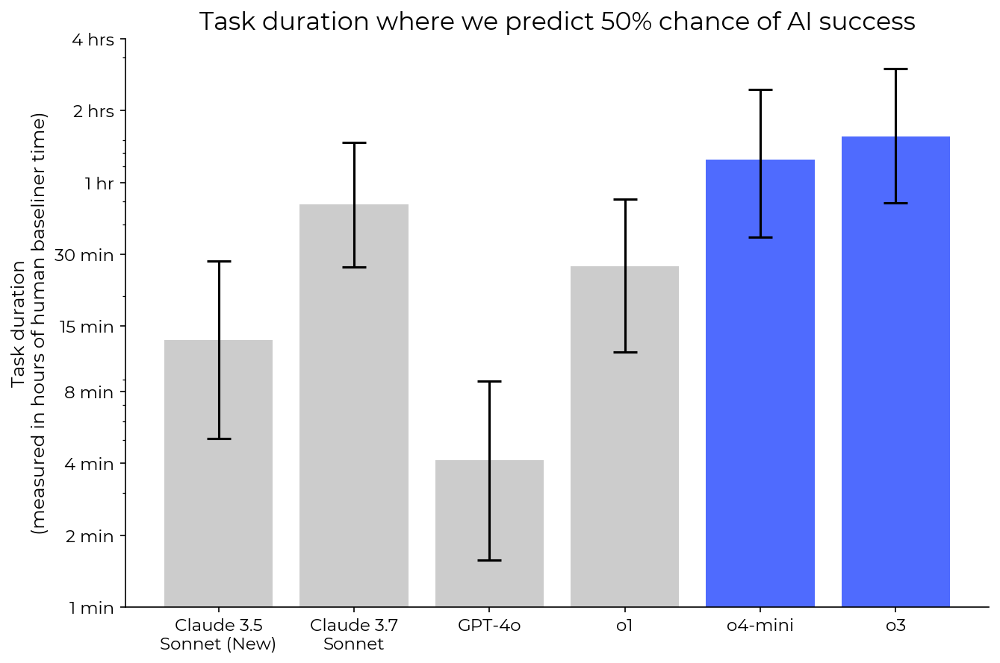<small>METR · o3 / o4-mini report · Apr 2025<br>Human task duration, not step count</small></div>
  <div class="p1925-decay-chart">
    <svg id="exp23-decay-svg" viewBox="0 0 990 510" role="img" aria-label="Toy model of independent steps without recovery: probability 0.95 to the power n. 10 steps 59.9%, 20 steps 35.8%, 50 steps 7.7%, 100 steps 0.6%.">
      <text class="p1925-svg-small" x="80" y="25">P(entire chain succeeds)</text>
      <g class="p1925-plot-grid"><path d="M80 58H925M80 152H925M80 246H925M80 340H925M80 434H925"/></g>
      <path class="p1925-plot-axis" d="M80 58V434H925"/>
      <g class="p1925-svg-small" text-anchor="end"><text x="66" y="67">100%</text><text x="66" y="162">75%</text><text x="66" y="256">50%</text><text x="66" y="350">25%</text><text x="66" y="444">0%</text></g>
      <g class="p1925-svg-small" text-anchor="middle"><text x="80" y="467">0</text><text x="249" y="467">20</text><text x="502.5" y="467">50</text><text x="925" y="467">100</text><text x="505" y="505">Number of steps</text></g>
      <!-- exp23-curve: generated directly from 0.95**n; see build_assets.py -->
      <path id="exp23-curve" class="p1925-decay-line" d="M80.00 58.00 L88.45 76.80 L96.90 94.66 L105.35 111.63 L113.80 127.75 L122.25 143.06 L130.70 157.61 L139.15 171.43 L147.60 184.55 L156.05 197.03 L164.50 208.87 L172.95 220.13 L181.40 230.82 L189.85 240.98 L198.30 250.63 L206.75 259.80 L215.20 268.51 L223.65 276.79 L232.10 284.65 L240.55 292.12 L249.00 299.21 L257.45 305.95 L265.90 312.35 L274.35 318.43 L282.80 324.21 L291.25 329.70 L299.70 334.92 L308.15 339.87 L316.60 344.58 L325.05 349.05 L333.50 353.30 L341.95 357.33 L350.40 361.16 L358.85 364.81 L367.30 368.27 L375.75 371.55 L384.20 374.68 L392.65 377.64 L401.10 380.46 L409.55 383.14 L418.00 385.68 L426.45 388.10 L434.90 390.39 L443.35 392.57 L451.80 394.64 L460.25 396.61 L468.70 398.48 L477.15 400.26 L485.60 401.94 L494.05 403.55 L502.50 405.07 L510.95 406.52 L519.40 407.89 L527.85 409.20 L536.30 410.44 L544.75 411.61 L553.20 412.73 L561.65 413.80 L570.10 414.81 L578.55 415.77 L587.00 416.68 L595.45 417.54 L603.90 418.37 L612.35 419.15 L620.80 419.89 L629.25 420.60 L637.70 421.27 L646.15 421.90 L654.60 422.51 L663.05 423.08 L671.50 423.63 L679.95 424.15 L688.40 424.64 L696.85 425.11 L705.30 425.55 L713.75 425.97 L722.20 426.38 L730.65 426.76 L739.10 427.12 L747.55 427.46 L756.00 427.79 L764.45 428.10 L772.90 428.40 L781.35 428.68 L789.80 428.94 L798.25 429.19 L806.70 429.44 L815.15 429.66 L823.60 429.88 L832.05 430.09 L840.50 430.28 L848.95 430.47 L857.40 430.64 L865.85 430.81 L874.30 430.97 L882.75 431.12 L891.20 431.27 L899.65 431.40 L908.10 431.53 L916.55 431.66 L925.00 431.77"/>
      <g class="fragment" data-fragment-index="1"><circle class="p1925-plot-dot" cx="164.5" cy="208.9" r="8"/><text class="p1925-point-label" x="183" y="190">10 → 59.9%</text></g>
      <g class="fragment" data-fragment-index="2"><circle class="p1925-plot-dot" cx="249" cy="299.2" r="8"/><text class="p1925-point-label" x="270" y="290">20 → 35.8%</text></g>
      <g class="fragment" data-fragment-index="3"><circle class="p1925-plot-dot" cx="502.5" cy="405.1" r="8"/><text class="p1925-point-label" x="490" y="376">50 → 7.7%</text></g>
      <g class="fragment" data-fragment-index="4"><circle class="p1925-plot-dot" cx="925" cy="431.8" r="8"/><text class="p1925-point-label" x="925" y="402" text-anchor="end">100 → 0.6%</text></g>
    </svg>
    <div class="p1925-toy-label">Toy model: independent steps, no recovery</div>
  </div>
</div>
```

::: {.p1925-chain-formula}
$$P(\mathrm{success}) = 0.95^n$$
:::

```{=html}
<div class="exp-takeaway">Long chains demand much more reliable steps</div>
<div class="exp-source">Main chart: author’s mathematical illustration · <a href="https://metr.org/evaluations/openai-o3-report/">Inset: METR, o3 / o4-mini evaluation, 16 Apr 2025</a></div>
```

::: {.notes}
Учебная модель: каждый из n шагов независимо успешен с вероятностью 0,95, любая ошибка срывает всю цепочку, восстановления нет. Поэтому перемножаем вероятности. Клики показывают 10, 20, 50, 100 шагов: 59,9%, 35,8%, 7,7%, 0,6%. Это расчёт автора, а не эмпирическая формула METR.

Ошибки реальных агентов могут зависеть друг от друга; проверки, повторные попытки и восстановление меняют результат. Оригинальный рисунок METR приведён отдельно как эмпирический контекст: в отчёте апреля 2025 измерялся 50%-горизонт задач по человеческому времени. Эта версия задач отличается от TH 1.1 на предыдущем слайде, численные значения напрямую не сравниваем. [@exp23_o3]

Источник вставки: [METR o3 / o4-mini report](https://metr.org/evaluations/openai-o3-report/).
:::

## Benchmarks are maps, not the territory {#exp24-benchmark-scope .exp-slide .p1925-benchmarks background-color="#ffffff"}

```{=html}
<div class="exp-body p1925-benchmark-panels">
  <div class="p1925-benchmark-panel">
    <strong class="p1925-panel-heading">ARC-AGI-3</strong>
    <div class="p1925-arc-frames">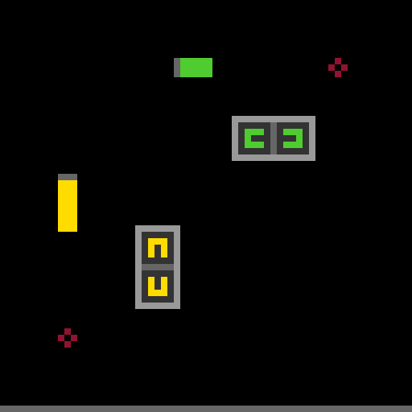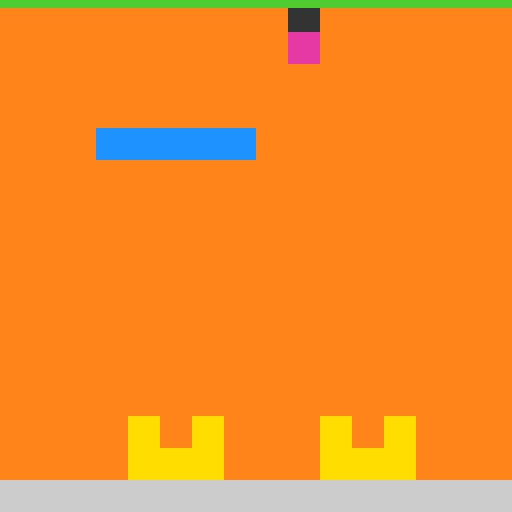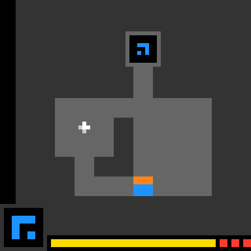</div>
    <div class="p1925-benchmark-flow">Explore <b>→</b> Infer rules <b>→</b> Act</div>
    <div class="p1925-measures"><span>What is measured?</span><strong>Adaptation to an unfamiliar environment</strong></div>
    <div class="p1925-launch"><span>Launch report · 25 March 2026</span><strong>Humans 100% · frontier AI 0.51%</strong></div>
  </div>
  <div class="p1925-benchmark-panel">
    <strong class="p1925-panel-heading">SWE-bench</strong>
    <div class="p1925-swe-flow"><div><small>01</small>GitHub issue</div><b>→</b><div><small>02</small>Repository</div><b>→</b><div><small>03</small>Patch</div><b>→</b><div><small>04</small>Tests</div></div>
    <div class="p1925-swe-detail"><code>problem statement</code><code>code context</code><code>candidate diff</code><code>pass / fail</code></div>
    <div class="p1925-measures"><span>What is measured?</span><strong>Resolve a repository issue,<br>verified by tests</strong></div>
  </div>
</div>
<div class="exp-takeaway">Task distribution + setup + scoring rule</div>
<div class="exp-source"><a href="https://arcprize.org/blog/arc-agi-3-launch">ARC-AGI-3 launch</a> · <a href="https://arcprize.org/blog/arc-agi-3-human-dataset">Official ARC environment demos</a> · <a href="https://www.swebench.com/SWE-bench/">SWE-bench documentation</a></div>
```

::: {.notes}
Это разные измерительные инструменты. ARC-AGI-3 требует исследовать среду и обнаружить её правила. SWE-bench проверяет исправление реальной задачи репозитория с помощью исполняемых тестов. Высокий результат в одном наборе не устанавливает качество во всех ситуациях. [@exp21_arc; @exp24_swe]

Слева настоящие анимированные демонстрации сред S5I5, SP80 и LS20 со страницы ARC Prize. Историческая плашка дословно передаёт headline запуска 25 марта 2026, не актуальный рейтинг. «Humans 100%» не означает, что каждый участник решил каждую среду: исследование подтверждает разрешимость всех сред людьми, каждую решили хотя бы два независимых участника. [@exp24_humans]

Источники: [ARC launch](https://arcprize.org/blog/arc-agi-3-launch), [human study and demos](https://arcprize.org/blog/arc-agi-3-human-dataset), [SWE-bench](https://www.swebench.com/SWE-bench/).
:::

## How clean is our measurement? {#exp25-evaluation-setup .exp-slide .p1925-measurement background-color="#ffffff"}

```{=html}
<div class="exp-body">
  <div class="p1925-result-context">ARC-AGI-3 Semi-Private · best observed configurations · 2 Sep 2026</div>
  <div class="p1925-score-comparison">
    <div class="p1925-score-card"><span>GPT-6 Astra</span><strong>62.7<small>%</small></strong><div class="fragment" data-fragment-index="1"><b>Standard harness</b><em>max reasoning</em></div></div>
    <div class="p1925-same-model">Same model.<br>Different setup.</div>
    <div class="p1925-score-card"><span>GPT-6 Astra</span><strong>99.9<small>%</small></strong><div class="fragment" data-fragment-index="1"><b>Provider Adapter</b><em>high reasoning</em></div></div>
  </div>
  <div class="p1925-setup-factors fragment" data-fragment-index="1"><div><strong>Harness</strong><span>Interaction loop</span></div><div><strong>Reasoning effort</strong><span>max / high</span></div><div><strong>State handling</strong><span>Notes / reasoning state</span></div><div><strong>Evaluation set</strong><span>Semi-Private</span></div></div>
  <div class="p1925-setup-caveat fragment" data-fragment-index="1">Both harness and reasoning effort differ</div>
</div>
<div class="exp-takeaway fragment" data-fragment-index="2">Evaluation setup is part of the result</div>
<div class="exp-source"><a href="https://arcprize.org/results/openai-gpt-6-astra">ARC Prize: GPT-6 Astra results</a> · Headline values as reported · Checked 23 Sep 2026</div>
```

::: {.notes}
Сначала видны только две оценки одной модели. Клик раскрывает условия. Это лучшие опубликованные конфигурации ARC-AGI-3 Semi-Private: Standard при max reasoning и Provider Adapter при high reasoning. Headline источника даёт 62,7% и 99,9%; таблица показывает 62,71% и 99,95%. Сохраняем значения headline, не пересчитывая округление. [@exp25_astra]

Standard переносит выбранные моделью заметки. Provider Adapter сохраняет непрозрачное reasoning-состояние между запросами и использует compaction. Меняются как harness, так и reasoning effort, поэтому это не эксперимент с одной изменённой переменной: всю разницу нельзя приписать harness. Следующий клик закрепляет вывод: условия выполнения входят в результат. [@exp25_astra]

Тот же принцип применим к человеческому baseline: ARC отдельно документирует исследование 458 участников и условия первого знакомства со средами. [@exp24_humans]

Источники: [GPT-6 Astra results](https://arcprize.org/results/openai-gpt-6-astra), [human baseline study](https://arcprize.org/blog/arc-agi-3-human-dataset).
:::

## What is actually different in frontier models? {#exp26-model-comparison .exp-slide .p2630 .p2630-template background-color="#ffffff"}

```{=html}
<div class="exp-body p2630-template-body">
  <div class="p2630-neutral">
    <div class="exp-kicker">A common model card</div>
    <div class="p2630-zone"><span>Design</span><div class="p2630-template-fields">
      <div><b>Architecture</b><small class="p2630-undisclosed fragment" data-fragment-index="1">Not publicly disclosed</small></div>
      <div><b>Data</b><small class="p2630-undisclosed fragment" data-fragment-index="1">Not publicly disclosed</small></div>
      <div><b>Post-training</b><small class="p2630-documented fragment" data-fragment-index="1">Publicly documented</small></div>
    </div></div>
    <div class="p2630-zone"><span>Operation</span><div class="p2630-template-fields">
      <div><b>Inference</b><small class="p2630-documented fragment" data-fragment-index="1">Publicly documented</small></div>
      <div><b>Tools</b><small class="p2630-documented fragment" data-fragment-index="1">Publicly documented</small></div>
      <div><b>Capability</b><small class="p2630-measured fragment" data-fragment-index="1">Measured</small></div>
    </div></div>
    <div class="p2630-zone"><span>Evidence</span><div class="p2630-template-fields p2630-two">
      <div><b>Evidence</b><small class="p2630-measured fragment" data-fragment-index="1">Measured</small></div>
      <div><b>Limits</b><small class="p2630-documented fragment" data-fragment-index="1">Publicly documented</small></div>
    </div></div>
    <div class="p2630-template-note">Status belongs to a claim, not to a provider.</div>
  </div>
  <div class="p2630-source-snippets">
    <div class="exp-kicker">Different release formats</div>
    
    <div class="p2630-map-arrow fragment" data-fragment-index="1">← <span>map to the same fields</span></div>
    
    <div class="p2630-snippet-caption">Official page excerpts · 23 Sep 2026</div>
  </div>
</div>
<div class="exp-takeaway">Compare the same fields, not the loudest headlines</div>
<div class="exp-source"><a href="https://openai.com/index/gpt-5-6/">OpenAI · GPT‑5.6</a> · <a href="https://www.anthropic.com/claude/fable">Anthropic · Claude Fable</a> · Card schema: course synthesis</div>
```

::: {.notes}
Перед нами не карточка конкретной модели, а схема сравнения. Статусы справа от полей — пример того, как отмечать отдельные сведения. Они не означают, что любой провайдер раскрывает одну и ту же информацию. По клику сведения со страниц складываются в общие поля.

Отсутствие архитектурных сведений не заполняем догадкой: высокий результат не доказывает число параметров, MoE или долю синтетических данных. «Не раскрыто» — содержательное значение поля. Различаем описание разработчика и результат измерения; для последнего сохраняем конфигурацию, метрику и дату.

Источники: [GPT‑5.6 release](https://openai.com/index/gpt-5-6/) [@exp27_gpt56] и [Claude Fable](https://www.anthropic.com/claude/fable) [@exp26_fable]. Справа реальные фрагменты этих страниц, снятые 23 сентября 2026 года.
:::

## Frontier model card I: GPT-5.6 {#exp27-gpt56-card .exp-slide .p2630 .p2630-gpt56 background-color="#ffffff"}

```{=html}
<div class="exp-body p2630-card-body">
  <div class="p2630-dateline"><b>OpenAI</b><span>Released 9 July 2026</span></div>
  <div class="p2630-tiers">
    <div><b>Sol</b><span>flagship</span></div><div><b>Terra</b><span>balanced</span></div><div><b>Luna</b><span>efficient</span></div>
  </div>
  <div class="p2630-specs p2630-four">
    <div><label>Architecture</label><span class="p2630-undisclosed">Not publicly disclosed</span></div>
    <div><label>Data</label><span class="p2630-undisclosed">Not publicly disclosed</span></div>
    <div><label>Post-training</label><span>Robustness &amp; safety training</span></div>
    <div><label>Limits</label><span>Safeguards &amp; trusted access</span></div>
  </div>
  <div class="p2630-operations">
    <div><label>Inference</label><span>Effort: low → max</span></div>
    <div><label>Tools</label><span>Programmatic tool calling</span></div>
    <div><label>Capability</label><span>Coding · knowledge work · science</span></div>
  </div>
  <div class="p2630-bottom-split">
    <div class="p2630-arc-family">
      <div class="p2630-panel-title">Evidence <span>ARC Prize · independent</span></div>
      <div class="p2630-panel-sub">ARC‑AGI‑3 · Semi‑Private · max reasoning</div>
      <div class="p2630-arc-values"><div><strong>7.78<span>%</span></strong><small>Sol</small></div><div><strong>0.80<span>%</span></strong><small>Terra</small></div><div><strong>0.18<span>%</span></strong><small>Luna</small></div></div>
      <div class="p2630-fine">July release evaluation · no Ultra result shown</div>
    </div>
    <div class="p2630-ultra">
      <div class="p2630-panel-title">Ultra <span>system organization</span></div>
      <div class="p2630-ultra-flow"><span class="p2630-task">Task</span><span class="exp-arrow">→</span><div class="p2630-four-agents"><span>A</span><span>B</span><span>C</span><span>D</span></div><span class="exp-arrow">→</span><span class="p2630-task">Result</span></div>
      <div class="p2630-fine">Four parallel agents by default · native schematic</div>
    </div>
  </div>
</div>
<div class="exp-takeaway">Model tier + reasoning effort + orchestration</div>
<div class="exp-source"><a href="https://openai.com/index/gpt-5-6/">OpenAI release</a> · <a href="https://arcprize.org/results/openai-gpt-5-6">ARC Prize results</a> · Selected release case · July 2026</div>
```

::: {.notes}
GPT‑5.6 — семейство из трёх уровней; одинаковый размер блоков означает разные назначения, а не размер модели. В релизе от 9 июля 2026 года Ultra описан как координация четырёх агентов по умолчанию. Это системный режим, его нельзя смешивать с reasoning effort отдельного агента. Общие сведения о safeguards опубликованы; полная архитектура и состав обучающей смеси не раскрыты. [@exp27_gpt56]

Независимая панель показывает ровно строки max из таблицы ARC Prize: Sol 7.78%, Terra 0.80%, Luna 0.18% на ARC‑AGI‑3 Semi‑Private. Для Sol отдельно опубликованный Public результат — 13.33%; его здесь не смешиваем с Semi‑Private. Это оценка июльского релиза, не Ultra и не утверждение о текущем лидерстве. [@exp27_arc56]

Источники: [релиз](https://openai.com/index/gpt-5-6/), [ARC Prize](https://arcprize.org/results/openai-gpt-5-6), [API model guidance](https://developers.openai.com/api/docs/guides/latest-model?model=gpt-5.6) [@exp27_gpt56docs]. Проверено 23 сентября 2026 года.
:::

## Frontier model card II: Astra {#exp28-astra-card .exp-slide .p2630 .p2630-astra background-color="#ffffff"}

```{=html}
<div class="exp-body p2630-card-body">
  <div class="p2630-dateline"><b>OpenAI GPT‑6 Astra</b><span>Released 3 September 2026</span></div>
  <div class="p2630-astra-left">
    <div class="p2630-specs p2630-three">
      <div><label>Architecture</label><span class="p2630-undisclosed">Not publicly disclosed</span></div>
      <div><label>Data</label><span class="p2630-undisclosed">Not publicly disclosed</span></div>
      <div><label>Post-training</label><span>RL + alignment</span></div>
    </div>
    <div class="p2630-astra-ops"><div><label>Inference</label><span>Effort: low → max</span></div><div><label>Tools</label><span>Search · code · computer use</span></div></div>
    <div class="p2630-capability-label">Capability <span>Publicly documented</span></div>
    <div class="p2630-capabilities"><div>Computer<br>use</div><div>Software<br>engineering</div><div>Science</div><div>Professional<br>work</div></div>
    <div class="p2630-astra-arc">
      <div class="p2630-panel-title">Evidence <span>ARC‑AGI‑3 · Semi‑Private · ARC Prize</span></div>
      <div class="p2630-astra-scores"><div><strong>62.71<span>%</span></strong><small>Standard · max effort</small></div><span class="p2630-score-divider">/</span><div><strong>99.95<span>%</span></strong><small>Provider Adapter · high effort</small></div></div>
      <div class="p2630-fine">Different harnesses and effort settings</div>
    </div>
  </div>
  <div class="p2630-astra-right">
    <div class="p2630-chart-label">Official evaluation panel <span>OpenAI</span></div>
    <div class="p2630-chart-crop">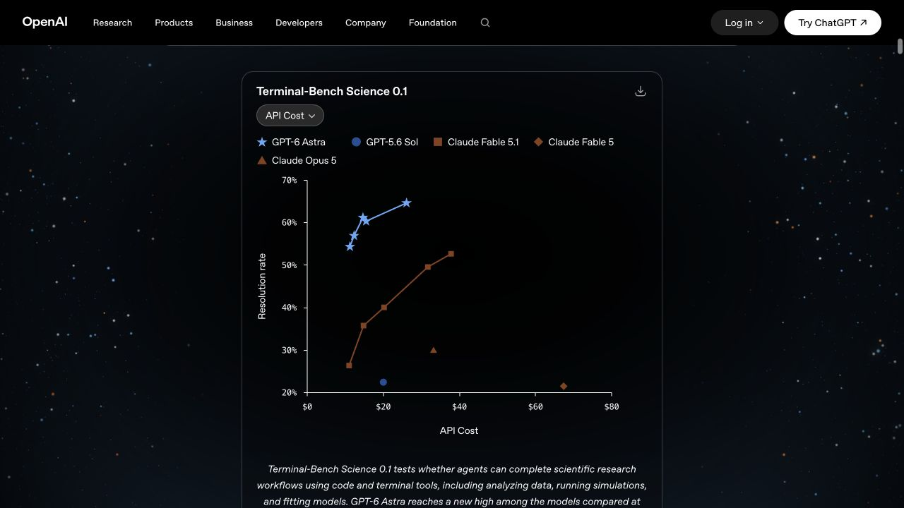</div>
    <div class="p2630-chart-conditions">Terminal‑Bench Science 0.1<br>Release configurations · estimated API cost</div>
  </div>
  <div class="p2630-astra-limits"><label>Limits · Safeguards / Deployment</label><span>Monitored tool use · access checks · cyber restrictions</span></div>
</div>
<div class="exp-takeaway">Capabilities, evidence, and deployment limits belong together</div>
<div class="exp-source"><a href="https://openai.com/index/gpt-6-astra/">OpenAI release</a> · <a href="https://arcprize.org/results/openai-gpt-6-astra">ARC Prize</a> · <a href="https://openai.com/index/safety-overview-gpt-6-astra/">Safety overview</a> · 23 Sep 2026 · Not Google Project Astra</div>
```

::: {.notes}
Astra здесь означает OpenAI GPT‑6 Astra, выпущенную 3 сентября 2026 года, а не Google Project Astra. Четыре области возможностей — структура релиза разработчика. Архитектурные параметры и полный состав данных в использованных публичных описаниях не раскрыты. Упоминание RL и alignment не раскрывает полного рецепта обучения. [@exp28_astra; @exp28_astradocs]

Справа настоящий фрагмент официального Terminal‑Bench Science 0.1 panel: resolution rate против estimated API cost. Релиз сообщает лучший результат Astra 64.6%, Fable 5.1 52.6%, Sol 22.4%; сводные scores выбирают максимум по effort, а исследовательская среда и production могут различаться. Это разработческая оценка, не независимый leaderboard. [@exp28_astra]

Внизу независимые результаты ARC Prize: Standard/max — 62.71%, Provider Adapter/high — 99.95%. Standard сохраняет заметки модели; Adapter дополнительно сохраняет скрытое reasoning state и использует compaction. Это разные конфигурации, а не изолированный эксперимент над единственным фактором. [@exp28_arcastra]

Safety overview отдельно описывает мониторинг использования инструментов, проверки и ограничения доступа. Наличие защит не означает отсутствия ошибок или рисков. [@exp28_astrasafety]

[Релиз](https://openai.com/index/gpt-6-astra/), [ARC Prize](https://arcprize.org/results/openai-gpt-6-astra), [Safety overview](https://openai.com/index/safety-overview-gpt-6-astra/). Срез: 23 сентября 2026 года.
:::

## Frontier model card III: Fable / Mythos {#exp29-fable-mythos .exp-slide .p2630 .p2630-fable background-color="#ffffff"}

```{=html}
<div class="exp-body p2630-fable-body">
  <div class="p2630-shared-model"><b>Same underlying model</b><span>Anthropic · 1 September 2026</span></div>
  <div class="p2630-branches" aria-hidden="true"><span></span><span></span></div>
  <div class="p2630-fable-columns">
    <div class="p2630-fable-column"><div class="p2630-column-name">Claude Fable 5.1</div>
      <div><label>Capabilities</label><span>Coding &amp; knowledge work</span></div>
      <div><label>Safeguards / Limits</label><span>General deployment safeguards</span></div>
      <div><label>Access</label><span class="p2630-available">Generally available</span></div>
      <div><label>Deployment context</label><span>Claude apps · API · cloud platforms</span></div>
    </div>
    <div class="p2630-fable-column"><div class="p2630-column-name">Claude Mythos 5.1</div>
      <div><label>Capabilities</label><span>Same model; different available behavior</span></div>
      <div><label>Safeguards / Limits</label><span>More permissive for approved work</span></div>
      <div><label>Access</label><span class="p2630-restricted">Restricted · vetted US organizations</span></div>
      <div><label>Deployment context</label><span>Life sciences beta · Claude Security</span></div>
    </div>
  </div>
  <div class="p2630-common-fields">
    <div><label>Architecture / Data</label><span class="p2630-undisclosed">Not publicly disclosed</span></div>
    <div><label>Post-training</label><span>Full recipe not disclosed</span></div>
    <div><label>Inference / Tools</label><span>Effort + workflow dependent</span></div>
    <div><label>Evidence</label><span>Release + system card</span></div>
  </div>
</div>
<div class="exp-takeaway p2630-fable-takeaway">Model capability <span>→</span> Safeguards <span>→</span> Available behavior</div>
<div class="exp-source"><a href="https://www.anthropic.com/claude-fable-and-mythos-5-1">Anthropic · Fable 5.1 &amp; Mythos 5.1</a> · <a href="https://www.anthropic.com/claude/mythos">Mythos access</a> · State of access: 23 Sep 2026</div>
```

::: {.notes}
Официальный релиз прямо говорит, что Fable 5.1 и Mythos 5.1 — одна модель с разными safeguards. Две колонки не изображают две подтверждённо разные архитектуры. Наблюдаемое поведение зависит от защит, маршрутизации и доступа. Fable общедоступна на поддерживаемых платформах; это не означает бесплатный доступ. [@exp29_fablemythos]

У Mythos более разрешительные настройки для проверенных пользователей и организаций в cybersecurity и life sciences; остальные защиты сохраняются. На дату среза доступ ограничен группой американских организаций. Life Sciences Verification Program запускается как invite-only beta; включение Mythos в Cyber Verification Program описано как будущий шаг. Claude Security уже использует Mythos 5.1. Поэтому на слайде нет обещания, что любой участник CVP уже имеет доступ. [@exp29_mythos]

Architecture / Data обозначают полную архитектуру и состав обучающей смеси: не подменяем их предположениями. Evidence здесь означает публикации разработчика; независимые численные результаты на этом слайде не заявлены.

Источники: [совместный релиз](https://www.anthropic.com/claude-fable-and-mythos-5-1), [страница Mythos](https://www.anthropic.com/claude/mythos), [Fable](https://www.anthropic.com/claude/fable) [@exp26_fable].
:::

## The frontier is a system, not a model {#exp30-system-stack .exp-slide .p2630 .p2630-system background-color="#ffffff"}

```{=html}
<div class="exp-body p2630-system-body">
  <div class="p2630-stack">
    <div class="p2630-layer p2630-completed fragment" data-fragment-index="5"><b>Completed work</b><span>A reviewed artifact</span></div>
    <div class="p2630-layer fragment" data-fragment-index="4"><b>Evaluation &amp; Review</b><span>Tests, scores, human judgment</span></div>
    <div class="p2630-layer fragment" data-fragment-index="3"><b>Agent orchestration</b><span>Parallel work, delegation, synthesis</span></div>
    <div class="p2630-layer fragment" data-fragment-index="2"><b>Memory &amp; Tools</b><span>Context, code, environments</span></div>
    <div class="p2630-layer fragment" data-fragment-index="1"><b>Inference mode</b><span>Effort and compute budget</span></div>
    <div class="p2630-layer p2630-base"><b>Base model</b><span>Learned representations and reasoning</span></div>
  </div>
  <div class="p2630-system-examples fragment" data-fragment-index="4">
    <div class="p2630-example"><b>Codex</b><span>Parallel tasks<br>Isolated worktrees<br>Diffs &amp; human review</span></div>
    <div class="p2630-example"><b>AlphaEvolve</b><span>Program database<br>Evolutionary search<br>Automatic evaluators</span></div>
  </div>
  <svg class="p2630-system-connectors fragment" data-fragment-index="4" viewBox="0 0 1496 400" aria-label="Codex connects to tools, orchestration and review; AlphaEvolve connects to memory, search and evaluation">
    <g fill="none" stroke="currentColor" stroke-width="1.5"><path d="M870 95 H918 V100 H992 M870 156 H918 M870 217 H918 V100"/><path d="M870 95 H950 V281 H992 M870 156 H950 M870 217 H950 V281"/></g>
  </svg>
  <div class="p2630-workflow-comparison"><div class="p2630-single-call">One model call</div><span class="exp-arrow">→</span><div class="p2630-end-to-end fragment" data-fragment-index="5">End-to-end workflow <span>plan · act · verify · revise</span></div></div>
</div>
<div class="exp-takeaway">A system earns its score through the whole workflow</div>
<div class="exp-source"><a href="https://openai.com/index/gpt-5-6/">GPT‑5.6</a> · <a href="https://openai.com/index/introducing-the-codex-app/">Codex app · 2026</a> · <a href="https://deepmind.google/blog/alphaevolve-a-gemini-powered-coding-agent-for-designing-advanced-algorithms/">AlphaEvolve · 2025</a> · Native conceptual schematic</div>
```

::: {.notes}
Начинаем только с базовой модели. На последовательных кликах добавляем режим вычислений, память и инструменты, организацию агентов, проверку и готовый артефакт. Схема — авторское обобщение, а не заявленная архитектура одного продукта.

Codex даёт конкретный пример: отдельные задачи, изолированные worktrees, возможность сравнивать изменения и выполнять человеческое review. [@exp30_codex] AlphaEvolve показывает другой цикл: LLM предлагают программы, автоматические evaluator их проверяют, база хранит результаты и управляет дальнейшим эволюционным поиском. [@exp30_alphaevolve] В GPT‑5.6 Ultra несколько агентов координируют работу параллельно. [@exp27_gpt56]

Сравнение продуктов не сводится к сравнению весов. Контекст, инструменты, число попыток и проверка также меняют результат. Линии справа отмечают особенно важные слои каждого примера; это не полный перечень его компонентов.

Источники: [Codex app](https://openai.com/index/introducing-the-codex-app/), [AlphaEvolve](https://deepmind.google/blog/alphaevolve-a-gemini-powered-coding-agent-for-designing-advanced-algorithms/), [GPT‑5.6](https://openai.com/index/gpt-5-6/).
:::

## What are we running out of? {#exp31-physical .exp-slide .cs31 background-color="#ffffff"}

```{=html}
<div class="exp-body cs31-layout">
  <div class="cs31-dimensions"><span>Compute</span><span>Power</span><span>Infrastructure</span></div>
  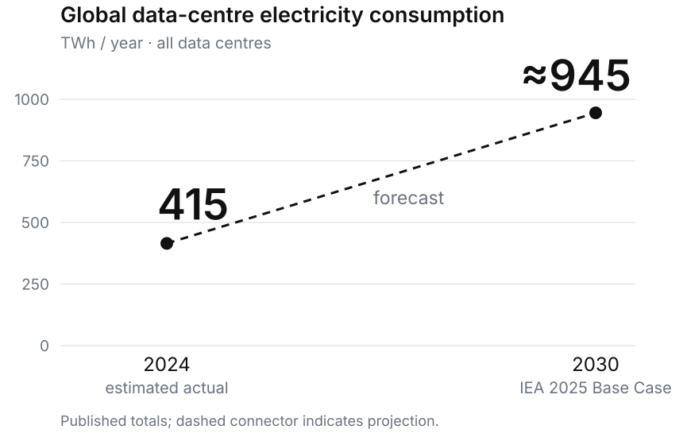
  <div class="cs31-side">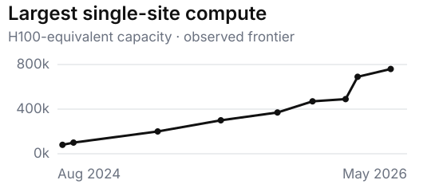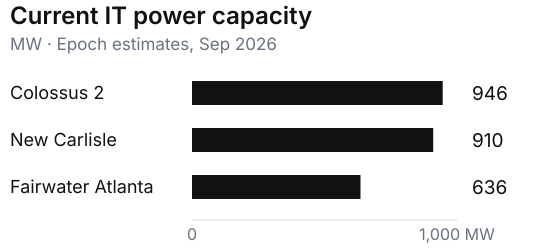</div>
</div>
<div class="exp-takeaway">Scaling has a physical footprint</div>
<div class="exp-source">IEA, Energy and AI (2025), CC BY 4.0 · Epoch AI (Jun / Sep 2026), CC BY 4.0 · Redrawn from published values · Accessed 23 Sep 2026</div>
```

::: {.notes}
Энергия в TWh, электрическая мощность в MW и вычислительная производительность — разные величины. Их нельзя суммировать или изображать на общей шкале. IEA учитывает все дата-центры, а не только AI. 415 TWh — оценка 2024 года; около 945 TWh — прогноз Base Case из отчёта 2025 года, а не наблюдение 2030 года. На главном графике только два опубликованных итога; промежуточная линия обозначает прогноз, а не дополнительные ежегодные измерения. [@exp31_iea]

Справа вверху — наблюдаемая часть ряда Epoch, опубликованного в июне 2026 года: от августа 2024 до мая 2026. H100 equivalents — нормированная вычислительная ёмкость, а не число установленных H100. Внизу — оценка действующей IT-мощности трёх площадок на сентябрь 2026 года; это мощность оборудования, не фактическое энергопотребление и не конечная проектная мощность. Слайд не задаёт дату, когда ресурсы «закончатся». [@exp31_epochcompute; @exp31_epochpower]

Источники: [IEA — Energy demand from AI](https://www.iea.org/reports/energy-and-ai/energy-demand-from-ai); [Epoch — compute frontier](https://epoch.ai/data-insights/largest-data-center-compute); [Epoch — power capacity](https://epoch.ai/graphs/largest-ai-data-centers-by-power-capacity).
:::

## But efficiency is also scaling {#exp32-efficiency .exp-slide .cs32 background-color="#ffffff"}

```{=html}
<div class="exp-body cs32-layout">
  <div class="cs32-hardware">
    <div><div class="cs32-label">Same hardware</div><div class="cs32-cluster"><i></i><i></i><i></i><i></i><i></i><i></i></div><div class="cs32-work">useful work <span>● ●</span></div></div>
    <div class="cs32-upgrade">Better algorithms<div>→</div></div>
    <div><div class="cs32-label">More useful work</div><div class="cs32-cluster"><i></i><i></i><i></i><i></i><i></i><i></i></div><div class="cs32-work">useful work <span>● ● ● ● ●</span></div></div>
  </div>
  <div class="cs32-bottom">
    <div class="cs32-metric"><div class="exp-kicker">AlphaEvolve · component</div><strong>23%</strong><div>faster selected kernel</div></div>
    <div class="cs32-metric"><div class="exp-kicker">AlphaEvolve · whole run</div><strong>1%</strong><div>reduction in Gemini<br>training time</div></div>
    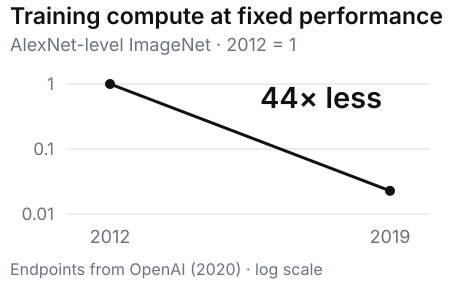
  </div>
</div>
<div class="exp-takeaway">More compute × better use of compute</div>
<div class="exp-source">OpenAI, AI and Efficiency (2020) · Google DeepMind, AlphaEvolve (2025), AlphaEvolve impact (2026) · Hardware / work symbols are illustrative</div>
```

::: {.notes}
Оба кластера нарисованы одинаковыми: меняется эффективность использования ресурсов. Количество кружков работы условное и не кодирует измеренный коэффициент.

Google DeepMind сообщает об ускорении выбранного matrix-multiplication kernel на 23% и сокращении всего времени обучения Gemini на 1%. Это разные знаменатели. Локальное ускорение не переносится на весь процесс: важна доля времени, которую занимает компонент. Отдельный исторический график нормирует вычисления для достижения уровня AlexNet на ImageNet: в анализе OpenAI для 2019 года требовалось в 44 раза меньше training compute, чем для 2012 года. Это конкретный порог качества, а не универсальный закон для всех задач. [@exp32_efficiency; @exp32_alphaevolve]

Источники: [OpenAI — AI and efficiency](https://openai.com/index/ai-and-efficiency/); [AlphaEvolve — 23% и 1%](https://deepmind.google/blog/alphaevolve-a-gemini-powered-coding-agent-for-designing-advanced-algorithms/); [AlphaEvolve impact](https://deepmind.google/blog/alphaevolve-impact/). [@exp32_impact]
:::

## How far can this recipe go? {#exp33-scenarios .exp-slide .cs33 background-color="#ffffff"}

```{=html}
<div class="exp-body">
<svg class="cs33-chart" viewBox="0 0 1496 550" role="img" aria-label="Three qualitative scenario strips for compute, capability, and autonomy. Solid historical schematics become multiple dashed possible futures, with no quantitative forecast or AGI date.">
  <text x="245" y="30" class="cs-label">Observed</text><text x="910" y="30" class="cs-label">Projected / Illustrative</text>
  <path d="M810 55V470" class="cs-rule"/>
  <text x="0" y="135" class="cs-label">Compute</text><text x="0" y="275" class="cs-label">Capability</text><text x="0" y="415" class="cs-label">Autonomy</text>
  <path d="M230 172H1450 M230 312H1450 M230 452H1450" class="cs-grid"/>
  <g class="fragment" data-fragment-index="1"><path d="M230 158L340 152L465 139L590 118L700 98L810 77 M230 298L370 290L500 271L635 248L810 223 M230 438L390 434L530 417L660 391L810 365" class="cs-history"/></g>
  <g class="fragment" data-fragment-index="2">
    <path d="M810 77L1450 47L1450 161Z M810 223L1450 192L1450 300Z M810 365L1450 333L1450 441Z" class="cs-range"/>
    <path d="M810 77Q1080 75 1450 47 M810 77Q1120 99 1450 105 M810 77Q1100 145 1450 161 M810 223Q1120 214 1450 192 M810 223Q1120 239 1450 246 M810 223Q1040 300 1450 300 M810 365Q1050 362 1450 333 M810 365Q1100 385 1450 398 M810 365Q1080 438 1450 441" class="cs-future"/>
    <text x="1175" y="128" class="cs-small">Scenario range</text><text x="1175" y="270" class="cs-small">Scenario range</text><text x="1175" y="413" class="cs-small">Scenario range</text>
  </g>
  <rect x="230" y="488" width="1220" height="53" class="cs-band"/><text x="250" y="523" class="cs-small">Physical constraints</text><text x="635" y="523" class="cs-small">chips · power · grids · construction</text>
</svg>
</div>
<div class="exp-takeaway">Trends motivate scenarios. They do not establish the future.</div>
<div class="exp-source">Conceptual schematics informed by METR, Epoch AI, and IEA · No common y-scale · Scenario ranges are not statistical confidence intervals</div>
```

::: {.notes}
Первый клик раскрывает историю, второй — расходящиеся продолжения. Все три полосы — качественные авторские схемы, а не измеренные временные ряды. Слова Observed и Projected различают статус утверждений; единая граница — логическая, без календарной даты. Диапазоны сценариев не являются доверительными интервалами.

Наблюдения METR, оценки вычислительных площадок Epoch и сценарии IEA помогают сформулировать условия продолжения роста. Они не дают единого закона для compute, capability и autonomy. Ограничения инфраструктуры могут менять траекторию; любое продолжение линии зависит от допущений. На слайде намеренно нет даты AGI. [@exp35_metr; @exp31_epochcompute; @exp31_iea]

Источники: [METR](https://metr.org/time-horizons/); [Epoch](https://epoch.ai/data-insights/largest-data-center-compute); [IEA](https://www.iea.org/reports/energy-and-ai/energy-demand-from-ai).
:::

## The open problems are changing {#exp34-open-problems .exp-slide .cs34 background-color="#ffffff"}

```{=html}
<div class="exp-body cs34-layout">
  <div class="cs34-old"><div class="exp-kicker">Earlier focus</div><p>Recognition</p><p>Classification</p><p>Matching</p><div class="cs34-shift">→</div></div>
  <div class="cs34-new">
    <div class="cs34-grid">
      <div class="fragment" data-fragment-index="1"><span>01</span><strong>Exploration</strong><p>What should I investigate?</p></div>
      <div class="fragment" data-fragment-index="2"><span>02</span><strong>World modeling</strong><p>How does this environment work?</p></div>
      <div class="fragment" data-fragment-index="3"><span>03</span><strong>Goal-setting</strong><p>What would count as success?</p></div>
      <div class="fragment" data-fragment-index="4"><span>04</span><strong>Planning &amp; Execution</strong><p>What should I do next?</p></div>
    </div>
    <div class="cs34-transition fragment" data-fragment-index="5"><div><div class="cs34-world"><i></i><b></b></div><span>State</span></div><b class="exp-arrow">→</b><div><div class="cs34-action">move →</div><span>Action</span></div><b class="exp-arrow">→</b><div><div class="cs34-world cs34-next"><i></i><b></b></div><span>Predicted next state</span></div></div>
  </div>
</div>
<div class="exp-takeaway fragment" data-fragment-index="5">From recognizing the world to operating in it</div>
<div class="exp-source">ARC-AGI-3 (2026) · Visual General Intelligence white paper (2026) · Genie (2024) · State transition: author schematic</div>
```

::: {.notes}
Клики по очереди показывают четыре вопроса. Старые задачи слева не объявлены решёнными: это прежний центр внимания. Интерактивная среда добавляет активный поиск информации, модель последствий, обнаружение цели и коррекцию действий. Именно эти четыре группы выделяет ARC-AGI-3. [@exp34_arc]

Genie связывает действия с генерируемыми следующими состояниями. Нижний ряд — учебная схема такого перехода, не кадр Genie и не пример среды ARC. White paper о visual general intelligence задаёт более широкую исследовательскую рамку. [@exp34_genie; @exp34_vgi]

Источники: [ARC-AGI-3](https://arcprize.org/competitions/2026/arc-agi-3); [Visual General Intelligence](https://deepmind.google/research/publications/270149/); [Genie](https://deepmind.google/research/publications/60474/).
:::

## Long-horizon autonomy is the stress test {#exp35-long-horizon .exp-slide .cs35 background-color="#ffffff"}

```{=html}
<div class="exp-body cs35-layout">
  <div class="cs35-main"><div class="cs35-version">METR · Time Horizon 1.1</div>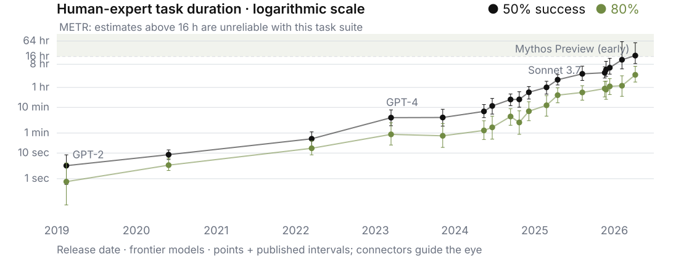<div class="cs35-chain"><span>Understand</span><b>→</b><span>Plan</span><b>→</b><span>Act</span><b>→</b><span>Check</span><b>→</b><span>Recover</span><b>→</b><span>Finish</span></div><div class="cs35-dependency">← intermediate results constrain what comes next →</div></div>
  <div class="cs35-supervision"><div>Human<br>supervision</div><ol><li>review scope</li><li>review plan</li><li>review evidence</li></ol><p>Workflow checkpoints<br><span>separate from time horizon</span></p></div>
</div>
<div class="exp-takeaway">Reliability belongs to the completed task.</div>
<div class="exp-source">METR · TH 1.1 · Page updated 8 May 2026 · Accessed 23 Sep 2026 · Native redraw of released YAML · Supervision strip: conceptual</div>
```

::: {.notes}
METR time horizon измеряется временем человека-эксперта на соответствующей задаче, а не длительностью непрерывной работы агента. Две серии соответствуют 50% и 80% вероятности завершения. Перерисованы опубликованные центральные оценки и интервалы TH 1.1 для моделей с меткой frontier; соединители лишь помогают чтению. Выше 16 часов сама METR отмечает ненадёжность оценок на текущем наборе. [@exp35_metr]

Длинная задача содержит зависимые этапы. Ошибку нужно обнаружить и исправить, сохранив цель и результаты предыдущих шагов. Полоса справа отдельно показывает возможные человеческие проверки: это наша схема процесса, не переменная графика METR. Набор задач преимущественно связан с software, ML и cybersecurity; абсолютные горизонты нельзя автоматически переносить на любую профессию.

[METR — Task-Completion Time Horizons](https://metr.org/time-horizons/), обновление 8 мая 2026 года, обращение 23 сентября 2026 года. [Исходный YAML TH 1.1](https://metr.org/assets/benchmark_results_1_1.yaml).
:::

## Science is an unusually hard benchmark {#exp36-science .exp-slide .cs36 background-color="#ffffff"}

```{=html}
<div class="exp-body cs36-layout">
  <div class="cs36-research"><span>Question</span><b>→</b><span class="fragment" data-fragment-index="1">Hypothesis</span><b class="fragment" data-fragment-index="1">→</b><span class="fragment" data-fragment-index="2">Experiment</span><b class="fragment" data-fragment-index="2">→</b><span class="fragment" data-fragment-index="2">Result</span><b class="fragment" data-fragment-index="2">→</b><span class="fragment" data-fragment-index="2">Verification</span></div>
  <div class="cs36-lanes">
    <div class="cs36-lane"><div class="cs36-name">Algorithms<br><span>AlphaEvolve</span></div><div class="cs36-program"><code>candidate.py</code><div>program</div></div><b class="exp-arrow">→</b><div class="cs36-check fragment" data-fragment-index="2"><strong>Automated evaluator</strong><span>execute · score · verify</span><div class="cs36-return">↶ feed results back to search</div></div></div>
    <div class="cs36-lane"><div class="cs36-name">Molecular structures<br><span>AlphaFold 3</span></div><div class="cs36-molecule"><div class="cs36-crop" role="img" aria-label="AlphaFold 3 published structure comparison, Figure 1a: protein, DNA and cGMP complex, PDB 7PZB." style="background-image:url(assets/final/part_31_37/alphafold3-fig1.png)"></div><span>predicted structure · Fig. 1a</span></div><b class="exp-arrow">→</b><div class="cs36-experiment fragment" data-fragment-index="2"><svg viewBox="0 0 54 62" aria-hidden="true"><path d="M20 3h14M23 3v21L8 49q-4 8 5 8h28q9 0 5-8L31 24V3M15 39h24" fill="none" stroke="currentColor" stroke-width="3"/></svg><strong>Experimental check</strong><span>physical measurements</span></div></div>
  </div>
  <div class="cs36-evidence fragment" data-fragment-index="2"><span>↘</span><strong>Evidence</strong><span>↗</span><p>Different claims.<br>Different tests.</p></div>
</div>
<div class="exp-takeaway fragment" data-fragment-index="2">A plausible answer is not a scientific result</div>
<div class="exp-source">Google DeepMind, AlphaEvolve (2025) · Abramson et al., Nature (2024), Fig. 1a, CC BY 4.0 · Structure figure shown as a cropped panel</div>
```

::: {.notes}
Первый клик раскрывает гипотезу, следующий — проверку. На верхней дорожке AlphaEvolve генерирует программы, а исполнение и функции оценки направляют следующий поиск. Корректность оценивается относительно поставленной задачи и evaluator. [@exp32_alphaevolve]

Нижняя дорожка показывает другой класс результата. Реальная панель 1a из статьи AlphaFold 3 содержит сравнение предсказанной и экспериментальной структуры комплекса белка с DNA и cGMP, PDB 7PZB. Отдельный блок физической проверки — общая научная рамка: он не означает, что AlphaFold 3 сам выполняет лабораторный эксперимент для каждого предсказания. Программный тест и экспериментальное свидетельство не взаимозаменяемы. [@exp36_alphafold]

Источники: [AlphaEvolve](https://deepmind.google/blog/alphaevolve-a-gemini-powered-coding-agent-for-designing-advanced-algorithms/); [AlphaFold 3 — Nature](https://www.nature.com/articles/s41586-024-07487-w).
:::

## Can AI improve AI? {#exp37-ai-improves-ai .exp-slide .cs37 background-color="#ffffff"}

```{=html}
<div class="exp-body cs37-layout">
<svg class="cs37-loop" viewBox="0 0 1020 540" role="img" aria-label="AI system to better algorithms to better infrastructure to more effective AI work, with a partial feedback loop and external human research direction.">
<defs><marker id="cs37-arrow" markerWidth="9" markerHeight="9" refX="8" refY="4" orient="auto"><path d="M0 0L8 4L0 8" fill="none" stroke="currentColor" stroke-width="1.5"/></marker></defs>
<g class="cs37-nodes"><rect x="112" y="35" width="320" height="90"/><text x="272" y="91">AI system</text><rect x="648" y="35" width="330" height="90"/><text x="813" y="91">Better algorithms</text><rect x="648" y="288" width="330" height="100"/><text x="813" y="331">Better</text><text x="813" y="367">infrastructure</text><rect x="112" y="288" width="320" height="100"/><text x="272" y="331">More effective</text><text x="272" y="367">AI work</text></g>
<g class="cs37-path"><path d="M432 80H631"/><path d="M813 125V270"/><path d="M648 338H450"/></g>
<g class="fragment" data-fragment-index="1"><path d="M272 288V142" class="cs37-feedback"/><text x="330" y="195" class="cs37-note">Partial</text><text x="330" y="222" class="cs37-note">feedback loop</text></g>
<path d="M570 467H70V80H94" class="cs37-humanpath"/><path d="M650 467H1000V338H991" class="cs37-humanpath"/>
<rect x="340" y="438" width="420" height="62" class="cs37-human"/><text x="550" y="479" class="cs37-humantext">Human research direction</text>
<text x="150" y="421" class="cs37-small">set tasks</text><text x="902" y="421" class="cs37-small">accept results</text>
</svg>
<div class="cs37-evidence"><div><div class="exp-kicker">Deployed example</div><strong>AlphaEvolve</strong><p>systems optimization</p><span>kernels · chips · scheduling</span></div><div><div class="exp-kicker">Reported research use</div><strong>AI research agents</strong><p>code &amp; experiments</p><span>under human direction</span></div></div>
</div>
<div class="exp-takeaway">Partial feedback is already visible.</div>
<div class="exp-source">Google DeepMind, AlphaEvolve (2025), impact update (7 May 2026) · OpenAI, Research acceleration (6 Sep 2026) · Accessed 23 Sep 2026</div>
```

::: {.notes}
Сначала виден прямой путь к улучшению инфраструктуры. Клик добавляет обратную связь. Это частичный цикл: AI помогает улучшать компоненты, которые используются в дальнейшей AI-работе. Внешний блок показывает, что люди задают направление и принимают результаты.

DeepMind описывает использование AlphaEvolve в оптимизации систем и проектировании TPU. OpenAI сообщает, что coding agents увеличивают объём кода и экспериментов исследователей; это наблюдение самой организации, а не независимая оценка скорости научного прогресса. Больше экспериментов не означает пропорционально больше научных открытий. В том же описании люди продолжают выбирать приоритеты и решать, какие результаты развивать. [@exp32_impact; @exp37_research]

Источники: [AlphaEvolve impact](https://deepmind.google/blog/alphaevolve-impact/); [Research acceleration: The view inside OpenAI](https://openai.com/index/research-acceleration-view-inside-openai/).
:::

## The loop is not closed yet {#exp38-loop-open .exp-slide .ev38 background-color="#ffffff"}

```{=html}
<div class="exp-body ev38-layout">
<svg class="ev38-loop" viewBox="0 0 1020 540" role="img" aria-label="Same partial AI improvement loop, now with external objective, evaluator and deployment checkpoints.">
<defs><marker id="ev38-arrow" markerWidth="9" markerHeight="9" refX="8" refY="4" orient="auto"><path d="M0 0L8 4L0 8" fill="none" stroke="currentColor" stroke-width="1.5"/></marker></defs>
<g class="ev38-nodes"><rect x="112" y="35" width="320" height="90"/><text x="272" y="91">AI system</text><rect x="648" y="35" width="330" height="90"/><text x="813" y="91">Better algorithms</text><rect x="648" y="288" width="330" height="100"/><text x="813" y="331">Better</text><text x="813" y="367">infrastructure</text><rect x="112" y="288" width="320" height="100"/><text x="272" y="331">More effective</text><text x="272" y="367">AI work</text></g>
<g class="ev38-path"><path d="M432 80H631"/><path d="M813 125V270"/><path d="M648 338H450"/></g>
<path d="M272 288V142" class="ev38-feedback"/><text x="330" y="195" class="ev38-note">Partial</text><text x="330" y="222" class="ev38-note">feedback loop</text>
<g class="fragment" data-fragment-index="1">
<path d="M550 438V417H70V195H175 M550 438V245H813 M760 467H1000V416H813V388" class="ev38-humanpath"/>
<g class="ev38-gates"><rect x="175" y="177" width="194" height="50"/><text x="272" y="209">Objective</text><rect x="715" y="178" width="196" height="50"/><text x="813" y="210">Evaluator</text><rect x="702" y="396" width="278" height="40"/><text x="841" y="423">Deployment decision</text></g>
<rect x="340" y="438" width="420" height="62" class="ev38-human"/><text x="550" y="478" class="ev38-humantext">Human / External validation</text>
</g><g class="fragment ev38-evidence-flow" data-fragment-index="2"><text x="550" y="535">AI prediction → Experiment → Accepted evidence</text></g></svg>
<div class="ev38-validation fragment" data-fragment-index="1"><div class="exp-kicker">External checkpoints</div><div class="ev38-step">Set the objective</div><div class="ev38-step">Choose the evaluator</div><div class="ev38-step">Accept deployment</div></div>
</div>
<div class="exp-takeaway fragment" data-fragment-index="3">Acceleration is not the same as a fully autonomous research loop.</div>
<div class="exp-source">Sources: AlphaEvolve (2025) · AlphaFold 3 (2024) · OpenAI, Research acceleration (6 Sep 2026)</div>
```

::: {.notes}
Повторяется геометрия предыдущего слайда. Первый клик раскрывает внешние контрольные точки: задачу, критерий оценки и решение об использовании результата. Второй клик отделяет предсказание от эксперимента и принятого свидетельства. Последний клик фиксирует вывод.

В AlphaEvolve исследователи задают исходную программу и evaluator. Автоматизированный поиск опирается на эту внешнюю постановку. В рассмотренных кейсах люди выбирают научные приоритеты и принимают результаты; ускорение отдельных компонентов не доказывает полностью автономного исследовательского цикла. Это утверждение о показанных примерах, а не отрицание полезного самоулучшения. [@exp38_alphaevolve; @exp38_research]

AlphaFold 3 предсказывает структуру биомолекулярных комплексов. Предсказание, экспериментальная проверка и принятое научное свидетельство — разные стадии; схема под циклом обобщает их, а не изображает внутреннюю архитектуру AlphaFold. [@exp38_alphafold]

Источники: [AlphaEvolve](https://deepmind.google/blog/alphaevolve-a-gemini-powered-coding-agent-for-designing-advanced-algorithms/); [Research acceleration](https://openai.com/index/research-acceleration-view-inside-openai/); [AlphaFold 3](https://www.nature.com/articles/s41586-024-07487-w).
:::

## Evidence #1: mathematics / science {#exp39-science-evidence .exp-slide .ev39 background-color="#ffffff"}

```{=html}
<div class="exp-body ev39-layout">
<div class="ev39-artifacts fragment" data-fragment-index="1"><div class="ev39-label">Proof write-up <span class="exp-muted">· Theorem 1.1</span></div>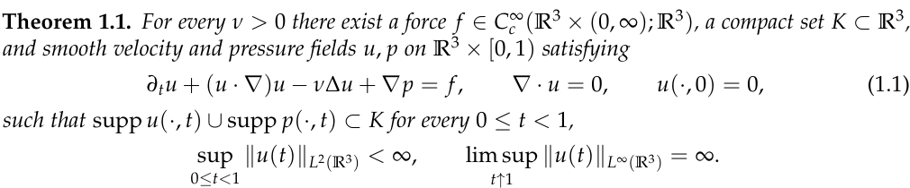<div class="ev39-label">Formalization <span class="exp-muted">· Lean source excerpt</span></div><pre class="ev39-lean">theorem periodic_corollary :
  breakdownStatement := by
  intro ν hν
  obtain ⟨u, p, f, K, hc, _, hrest⟩ :=
    NavierStokesR3.
      theorem_1_1_with_initial_rest ν hν
  …</pre></div>
<div class="ev39-card"><div class="ev39-headline">Published AI-generated<br>proposed solution</div><div class="ev39-row"><b>Problem</b><span>Navier–Stokes<br>smooth forcing · C / D</span></div><div class="ev39-row"><b>AI contribution</b><span>Proposed proof + formalization</span></div><div class="ev39-row"><b>Human contribution</b><span>Direction, resource allocation, publication</span></div><div class="ev39-row fragment" data-fragment-index="1"><b>Verification artifact</b><span>Paper + Lean repository</span></div><div class="ev39-row ev39-status fragment" data-fragment-index="2"><b>Status</b><span>Published 8 Sep 2026<br>No prize claimed</span></div></div>
</div>
<div class="exp-takeaway fragment" data-fragment-index="2">Claim → artifact → verification → external recognition</div>
<div class="exp-source">OpenAI, On the Navier–Stokes Millennium Prize Problem (8 Sep 2026) · Paper p. 1 · openai/NavierStokesAndEuler</div>
```

::: {.notes}
На слайде пересказывается опубликованное заявление OpenAI и показаны доступные артефакты. Это не собственное математическое заключение преподавателя. Результат относится к исследовательской системе из публикации. Авторы заявляют конечновременную сингулярность при гладкой внешней силе и ограниченной энергии — варианты C и D официальной постановки, а не решение невынужденного случая. [@exp39_report; @exp39_paper]

Слева — настоящий фрагмент страницы 1 статьи и точная выдержка из `NavierStokes/PeriodicPaperTheorem.lean`, строки 155–158, с переносом длинного имени и многоточием вместо продолжения. Lean-репозиторий является опубликованным проверочным артефактом; собственная сборка доказательства здесь не выполнялась. [@exp39_lean]

Вклад человека включает выбор направлений, перераспределение ресурсов, передачу промежуточных результатов и решение о публикации. OpenAI прямо заявила, что не намерена претендовать на Millennium Prize. Публикация и формализация не подменяют процедуру внешнего признания. [@exp39_report]

Источники: [Публикация OpenAI](https://openai.com/index/navier-stokes-solution/); [статья, страница 1](https://cdn.openai.com/pdf/32d9f210-8b73-45e0-91bc-82a30aef8a9a/navier-stokes.pdf#page=1); [Lean-артефакт](https://github.com/openai/NavierStokesAndEuler/blob/main/NavierStokes/PeriodicPaperTheorem.lean).
:::

## Evidence #2: software engineering {#exp40-software-evidence .exp-slide .ev40 background-color="#ffffff"}

```{=html}
<div class="exp-body">
<div class="ev40-strip"><div class="ev40-frame"><h3>Issue</h3><p>Nested models lose separability</p><small>SWE-bench Lite<br>astropy__astropy-12907</small></div><div class="exp-arrow">→</div><div class="ev40-frame"><h3>Repository</h3><pre>astropy/
  modeling/
    separable.py
    tests/</pre><small>Inspect <code>_cstack</code></small></div><div class="exp-arrow fragment" data-fragment-index="1">→</div><div class="ev40-frame fragment" data-fragment-index="1"><h3>Patch</h3><pre>cright[ … ] =
<span class="ev40-diff-minus">− 1</span>
<span class="ev40-diff-plus">+ right</span></pre><small>Benchmark reference patch<br>slice abbreviated</small></div><div class="exp-arrow fragment" data-fragment-index="2">→</div><div class="ev40-frame ev40-tests fragment" data-fragment-index="2"><h3>Tests</h3><small>Isolated reproducer</small><strong>FAIL → PASS</strong><small>Preserve the nested<br>dependency matrix</small></div></div>
<div class="ev40-review fragment" data-fragment-index="3"><div><h3>Workflow,<br>not just code completion</h3><p>Parallel tasks → review changes</p></div>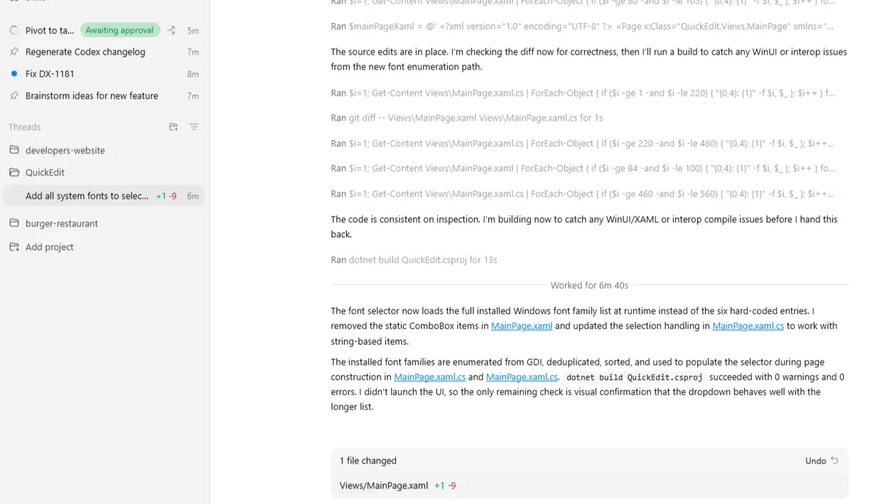</div>
</div>
<div class="exp-takeaway">A repository change becomes evidence when we execute a check.</div>
<div class="exp-source">SWE-bench Lite: astropy__astropy-12907 · Isolated reproduction: 23 Sep 2026 · Codex official UI: 4 Mar 2026</div>
```

::: {.notes}
Сначала видны задача и репозиторий. Клики раскрывают patch, проверку и интерфейс принятия работы. SWE-bench оценивает исправления настоящих issues в контексте репозитория с исполняемыми проверками. [@exp40_swebench]

Конкретный пример взят из SWE-bench Lite: `astropy__astropy-12907`. В `_cstack` вложенная матрица зависимостей ошибочно заменялась единицами. Эталонный patch сохраняет `right`. Здесь показан reference patch датасета, а не результат прогона конкретного AI. В подписи diff многоточие сокращает индекс среза, но сохраняет смысл единственного изменения. [@exp40_dataset]

FAIL → PASS получено при выполнении оригинальной функции `_cstack` на изолированном массивном примере до и после эталонного исправления. Это не запуск полного Astropy или SWE-bench harness и не оценка модели. Команда, исходник и вывод сохранены рядом с изображениями в `assets/final/part_38_43/`. Такая проверка даёт предметное свидетельство об этой ветви функции, но не доказывает отсутствие всех ошибок.

Внизу — подлинный фрагмент официального скриншота Codex for Windows, опубликованного в changelog 4 марта 2026. Несколько задач, отчёт о сборке и сводка изменённого файла показывают организацию работы. Это отдельный продуктовый пример, не интерфейс выполнения приведённого Astropy issue. [@exp40_codex; @exp40_changelog]

Источники: [SWE-bench](https://www.swebench.com/SWE-bench/); [датасет SWE-bench Lite](https://huggingface.co/datasets/princeton-nlp/SWE-bench_Lite); [Codex app](https://openai.com/index/introducing-the-codex-app/); [официальный changelog](https://learn.chatgpt.com/docs/changelog).
:::

## Evidence #3: multimodal world understanding {#exp41-world-evidence .exp-slide .ev41 background-color="#ffffff"}

```{=html}
<div class="exp-body ev41-layout"><div class="ev41-old"><div class="exp-kicker">Fixed-label perception</div><div class="ev41-output">cat</div><small>Illustrative classifier output</small></div><div class="exp-arrow">⟶</div><div><div class="ev41-sequence-title">Project Astra <span class="exp-muted">· official 2025 demo excerpt</span></div><div class="ev41-sequence"><div class="ev41-stage fragment" data-fragment-index="1"><h3>Scene</h3><p>See the current setting<br>2025 demo · frame 1</p></div><div class="ev41-stage fragment" data-fragment-index="2"><h3>Dialogue</h3><p>Respond in context<br>2025 demo · frame 2</p></div><div class="ev41-stage fragment" data-fragment-index="3"><h3>Memory</h3><p>Retrieve relevant context<br>2025 demo · frame 3</p></div></div><div class="ev41-context fragment" data-fragment-index="3"><div class="ev41-gpt">GPT-4o</div><div><p>Audio + vision + text in real-time interaction</p><small>OpenAI demonstration · 13 May 2024</small></div></div></div></div>
<div class="exp-takeaway">From a label to an ongoing interaction.</div>
<div class="exp-source">Google DeepMind, Project Astra demo (2025), Universal AI assistant (20 May 2025) · OpenAI, Hello GPT-4o (13 May 2024)</div>
```

::: {.notes}
Слева — учебный пример интерфейса классификации: фотография кошки и подпись `cat`. Это иллюстрация, не измеренный ответ AlexNet. Фото Chelsea взято из открытых sample data scikit-image.

Справа три последовательных кадра официального ролика Project Astra на сайте Google DeepMind: 1, 3 и 8 секунд короткого teaser, связанного с демонстрацией 2025 года. Видны рабочее место, ответ на телефоне и переход к руководству велосипеда. Подписи Scene / Dialogue / Memory описывают более широкий класс возможностей по сопровождающему первоисточнику. Статичные кадры сами по себе не доказывают наличие долговременной памяти; в источнике отдельно описаны retrieval и multimodal memory. [@exp41_astra; @exp41_universal]

Демонстрации 2024 и 2025 годов показывают переход от единичного распознавания к взаимодействию с видео, речью и контекстом. GPT-4o — второй пример мультимодального взаимодействия, а не та же система. Здесь речь о Google Project Astra, не о модели OpenAI GPT-6 Astra. Демонстрация — конкретный сценарий, не гарантия надёжности во всех реальных условиях. [@exp41_gpt4o; @exp41_astra2024]

Источники: [Project Astra и официальный ролик](https://deepmind.google/models/project-astra/); [Universal AI assistant, 2025](https://blog.google/innovation-and-ai/models-and-research/google-deepmind/gemini-universal-ai-assistant/); [Astra, 2024](https://blog.google/innovation-and-ai/products/google-gemini-update-flash-ai-assistant-io-2024/); [Hello GPT-4o](https://openai.com/index/hello-gpt-4o/).
:::

## From models to agents {#exp42-agents .exp-slide .ev42 background-color="#ffffff"}

```{=html}
<div class="exp-body"><div class="ev42-linear">Prompt → Model → Response</div><svg class="ev42-loop" viewBox="0 0 1490 550" role="img" aria-label="Agent observes, plans, acts and observes again, guided by a goal, memory, tools and human constraints."><defs><marker id="ev42-arrow" markerWidth="9" markerHeight="9" refX="8" refY="4" orient="auto"><path d="M0 0L8 4L0 8" fill="none" stroke="currentColor" stroke-width="1.5"/></marker></defs><rect x="485" y="82" width="305" height="85" class="ev42-node"/><text x="638" y="135">Reason / Plan</text><rect x="418" y="237" width="250" height="94" class="ev42-goal"/><text x="543" y="295">Goal</text><rect x="104" y="233" width="250" height="94" class="ev42-node"/><text x="229" y="291">Observe</text><path d="M228 233V125H465" class="ev42-arrow"/><g class="fragment ev42-action" data-fragment-index="1"><rect x="772" y="233" width="250" height="94" class="ev42-node"/><text x="897" y="291">Act</text><path d="M790 125H896V213" class="ev42-arrow"/><path d="M1022 279H1100" class="ev42-arrow"/><rect x="1118" y="170" width="267" height="226" class="ev42-side"/><text x="1251" y="224">Search</text><text x="1251" y="291">Code</text><text x="1251" y="358">Browser</text></g><g class="fragment" data-fragment-index="2"><path d="M897 327V422H229V347" class="ev42-arrow"/><text x="551" y="460" class="ev42-side-text">Result / new observation</text></g><g class="fragment" data-fragment-index="3"><path d="M228 233V125H465" class="ev42-arrow"/><rect x="42" y="474" width="290" height="65" class="ev42-side"/><text x="187" y="515" class="ev42-side-text">Memory / State</text><path d="M189 474V350 M104 280H23V125H485" class="ev42-link"/><rect x="1055" y="470" width="360" height="65" class="ev42-side"/><text x="1235" y="497" class="ev42-side-text">Human approval</text><text x="1235" y="525" class="ev42-side-text">/ Constraints</text><path d="M1055 502H972V327" class="ev42-link"/></g></svg></div>
<div class="exp-takeaway fragment" data-fragment-index="3">An agent adapts its next step to what happened.</div>
<div class="exp-source">Yao et al., ReAct (2022/2023) · Google, Gemini 2.0 (11 Dec 2024) · OpenAI, Computer-Using Agent (23 Jan 2025)</div>
```

::: {.notes}
Маленькая схема показывает одиночный ответ модели. Первый клик добавляет действие и инструменты; линейная схема уменьшается. Второй клик возвращает последствия действия в наблюдение. Третий раскрывает состояние, ограничения и возможность продолжить планирование.

Агент определяется организацией поведения: система получает последствия действия и использует их при выборе следующего шага. Длинный ответ и сам факт наличия API ещё не задают такого цикла. ReAct чередует reasoning, action и observation; Computer-Using Agent описывает взаимодействие с интерфейсом через восприятие, действие и новое наблюдение. [@exp42_react; @exp42_cua]

Goal, Memory / State и внешние ограничения — обобщающая авторская схема, а не раскрытая архитектура конкретной закрытой модели. Инструменты Search, Code и Browser расширяют доступные действия. В практической системе часть действий ограничивается правилами или требует человеческого подтверждения. [@exp42_gemini]

Источники: [ReAct](https://arxiv.org/abs/2210.03629); [Computer-Using Agent](https://openai.com/index/computer-using-agent/); [Gemini 2.0](https://blog.google/innovation-and-ai/models-and-research/google-deepmind/google-gemini-ai-update-december-2024/).
:::

## And you can use this now {#exp43-use-agents .exp-slide .ev43 background-color="#ffffff"}

```{=html}
<div class="exp-body"><div class="ev43-evolution"><span>Models</span><span class="fragment" data-fragment-index="1">→ Agents</span><span class="fragment ev43-teams" data-fragment-index="2">→ Teams of Agents</span></div><div class="ev43-actionline fragment" data-fragment-index="2">Delegate → Run in parallel → Review</div><div class="ev43-products fragment" data-fragment-index="2"><div><div class="ev43-caption">Codex · official UI excerpt · 4 Mar 2026</div></div><div><div class="ev43-caption">Project Mariner · demo · 20 May 2025</div></div></div></div>
<div class="exp-source">OpenAI, Introducing the Codex app (2 Feb 2026), official changelog · Google DeepMind, Universal AI assistant (20 May 2025)</div>
```

::: {.notes}
Это переход к практике. Теперь вопрос — как сформулировать работу, задать критерий готовности, ограничить полномочия и проверить результат. Принятие выполненной работы остаётся отдельным этапом.

Codex app представлен как интерфейс для нескольких агентов, раздельных задач, параллельной работы и просмотра изменений. Здесь использован подлинный скриншот официального changelog для Windows от 4 марта 2026 года; кадр обрезан до рабочей области. [@exp40_codex; @exp40_changelog]

Project Mariner показан как отдельный браузерный пример. В публикации 20 мая 2025 Google описывала систему агентов, способную выполнять до десяти задач одновременно. Кадр взят на 8-й секунде официального UI-demo из той публикации. Продукты не представлены как единая интеграция; изображение одного задания Mariner само по себе не показывает все десять. [@exp41_universal]

Источники: [Codex app](https://openai.com/index/introducing-the-codex-app/); [официальный Codex changelog](https://learn.chatgpt.com/docs/changelog); [Universal AI assistant / Project Mariner](https://blog.google/innovation-and-ai/models-and-research/google-deepmind/gemini-universal-ai-assistant/).
:::
