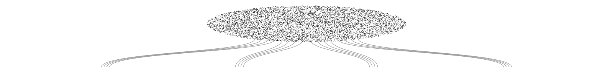
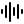
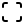
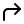
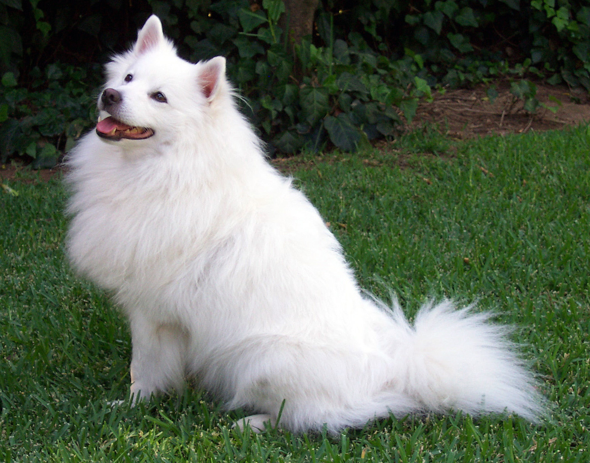

## Modern AI {#lecture-01-agenda .lecture-cover background-color="#0a0a0a"}

:::: {.hero-container .hero-minimal-split}

::: {.hero-main}
<div class="hero-kicker">Lecture 01</div>
<div class="hero-title">Modern AI</div>
<div class="hero-subtitle">Introduction</div>
:::

::: {.lecture-agenda}
<h3>Agenda</h3>

1. What AI systems can do
2. Vision, language & image generation
3. Reasoning, training & inference
4. AGI, reliability & evaluation
5. Frontier systems & scaling limits
6. Agents, science & open problems

:::

::::

::: {.notes}
Сегодня разберём, как устроены современные AI-системы и что позволяет оценить их возможности. Начнём с примеров результатов, затем проследим развитие представлений в зрении и языке и их объединение в мультимодальных моделях. Затем разберём генерацию изображений: зашумление и обучение, sampling, flow matching и дистилляцию. Обсудим reasoning, обучение и вычисления во время решения задачи. После этого отделим возможности от надёжности и автономности, рассмотрим современные системы и ограничения масштабирования. Завершим агентами, научными задачами и открытыми вопросами.
:::

## This should not be possible {#this-should-not-be-possible .imo-opener background-color="#ffffff"}

::: {.imo-claim}
Gold-medal level at the<br>International Mathematical Olympiad
:::

::: {.imo-summary}
5 / 6 problems · 35 / 42 points
:::

::: {.imo-caption}
Problem in natural language → reasoning → proof
:::

:::: {.imo-evidence}

::: {.imo-problem}
<div class="imo-problem-label">IMO problem 4</div>

Take a positive integer. Add its three largest positive divisors smaller than itself:

$$
a_{n+1}=d_1+d_2+d_3
$$

**Which starting values allow this forever?**

<div class="imo-problem-condition">At every step, three such divisors must exist.</div>
:::

<div class="imo-arrow" aria-hidden="true">→</div>
<div class="imo-model">Reasoning model</div>
<div class="imo-arrow" aria-hidden="true">→</div>
<div class="imo-proof">proof <span aria-label="verified">✓</span></div>

::::

::: {.imo-result aria-label="35 out of 42 points, gold-medal level"}
<div class="imo-score">35 <span>/</span> 42</div>
<div class="imo-gold">GOLD</div>
:::

::: {.imo-question .fragment .fade-in fragment-index="1"}
How did next-token prediction turn into this?
:::

<div class="imo-footer">International Mathematical Olympiad · 2025</div>
<div class="imo-attribution">Gemini Deep Think · Google DeepMind</div>

::: {.notes}

Показать результат, дать аудитории несколько секунд рассмотреть условие и оценку. Здесь пока не объяснять устройство модели. После паузы нажать → или Space: появится вопрос «How did next-token prediction turn into this?».

Это результат продвинутой исследовательской версии Gemini Deep Think от Google DeepMind на IMO 2025. Система получила 35 из 42 баллов, полностью решив пять из шести задач. Координаторы IMO оценили представленные доказательства по тем же критериям, что работы участников. Условия и доказательства были на естественном языке, а соблюдение конкурсного лимита времени заявлено DeepMind. [@deepmind_imo2025]

Слева — краткий пересказ настоящей задачи № 4. Нужно найти все положительные целые начальные значения бесконечной последовательности. Каждый следующий член равен сумме трёх наибольших положительных делителей предыдущего, меньших самого числа. На каждом шаге такие три различных делителя должны существовать. В формуле $d_1>d_2>d_3$ обозначают три наибольших собственных делителя текущего $a_n$; они определяются заново на каждом шаге. Например, для 72 это 36, 24 и 18, поэтому следующий член равен 78. Это пересказ условия с сохранением ограничений, а не цитата или снимок оригинального листа. Доказательство Gemini для задачи № 4 опубликовано на страницах 9–10. [@imo2025_problems; @gemini_imo2025_solutions]

Точность формулировки: GOLD означает уровень результата, соответствующий золотой медали, а не медаль официального участника. IMO удостоверила качество представленных решений, но не проверяла способ их получения, вычислительные ресурсы или отсутствие человеческого участия. Самостоятельность процесса описывать как заявление разработчика. Это олимпиадные задачи с известными организаторам решениями, а не открытые проблемы математики. [@imo2025_ai_statement]

Источники:

- [Google DeepMind: результат и условия, 21 июля 2025](https://deepmind.google/blog/advanced-version-of-gemini-with-deep-think-officially-achieves-gold-medal-standard-at-the-international-mathematical-olympiad/).
- [Официальные условия IMO 2025, задача 4, страница 2](https://www.imo-official.org/assets/documents/problems/2025/2025_eng.pdf).
- [Опубликованные доказательства Gemini, задача 4, страницы 9–10](https://storage.googleapis.com/deepmind-media/gemini/IMO_2025.pdf).
- [Заявление организаторов IMO о проверке AI-решений, 19 июля 2025](https://imo2025.au/wp-content/uploads/2025/07/IMO-2025_ClosingDayStatement-19072025.pdf).

:::

## AI can discover what we didn’t know {#ai-can-discover .discovery-slide background-color="#ffffff"}

<div class="discovery-loop">generate → run → evaluate → improve</div>

::: {.discovery-reveal .fragment .fade-in fragment-index="1"}
<div class="discovery-rhetoric">“The answer was not in the training data.”</div>
<div class="discovery-qualification">About the novelty of the result, not the contents of the training set.</div>
:::

```{=html}
<div class="discovery-comparison" role="img" aria-label="Scalar multiplications in bilinear algorithms for complex 4 by 4 matrices: 49, the previous best from Strassen in 1969, to 48, discovered by AlphaEvolve in 2025.">
  <div class="discovery-before">
    <div class="discovery-year">1969</div>
    <div class="discovery-number">49</div>
    <div class="discovery-label">best known</div>
  </div>
  <div class="discovery-arrow" aria-hidden="true"></div>
  <div class="discovery-after">
    <div class="discovery-year">2025</div>
    <div class="discovery-number">48</div>
    <div class="discovery-label">AI-discovered</div>
  </div>
</div>
```

<div class="discovery-unit">scalar multiplications · bilinear algorithms</div>
<div class="discovery-domain">4×4 complex matrix multiplication</div>
<div class="discovery-attribution">AlphaEvolve · Google DeepMind</div>

::: {.notes}

Сначала показать только переход 49 → 48. В предыдущем примере AI решал олимпиадные задачи, решения которых были известны организаторам. Здесь речь о новом алгоритмическом результате.

Числа обозначают скалярные умножения в билинейных алгоритмах для двух комплексных матриц $4\times4$. Рекурсивное применение алгоритма Штрассена 1969 года даёт $7^2=49$ умножений. В 2025 году поиск AlphaEvolve нашёл точное разложение ранга 48. «Best known» относится к прежнему результату в этой постановке. Вне класса таких разложений существовали схемы с менее чем 49 умножениями; общее заявление «умножение матриц впервые улучшили с 1969 года» было бы неверным. 48 не означает число всех арифметических операций, доказанный минимум или измеренное ускорение на GPU. [@final_alphaevolve_paper]

Человек задаёт проблему, стартовую программу и функцию оценки. Модели Gemini предлагают изменения поискового кода; исполнение и оценка кандидатов направляют следующие итерации. Формула на слайде «generate → run → evaluate → improve» описывает весь цикл системы. [@final_alphaevolve_blog]

Корректность опубликованного разложения проверяется восстановлением тензора умножения из коэффициентов. В официальном notebook используется точное сравнение `np.array_equal`, а не только тесты на случайных матрицах. [@final_alphaevolve_results]

Главный переход, произнести устно: **Prediction has become search. Search plus verification can become discovery.** Предсказание используется как генератор кандидатов внутри поиска; проверка связывает поиск с условием задачи.

После объяснения нажать → или Space. Фраза «The answer was not in the training data» дана в кавычках как риторическая формулировка о новом алгоритме. Оговорку под ней произнести вслух: новизна результата не доказывает отсутствие любых связанных материалов или самого ответа в обучающем корпусе. Источники не предоставляют аудит training data. Проверка математической корректности также сама по себе не устанавливает историческую новизну.

Источники:

- [AlphaEvolve: техническая статья, §3.1, таблица 2 и сноска 2](https://arxiv.org/html/2506.13131v1).
- [Google DeepMind: анонс AlphaEvolve, 14 мая 2025](https://deepmind.google/blog/alphaevolve-a-gemini-powered-coding-agent-for-designing-advanced-algorithms/).
- [Официальные коэффициенты и проверка результата](https://github.com/google-deepmind/alphaevolve_results/blob/main/mathematical_results.ipynb).

:::

## A 90-year-old problem. {#massive-parallel-search .ns-search-slide background-color="#ffffff"}

<div class="ns-kicker">NAVIER–STOKES · MILLENNIUM PRIZE PROBLEM</div>
<div class="ns-agent-count">~10,000 <span>AI agents</span></div>



```{=html}
<div class="ns-metrics" aria-label="Reported resources for the Navier–Stokes effort">
  <div class="ns-metric"><div class="ns-metric-value">2.7M</div><div class="ns-metric-label">messages</div></div>
  <div class="ns-metric"><div class="ns-metric-value">130B</div><div class="ns-metric-label">output tokens</div></div>
  <div class="ns-metric"><div class="ns-metric-value">88h</div><div class="ns-metric-label">to solution</div></div>
  <div class="ns-metric"><div class="ns-metric-value">+17h</div><div class="ns-metric-label">Lean formalization</div></div>
</div>
```

:::: {.ns-proof-flow}

::: {.ns-proof-card}
<div class="ns-proof-label">PROPOSED PROOF <span>· Theorem 1.1 · smooth forcing</span></div>

$$
\sup_{0\le t<1}\|u(t)\|_{L^2(\mathbb{R}^3)}<\infty,
\qquad
\limsup_{t\uparrow1}\|u(t)\|_{L^\infty(\mathbb{R}^3)}=\infty
$$

:::

<div class="ns-proof-arrow" aria-hidden="true">→</div>
<div class="ns-lean" aria-label="Lean formal verification">Lean ✓</div>

::::

<div class="ns-takeaway">Massive parallel search → proposed proof → formal verification</div>
<div class="ns-cost-note">GPU count, GPU-hours and dollar cost were not disclosed in the announcement or paper.</div>
<a class="ns-attribution" href="https://openai.com/index/navier-stokes-solution/">OpenAI · September 2026</a>

::: {.notes}

Главный тезис: **The breakthrough was not one brilliant answer. It was massive parallel search + verification.** Показать масштаб параллельного поиска, затем перевести внимание с количества агентов на проверку результата.

По отчёту OpenAI от 8 сентября 2026 года, группа Navier–Stokes включала около 10 000 одновременно работающих агентов. 2,7 млн сообщений и около 130 млрд выходных токенов относятся именно к этой задаче. 88 часов отсчитывались от запуска первых агентов до найденного решения, а ещё 17 часов заняли формализация и проверка. Поиск выполняла внутренняя модель, GPT-6 Astra использовалась для Lean. Человек направлял группы и распределял ресурсы; Codex помогал объединять промежуточные результаты. [@final_openai_navier_report]

Весь эксперимент по нескольким задачам составил 4,9 млн сообщений и около 300 млрд выходных токенов. Эти значения не подменяют показатели Navier–Stokes. В проверенных анонсе и статье не указаны число GPU, GPU-часы и долларовая стоимость. Их нельзя вывести непосредственно из числа агентов или токенов.

Карточка содержит фрагмент утверждения Theorem 1.1, а не полное доказательство. Авторы заявляют для трёхмерных уравнений с гладкой внешней силой, при любой положительной вязкости, решение с нулевой начальной скоростью, ограниченной энергией и неограниченной скоростью при $t\uparrow1$. Статья адресует варианты C и D постановки Clay; это не утверждение о невынужденных Navier–Stokes. [@final_openai_navier_paper]

Формализация опубликована в официальном репозитории. Значок Lean отмечает опубликованную формальную проверку по сообщению авторов; в рамках подготовки лекции собственная сборка доказательства не выполнялась. [@final_openai_navier_lean]

Статус: proposed proof, без объявления присуждённой Millennium Prize. OpenAI сообщает, что не намерена претендовать на приз. Формальное признание следует процедуре Clay Mathematics Institute. [@final_openai_navier_report; @final_clay_prize_rules]

Облако — схема масштаба, а не журнал исполнения. Оно содержит 10 000 точек; расположение точек и разветвления иллюстративны. Число агентов в источнике приблизительное, а схема не задаёт соответствие «один агент — один GPU».

Источники:

- [OpenAI, анонс от 8 сентября 2026](https://openai.com/index/navier-stokes-solution/).
- [Finite Time Blowup for Navier–Stokes, Theorem 1.1, страница 1](https://cdn.openai.com/pdf/32d9f210-8b73-45e0-91bc-82a30aef8a9a/navier-stokes.pdf#page=1).
- [Официальная Lean-формализация](https://github.com/openai/NavierStokesAndEuler).
- [Правила Millennium Prize](https://www.claymath.org/millennium-problems/rules/).

:::

## Intelligence used to be fragmented {#fragmented-intelligence .fragmented-slide background-color="#ffffff"}

```{=html}
<div class="fragmented-grid">
  <div class="fragmented-island" role="group" aria-label="Vision: image to CNN to class">
    <div class="fragmented-modality">VISION</div>
    <div class="fragmented-process">
      <div class="fragmented-stage">
        <div class="fragmented-stage-main"></div>
        <div class="fragmented-stage-caption">image</div>
      </div>
      <div class="fragmented-arrow" aria-hidden="true">→</div>
      <div class="fragmented-stage fragmented-model">
        <div class="fragmented-stage-main">CNN</div>
        <a class="fragmented-stage-caption" href="https://papers.nips.cc/paper_files/paper/2012/hash/c399862d3b9d6b76c8436e924a68c45b-Abstract.html">AlexNet · 2012</a>
      </div>
      <div class="fragmented-arrow" aria-hidden="true">→</div>
      <div class="fragmented-stage">
        <div class="fragmented-stage-main fragmented-output">Samoyed</div>
        <div class="fragmented-stage-caption">class</div>
      </div>
    </div>
  </div>
  <div class="fragmented-island" role="group" aria-label="Language: text to encoder to sentiment classification">
    <div class="fragmented-modality">LANGUAGE</div>
    <div class="fragmented-process">
      <div class="fragmented-stage">
        <div class="fragmented-stage-main fragmented-text">“A great<br>film.”</div>
        <div class="fragmented-stage-caption">text</div>
      </div>
      <div class="fragmented-arrow" aria-hidden="true">→</div>
      <div class="fragmented-stage fragmented-model">
        <div class="fragmented-stage-main">Encoder</div>
        <a class="fragmented-stage-caption" href="https://aclanthology.org/N19-1423/">BERT · 2018/19</a>
      </div>
      <div class="fragmented-arrow" aria-hidden="true">→</div>
      <div class="fragmented-stage">
        <div class="fragmented-stage-main fragmented-output">positive</div>
        <div class="fragmented-stage-caption">sentiment</div>
      </div>
    </div>
  </div>
  <div class="fragmented-island" role="group" aria-label="Audio: waveform to speech model to transcript">
    <div class="fragmented-modality">AUDIO</div>
    <div class="fragmented-process">
      <div class="fragmented-stage">
        <div class="fragmented-stage-main"></div>
        <div class="fragmented-stage-caption">waveform</div>
      </div>
      <div class="fragmented-arrow" aria-hidden="true">→</div>
      <div class="fragmented-stage fragmented-model">
        <div class="fragmented-stage-main fragmented-generic">Speech<br>model</div>
        <div class="fragmented-stage-caption">recognition</div>
      </div>
      <div class="fragmented-arrow" aria-hidden="true">→</div>
      <div class="fragmented-stage">
        <div class="fragmented-stage-main fragmented-output">“hello”</div>
        <div class="fragmented-stage-caption">transcript</div>
      </div>
    </div>
  </div>
  <div class="fragmented-island" role="group" aria-label="Action: state to policy to movement">
    <div class="fragmented-modality">ACTION</div>
    <div class="fragmented-process">
      <div class="fragmented-stage">
        <div class="fragmented-stage-main"></div>
        <div class="fragmented-stage-caption">state</div>
      </div>
      <div class="fragmented-arrow" aria-hidden="true">→</div>
      <div class="fragmented-stage fragmented-model">
        <div class="fragmented-stage-main">Policy</div>
        <div class="fragmented-stage-caption">control</div>
      </div>
      <div class="fragmented-arrow" aria-hidden="true">→</div>
      <div class="fragmented-stage">
        <div class="fragmented-stage-main"></div>
        <div class="fragmented-stage-caption">turn right</div>
      </div>
    </div>
  </div>
</div>
<div class="fragmented-gaps fragment fade-in" data-fragment-index="1" aria-hidden="true">
  <span class="fragmented-gap-vertical"></span>
  <span class="fragmented-gap-left"></span>
  <span class="fragmented-gap-right"></span>
</div>
<div class="fragmented-takeaway">Separate inputs. Separate representations. Separate systems.</div>
```

::: {.notes}

После трёх современных результатов вернуться к тому, из каких отдельных направлений возникли мультимодальные системы. В каждом направлении были свои входные данные, обученные представления, прикладные задачи и метрики оценки. Одинаковая структура процессов подчёркивает сходство общей идеи, а раздельные рамки — отсутствие единого пространства между показанными системами.

VISION: AlexNet — конкретный архетип CNN-классификатора изображений с фиксированным набором из 1000 классов ImageNet. Подпись Samoyed иллюстрирует категориальный выход; это учебный пример, а не измерение точности. Оригинальная статья опубликована в 2012 году. [@final_alexnet]

LANGUAGE: BERT обучает двунаправленные представления текста; encoder с дополнительным выходным слоем дообучается для прикладных NLP-задач. На слайде показан один понятный пример — определение тональности. В статье также рассматриваются inference, question answering и tagging. BERT опубликован как препринт в 2018 году и как статья NAACL в 2019 году. Фраза и метка приведены для иллюстрации; это не пример из статьи. [@final_bert]

AUDIO и ACTION — обобщённые схемы распознавания речи и управления. Они не обозначают конкретные архитектуры или модели. Результаты речи уже могли быть текстовыми, а управление могло использовать зрение: слайд не утверждает, что исторически совсем не было мультимодальных исследований или межмодальных интерфейсов. Основной тезис — самостоятельность технологических направлений и их представлений.

По нажатию → или Space подсвечиваются пустые промежутки между четырьмя рамками. Перевести внимание аудитории с отдельных моделей на вопрос: как связать эти представления? Общую строку произнести как переход к следующей части лекции.

Референс-карта: `references/slides/slides_references.md`, раздел «Intelligence used to be fragmented». Композиция и процессы перерисованы для лекции.

Источники:

- [Krizhevsky, Sutskever, Hinton — ImageNet Classification with Deep Convolutional Neural Networks, 2012](https://papers.nips.cc/paper_files/paper/2012/hash/c399862d3b9d6b76c8436e924a68c45b-Abstract.html).
- [Devlin et al. — BERT: Pre-training of Deep Bidirectional Transformers for Language Understanding, NAACL 2019](https://aclanthology.org/N19-1423/).
- [Фотография собаки из официального примера PyTorch Hub для AlexNet](https://pytorch.org/hub/pytorch_vision_alexnet/); [исходный файл](https://github.com/pytorch/hub/blob/master/images/dog.jpg).
- [Пиктограммы Lucide: audio-lines, scan, corner-up-right](https://github.com/lucide-icons/lucide), ISC License; файл лицензии сохранён рядом с изображениями.

:::

<!-- BEGIN REQUESTED CONTINUATION -->

## Vision learned what to look for {#exp04-vision .exp-slide .rev-vision background-color="#ffffff"}

```{=html}
<div class="exp-body">
<svg viewBox="0 0 1496 555" role="img" aria-label="A bicycle photograph passes through learned transformations, becomes a feature vector, and enters a classifier. After the prediction, the true label is revealed; the classification error updates all learned layers.">
<defs><marker id="rev-vision-arrow" viewBox="0 0 10 10" refX="9" refY="5" markerWidth="6" markerHeight="6" orient="auto"><path d="M0 0L10 5L0 10Z" fill="currentColor"/></marker></defs>
<rect x="0" y="0" width="1496" height="48" class="rv-soft"/>
<text x="16" y="31" class="rv-small">Manual approach: features designed in advance</text>
<path d="M650 13V35" class="rv-rule"/>
<text x="684" y="31" class="rv-small">Neural network: features learned from data</text>
<text x="0" y="112" class="rv-stage">Image</text>
<text x="290" y="112" class="rv-stage">Learned transformations</text>
<text x="818" y="112" class="rv-stage">Feature vector</text>
<text x="1174" y="112" class="rv-stage">Classifier</text>
<image href="assets/final/revision_20260923/vision/bicycle.jpg" x="0" y="182" width="230" height="172" preserveAspectRatio="xMidYMid meet"/>
<path d="M242 266H274" class="rv-line" marker-end="url(#rev-vision-arrow)"/>
<rect x="290" y="142" width="446" height="252" class="rv-box"/>
<text x="309" y="174" class="rv-small">AlexNet · 2012</text>
<image href="assets/final/revision_20260923/vision/alexnet-fig3-detail.png" x="309" y="198" width="166" height="130" preserveAspectRatio="xMidYMid meet"/>
<text x="309" y="358" class="rv-tiny">Filters from Fig. 3</text>
<text x="309" y="382" class="rv-tiny rv-muted">learned from data</text>
<path d="M486 262H518" class="rv-line" marker-end="url(#rev-vision-arrow)"/>
<g fill="none" stroke="currentColor" stroke-width="2.3">
 <rect x="535" y="207" width="73" height="69"/><rect x="628" y="245" width="73" height="69"/>
 <path d="M550 256L570 229L591 255M551 219L594 263M550 265Q570 243 597 260"/>
 <path d="M641 293Q653 260 685 268M641 290Q660 287 687 303"/>
 <path d="M610 250L625 271"/>
</g>
<text x="535" y="358" class="rv-tiny">Combinations</text>
<text x="535" y="382" class="rv-tiny rv-muted">teaching schematic</text>
<path d="M748 266H798" class="rv-line" marker-end="url(#rev-vision-arrow)"/>
<rect x="818" y="233" width="286" height="65" class="rv-lime"/>
<text x="961" y="275" text-anchor="middle" class="rv-vector">0.2  −0.4  1.1  …</text>
<text x="961" y="338" text-anchor="middle" class="rv-representation">Image</text>
<text x="961" y="370" text-anchor="middle" class="rv-representation">representation</text>
<text x="961" y="400" text-anchor="middle" class="rv-tiny rv-muted">illustrative values</text>
<path d="M1117 266H1154" class="rv-line" marker-end="url(#rev-vision-arrow)"/>
<rect x="1174" y="217" width="322" height="97" class="rv-box"/>
<text x="1335" y="256" text-anchor="middle" class="rv-small">Features → class</text>
<text x="1335" y="288" text-anchor="middle" class="rv-small">probabilities</text>
<g class="fragment" data-fragment-index="1">
 <text x="1174" y="350" class="rv-tiny rv-muted">Illustrative prediction</text>
 <text x="1174" y="385" class="rv-result">“motorcycle”</text>
</g>
<g class="fragment" data-fragment-index="2">
 <rect x="1174" y="403" width="322" height="46" class="rv-lime"/>
 <text x="1186" y="434" class="rv-small">Label: “bicycle”</text>
 <path d="M1458 459V497H515V407" class="rv-back" marker-end="url(#rev-vision-arrow)"/>
 <path d="M1158 497V330H1335V317" class="rv-back" marker-end="url(#rev-vision-arrow)"/>
 <rect x="579" y="477" width="538" height="39" fill="white"/>
 <text x="848" y="503" text-anchor="middle" class="rv-small">Classification error</text>
 <text x="515" y="548" class="rv-feedback">Update all learned layers</text>
</g>
</svg>
</div>
<div class="exp-takeaway">The network learns an image representation and how to use it.</div>
<div class="exp-source"><a href="https://papers.nips.cc/paper_files/paper/2012/file/c399862d3b9d6b76c8436e924a68c45b-Paper.pdf">Krizhevsky et al., 2012 · §§3, 5 · Fig. 3, detail</a> · <a href="https://commons.wikimedia.org/wiki/File:Dutch_bicycle.jpg">Photo: Petar Milošević</a> · <a href="https://creativecommons.org/licenses/by-sa/4.0/">CC BY-SA 4.0</a></div>
```

::: {.notes}

«Мы не выписываем правило “если есть два колеса, это велосипед”. Мы показываем примеры и измеряем ошибку. Обучение меняет внутренние преобразования так, чтобы классифицировать становилось легче. Важно, что внутри возникает вектор признаков, а не только последнее слово “велосипед”».

Начать с небольшой полосы сверху: при ручном проектировании мы заранее выбираем измерения. В нейросети параметры преобразований изменяются по обучающим примерам. AlexNet — конкретный исторический пример этого принципа, а не начало перечня архитектур. Четыре стадии — учебное упрощение; в оригинальной сети пять свёрточных и три полносвязных обучаемых слоя, а выход задаёт распределение по 1000 классам. Представление и классификационная голова визуально разделены, хотя обучаются совместно. [@exp04_alexnet]

Внутри блока показаны 12 настоящих фильтров первого свёрточного слоя: первые четыре столбца верхних трёх строк Figure 3 из статьи. Это фильтры, выученные на ImageNet, а не отклики сети на данную фотографию. Следующие контуры обозначают условное комбинирование признаков: это учебная схема, не точная интерпретация каждого слоя. Числа в векторе также условны.

Первый клик раскрывает условное неверное предсказание “motorcycle”. Второй клик показывает настоящую метку “bicycle”, ошибку классификации и обратные стрелки к преобразованиям и классификатору: обновляются параметры всех обучаемых слоёв. Результат придуман для объяснения обучения; AlexNet на фотографии не запускался. В реальном обучении ошибка считается по предсказанному распределению вероятностей и целевой метке, а не только по совпадению последнего слова; обратное распространение вычисляет градиенты, после чего оптимизатор обновляет веса. В §5 описано обучение SGD с momentum. [@exp04_alexnet]

Источник фильтров: [Krizhevsky, Sutskever, Hinton, 2012, §§3 и 5, Figure 3, PDF p. 6](https://papers.nips.cc/paper_files/paper/2012/file/c399862d3b9d6b76c8436e924a68c45b-Paper.pdf). Фото [Dutch bicycle, Petar Milošević, 2018](https://commons.wikimedia.org/wiki/File:Dutch_bicycle.jpg), [CC BY-SA 4.0](https://creativecommons.org/licenses/by-sa/4.0/), уменьшено при показе, содержимое не изменено.

:::

## Transformer: every token gets context {#exp05-language .exp-slide .rev-attention background-color="#ffffff"}

```{=html}
<div class="exp-body">
<svg viewBox="0 0 1496 555" role="img" aria-label="Illustrative self-attention for Anna took an umbrella. It… Scores become normalized weights and mix value vectors. Then a feed-forward network transforms the vector. RNN states update sequentially, while Transformer positions within a layer can update in parallel during training.">
<defs><marker id="rev-att-arrow" viewBox="0 0 10 10" refX="9" refY="5" markerWidth="7" markerHeight="7" orient="auto-start-reverse"><path d="M0 0L10 5L0 10z" class="rev-att-fill"/></marker></defs>
<text x="0" y="20" class="rev-att-small">One position gathers available context</text>
<path d="M150 93 Q395 -32 648 89" class="rev-att-link"/>
<path d="M314 93 Q480 4 648 89" class="rev-att-link"/>
<path d="M478 93 Q564 42 648 89" class="rev-att-link rev-att-strong"/>
<path d="M683 85 C768 35 780 129 711 123" class="rev-att-link"/>
<text x="94" y="131" class="rev-att-token">Anna</text><text x="251" y="131" class="rev-att-token">took</text><text x="478" y="131" text-anchor="middle" class="rev-att-token" style="font-size:36px">an umbrella.</text>
<rect x="604" y="89" width="113" height="62" class="rev-att-lime"/><text x="660" y="132" text-anchor="middle" class="rev-att-token">It</text><text x="785" y="132" class="rev-att-token">…</text>
<text x="950" y="92" class="rev-att-small">Illustrative links and weights</text><text x="950" y="123" class="rev-att-small">Simplified token groups for readability</text>
<path d="M660 155V185" class="rev-att-line" marker-end="url(#rev-att-arrow)"/>
<rect x="0" y="194" width="1138" height="210" class="rev-att-box"/>
<text x="24" y="231" class="rev-att-label">Attention</text><text x="189" y="230" class="rev-att-small">gather context</text>
<g class="fragment" data-fragment-index="1">
 <text x="24" y="275" class="rev-att-stage">1   Compatibility scores</text>
 <text x="61" y="313" text-anchor="middle" class="rev-att-tiny">Anna</text><text x="136" y="313" text-anchor="middle" class="rev-att-tiny">took</text><text x="211" y="313" text-anchor="middle" class="rev-att-tiny">umbrella.</text><text x="286" y="313" text-anchor="middle" class="rev-att-tiny">It</text>
 <text x="61" y="350" text-anchor="middle">−0.4</text><text x="136" y="350" text-anchor="middle">0.3</text><text x="211" y="350" text-anchor="middle" class="rev-att-bold">1.7</text><text x="286" y="350" text-anchor="middle">−0.2</text>
 <text x="24" y="383" class="rev-att-tiny">Query for “It” × each key</text>
</g>
<g class="fragment" data-fragment-index="2">
 <path d="M330 326H362" class="rev-att-line" marker-end="url(#rev-att-arrow)"/>
 <text x="390" y="275" class="rev-att-stage">2   Normalize with softmax</text>
 <text x="427" y="313" text-anchor="middle" class="rev-att-tiny">Anna</text><text x="502" y="313" text-anchor="middle" class="rev-att-tiny">took</text><text x="577" y="313" text-anchor="middle" class="rev-att-tiny">umbrella.</text><text x="652" y="313" text-anchor="middle" class="rev-att-tiny">It</text>
 <rect x="545" y="323" width="65" height="38" class="rev-att-highlight"/>
 <text x="427" y="350" text-anchor="middle">0.08</text><text x="502" y="350" text-anchor="middle">0.16</text><text x="577" y="350" text-anchor="middle" class="rev-att-bold">0.66</text><text x="652" y="350" text-anchor="middle">0.10</text>
 <text x="390" y="383" class="rev-att-tiny">Rounded weights sum to 1</text>
</g>
<g class="fragment" data-fragment-index="3">
 <path d="M710 326H743" class="rev-att-line" marker-end="url(#rev-att-arrow)"/>
 <text x="771" y="275" class="rev-att-stage">3   Mix information</text>
 <text x="771" y="314" class="rev-att-mix">0.08 v₁ + 0.16 v₂</text><text x="771" y="349" class="rev-att-mix">+ <tspan class="rev-att-bold">0.66 v₃</tspan> + 0.10 v₄</text>
 <text x="771" y="383" class="rev-att-tiny">Values form one context vector</text>
 <path d="M1138 305H1191" class="rev-att-line" marker-end="url(#rev-att-arrow)"/>
 <rect x="1210" y="237" width="286" height="137" class="rev-att-box"/>
 <text x="1353" y="280" text-anchor="middle" class="rev-att-label">FFN</text><text x="1353" y="316" text-anchor="middle">transform</text><text x="1353" y="348" text-anchor="middle">the vector</text>
</g>
<path d="M0 439H1496" class="rev-att-divider"/>
<text x="0" y="480" class="rev-att-stage">RNN</text><text x="0" y="513" class="rev-att-small">sequential states</text>
<g class="rev-att-rnn">
 <rect x="216" y="466" width="58" height="43" class="rev-att-box"/><text x="245" y="495" text-anchor="middle">h₁</text><path d="M278 487H309" class="rev-att-line" marker-end="url(#rev-att-arrow)"/>
 <rect x="320" y="466" width="58" height="43" class="rev-att-box"/><text x="349" y="495" text-anchor="middle">h₂</text><path d="M382 487H413" class="rev-att-line" marker-end="url(#rev-att-arrow)"/>
 <rect x="424" y="466" width="58" height="43" class="rev-att-box"/><text x="453" y="495" text-anchor="middle">h₃</text><path d="M486 487H517" class="rev-att-line" marker-end="url(#rev-att-arrow)"/>
 <rect x="528" y="466" width="58" height="43" class="rev-att-box"/><text x="557" y="495" text-anchor="middle">h₄</text>
</g>
<text x="710" y="480" class="rev-att-stage">Transformer</text><text x="710" y="513" class="rev-att-small">parallel positions</text>
<g class="rev-att-parallel">
 <rect x="972" y="476" width="60" height="37" class="rev-att-lime"/><rect x="1067" y="476" width="60" height="37" class="rev-att-lime"/><rect x="1162" y="476" width="60" height="37" class="rev-att-lime"/><rect x="1257" y="476" width="60" height="37" class="rev-att-lime"/>
 <path d="M1002 453V472" class="rev-att-line" marker-end="url(#rev-att-arrow)"/><path d="M1097 453V472" class="rev-att-line" marker-end="url(#rev-att-arrow)"/><path d="M1192 453V472" class="rev-att-line" marker-end="url(#rev-att-arrow)"/><path d="M1287 453V472" class="rev-att-line" marker-end="url(#rev-att-arrow)"/>
 <text x="1002" y="502" text-anchor="middle">x′₁</text><text x="1097" y="502" text-anchor="middle">x′₂</text><text x="1192" y="502" text-anchor="middle">x′₃</text><text x="1287" y="502" text-anchor="middle">x′₄</text>
 <text x="1342" y="495" class="rev-att-tiny">one layer</text>
</g>
<text x="710" y="548" class="rev-att-small">Training parallelism ≠ generating all new tokens at once</text>
</svg>
</div>
<div class="exp-takeaway">Attention updates each representation using its available context.</div>
<div class="exp-source"><a href="https://arxiv.org/abs/1706.03762">Vaswani et al., 2017, §§3.1–3.3 and Figure 2</a>. Simplified single-head illustration, not measured model attention.</div>
```

::: {.notes}

«Transformer — это способ перерабатывать представления с учётом контекста. Но архитектура ещё не говорит, какую ошибку мы минимизируем: к этому перейдём дальше».

Вверху читаем «Anna took an umbrella. It…». Выделена позиция «It». Доступны предыдущие позиции и сама текущая позиция. Арки показывают поступление контекста к ней. Связи и числа иллюстративные: это не attention weights конкретной модели и не измеренное разрешение местоименной ссылки. Для читаемости здесь четыре условные группы: Anna, took, an umbrella. и It. В подписи третьей группы сокращённо указано umbrella. Реальный токенизатор разделяет артикль, слова и пунктуацию иначе.

Клик 1 раскрывает оценки совместимости запроса для «It» с ключами доступных позиций. В scaled dot-product attention это скалярные произведения, делённые на корень из размерности ключа. Клик 2 раскрывает softmax: для оценок −0.4, 0.3, 1.7, −0.2 получаются веса приблизительно 0.08, 0.16, 0.66, 0.10. Они неотрицательны и в сумме дают единицу. Клик 3 показывает взвешенную сумму value-векторов и FFN, который преобразует полученный вектор отдельно в каждой позиции. Индексы v₁–v₄ соответствуют порядку четырёх единиц фразы. Один head, residual connections, нормализация и выходная проекция упрощены ради одного понятного прохода. [@rev_attention_transformer]

Внизу сравниваем зависимости вычисления. В RNN очередное состояние требует предыдущее состояние этого же слоя. В Transformer представления всех доступных позиций для следующего слоя вычисляются из представлений предыдущего слоя, поэтому позиции одного слоя можно обрабатывать параллельно. Каузальная маска ограничивает доступный контекст, а не требует последовательного вычисления всех позиций во время обучения. Это не обещание линейной стоимости attention по длине последовательности.

Обязательно уточнить: параллельная обработка позиций при обучении не означает, что авторегрессионная модель генерирует весь ответ одновременно. Новые токены обычно появляются последовательно, каждый следующий зависит от уже полученных. Нижняя схема иллюстрирует организацию вычислений, а не фактическое расписание конкретного GPU.

Источник: [Vaswani et al., Attention Is All You Need, §§3.1–3.3, Figure 2 и §4](https://arxiv.org/html/1706.03762v7).

:::

## Images can become tokens too {#rev06a-image-tokens .exp-slide .rev-vit background-color="#ffffff"}

```{=html}
<div class="exp-body">
<svg viewBox="0 0 1496 555" role="img" aria-label="Two separate lanes. Text becomes text tokens, vectors with positions, and a Transformer. A bicycle image splits into a 3 by 3 grid, unfolds to nine patches, and becomes equal-sized vectors plus position embeddings for a separate Transformer of the same architectural type.">
<defs><marker id="rev-vit-arrow" viewBox="0 0 10 10" refX="9" refY="5" markerWidth="7" markerHeight="7" orient="auto"><path d="M0 0L10 5L0 10z" class="rev-vit-fill"/></marker></defs>
<text x="0" y="33" class="rev-vit-label">Text</text><text x="299" y="33" class="rev-vit-label">Tokens</text><text x="878" y="33" class="rev-vit-label">Vectors + positions</text>
<text x="0" y="136" class="rev-vit-text">a bicycle</text>
<path d="M219 122H261" class="rev-vit-line" marker-end="url(#rev-vit-arrow)"/>
<rect x="299" y="86" width="99" height="65" class="rev-vit-box"/><text x="348" y="130" text-anchor="middle" class="rev-vit-text">a</text>
<rect x="421" y="86" width="195" height="65" class="rev-vit-box"/><text x="519" y="130" text-anchor="middle" class="rev-vit-text">bicycle</text>
<text x="299" y="199" class="rev-vit-small">Illustrative text tokenization</text>
<path d="M745 122H838" class="rev-vit-line" marker-end="url(#rev-vit-arrow)"/>
<g class="rev-vit-vector"><rect x="928" y="86" width="28" height="70"/><path d="M928 100H956M928 114H956M928 128H956M928 142H956"/></g>
<g class="rev-vit-vector"><rect x="991" y="86" width="28" height="70"/><path d="M991 100H1019M991 114H1019M991 128H1019M991 142H1019"/></g>
<text x="942" y="191" text-anchor="middle" class="rev-vit-position">+ p₁</text><text x="1005" y="191" text-anchor="middle" class="rev-vit-position">+ p₂</text>
<path d="M1161 122H1209" class="rev-vit-line" marker-end="url(#rev-vit-arrow)"/>
<rect x="1230" y="79" width="266" height="89" class="rev-vit-transformer"/><text x="1363" y="132" text-anchor="middle" class="rev-vit-label">Transformer</text>
<path d="M0 246H1496" class="rev-vit-divider"/>
<text x="0" y="291" class="rev-vit-label">Image</text>
<image href="assets/final/revision_20260923/vision/bicycle.jpg" x="0" y="322" width="216" height="139.61" preserveAspectRatio="xMidYMid meet"/>
<g class="fragment" data-fragment-index="1">
 <rect x="0" y="322" width="216" height="139.61" class="rev-vit-grid"/><path d="M72 322V461.61M144 322V461.61M0 368.54H216M0 415.07H216" class="rev-vit-grid"/>
 <text x="0" y="499" class="rev-vit-small">3 × 3 patches</text>
</g>
<g class="fragment" data-fragment-index="2">
 <path d="M231 391H273" class="rev-vit-line" marker-end="url(#rev-vit-arrow)"/>
 <text x="299" y="291" class="rev-vit-label">Patch sequence</text>
<g class="rev-vit-patch" style="--rev-patch-i:0"><svg x="299" y="369" width="48" height="31.03" viewBox="0.0000 0.0000 1530.6667 989.3333"><image href="assets/final/revision_20260923/vision/bicycle.jpg" width="4592" height="2968"/></svg><rect x="299" y="369" width="48" height="31.03" class="rev-vit-patch-border"/><text x="323" y="436" text-anchor="middle" class="rev-vit-position">1</text></g>
<g class="rev-vit-patch" style="--rev-patch-i:1"><svg x="352" y="369" width="48" height="31.03" viewBox="1530.6667 0.0000 1530.6667 989.3333"><image href="assets/final/revision_20260923/vision/bicycle.jpg" width="4592" height="2968"/></svg><rect x="352" y="369" width="48" height="31.03" class="rev-vit-patch-border"/><text x="376" y="436" text-anchor="middle" class="rev-vit-position">2</text></g>
<g class="rev-vit-patch" style="--rev-patch-i:2"><svg x="405" y="369" width="48" height="31.03" viewBox="3061.3333 0.0000 1530.6667 989.3333"><image href="assets/final/revision_20260923/vision/bicycle.jpg" width="4592" height="2968"/></svg><rect x="405" y="369" width="48" height="31.03" class="rev-vit-patch-border"/><text x="429" y="436" text-anchor="middle" class="rev-vit-position">3</text></g>
<g class="rev-vit-patch" style="--rev-patch-i:3"><svg x="458" y="369" width="48" height="31.03" viewBox="0.0000 989.3333 1530.6667 989.3333"><image href="assets/final/revision_20260923/vision/bicycle.jpg" width="4592" height="2968"/></svg><rect x="458" y="369" width="48" height="31.03" class="rev-vit-patch-border"/><text x="482" y="436" text-anchor="middle" class="rev-vit-position">4</text></g>
<g class="rev-vit-patch" style="--rev-patch-i:4"><svg x="511" y="369" width="48" height="31.03" viewBox="1530.6667 989.3333 1530.6667 989.3333"><image href="assets/final/revision_20260923/vision/bicycle.jpg" width="4592" height="2968"/></svg><rect x="511" y="369" width="48" height="31.03" class="rev-vit-patch-border"/><text x="535" y="436" text-anchor="middle" class="rev-vit-position">5</text></g>
<g class="rev-vit-patch" style="--rev-patch-i:5"><svg x="564" y="369" width="48" height="31.03" viewBox="3061.3333 989.3333 1530.6667 989.3333"><image href="assets/final/revision_20260923/vision/bicycle.jpg" width="4592" height="2968"/></svg><rect x="564" y="369" width="48" height="31.03" class="rev-vit-patch-border"/><text x="588" y="436" text-anchor="middle" class="rev-vit-position">6</text></g>
<g class="rev-vit-patch" style="--rev-patch-i:6"><svg x="617" y="369" width="48" height="31.03" viewBox="0.0000 1978.6667 1530.6667 989.3333"><image href="assets/final/revision_20260923/vision/bicycle.jpg" width="4592" height="2968"/></svg><rect x="617" y="369" width="48" height="31.03" class="rev-vit-patch-border"/><text x="641" y="436" text-anchor="middle" class="rev-vit-position">7</text></g>
<g class="rev-vit-patch" style="--rev-patch-i:7"><svg x="670" y="369" width="48" height="31.03" viewBox="1530.6667 1978.6667 1530.6667 989.3333"><image href="assets/final/revision_20260923/vision/bicycle.jpg" width="4592" height="2968"/></svg><rect x="670" y="369" width="48" height="31.03" class="rev-vit-patch-border"/><text x="694" y="436" text-anchor="middle" class="rev-vit-position">8</text></g>
<g class="rev-vit-patch" style="--rev-patch-i:8"><svg x="723" y="369" width="48" height="31.03" viewBox="3061.3333 1978.6667 1530.6667 989.3333"><image href="assets/final/revision_20260923/vision/bicycle.jpg" width="4592" height="2968"/></svg><rect x="723" y="369" width="48" height="31.03" class="rev-vit-patch-border"/><text x="747" y="436" text-anchor="middle" class="rev-vit-position">9</text></g>
 <text x="299" y="499" class="rev-vit-small">Flatten each patch</text>
</g>
<g class="fragment" data-fragment-index="3">
 <path d="M789 391H838" class="rev-vit-line" marker-end="url(#rev-vit-arrow)"/>
 <text x="878" y="291" class="rev-vit-label">Vectors + positions</text>
<g class="rev-vit-vector"><rect x="860" y="348" width="28" height="70"/><path d="M860 362H888M860 376H888M860 390H888M860 404H888"/></g><text x="874" y="445" text-anchor="middle" class="rev-vit-position">+p₁</text>
<g class="rev-vit-vector"><rect x="893" y="348" width="28" height="70"/><path d="M893 362H921M893 376H921M893 390H921M893 404H921"/></g><text x="907" y="445" text-anchor="middle" class="rev-vit-position">+p₂</text>
<g class="rev-vit-vector"><rect x="926" y="348" width="28" height="70"/><path d="M926 362H954M926 376H954M926 390H954M926 404H954"/></g><text x="940" y="445" text-anchor="middle" class="rev-vit-position">+p₃</text>
<g class="rev-vit-vector"><rect x="959" y="348" width="28" height="70"/><path d="M959 362H987M959 376H987M959 390H987M959 404H987"/></g><text x="973" y="445" text-anchor="middle" class="rev-vit-position">+p₄</text>
<g class="rev-vit-vector"><rect x="992" y="348" width="28" height="70"/><path d="M992 362H1020M992 376H1020M992 390H1020M992 404H1020"/></g><text x="1006" y="445" text-anchor="middle" class="rev-vit-position">+p₅</text>
<g class="rev-vit-vector"><rect x="1025" y="348" width="28" height="70"/><path d="M1025 362H1053M1025 376H1053M1025 390H1053M1025 404H1053"/></g><text x="1039" y="445" text-anchor="middle" class="rev-vit-position">+p₆</text>
<g class="rev-vit-vector"><rect x="1058" y="348" width="28" height="70"/><path d="M1058 362H1086M1058 376H1086M1058 390H1086M1058 404H1086"/></g><text x="1072" y="445" text-anchor="middle" class="rev-vit-position">+p₇</text>
<g class="rev-vit-vector"><rect x="1091" y="348" width="28" height="70"/><path d="M1091 362H1119M1091 376H1119M1091 390H1119M1091 404H1119"/></g><text x="1105" y="445" text-anchor="middle" class="rev-vit-position">+p₈</text>
<g class="rev-vit-vector"><rect x="1124" y="348" width="28" height="70"/><path d="M1124 362H1152M1124 376H1152M1124 390H1152M1124 404H1152"/></g><text x="1138" y="445" text-anchor="middle" class="rev-vit-position">+p₉</text>
 <text x="878" y="499" class="rev-vit-small">Learned projection + position</text>
 <path d="M1161 391H1209" class="rev-vit-line" marker-end="url(#rev-vit-arrow)"/>
 <rect x="1230" y="348" width="266" height="89" class="rev-vit-transformer"/><text x="1363" y="401" text-anchor="middle" class="rev-vit-label">Transformer</text>
 <text x="1230" y="486" class="rev-vit-small">Same architecture type</text><text x="1230" y="516" class="rev-vit-small">Separate learned weights</text>
</g>
</svg>
</div>
<div class="exp-takeaway">Same processing format ≠ a shared semantic space.</div>
<div class="exp-source"><a href="https://arxiv.org/abs/2010.11929">Dosovitskiy et al., 2020/2021, Figure 1</a>. 3 × 3 grid is schematic. Photo: <a href="https://commons.wikimedia.org/wiki/File:Dutch_bicycle.jpg">Petar Milošević, CC BY-SA 4.0</a>.</div>
```

::: {.notes}

«Визуальный токен не обязан соответствовать предмету. Это может быть кусочек неба или часть колеса. И одинаковая архитектура сама по себе не делает вектор фотографии собаки сопоставимым с вектором слова “собака”. Связь между модальностями ещё нужно обучить».

Верхняя дорожка задаёт знакомый переход: текст, токены, векторы с позициями, Transformer. Разбиение «a bicycle» на две единицы иллюстративное и не привязано к определённому токенизатору.

Внизу сначала видно целую фотографию. Клик 1 накладывает сетку 3 × 3. Клик 2 разворачивает девять участков в последовательность слева направо, строка за строкой. Порядковые номера дают возможность проследить соответствие. Клик 3 превращает каждый развёрнутый участок в вектор одинаковой длины, добавляет позиционное представление pᵢ и отправляет последовательность в отдельный Transformer. Внутренние полосы вектора обозначают координаты, их оттенки не являются измеренными активациями.

В ViT каждый участок разворачивается в вектор пикселей и проходит обучаемую линейную проекцию. К полученному embedding добавляется позиционный вектор, чтобы сохранить информацию о расположении. Сетка 3 × 3 служит учебной иллюстрацией. Число участков и пропорции фотографии здесь не воспроизводят вход конкретного ViT. Classification token и голова классификации исходной статьи опущены, поскольку задача слайда — формат входа. [@rev_attention_vit]

Два Transformer нарисованы одинаково, но остаются двумя разными блоками. Мы утверждаем общность типа архитектуры, а не общие веса или автоматически сопоставимые пространства представлений. Даже одинаковая размерность не задаёт одинаковое значение координат. Это готовит вопрос, который далее решает совместное обучение CLIP.

Источники: [Dosovitskiy et al., An Image is Worth 16×16 Words, Figure 1 и §3.1](https://arxiv.org/html/2010.11929v2); [Vaswani et al., §3.5, позиционное кодирование текста](https://arxiv.org/html/1706.03762v7). Фото [Dutch bicycle, Petar Milošević](https://commons.wikimedia.org/wiki/File:Dutch_bicycle.jpg), 2018, [CC BY-SA 4.0](https://creativecommons.org/licenses/by-sa/4.0/). В учебной схеме фото разделено на девять прямоугольных участков, источник и автор указаны.

:::

## Self-supervision: the data provides the target {#exp06-self-supervision .exp-slide .rev-selfsup background-color="#ffffff"}

```{=html}
<div class="exp-body">
<svg viewBox="0 0 1496 555" role="img" aria-label="The source text, The cat sits on the mat, provides training pairs: The cat predicts sits; The cat sits predicts on; The cat sits on the predicts mat. Targets come from the source text. Below, one photograph provides two views whose representations should agree.">
<defs>
 <marker id="rev-selfsup-arrow" viewBox="0 0 10 10" refX="9" refY="5" markerWidth="6" markerHeight="6" orient="auto"><path d="M0 0L10 5L0 10Z" fill="currentColor"/></marker>
 <clipPath id="rev-selfsup-crop-a"><rect x="298" y="437" width="126" height="91"/></clipPath>
 <clipPath id="rev-selfsup-crop-b"><rect x="442" y="437" width="126" height="91"/></clipPath>
</defs>
<text x="0" y="24" class="rs-kicker">SOURCE TEXT</text>
<text x="0" y="88" class="rs-sentence">The cat sits on the mat</text>
<path d="M0 110H914" class="rs-rule"/>
<text x="30" y="154" class="rs-kicker">CONTEXT</text>
<text x="632" y="154" class="rs-kicker">TARGET NEXT TOKEN</text>
<g class="fragment fade-up" data-fragment-index="1">
 <text x="30" y="208" class="rs-pair">The cat</text><path d="M515 197H583" class="rs-line" marker-end="url(#rev-selfsup-arrow)"/>
 <rect x="632" y="171" width="282" height="53" class="rs-lime"/><text x="654" y="208" class="rs-pair">sits</text>
</g>
<g class="fragment fade-up" data-fragment-index="2">
 <text x="30" y="278" class="rs-pair">The cat sits</text><path d="M515 267H583" class="rs-line" marker-end="url(#rev-selfsup-arrow)"/>
 <rect x="632" y="241" width="282" height="53" class="rs-lime"/><text x="654" y="278" class="rs-pair">on</text>
</g>
<g class="fragment fade-up" data-fragment-index="3">
 <text x="30" y="348" class="rs-pair">The cat sits on the</text><path d="M515 337H583" class="rs-line" marker-end="url(#rev-selfsup-arrow)"/>
 <rect x="632" y="311" width="282" height="53" class="rs-lime"/><text x="654" y="348" class="rs-pair">mat</text>
</g>
<g class="fragment" data-fragment-index="3">
 <path d="M958 178H978V359H958" class="rs-line"/>
 <text x="1034" y="213" class="rs-insight">The target is already</text>
 <text x="1034" y="251" class="rs-insight">in the source text.</text>
 <text x="1034" y="313" class="rs-small rs-muted">No annotator writes a label</text>
 <text x="1034" y="343" class="rs-small rs-muted">for each training pair.</text>
</g>
<g class="fragment" data-fragment-index="4">
 <path d="M0 398H1496" class="rs-rule"/>
 <text x="0" y="426" class="rs-kicker">FOR AN IMAGE</text>
 <image href="assets/final/revision_20260923/vision/bicycle.jpg" x="0" y="442" width="162" height="105" preserveAspectRatio="xMidYMid meet"/>
 <path d="M183 487H267" class="rs-line" marker-end="url(#rev-selfsup-arrow)"/>
 <image href="assets/final/revision_20260923/vision/bicycle.jpg" x="262" y="398" width="218" height="141" clip-path="url(#rev-selfsup-crop-a)"/>
 <image href="assets/final/revision_20260923/vision/bicycle.jpg" x="367" y="419" width="224" height="145" clip-path="url(#rev-selfsup-crop-b)"/>
 <text x="432" y="546" text-anchor="middle" class="rs-tiny">two views of one photograph</text>
 <path d="M599 487H660" class="rs-line" marker-end="url(#rev-selfsup-arrow)"/>
 <text x="692" y="478" class="rs-small">Match</text><text x="692" y="509" class="rs-small">representations</text>
 <path d="M980 438V530" class="rs-rule"/>
 <text x="1016" y="463" class="rs-small rs-muted">Prevent all images from</text>
 <text x="1016" y="492" class="rs-small rs-muted">mapping to the same vector.</text>
 <text x="1016" y="536" class="rs-next">How this works → DINO</text>
</g>
</svg>
</div>
<div class="exp-takeaway fragment" data-fragment-index="5">No separate manual label is needed for each training example.</div>
<div class="exp-source"><a href="https://cdn.openai.com/research-covers/language-unsupervised/language_understanding_paper.pdf">Radford et al., 2018 · §3.1</a> · <a href="https://openaccess.thecvf.com/content/ICCV2021/papers/Caron_Emerging_Properties_in_Self-Supervised_Vision_Transformers_ICCV_2021_paper.pdf">Caron et al., 2021 · Fig. 2</a> · <a href="https://commons.wikimedia.org/wiki/File:Dutch_bicycle.jpg">Photo: Petar Milošević</a> · <a href="https://creativecommons.org/licenses/by-sa/4.0/">CC BY-SA 4.0, crops</a></div>
```

::: {.notes}

«Self-supervision не означает обучение без задачи и без ошибки. Мы по-прежнему сравниваем предсказание с целью. Меняется источник цели».

Сначала прочитать исходную строку “The cat sits on the mat”. Первый клик выделяет обучающую пару “The cat” → “sits”. Второй: “The cat sits” → “on”. Третий: “The cat sits on the” → “mat” и общий вывод справа. Показаны три выбранные пары; все остальные позиции предложения тоже могут давать обучающие примеры. Целевые продолжения уже содержались в исходном тексте: отдельный разметчик не записывал их для каждого примера. Показанные слова условно изображают токены; реальный токенизатор может делить слова на несколько единиц. Сам пример создан для лекции.

В §3.1 Radford et al. (2018) языковая модель максимизирует вероятность следующего токена по предшествующему контексту. Обучение сравнивает распределение предсказаний с фактически следующим токеном. На слайде пары раскрываются по очереди для объяснения происхождения цели; это не утверждение, что вычисления при обучении обязательно выполняются последовательно по одному слову. [@rev_vision_gpt2018]

Четвёртый клик — короткая зрительная ветка: одна фотография, две разные обрезки, требование согласованности представлений. Эта схема только вводит следующий слайд про DINO. Согласование требует специальной организации обучения: одинаковые векторы для всех изображений удовлетворяли бы наивному требованию совпадения, но ничего полезного не представляли бы. В DINO две ветки связаны схемой student/teacher, обновлением teacher через EMA, stop-gradient и обработкой выходов; подробности — на следующем слайде. Figure 2 показывает две трансформации одного изображения и согласование выходных распределений. [@exp07_dino]

Последний клик раскрывает экономический вывод только после механизма: «Не нужна отдельная ручная метка для каждого такого примера». Это не означает отсутствие труда над сбором и подготовкой данных или отсутствие ручных меток на всех последующих стадиях.

Источники: [Radford et al., Improving Language Understanding by Generative Pre-Training, 2018, §3.1](https://cdn.openai.com/research-covers/language-unsupervised/language_understanding_paper.pdf); [Caron et al., Emerging Properties in Self-Supervised Vision Transformers, ICCV 2021, Figure 2](https://openaccess.thecvf.com/content/ICCV2021/papers/Caron_Emerging_Properties_in_Self-Supervised_Vision_Transformers_ICCV_2021_paper.pdf). [Фотография Petar Milošević](https://commons.wikimedia.org/wiki/File:Dutch_bicycle.jpg), [CC BY-SA 4.0](https://creativecommons.org/licenses/by-sa/4.0/); две обрезки выполнены в SVG для учебной иллюстрации и доступны под той же лицензией.

:::

## DINO: vision without language {#exp07-dino .exp-slide .p0410 background-color="#ffffff"}

```{=html}
<div class="exp-body p07-body">
 <div class="p07-diagram">
  <svg viewBox="0 0 930 555" role="img" aria-label="One image produces global and local views. A momentum teacher and a trained student predict matching representations. The teacher is updated by an exponential moving average of the student.">
   <defs><marker id="exp07-arrow" viewBox="0 0 10 10" refX="9" refY="5" markerWidth="7" markerHeight="7" orient="auto"><path d="M0 0L10 5L0 10" fill="currentColor"/></marker></defs>
   <text x="0" y="157" class="p04-small">one image</text>
   <g class="fragment" data-fragment-index="1">
    <path d="M143 236H182V114H238" class="p04-line" marker-end="url(#exp07-arrow)"/><path d="M182 236V377H238" class="p04-line" marker-end="url(#exp07-arrow)"/>
    <text x="252" y="46" class="p04-small">global view</text><text x="252" y="309" class="p04-small">local view</text>
    <path d="M373 115H430" class="p04-line" marker-end="url(#exp07-arrow)"/><path d="M373 378H430" class="p04-line" marker-end="url(#exp07-arrow)"/>
    <rect x="446" y="68" width="198" height="96" class="p04-box"/><text x="545" y="108" text-anchor="middle" class="p04-label">Teacher</text><text x="545" y="141" text-anchor="middle" class="p04-small">stop gradient</text>
    <rect x="446" y="331" width="198" height="96" class="p04-box"/><text x="545" y="373" text-anchor="middle" class="p04-label">Student</text><text x="545" y="406" text-anchor="middle" class="p04-small">learned weights</text>
    <path d="M493 326V171" class="p04-muted-line" stroke-dasharray="6 6" marker-end="url(#exp07-arrow)"/><text x="517" y="244" class="p04-small">EMA</text><text x="517" y="271" class="p04-small">update</text>
   </g>
   <g class="fragment" data-fragment-index="2">
    <path d="M647 115H691" class="p04-line" marker-end="url(#exp07-arrow)"/><path d="M647 378H691" class="p04-line" marker-end="url(#exp07-arrow)"/>
    <path d="M777 139V201" class="p04-line" marker-end="url(#exp07-arrow)"/><path d="M777 354V295" class="p04-line" marker-end="url(#exp07-arrow)"/>
    <rect x="677" y="208" width="241" height="80" class="p04-lime"/><text x="798" y="240" text-anchor="middle" style="font-size:24px">Match</text><text x="798" y="271" text-anchor="middle" style="font-size:24px">representations</text>
    <text x="447" y="498" class="p04-small">Same scene. Different views.</text>
   </g>
  </svg>
  <div class="p04-sprite p04-bird p07-origin" role="img" aria-label="Bird in the source image"></div>
  <div class="p04-sprite p04-bird p07-crop p07-global fragment" data-fragment-index="1" role="img" aria-label="Global crop"></div>
  <div class="p04-sprite p04-bird p07-crop p07-local fragment" data-fragment-index="1" role="img" aria-label="Local crop"></div>
  <div class="p04-vector p07-output p07-output-top fragment" data-fragment-index="2"><i></i><i></i><i></i><i></i><i></i><i></i></div>
  <div class="p04-vector p07-output p07-output-bottom fragment" data-fragment-index="2"><i></i><i></i><i></i><i></i><i></i><i></i></div>
 </div>
 <div class="p07-results fragment" data-fragment-index="3">
  <div class="exp-kicker">Published DINO results</div>
  <div class="p07-results-head"><span>Image</span><span>Attention</span></div>
  <div class="p07-pairs"><div class="p04-sprite p04-bird" role="img" aria-label="Original bird image from DINO"></div><div class="p04-sprite p04-bird-map" role="img" aria-label="Genuine DINO attention map highlighting the bird"></div><div class="p04-sprite p04-boat" role="img" aria-label="Original sailboat image from DINO"></div><div class="p04-sprite p04-boat-map" role="img" aria-label="Genuine DINO attention map highlighting the sailboat"></div></div>
  <div class="p07-evidence-caption">[CLS] attention, final layer<br>ViT with 8 × 8 patches</div>
 </div>
</div>
<div class="exp-takeaway">No captions. No class labels. Visual structure emerges.</div>
<div class="exp-source"><a href="https://arxiv.org/abs/2104.14294">Caron et al., DINO, 2021</a> · <a href="https://github.com/facebookresearch/dino#self-attention-visualization">attention maps: official DINO repository</a> · training schematic simplified</div>
```

::: {.notes}

Первый клик раскрывает разные виды одного изображения и два энкодера. В реальном DINO teacher видит два глобальных crop, student — глобальные и локальные. Здесь оставлено по одному виду для объяснения. Teacher обновляется экспоненциальным скользящим средним весов student и не получает градиент от loss. Это не отдельная модель, заранее обученная человеком на классах. [@exp07_dino]

Второй клик раскрывает согласование. После projection heads сравниваются распределения student и teacher посредством cross-entropy. Centering и sharpening выхода teacher помогают избежать коллапса, при котором все изображения получили бы один и тот же выход. Компактные полоски показывают условные векторы, а не измеренные активации. [@exp07_dino]

Третий клик показывает реальные attention maps из официального репозитория авторов. Это исходные пиксели опубликованной иллюстрации, показанные парами без перекрашивания. Внимание [CLS]-токена из последнего слоя ViT с patches 8×8 выделяет птицу и лодку. [@exp07_dino_maps]

Здесь нет связи изображения со словами: вся конструкция остаётся внутри визуальной модальности. Объектная структура attention не заменяет полноценную оценку сегментации и не доказывает универсальное понимание сцены.

Источники: [DINO, Figure 1 и §3](https://arxiv.org/html/2104.14294v2), [оригинальный файл attention maps](https://raw.githubusercontent.com/facebookresearch/dino/main/.github/attention_maps.png), [ViT](https://arxiv.org/abs/2010.11929).

:::

## But vision still had no language interface {#exp08-interface .exp-slide .p0410 background-color="#ffffff"}

```{=html}
<div class="exp-body p08-body">
 <div><div class="p08-cloud-label">Visual space</div><div class="p08-cloud p08-cloud-v">
  <div class="p04-sprite p04-bird p08-photo p08-matched" role="img" aria-label="Bird image"></div><div class="p04-sprite p04-giraffe p08-photo" role="img" aria-label="Giraffe image"></div><div class="p04-sprite p04-bike p08-photo" role="img" aria-label="Bicycle image"></div><div class="p04-sprite p04-boat p08-photo" role="img" aria-label="Sailboat image"></div><div class="p08-photo"></div>
 </div></div>
 <div class="p08-gap"><div class="p08-question">How do words<br>point to images?</div><div class="p08-alignment fragment" data-fragment-index="1">← Alignment →</div></div>
 <div><div class="p08-cloud-label">Language space</div><div class="p08-cloud p08-cloud-t">
  <div class="p08-word p08-matched">a bird</div><div class="p08-word">a giraffe</div><div class="p08-word">a bicycle</div><div class="p08-word">a boat on a lake</div><div class="p08-word">a white dog</div>
 </div></div>
</div>
<div class="exp-takeaway fragment" data-fragment-index="1">A representation is not yet an interface.</div>
<div class="exp-source"><a href="https://arxiv.org/abs/2104.14294">DINO, 2021</a> · <a href="https://arxiv.org/abs/2103.00020">CLIP, 2021</a> · conceptual spaces, not measured embedding projections</div>
```

::: {.notes}

DINO даёт богатые визуальные признаки. Сам по себе такой энкодер не задаёт способ ввести текстовый запрос и сравнить его с изображением. Текстовый энкодер тоже может иметь полезные представления, но независимое обучение не даёт автоматически нужного соответствия координат или расстояний между модальностями. [@exp07_dino; @exp09_clip]

До клика пространства раздельны. После клика появляется Alignment, пространства немного сближаются, фотография птицы и подпись получают общий акцент. Это условная схема обучения соответствию. Расположение миниатюр не является результатом PCA, t-SNE или UMAP, а сближение не означает, что обе модальности становятся полностью одинаковыми.

Один конкретный пример: запрос a bird должен получить высокое сходство с фотографией птицы. Следующий слайд объясняет обучающую задачу, которая делает такое сравнение возможным.

Источники: [DINO](https://arxiv.org/abs/2104.14294), [CLIP, Figure 1](https://arxiv.org/abs/2103.00020). Фотографии: [официальная иллюстрация DINO](https://raw.githubusercontent.com/facebookresearch/dino/main/.github/attention_maps.png), [PyTorch Hub](https://github.com/pytorch/hub/blob/master/images/dog.jpg).

:::

## CLIP: which caption belongs to this image? {#exp09-clip .exp-slide .rev-clip-task background-color="#ffffff"}

```{=html}
<div class="exp-body rev-clip-task-body">
  <div class="rev-clip-pairs">
    <div class="exp-kicker">Three observed pairs</div>
    <div class="rev-clip-pair"><span class="rev-clip-mark">A</span><span>“White dog”</span></div>
    <div class="rev-clip-pair"><span class="rev-clip-mark">B</span><span>“Black<br>bicycle”</span></div>
    <div class="rev-clip-pair"><span class="rev-clip-mark">C</span><span>“Cup of coffee”</span></div>
  </div>
  <div class="rev-clip-paths">
    <div class="exp-kicker">Two encoders</div>
    <div class="rev-clip-lane"><div class="rev-clip-input">Images<br><small>A · B · C</small></div><span class="rev-clip-arrow">→</span><div class="rev-clip-net">Image<br>encoder</div><span class="rev-clip-arrow">→</span><div class="rev-clip-vectors"><div>Image vectors</div><span><b>A</b><i></i><i></i><i></i><i></i></span><span><b>B</b><i></i><i></i><i></i><i></i></span><span><b>C</b><i></i><i></i><i></i><i></i></span></div></div>
    <div class="rev-clip-lane"><div class="rev-clip-input">Captions<br><small>A · B · C</small></div><span class="rev-clip-arrow">→</span><div class="rev-clip-net">Text<br>encoder</div><span class="rev-clip-arrow">→</span><div class="rev-clip-vectors"><div>Text vectors</div><span><b>A</b><i></i><i></i><i></i><i></i></span><span><b>B</b><i></i><i></i><i></i><i></i></span><span><b>C</b><i></i><i></i><i></i><i></i></span></div></div>
    <div class="rev-clip-definition">Encoder = a network that maps an input to a vector</div>
  </div>
  <div class="rev-clip-choice">
    <div class="exp-kicker">The training task</div>
    <div class="rev-clip-question">Which caption was paired with this image in the data?</div>
    <div class="rev-clip-options"><div><div><span class="rev-clip-mark">A</span>“White dog”</div><div><span class="rev-clip-mark">B</span>“Black bicycle”</div><div><span class="rev-clip-mark">C</span>“Cup of coffee”</div></div></div>
    <div class="rev-clip-selection fragment" data-fragment-index="1">Choose the paired caption.</div>
  </div>
</div>
<div class="exp-takeaway">Learn to match an image with its paired text.</div>
<div class="exp-source"><a href="https://openai.com/index/clip/">OpenAI, CLIP (2021), Approach</a> · <a href="https://proceedings.mlr.press/v139/radford21a.html">Radford et al., Fig. 1</a> · illustrative pairs; photo credits in notes</div>
```

::: {.notes}

Энкодер — это нейросеть, которая превращает вход в числовой вектор. Здесь две сети: одна принимает изображение, другая — текст. Они обучаются совместно, чтобы выходы можно было сопоставлять. [@rev_clip_paper]

Нам известно, какое изображение и какой текст встретились вместе в корпусе. Учебная задача CLIP — выбрать исходную подпись среди других вариантов, а не написать новую подпись. Остальные тексты в порции данных предоставляют альтернативы без отдельной ручной разметки всех сочетаний. Подписи при этом уже содержат информацию, созданную людьми: это обучение с естественно-языковой супервизией. [@rev_clip_release]

На экране три авторские учебные пары. Фотографии настоящие, но эти конкретные пары не заявляются как данные исходного обучения CLIP. Подписи на английском составлены для объяснения задачи, а не получены запуском модели. Буквы A, B, C — известные нам соответствия. Они не передаются энкодерам как признаки. Полоски векторов схематичны. На следующем слайде эти же пары станут заголовками матрицы.

Источники: [OpenAI, Approach](https://openai.com/index/clip/), [Radford et al., Figure 1](https://proceedings.mlr.press/v139/radford21a/radford21a.pdf). Фото собаки: [PyTorch Hub](https://github.com/pytorch/hub/blob/master/images/dog.jpg). Фото велосипеда: [Petar Milošević, Dutch bicycle, CC BY-SA 4.0](https://commons.wikimedia.org/wiki/File:Dutch_bicycle.jpg), показано с кадрированием CSS. Фото чашки: [Rachel Michetti, CC0, scikit-image coffee](https://scikit-image.org/docs/stable/api/skimage.data.html#skimage.data.coffee).

:::

## CLIP learns by contrasting matches and mismatches {#rev10a-clip-training .exp-slide .rev-clip-loss background-color="#ffffff"}

```{=html}
<div class="exp-body rev-clip-loss-body">
  <div class="rev-clip-encoder-label rev-clip-image-label">Images A · B · C</div>
  <div class="rev-clip-train-net rev-clip-image-net"><span>Image encoder</span><small>parameters θ<sub>image</sub></small></div>
  <div class="rev-clip-encoder-label rev-clip-text-label">Captions A · B · C</div>
  <div class="rev-clip-train-net rev-clip-text-net"><span>Text encoder</span><small>parameters θ<sub>text</sub></small></div>
  <svg class="rev-clip-forward" viewBox="0 0 1496 555" aria-hidden="true"><defs><marker id="rev-clip-forward-tip" viewBox="0 0 10 10" refX="9" refY="5" markerWidth="8" markerHeight="8" orient="auto-start-reverse"><path d="M0 0 L10 5 L0 10" fill="currentColor"/></marker></defs><path d="M264 162 H323" marker-end="url(#rev-clip-forward-tip)"/><path d="M264 324 H323" marker-end="url(#rev-clip-forward-tip)"/></svg>
  <div class="rev-clip-matrix-title">Pairwise similarity <small>— illustrative numbers</small></div>
  <div class="rev-clip-matrix" role="group" aria-label="Illustrative similarities, not model measurements. The correct A–A pair scores 0.28, below competitors at 0.57 in its row and 0.49 in its column.">
    <div></div><div class="rev-clip-colhead"><b>A</b>“White<br>dog”</div><div class="rev-clip-colhead"><b>B</b>“Black<br>bicycle”</div><div class="rev-clip-colhead"><b>C</b>“Cup of<br>coffee”</div>
    <div class="rev-clip-rowhead"><b>A</b></div><div class="rev-clip-cell"><span class="fragment" data-fragment-index="0">0.28</span><i class="rev-clip-target fragment" data-fragment-index="1"></i></div><div class="rev-clip-cell"><span class="fragment" data-fragment-index="0">0.57</span></div><div class="rev-clip-cell"><span class="fragment" data-fragment-index="0">0.11</span></div>
    <div class="rev-clip-rowhead"><b>B</b></div><div class="rev-clip-cell"><span class="fragment" data-fragment-index="0">0.49</span></div><div class="rev-clip-cell"><span class="fragment" data-fragment-index="0">0.35</span><i class="rev-clip-target fragment" data-fragment-index="1"></i></div><div class="rev-clip-cell"><span class="fragment" data-fragment-index="0">0.07</span></div>
    <div class="rev-clip-rowhead"><b>C</b></div><div class="rev-clip-cell"><span class="fragment" data-fragment-index="0">0.16</span></div><div class="rev-clip-cell"><span class="fragment" data-fragment-index="0">0.22</span></div><div class="rev-clip-cell"><span class="fragment" data-fragment-index="0">0.64</span><i class="rev-clip-target fragment" data-fragment-index="1"></i></div>
    <div class="rev-clip-row-focus fragment fade-in-then-out" data-fragment-index="2"></div><div class="rev-clip-col-focus fragment fade-in-then-out" data-fragment-index="3"></div>
  </div>
  <div class="rev-clip-known fragment" data-fragment-index="1"><i></i>Known pairs are the targets.</div>
  <div class="rev-clip-prompt fragment fade-in-then-out" data-fragment-index="2"><span>Image → text · row A</span><strong>Which text matches the image?</strong><div>Target A: <b>0.28</b><br>Competitor B: <b>0.57</b></div></div>
  <div class="rev-clip-prompt fragment fade-in-then-out" data-fragment-index="3"><span>Text → image · column A</span><strong>Which image matches the text?</strong><div>Target A: <b>0.28</b><br>Competitor B: <b>0.49</b></div></div>
  <div class="rev-clip-prompt rev-clip-error-explain fragment" data-fragment-index="4"><span>One training step</span><strong>The paired target<br>is losing.</strong><div>Relative scores produce<br>a training error.</div></div>
  <div class="rev-clip-loss-box fragment" data-fragment-index="4"><strong>Row loss + column loss</strong><span>average over both directions</span></div>
  <svg class="rev-clip-backward fragment" data-fragment-index="4" viewBox="0 0 1496 555" aria-label="The loss updates the parameters of both encoders."><defs><marker id="rev-clip-back-tip" viewBox="0 0 10 10" refX="9" refY="5" markerWidth="8" markerHeight="8" orient="auto-start-reverse"><path d="M0 0 L10 5 L0 10" fill="currentColor"/></marker></defs><path d="M962 487 H12 V162 H33" marker-end="url(#rev-clip-back-tip)"/><path d="M12 324 H33" marker-end="url(#rev-clip-back-tip)"/></svg>
  <div class="rev-clip-update fragment" data-fragment-index="4">Update both encoders’ parameters</div>
  <div class="rev-clip-next fragment" data-fragment-index="5">Then: a new batch of pairs ↻</div>
</div>
<div class="exp-takeaway">The matrix is where the training error is computed.</div>
<div class="exp-source"><a href="https://proceedings.mlr.press/v139/radford21a/radford21a.pdf">Radford et al. (2021), §2.2 · Figures 1 &amp; 3</a> · all scores are illustrative; same photographs and captions as the previous slide</div>
```

::: {.notes}

Порядок кликов: 1 — девять учебных сходств; 2 — диагональ известных пар; 3 — выбор текста по строке A; 4 — выбор изображения по столбцу A; 5 — ошибка и обновление двух энкодеров; 6 — новая порция данных.

Диагональ задаётся исходными соответствиями в данных, а не текущим максимумом. В нашем условном примере правильные 0.28 проигрывают 0.57 по строке и 0.49 по столбцу. Ошибка сообщает, что относительно конкурентов целевую пару нужно оценивать выше. [@rev_clip_paper]

В CLIP сравниваются нормализованные векторы, затем сходства масштабируются обучаемой температурой. Симметричная cross-entropy усредняет задачи по строкам и столбцам. Обратное распространение даёт градиенты параметров обеих сетей и проекций. Стрелки возвращаются к сетям: меняются веса, а не нарисованные точки. [@rev_clip_paper]

Все числа придуманы только для объяснения; это не результат inference и не обещание улучшить каждую ячейку за один шаг. Матрица показывает механизм получения ошибки. Другие пары считаются несовпадающими по структуре batch, но могут быть семантически похожи: например, в другом batch могут встретиться две фотографии собак. Их нельзя объявлять объективно несовместимыми по смыслу.

Далее меняется режим: обучение уже выполнено, веса фиксированы, пользователь меняет описания категорий. Это zero-shot применение, показанное на следующем слайде. [@rev_clip_release]

Источники: [Radford et al., §2.2, Figures 1 и 3](https://proceedings.mlr.press/v139/radford21a/radford21a.pdf), [OpenAI, CLIP](https://openai.com/index/clip/). Фотографии те же: [PyTorch Hub](https://github.com/pytorch/hub/blob/master/images/dog.jpg); [Petar Milošević, CC BY-SA 4.0](https://commons.wikimedia.org/wiki/File:Dutch_bicycle.jpg), CSS-кадрирование; [Rachel Michetti, CC0](https://scikit-image.org/docs/stable/api/skimage.data.html#skimage.data.coffee).

:::

## Why CLIP mattered {#exp10-zero-shot .exp-slide .p0410 background-color="#ffffff"}

```{=html}
<div class="exp-body p10-body">
 <div class="p10-fixed">
  <div class="p10-heading">Fixed-label classifier</div>
  <div class="p10-small-photo"></div>
  <div class="p10-fixed-flow"><span class="exp-arrow">↓</span><div class="p10-model">Classifier</div></div>
  <div class="p10-labels">class 1: dog<br>class 2: cat<br>class 3: car<br>… fixed output head</div>
 </div>
 <div class="p10-center">Change the labels,<br><strong>not the weights</strong></div>
 <div>
  <div class="p10-heading">Text-defined classifier</div>
  <div class="p10-flex">
   <div class="p10-scorer"><div class="p10-query"></div><div class="p10-model">CLIP</div><div class="p10-illustrative">fixed weights</div></div>
   <div class="exp-arrow">→</div>
   <div class="p10-textset">
    <div class="p10-set fragment fade-out" data-fragment-index="1"><div class="p10-prompt"><span>a photo of a dog</span><div class="p10-bar"><i style="width:88%"></i></div></div><div class="p10-prompt"><span>a photo of a wolf</span><div class="p10-bar"><i style="width:48%"></i></div></div><div class="p10-prompt"><span>a photo of a cat</span><div class="p10-bar"><i style="width:22%"></i></div></div></div>
    <div class="p10-set fragment" data-fragment-index="1"><div class="p10-prompt"><span>a fluffy white dog</span><div class="p10-bar"><i style="width:90%"></i></div></div><div class="p10-prompt"><span>a short-haired dog</span><div class="p10-bar"><i style="width:35%"></i></div></div><div class="p10-prompt"><span>a dark-coated dog</span><div class="p10-bar"><i style="width:18%"></i></div></div></div>
   </div>
  </div>
  <div class="p10-illustrative" style="margin-top:41px">Similarity bars are schematic, not model measurements.</div>
 </div>
</div>
<div class="exp-takeaway">Zero-shot transfer</div>
<div class="exp-source"><a href="https://proceedings.mlr.press/v139/radford21a.html">Radford et al., CLIP, 2021</a> · <a href="https://openai.com/index/clip/">OpenAI: CLIP</a> · illustrative prompts and rankings</div>
```

::: {.notes}

Слева обычный классификатор: размер и значение выходных координат задаются заранее. Справа для каждой категории составляется текстовое описание, текстовый энкодер превращает его в вектор, и изображение сравнивается с этими векторами. На слайде это объединено в один неизменный блок CLIP, содержащий два энкодера и вычисление сходства. [@exp09_clip]

По клику dog / wolf / cat сменяются описаниями внешнего вида собаки. Блок модели остаётся на месте. Полосы сходства нарисованы только для иллюстрации принципа и не представляют результаты inference. Даже разумная формулировка prompt не гарантирует правильного ответа. Чувствительность к формулировке и ограничения переноса остаются. [@exp09_clip_release]

Zero-shot не означает, что модель не обучалась. Она предварительно обучена на парах изображений и текстов. Не требуется отдельное обучение на размеченных примерах именно новой задачи, которую мы задаём через описания категорий. Фраза Change the labels, not the weights относится к такому zero-shot режиму, а не запрещает дальнейший fine-tuning.

Источники: [CLIP, zero-shot classifier в Figure 1](https://proceedings.mlr.press/v139/radford21a.html), [официальный релиз](https://openai.com/index/clip/). Фото: [PyTorch Hub](https://github.com/pytorch/hub/blob/master/images/dog.jpg).

:::

## Alignment is not reasoning {#exp11-alignment .exp-slide .expm .exp11 background-color="#ffffff"}

```{=html}
<div class="exp-body exp11-body">
  <div class="exp11-clip">
    <div class="exp-kicker">CLIP · matching</div>
    <svg viewBox="0 0 390 400" role="img" aria-label="Image encoder and text encoder converge on similarity">
      <defs><marker id="exp11-arr" markerWidth="8" markerHeight="8" refX="7" refY="3" orient="auto"><path d="M0,0 L7,3 L0,6" fill="none" stroke="currentColor"/></marker></defs>
      <g class="expm-svg-lines"><rect x="8" y="55" width="158" height="85"/><rect x="223" y="55" width="158" height="85"/><rect x="81" y="274" width="230" height="82"/><path d="M87 140 V209 H177 V270 M302 140 V209 H215 V270" marker-end="url(#exp11-arr)"/></g>
      <g class="expm-svg-text" text-anchor="middle"><text x="87" y="29">Image</text><text x="302" y="29">Text</text><text x="87" y="90">Vision</text><text x="87" y="121">encoder</text><text x="302" y="90">Text</text><text x="302" y="121">encoder</text><text x="195" y="325">Similarity</text></g>
    </svg>
  </div>
  <div class="exp11-evidence">
    <div class="exp11-subtitle">Same objects. Different relation.</div>
    <div class="exp11-pair">
      <div><svg class="exp11-photo" viewBox="429 449 412 310" role="img" aria-label="SVO-Probes positive example: a football player trying to catch a ball"><image href="assets/final/part_11_18/svo-original.jpg" width="1280" height="766"/></svg><p class="exp11-caption"><span class="exp11-noun">A player tries to </span><strong>catch</strong><span class="exp11-noun"> the ball.</span></p></div>
      <div><svg class="exp11-photo" viewBox="429 127 412 310" role="img" aria-label="SVO-Probes verb-negative example: a soccer player kicking a ball"><image href="assets/final/part_11_18/svo-original.jpg" width="1280" height="766"/></svg><p class="exp11-caption"><span class="exp11-noun">A player tries to </span><strong>kick</strong><span class="exp11-noun"> the ball.</span></p></div>
    </div>
    <div class="exp11-svo"><span>Subject</span><b>Verb</b><span>Object</span></div>
  </div>
  <span class="fragment exp11-focus" data-fragment-index="1" aria-hidden="true"></span>
</div>
<div class="exp-takeaway">Semantic matching ≠ relational understanding</div>
<div class="exp-source"><a href="https://arxiv.org/abs/2103.00020">CLIP · 2021</a> · <a href="https://deepmind.google/blog/probing-image-language-transformers-for-verb-understanding/">SVO-Probes · Google DeepMind · 2022</a></div>
```

::: {.notes}

Слева вспомнить dual encoder: отдельные представления изображения и текста сравниваются по сходству. Справа — две реальные фотографии из средней колонки официального примера SVO-Probes. В исходной проверке предложение «A player tries to catch the ball» сопоставляется с положительным изображением и отрицательным примером, где изменено действие. Подпись с kick здесь адаптирована для визуального сравнения; это не вторая дословная аннотация корпуса. [@exp11_clip; @exp11_svo]

По клику приглушаются существительные, глаголы остаются акцентом. Наличие человека и мяча ещё не устанавливает отношение между ними. Спорт и конкретные мячи на фотографиях различаются, поэтому «same objects» означает общие семантические категории, а не один и тот же предмет.

SVO-Probes показывает тип проверки, а не измеренный провал CLIP на этой паре. Работа исследует image-language Transformer-модели; её результат нельзя автоматически приписывать CLIP.

Источники: [CLIP](https://arxiv.org/abs/2103.00020); [Google DeepMind, SVO-Probes](https://deepmind.google/blog/probing-image-language-transformers-for-verb-understanding/).

:::

## From embeddings to multimodal models {#exp12-connector .exp-slide .expm .exp12 background-color="#ffffff"}

```{=html}
<div class="exp-body exp12-body">
  <div class="exp12-before"><div class="exp-kicker">Embeddings</div><div>Image<br><span class="expm-large-arrow">↕</span><br>Text</div><p>similarity</p></div>
  <div class="exp12-after">
    <div class="exp-kicker">Image-conditioned generation</div>
    <div class="exp12-pipeline"><span>Image</span><span class="exp-arrow">→</span><div class="expm-box">Vision<br>encoder</div><span class="exp-arrow fragment" data-fragment-index="1">→</span><div class="expm-box expm-accent-box fragment" data-fragment-index="1">Connector</div><span class="exp-arrow fragment" data-fragment-index="2">→</span><div class="expm-box fragment" data-fragment-index="2">Language<br>model</div><span class="exp-arrow fragment" data-fragment-index="2">→</span><span class="fragment" data-fragment-index="2">Answer</span></div>
    <div class="exp12-methods">
      <div><button type="button" class="vlm-open" data-vlm-open="flamingo" aria-haspopup="dialog">Flamingo</button><span>connecting layers</span></div>
      <div><button type="button" class="vlm-open" data-vlm-open="blip2" aria-haspopup="dialog">BLIP-2</button><div><button type="button" class="vlm-open vlm-open-sub" data-vlm-open="qformer" aria-haspopup="dialog">Q-Former</button></div></div>
      <div><button type="button" class="vlm-open" data-vlm-open="llava" aria-haspopup="dialog">LLaVA</button><span>projector + instruction tuning</span></div>
    </div>
    <div class="vlm-click-hint">Select a model, then a component to explore the paper’s diagrams</div>
    <div class="exp12-dialog"><svg viewBox="429 449 412 310" role="img" aria-label="Football player and ball"><image href="assets/final/part_11_18/svo-original.jpg" width="1280" height="766"/></svg><div><span class="exp-kicker">Illustrative interaction</span><p><b>Q</b> What is the player doing?</p><p><b>A</b> Trying to catch a ball.</p></div></div>
  </div>
</div>
<div class="exp-takeaway">Connect visual features to a model that can generate language</div>
<div class="exp-source"><a href="https://deepmind.google/blog/tackling-multiple-tasks-with-a-single-visual-language-model/">Flamingo · 2022</a> · <a href="https://arxiv.org/abs/2301.12597">BLIP-2 · 2023</a> · <a href="https://llava-vl.github.io/">LLaVA · 2023</a></div>
```

::: {.notes}

Переход от оценки сходства к генерации ответа, обусловленного изображением. По первому клику добавить connector, по второму — языковую модель и ответ. Названия Flamingo, BLIP-2 и LLaVA открывают полноэкранные поясняющие слайды. Внутри показаны оригинальные фигуры статей. Блоки на схемах и кнопки справа открывают следующие уровни: Perceiver Resampler, Gated cross-attention и общую операцию Cross-attention; Q-Former, Attention masks и Visual prefix; Projector в LLaVA. Back или Esc возвращают на один уровень, Overview — к этой схеме с сохранением раскрытых элементов. Русский нарратив вложенных слайдов находится в lecture01_final_part1_notes.md под слайдом 16.

Схема намеренно обобщённая. Flamingo использует обучаемые компоненты между замороженными визуальной и языковой моделями, включая Perceiver Resampler и cross-attention. BLIP-2 связывает замороженные модели через Q-Former, который обучается в два этапа. В исходной LLaVA визуальные признаки проецируются в пространство языковой модели, затем применяется visual instruction tuning. Это разные способы связи модальностей, а не одна архитектура с тремя названиями. [@exp12_flamingo; @exp12_blip2; @exp12_llava]

Небольшой диалог — созданная для лекции иллюстрация интерфейса, а не лог конкретной модели и не benchmark. Фотография повторяет положительный пример SVO-Probes. Связный ответ сам по себе не доказывает правильность каждого визуального вывода.

Источники: [Flamingo](https://deepmind.google/blog/tackling-multiple-tasks-with-a-single-visual-language-model/); [BLIP-2](https://arxiv.org/abs/2301.12597); [LLaVA](https://llava-vl.github.io/).

:::

<!-- Image generation: D01–D23. Keep these includes in narrative order. -->








